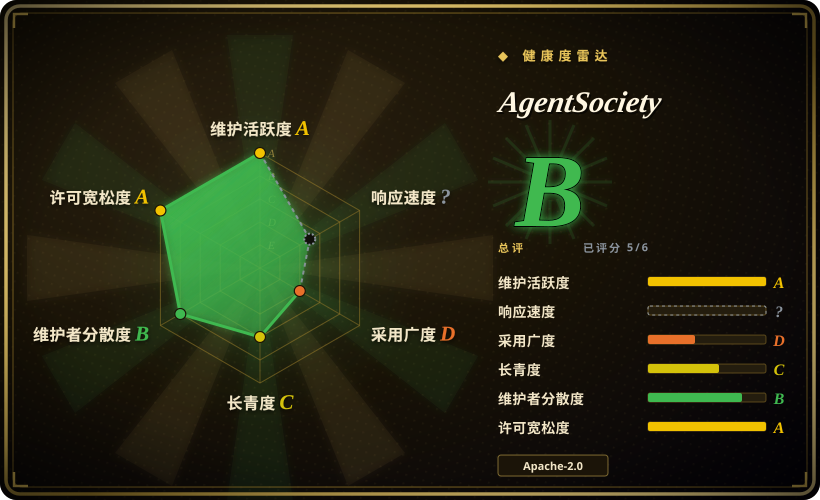

# AgentSociety

清华 FIB Lab 的 LLM agent 社会模拟平台：v1 是城市尺度模拟器（Ray 上的出行/经济/社交模块）；现在的 AgentSociety 2 是 LLM 原生研究环境，带可插拔环境、多种推理路由、实验回放和 DuckDB 追踪——为「可执行的社会科学」而造。PyPI 包名 `agentsociety2`。

## 何时使用

你是社会科学研究者或研发工程师，在设计一个**实验**而不只是 demo：你需要可复现的运行（catalog 驱动的 JSONL 回放）、分布式执行（Ray）、模块化环境（v1 的城市出行/经济/社交；v2 的可插拔 env 模块），以及研究闭环工具（文献检索、假设生成、实验设计、论文写作）。

选 AgentSociety 的决定性取舍是**科研严谨性优先于产品完成度**：MiroFish 给你成品报告 UI，OASIS 给你社交媒体信息流保真度——AgentSociety 给你实验记录本和计算脚手架，Apache-2.0、无外部 SaaS 依赖。

## 何时不用

- **你要的是成品预测产品。** 它是框架；要「上传→报告」体验用 [MiroFish](mirofish.zh.md)。
- **目标是社交媒体信息动力学。** 信息流和推荐算法是 OASIS 的主场；研究类 Twitter/Reddit 的传播与极化用 [OASIS](oasis.zh.md)。
- **你要最小 footprint。** Ray + 环境服务 + LLM 客户端比单脚本模拟器重得多；想研究最小化的开创性架构，去读 [generative_agents](generative-agents.zh.md)。
- **在意目录级许可证纯净度。** Apache-2.0 但排除 `packages/agentsociety/agentsociety/commercial` 子树（README 声明；该目录截至 2026-09 确实存在）——打算再分发 v1 内部代码前先审计该目录的条款。

## 横向对比

| 替代品 | 是否收录 | 我们的评价 | 取舍 |
|---|---|---|---|
| [OASIS](oasis.zh.md) | ✅ | 带推荐系统的社交媒体平台模拟选 OASIS；城市尺度或需要实验管理（回放、Ray 分布式）的社会科学选 AgentSociety。 | OASIS 窄于媒体但信息流保真；AgentSociety 更宽且科研工具齐全。 |
| [MiroFish](mirofish.zh.md) | ✅ | 要打包好的「上传→报告」成品选 MiroFish；必须自己设计、运行并能为实验辩护时选 AgentSociety。 | AgentSociety 收你工程时间，还你可复现性和 Apache-2.0 自由。 |
| [generative_agents](generative-agents.zh.md) | ✅ | 只有为研究 2023 年原版才选 generative_agents；任何打算运行、扩展或发论文的场景选 AgentSociety。 | generative_agents 是冻结的历史；AgentSociety 是有论文背书的在维护平台。 |

## 技术栈

- **v2（推荐）：** Python ≥3.11；workspace 绑定的无状态 agent 由 Ray Tasks 驱动；可插拔 env 模块（如 `SimpleSocialSpace`）；推理路由（默认 CodeGen，另有 ReAct、Plan-Execute、Two-Tier、Search）；MCP 工具支持；JSONL 实验回放 + DuckDB 读取；分布式追踪。
- **v1（legacy）：** 城市尺度模拟器，gRPC 环境集成，城市模块（出行、经济、社交），Ray 分布式。
- **LLM 接入：** OpenAI、Anthropic 或任意 litellm 支持的 provider，走环境变量。
- **周边：** React web 前端、VSCode 插件、benchmark 包；论文 arXiv:2502.08691（v1）与 arXiv:2607.11895（v2）。

## 依赖

- Python ≥3.11；Ray（分布式执行）；DuckDB（回放读取）。
- 一个 LLM API key（OpenAI、Anthropic 或 litellm 支持的 provider）。
- 无强制外部 SaaS；可完全自托管。

## 运维难度

**中到高。** `pip install agentsociety2` 加个 API key 能跑 quickstart，但真实实验意味着运维 Ray、设计环境、管理回放 catalog 和 trace——这是科研基础设施。v1/v2 分裂（两个 PyPI 包、两个文档站）也增加了上手成本。

## 健康度与可持续性

- **维护——非常活跃（截至 2026-09）。** 最近 push 2026-09-18；agentsociety2 v2.9.0 发布于 2026-09-17，每月多个 release。
- **治理/背书——高校实验室。** 清华 FIB Lab 组织所有；前五贡献者各持有 67–273 次提交（2026-09）——bus factor 比个人项目健康；两篇 arXiv 论文锚定研究议程。
- **年龄与 Lindy——年轻。** 创建于 2025-02（约 19 个月），1.3k stars（2026-09）：采用度尚温和；实验室长期做城市模拟的研究线是主要的存续信号 [推断]。
- **风险信号。** v1 已被标记为「legacy」——约 1.5 年内发生了一次完整 API 代际断裂，预期 v2 线还会继续动；Apache-2.0 但有 `commercial` 子树 carve-out（见「何时不用」）。

## 存疑（未验证）

- [未验证] `packages/agentsociety/agentsociety/commercial` 许可证 carve-out 的具体条款（README 声明；目录已确认存在于 2026-09，内容未审计）。
- [未验证] v2 的规模/性能声称（论文自述；未复现）。
- [未验证] 超出实验室发表周期之外的长期维护承诺。
