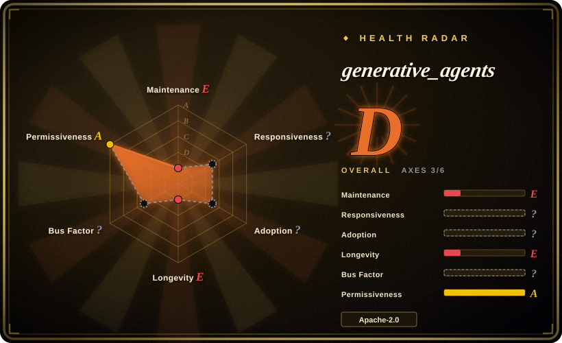

# generative_agents

The original Stanford "Generative Agents: Interactive Simulacra of Human Behavior" (UIST'23) research prototype: 25 LLM agents with a memory stream, reflection, and planning architecture live out days in a 2D town (Smallville). The founding reference of the LLM-agent-society field — frozen since 2024-08.

## When to use

You're a student, researcher, or engineer who wants to study the paper's architecture as running code: the memory-stream / retrieval / reflection / planning loop in the `reverie` backend server, and the Django-served, replayable 2D world. You want the canonical 25-agent Smallville demo — to reproduce the paper's emergent-behavior anecdotes (an invitation spreading through town, agents coordinating a party) or to teach the concepts.

Choose it over the substitutes only when the deciding factor is **historical and architectural fidelity to the 2023 paper**: OASIS and AgentSociety are maintained frameworks that exceed it in scale and tooling, and MiroFish is a product — none of them is the minimal, readable original.

## When NOT to use

- **Anything you intend to run seriously or build on.** No commits since 2024-08-05 (as of 2026-09), and the pins are paper-era (`openai==0.27.0`, `Django==2.2`) — the old OpenAI client API alone forces porting. For a maintained base use [OASIS](oasis.md) or [AgentSociety](agentsociety.md).
- **Scale beyond a demo.** 25 agents in one small town is the design point; for thousands-to-million-agent social-media simulation use [OASIS](oasis.md).
- **A productized prediction/report workflow.** It produces a replayable simulation, not reports; use [MiroFish](mirofish.md).
- **A modern LLM stack.** Expect dependency archaeology and no test safety net; for anything production-adjacent, treat this as a pattern source and reimplement on a maintained framework.

## Comparison

| Alternative | In index | Our verdict | Tradeoff |
|---|---|---|---|
| [OASIS](oasis.md) | ✅ | Choose OASIS for maintained, scalable social-media simulation in code; keep generative_agents for studying the original memory/reflection/planning design. | OASIS is a framework with scale; generative_agents is a fixed, frozen town demo. |
| [AgentSociety](agentsociety.md) | ✅ | Choose AgentSociety for experiment-managed social-science simulation with replay and distribution; generative_agents only for the canonical Smallville scenario. | AgentSociety is research-tooled and active; generative_agents has had zero maintenance since 2024-08. |
| [MiroFish](mirofish.md) | ✅ | Choose MiroFish when you want a finished upload→simulate→report product rather than a research prototype. | MiroFish is productized and active, but AGPL-3.0 and far removed from the paper's minimalism. |

## Tech stack

- **Backend:** Python `reverie` server implementing the simulation loop (memory stream, retrieval, reflection, planning); Django `frontend_server` for replay and persona state; SQLite + file-based storage folders.
- **Frontend:** browser-rendered 2D tile world (Smallville) served via Django templates.
- **LLM:** OpenAI API via the paper-era client (`openai==0.27.0`, requirements.txt as of 2026-09).
- **Notable pins:** `Django==2.2`, `numpy==1.25.2`, `pandas==2.0.3` — 2023-era versions throughout.

## Dependencies

- Python 3 (paper-era; the pinned requirements date to 2023 and predate modern Python support).
- An OpenAI API key; the paper-era simulations were expensive to run [未验证 on exact cost].
- No Docker image, no releases, no CI.

## Ops difficulty

**Medium, and rising with age.** The documented path (two processes: `reverie` backend + Django frontend) worked in 2023; today expect to fight pinned 2023 dependencies and the pre-1.0 OpenAI client before the demo runs. There are no releases or tests to lean on.

## Health & viability

- **Maintenance — dormant.** Last push 2024-08-05 (as of 2026-09): over two years without commits; not archived, but effectively frozen; 146 open issues (2026-09) without responses.
- **Governance / bus factor.** Personal research repo (`joonspk-research`, 26 of ~31 counted commits, 2026-09); the authors moved on after the UIST'23 publication.
- **Age & Lindy — old enough to judge, and the verdict is "landmark, not infrastructure".** Created 2023-07; 22.1k stars (2026-09) driven by the paper's fame. Its lasting value is as the field's reference implementation, not as a maintained dependency [推断].
- **Risk flags.** Frozen dependency pins and no security maintenance — do not expose a deployment to the internet; the 2D-world code paths were written for a demo, not hardening.

## Caveats (unverified)

- [未验证] The exact cost of reproducing the paper's simulations (author-reported figures circulate; we did not verify).
- [未验证] Whether the pinned 2023 dependency set still installs cleanly on modern Python; expect porting work.
- [未验证] The emergent-behavior anecdotes (e.g. the party coordination) come from the paper and demos; independent reproductions are scarce.
- [推断] Any prompt/model behavior observed with today's OpenAI models will differ from the paper's results — the pinned client targets models that may be deprecated.
