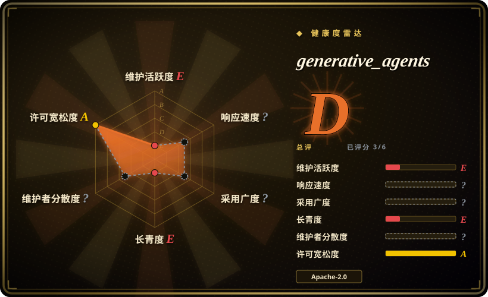

# generative_agents

斯坦福「Generative Agents: Interactive Simulacra of Human Behavior」（UIST'23）的原版研究原型：25 个带 memory stream、reflection、planning 架构的 LLM agent 在一个 2D 小镇（Smallville）里生活。LLM agent 社会这个领域的开创性参考实现——自 2024-08 起冻结。

## 何时使用

你是学生、研究者或工程师，想把论文架构当运行中的代码来研究：`reverie` 后端服务里的 memory stream / 检索 / reflection / planning 循环，以及 Django 服务的可回放 2D 世界。你要的是那个经典的 25 agent Smallville demo——复现论文里的涌现行为轶事（派对邀请在镇上传开、agent 们自发协调），或用来教学。

只有在决定性因素是**对 2023 年论文的历史/架构保真度**时才选它而非替代品：OASIS 和 AgentSociety 是在维护的框架，规模和工具远超它，MiroFish 是产品——它们都不是那个最小、可读的原版。

## 何时不用

- **任何打算认真跑或在上面盖楼的场景。** 自 2024-08-05 起没有提交（截至 2026-09），依赖锁死在论文年代（`openai==0.27.0`、`Django==2.2`）——光是旧版 OpenAI 客户端 API 就逼着你要做移植。要在维护的底座用 [OASIS](oasis.zh.md) 或 [AgentSociety](agentsociety.zh.md)。
- **超过 demo 的规模。** 25 个 agent 一个小镇就是设计目标；数千到百万 agent 的社交媒体模拟用 [OASIS](oasis.zh.md)。
- **产品化的预测/报告工作流。** 它产出的是可回放的模拟，不是报告；用 [MiroFish](mirofish.zh.md)。
- **现代 LLM 技术栈。** 预期要做依赖考古，且没有测试安全网；任何接近生产的用途都把它当设计模式来源、在维护中的框架上重新实现。

## 横向对比

| 替代品 | 是否收录 | 我们的评价 | 取舍 |
|---|---|---|---|
| [OASIS](oasis.zh.md) | ✅ | 在维护、可规模化的代码级社交媒体模拟选 OASIS；generative_agents 留给研究原版 memory/reflection/planning 设计。 | OASIS 是有规模的框架；generative_agents 是固定的、冻结的小镇 demo。 |
| [AgentSociety](agentsociety.zh.md) | ✅ | 需要回放和分布式的实验管理型社会科学模拟选 AgentSociety；generative_agents 只用于经典 Smallville 场景。 | AgentSociety 科研工具齐全且活跃；generative_agents 自 2024-08 零维护。 |
| [MiroFish](mirofish.zh.md) | ✅ | 想要「上传→模拟→报告」成品而非研究原型时选 MiroFish。 | MiroFish 产品化且活跃，但 AGPL-3.0，且远离论文的极简主义。 |

## 技术栈

- **后端：** Python `reverie` 服务实现模拟循环（memory stream、检索、reflection、planning）；Django `frontend_server` 负责回放和 persona 状态；SQLite + 文件目录存储。
- **前端：** 浏览器渲染的 2D 瓦片世界（Smallville），经 Django 模板服务。
- **LLM：** OpenAI API，走论文年代客户端（`openai==0.27.0`，requirements.txt 截至 2026-09 未变）。
- **代表性锁定版本：** `Django==2.2`、`numpy==1.25.2`、`pandas==2.0.3`——通篇 2023 年代版本。

## 依赖

- Python 3（论文年代；锁定依赖停留在 2023 年，早于现代 Python 支持）。
- 一个 OpenAI API key；论文年代的模拟跑起来很贵 [未验证：具体金额]。
- 无 Docker 镜像、无 release、无 CI。

## 运维难度

**中等，且随年代上升。** 文档记载的路径（两个进程：`reverie` 后端 + Django 前端）在 2023 年可用；今天要预期先和锁定在 2023 年的依赖、pre-1.0 的 OpenAI 客户端搏斗一番 demo 才能跑起来。没有 release、没有测试可依靠。

## 健康度与可持续性

- **维护——休眠。** 最近 push 2024-08-05（截至 2026-09）：超过两年无提交；未归档但等同冻结；146 个 open issue（2026-09）无人回应。
- **治理/bus factor。** 个人研究仓库（`joonspk-research`，约 31 次已统计提交中占 26 次，2026-09）；作者在 UIST'23 论文发表后已转向。
- **年龄与 Lindy——老到可以下结论了，结论是「里程碑，不是基础设施」。** 创建于 2023-07；22.1k stars（2026-09）由论文声望驱动。它的持久价值是作为领域参考实现，而不是可依赖的维护中组件 [推断]。
- **风险信号。** 依赖锁定冻结、无安全维护——别把部署暴露到公网；2D 世界的代码路径是为 demo 写的，没做过加固。

## 存疑（未验证）

- [未验证] 复现论文模拟的确切成本（流传的是作者自述数字；我们未核实）。
- [未验证] 锁定在 2023 年的依赖集在现代 Python 上是否还能干净安装；预期要做移植。
- [未验证] 涌现行为轶事（如派对协调）来自论文与 demo；独立复现很少。
- [推断] 用今天的 OpenAI 模型观察到的任何 prompt/模型行为都会与论文结果不同——锁定的客户端面向的模型可能已下线。
