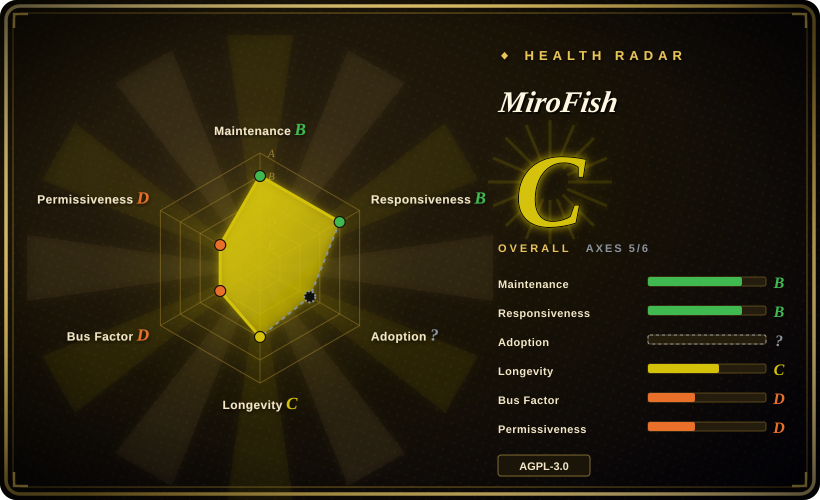

# MiroFish

Packaged end-to-end "swarm intelligence" prediction app: upload seed material (news, reports, novels), it builds a GraphRAG knowledge graph, spins up thousands of LLM agents in an OASIS-powered simulated society, lets you inject "what-if" variables, and returns a prediction report plus an interactive digital world.

## When to use

You're a comms/policy analyst (or a curious individual) holding a real-world seed document — a public-opinion report, a policy draft, a financial signal, or half a novel — and you want to rehearse how a crowd might react *before* the real event plays out. You don't want to build a simulation stack: you want to upload the document, describe the question in natural language, and get back a report plus a browsable simulated world where you can chat with individual agents.

Pick MiroFish over its substitutes when the deciding tradeoff is **packaged product vs. engine**: OASIS and AgentSociety are frameworks you write code against, while MiroFish ships the full upload→graph→simulate→report loop behind a web UI, with Chinese-language product polish and Docker deployment.

## When NOT to use

- **You need a simulation engine/library, not an app.** MiroFish is a fixed pipeline; if you want to design custom agent actions, environments, or drive simulations from code, use [OASIS](oasis.md) (its own underlying engine) or [AgentSociety](agentsociety.md) instead.
- **The output feeds a high-stakes decision.** There is no published validation that LLM-agent societies predict real crowd behavior [未验证]. Treat it as scenario rehearsal, not forecasting; for decisions with real consequences use domain methods (polling, prediction markets, expert panels).
- **You plan commercial/SaaS redistribution.** AGPL-3.0 means offering a modified MiroFish over a network triggers source-disclosure obligations; if you need a permissively licensed base to build a product on, start from Apache-2.0 OASIS or AgentSociety.
- **Your seed material is sensitive.** Agent memory runs on Zep Cloud (external SaaS); if data must stay on-prem, AgentSociety has no such hard dependency, or audit exactly what leaves your machine first.
- **You're cost-sensitive.** The README itself warns "high consumption, try simulations with fewer than 40 rounds first" and publishes no token reference; OASIS publishes a measured token/cost table and pairs with cheap models (qwen-turbo), making spend far more predictable.
- **You need research-grade reproducibility.** No experiment replay or trace tooling; AgentSociety 2 (JSONL replay, DuckDB tracing) is built for that.

## Comparison

| Alternative | In index | Our verdict | Tradeoff |
|---|---|---|---|
| [OASIS](oasis.md) | ✅ | Choose OASIS when you're building your own social-media simulation in code and need scale (up to a claimed 1M agents) and a measured cost model; choose MiroFish when you want a finished upload-to-report product. | MiroFish is built on OASIS — you trade programmability and license freedom for a complete pipeline and UI. |
| [AgentSociety](agentsociety.md) | ✅ | Choose AgentSociety for social-science experiments that need replay, distributed execution, and publishable rigor; choose MiroFish for fast, productized what-if rehearsal. | AgentSociety is Apache-2.0 and research-tooled, but you assemble the experiment yourself. |
| [generative_agents](generative-agents.md) | ✅ | Choose generative_agents only to study or teach the original 2023 Smallville architecture; for anything you intend to run seriously, choose MiroFish (maintained, packaged). | generative_agents is the field's founding reference but unmaintained since 2024-08. |

## Tech stack

- **Backend:** Python 3.11–3.12, Flask + flask-cors, `camel-oasis` 0.2.5 / `camel-ai` 0.2.78 (simulation engine), `zep-cloud` 3.25.0 (agent memory), OpenAI-compatible LLM client, PyMuPDF (document ingestion), uv-managed.
- **Frontend:** Vue 3 + vue-router + vue-i18n + d3; Node.js ≥18.
- **Pipeline:** seed extraction → GraphRAG knowledge graph → persona generation → dual-platform parallel simulation → ReportAgent.
- **Deploy:** source (`npm run dev`) or docker-compose; ports 3000 (frontend) / 5001 (backend).

## Dependencies

- Any LLM API in OpenAI SDK format (README recommends Alibaba Qwen-plus); high token consumption — see "When NOT to use".
- **Zep Cloud account** (external SaaS; README claims the free tier suffices for light use) — hard dependency for the memory layer.
- Node.js ≥18, Python ≥3.11 and ≤3.12, uv; Docker optional.

## Ops difficulty

**Medium.** Install is scripted (`npm run setup:all`, docker-compose provided) and there are only two services, but real operation means managing LLM token burn, a Zep Cloud account, and long-running simulations. The v0.1.x line has no migration burden yet — expect breaking changes instead.

## Health & viability

- **Maintenance — active (as of 2026-09).** Last push 2026-09-16; three tagged releases since 2025-12 (latest v0.1.2, 2026-03).
- **Governance / bus factor — single-author dominant.** 666ghj accounts for 266 of ~305 counted commits (~87%) (2026-09). The README states Shanda Group strategic backing/incubation and lists a shanda.com hiring contact, but there is no foundation or multi-org governance; whether backing converts into commit throughput is [未验证].
- **Age & Lindy — very young, extremely hyped.** Created 2025-11-26, ~10 months old with 73.9k stars (2026-09): exactly the fast-growth profile the Lindy prior discounts; the star count alone is not evidence of durability [推断].
- **Adoption.** No PyPI/npm package — installed from source or Docker; production adopters unknown.
- **Risk flags.** AGPL-3.0 (network copyleft); hard external dependency on Zep Cloud; the "predicting anything" marketing claim far exceeds validated capability (see Caveats).

## Caveats (unverified)

- [未验证] Predictive validity of LLM-agent social simulation — no published evaluation against real outcomes; treat reports as plausible scenario narratives, not forecasts. LLM behavior is not guaranteed.
- [未验证] Exact nature and terms of the Shanda Group backing (README statement only); whether it secures long-term maintenance is unknown.
- [未验证] Token cost per simulation round — the README warns "high consumption" and suggests fewer than 40 rounds, but publishes no measured figures.
- [未验证] What the two platforms in "dual-platform parallel simulation" concretely are (README wording; presumably two social-media-like environments [推断]).
- [未验证] Whether the Zep Cloud free quota suffices for non-trivial simulations (README claim).
- [未验证] Whether the star growth is organic or campaign-driven; the repo runs a bot that commits star-history updates.
