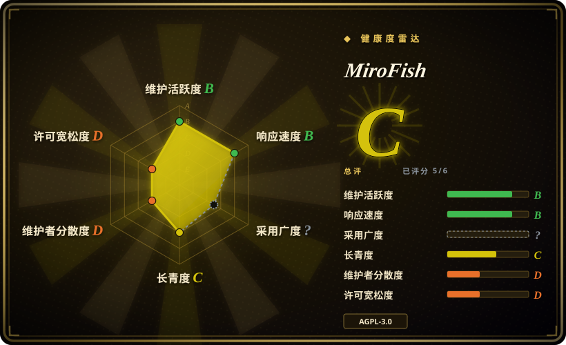

# MiroFish

端到端打包好的「群体智能」预测应用：上传种子材料（新闻、报告、小说），它构建 GraphRAG 知识图谱、在 OASIS 驱动的模拟社会里拉起数千个 LLM agent，允许你从上帝视角注入「如果……会怎样」变量，最终返回一份预测报告和一个可交互的数字世界。

## 何时使用

你是公关/政策分析师（或好奇的个人），手里拿着一份现实世界的种子材料——舆情报告、政策草案、财经信号，或半本小说——想在真实事件发生**之前**先彩排一遍人群可能的反应。你不想自己搭模拟技术栈：你想上传文档、用自然语言描述预测问题，然后拿回一份报告和一个可浏览的模拟世界，还能和里面的单个 agent 聊天。

选 MiroFish 而非其替代品的决定性取舍是**成品 vs 引擎**：OASIS 和 AgentSociety 是要写代码的框架，而 MiroFish 把「上传→建图→模拟→报告」整条链路装进了 web UI，带中文产品打磨和 Docker 部署。

## 何时不用

- **你要的是模拟引擎/库，不是应用。** MiroFish 是固定流水线；想自定义 agent 动作、环境、或以代码方式驱动模拟，用 [OASIS](oasis.zh.md)（它自己的底层引擎）或 [AgentSociety](agentsociety.zh.md)。
- **输出要喂给高风险决策。** 没有任何公开验证表明 LLM agent 社会能预测真实人群行为 [未验证]。把它当情景彩排，不是预测；真正有后果的决策请用领域方法（民调、预测市场、专家小组）。
- **要做商用/SaaS 再分发。** AGPL-3.0 意味着把改过的 MiroFish 挂到网络上提供服务即触发源码公开义务；需要宽松许可证底座做产品，从 Apache-2.0 的 OASIS 或 AgentSociety 起步。
- **种子材料敏感。** agent 记忆跑在 Zep Cloud（外部 SaaS）上；数据必须留在本地的话，AgentSociety 没有这种硬依赖，或者先审计到底什么数据出了你的机器。
- **对成本敏感。** README 自己警告「消耗高，先跑 40 轮以内的模拟」，且没有公布 token 参考；OASIS 公布了实测 token/成本表、可配便宜模型（qwen-turbo），花费可预期得多。
- **需要科研级可复现性。** 没有实验回放或 trace 工具；AgentSociety 2（JSONL 回放、DuckDB 追踪）就是为这个造的。

## 横向对比

| 替代品 | 是否收录 | 我们的评价 | 取舍 |
|---|---|---|---|
| [OASIS](oasis.zh.md) | ✅ | 当你要用代码自建社交媒体模拟、需要规模化（号称最高百万 agent）和实测成本模型时选 OASIS；当你要一个上传即出报告的成品时选 MiroFish。 | MiroFish 就建在 OASIS 之上——你拿可编程性和许可证自由换了完整流水线和 UI。 |
| [AgentSociety](agentsociety.zh.md) | ✅ | 需要回放、分布式执行和可发表严谨性的社会科学实验选 AgentSociety；要快速、产品化的「如果……会怎样」彩排选 MiroFish。 | AgentSociety 是 Apache-2.0 且科研工具齐全，但实验要自己组装。 |
| [generative_agents](generative-agents.zh.md) | ✅ | 只有为研究或教学 2023 年原版 Smallville 架构才选 generative_agents；任何打算认真跑的东西都选 MiroFish（仍在维护、已产品化）。 | generative_agents 是该领域的开创性参考实现，但 2024-08 起停止维护。 |

## 技术栈

- **后端：** Python 3.11–3.12，Flask + flask-cors，`camel-oasis` 0.2.5 / `camel-ai` 0.2.78（模拟引擎），`zep-cloud` 3.25.0（agent 记忆），OpenAI 兼容 LLM 客户端，PyMuPDF（文档解析），uv 管理。
- **前端：** Vue 3 + vue-router + vue-i18n + d3；Node.js ≥18。
- **流水线：** 种子抽取 → GraphRAG 知识图谱 → persona 生成 → 双平台并行模拟 → ReportAgent。
- **部署：** 源码（`npm run dev`）或 docker-compose；端口 3000（前端）/ 5001（后端）。

## 依赖

- 任意 OpenAI SDK 格式的 LLM API（README 推荐阿里 Qwen-plus）；token 消耗高——见「何时不用」。
- **Zep Cloud 账号**（外部 SaaS；README 称免费额度够轻度使用）——记忆层硬依赖。
- Node.js ≥18、Python ≥3.11 且 ≤3.12、uv；Docker 可选。

## 运维难度

**中等。** 安装有脚本（`npm run setup:all`，提供 docker-compose），只有两个服务；但真实运维意味着管 LLM token 消耗、维护 Zep Cloud 账号、跑长时间模拟。v0.1.x 阶段还没有迁移负担——但要预期 breaking change。

## 健康度与可持续性

- **维护——活跃（截至 2026-09）。** 最近 push 2026-09-16；2025-12 以来打了三个 tag（最新 v0.1.2，2026-03）。
- **治理/bus factor——单作者主导。** 666ghj 占已统计约 305 次提交中的 266 次（约 87%）（2026-09）。README 称获盛大集团战略支持/孵化并留了 shanda.com 招聘邮箱，但没有基金会或多组织治理；backing 能否转化为持续提交产能 [未验证]。
- **年龄与 Lindy——极年轻、爆发式走红。** 创建于 2025-11-26，约 10 个月就有 73.9k stars（2026-09）：正是 Lindy 先验要打折的「年轻+爆火」画像；star 数本身不是耐久性证据 [推断]。
- **采用。** 没有 PyPI/npm 包——源码或 Docker 安装；生产采用者未知。
- **风险信号。** AGPL-3.0（网络 copyleft）；对 Zep Cloud 的硬外部依赖；「预测万物」的宣传远超已验证能力（见存疑账本）。

## 存疑（未验证）

- [未验证] LLM agent 社会模拟的预测有效性——没有针对真实结果的公开评估；把报告当作自洽的情景叙事，不是预测。LLM 行为不可保证。
- [未验证] 盛大集团支持的具体性质与条款（仅 README 自述）；能否保障长期维护未知。
- [未验证] 每轮模拟的 token 成本——README 警告「消耗高」并建议 40 轮以内，但没有公布实测数字。
- [未验证] 「双平台并行模拟」的两个平台具体是什么（README 措辞；推测是两个类社交媒体环境 [推断]）。
- [未验证] Zep Cloud 免费额度对非轻度模拟是否够用（README 自述）。
- [未验证] star 增长是自然增长还是运营驱动；仓库里有 bot 定期提交 star-history 更新。
