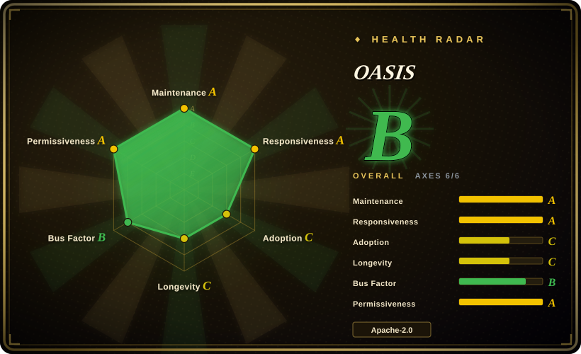

# OASIS

CAMEL-AI's scalable open-source social-media simulator: LLM agents (up to a claimed one million) interact on Twitter/Reddit-like platforms with a 23-action space and built-in recommendation systems, for studying information spread, group polarization, and herd behavior. PyPI: `camel-oasis`.

## When to use

You're a researcher or engineer who wants to *build* a social-media simulation in code — define agent populations from profile files, choose the action space (post, comment, repost, follow, mute, …), plug in your LLM of choice via CAMEL's ModelFactory, and study what emerges. You need scale (thousands up to a claimed million agents), a PettingZoo-style `env.step` API, and a measured token-cost table to budget runs.

Pick OASIS over substitutes when the deciding tradeoff is **social-media fidelity as a library**: it models Twitter/Reddit dynamics — recommendation algorithms, trending, a 23-action space — as a pip-installable framework. MiroFish gives you a finished app on top of it, AgentSociety targets broader urban/social-science worlds, and generative_agents is a fixed 25-agent town you fork, not a framework.

## When NOT to use

- **You want a finished product, not an engine.** There is no upload-to-report UI; if you want to hand a document to a web app and get a prediction report, use [MiroFish](mirofish.md) (which is built on OASIS).
- **Your world isn't social media.** The environments are Twitter/Reddit-like platforms; for city-scale urban/economic simulation use [AgentSociety](agentsociety.md); for an embodied 2D village, read [generative_agents](generative-agents.md) as a pattern, not a base.
- **You need general-purpose multi-agent orchestration.** OASIS is a simulator, not a production agent framework; look at the `agent-frameworks` category instead.
- **You're simulating at large scale on a small budget.** Cost scales with agents × activation probability × steps — OASIS's own table measures ~335.6k input tokens for 100 agents × 1 step on qwen-turbo (2024-12 reference); a million-agent run is a research-budget item. For a one-off lightweight rehearsal, a small [MiroFish](mirofish.md) run is cheaper to set up.
- **You need validated prediction.** Emergence is not accuracy — no project in this category publishes validated forecasting ability [推断]; use simulations as scenario generators, not oracles.

## Comparison

| Alternative | In index | Our verdict | Tradeoff |
|---|---|---|---|
| [MiroFish](mirofish.md) | ✅ | Choose MiroFish when you want the packaged upload→report product; choose OASIS when you need to program the simulation yourself, avoid MiroFish's AGPL-3.0, or drop its Zep Cloud dependency. | OASIS is Apache-2.0 and self-contained; in exchange you build the pipeline MiroFish gives you for free. |
| [AgentSociety](agentsociety.md) | ✅ | Choose AgentSociety for city-scale or experiment-managed social science (Ray distribution, replay, research skills); choose OASIS for social-media-specific dynamics with recommendation systems. | OASIS is narrower (media platforms) but models the feed algorithms AgentSociety doesn't center on. |
| [generative_agents](generative-agents.md) | ✅ | Choose generative_agents only to study the original 2023 architecture; choose OASIS for anything runnable at scale today. | generative_agents is unmaintained since 2024-08 and hard-coded to its 25-agent town. |

## Tech stack

- **Package:** Python (≥3.10, <3.12), PyPI `camel-oasis` (v0.2.5, 2025-12), layered on `camel-ai`; Poetry-managed.
- **Environment:** PettingZoo-style `oasis.make` / `env.step` API; Twitter and Reddit platform types; SQLite-backed simulation database.
- **Agent model:** 23-action space (post/comment/repost/follow/mute/search/trend/…), LLM + manual actions, per-agent model/tool/prompt customization.
- **Recommendation systems:** interest-based and hot-score-based feeds; optional Twhin-Bert recommender using OpenAI embeddings.
- **Data/analysis:** pandas, igraph, cairocffi; a public Hugging Face dataset of user profiles.

## Dependencies

- Python ≥3.10 and <3.12.
- Any LLM supported by CAMEL's ModelFactory (OpenAI, Qwen, …); the quickstart uses an OpenAI API key.
- Optional: OpenAI embeddings for the Twhin-Bert recommender.
- No external SaaS required; simulation state lives in a local SQLite file.

## Ops difficulty

**Low to medium.** `pip install camel-oasis`, set an API key, run a script — the bundled 36-user Reddit example runs locally in minutes. Difficulty rises with scale: generating large agent populations, budgeting tokens, and analyzing big simulation databases are on you (tutorials live in `examples/`).

## Health & viability

- **Maintenance — active (as of 2026-09).** Last push 2026-08-27; releases through v0.2.5 (2025-12); README news updated 2026-08.
- **Governance / backing — CAMEL-AI org.** Org-owned (`camel-ai/`); the top five contributors are org-affiliated, led by echo-yiyiyi (401 commits, 2026-09); backed by the CAMEL-AI project family with an arXiv paper (2411.11581) and a Hugging Face dataset — a lower single-point-of-failure risk than solo projects [推断 on long-term org commitment].
- **Age & Lindy — young but adoption-proven.** Created 2024-11 (~22 months), 5.2k stars (2026-09); already the simulation engine inside a 73.9k-star downstream product (MiroFish) — a real adoption signal.
- **Risk flags.** No relicense history (Apache-2.0). The "one million agents" headline is author-reported — benchmark before budgeting (see Caveats).

## Caveats (unverified)

- [未验证] The "up to one million agents" scale claim — author-reported; we did not reproduce it.
- [未验证] Token/cost figures (~335,600 input tokens per 100 agents × 1 step; the qwen pricing table) were measured by the authors as of 2024-12; model prices and prompt sizes drift.
- [未验证] Behavioral realism of agent populations vs. real platform users; no independent validation known.
- [推断] CAMEL-AI's long-term commitment to OASIS specifically (vs. the flagship CAMEL framework) is assumed, not stated.
