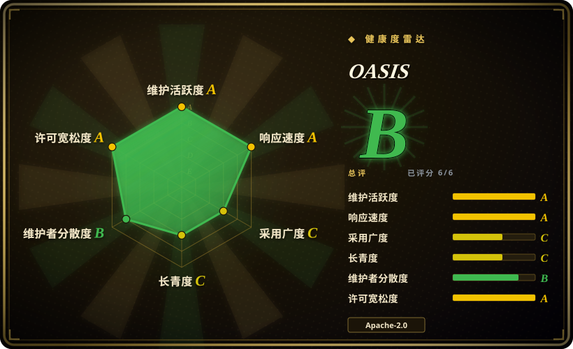

# OASIS

CAMEL-AI 出品的可规模化开源社交媒体模拟器：LLM agent（号称最高百万级）在类 Twitter/Reddit 平台上以 23 种动作互动，内置推荐系统，用于研究信息传播、群体极化与羊群效应。PyPI 包名 `camel-oasis`。

## 何时使用

你是研究者或工程师，想用**代码**搭建一个社交媒体模拟——从 profile 文件定义 agent 群体、选动作空间（发帖、评论、转发、关注、屏蔽……）、通过 CAMEL 的 ModelFactory 接入你选的 LLM，然后观察涌现结果。你需要规模化（数千到号称百万 agent）、PettingZoo 风格的 `env.step` API，以及一张实测 token 成本表来做预算。

选 OASIS 而非替代品的决定性取舍是**库形态的社交媒体保真度**：它把 Twitter/Reddit 动力学——推荐算法、热榜、23 动作空间——做成 pip 可装的框架。MiroFish 是在它之上的成品应用，AgentSociety 面向更宽的城市/社会科学世界，generative_agents 是一个固定的 25 agent 小镇——你 fork 它，而不是拿它当框架。

## 何时不用

- **你要的是成品，不是引擎。** 没有「上传→报告」的 UI；想把文档交给 web 应用拿回预测报告，用 [MiroFish](mirofish.zh.md)（它就建在 OASIS 上）。
- **你的世界不是社交媒体。** 环境是类 Twitter/Reddit 平台；城市尺度的城市/经济模拟用 [AgentSociety](agentsociety.zh.md)；具身 2D 村庄去看 [generative_agents](generative-agents.zh.md)——当设计模式读，别当底座。
- **你需要通用多 agent 编排。** OASIS 是模拟器，不是生产用 agent 框架；请去 `agent-frameworks` 分类找。
- **大规模模拟但预算紧。** 成本随 agent 数 × 激活概率 × 步数增长——OASIS 自己的实测表：100 agent × 1 步在 qwen-turbo 上约 33.56 万 input token（2024-12 参考）；百万 agent 一次运行是科研预算级别。一次性轻量彩排的话，小规模 [MiroFish](mirofish.zh.md) 跑一次的搭建成本更低。
- **你需要经过验证的预测。** 涌现不等于准确——本分类没有任何项目公布过经验证的预测能力 [推断]；把模拟当情景生成器，别当神谕。

## 横向对比

| 替代品 | 是否收录 | 我们的评价 | 取舍 |
|---|---|---|---|
| [MiroFish](mirofish.zh.md) | ✅ | 想要打包好的「上传→报告」成品选 MiroFish；需要自己编程控制模拟、避开 MiroFish 的 AGPL-3.0 或甩掉它的 Zep Cloud 依赖时选 OASIS。 | OASIS 是 Apache-2.0 且自包含；代价是 MiroFish 白送的流水线要你自己搭。 |
| [AgentSociety](agentsociety.zh.md) | ✅ | 城市尺度或需要实验管理（Ray 分布式、回放、科研技能）的社会科学研究选 AgentSociety；社交媒体特定动力学（带推荐系统）选 OASIS。 | OASIS 更窄（媒体平台），但把 AgentSociety 不侧重的信息流推荐算法建了出来。 |
| [generative_agents](generative-agents.zh.md) | ✅ | 只有为研究 2023 年原版架构才选 generative_agents；今天要在大规模上跑的东西都选 OASIS。 | generative_agents 自 2024-08 停止维护，且硬编码在 25 agent 小镇上。 |

## 技术栈

- **包：** Python（≥3.10，<3.12），PyPI `camel-oasis`（v0.2.5，2025-12），构建在 `camel-ai` 之上；Poetry 管理。
- **环境：** PettingZoo 风格 `oasis.make` / `env.step` API；Twitter 与 Reddit 两种平台类型；SQLite 存储模拟状态。
- **Agent 模型：** 23 动作空间（发帖/评论/转发/关注/屏蔽/搜索/热榜……），LLM 动作 + 手动动作，支持按 agent 自定义模型/工具/prompt。
- **推荐系统：** 基于兴趣与基于热度的信息流；可选 Twhin-Bert 推荐器（用 OpenAI embedding）。
- **数据/分析：** pandas、igraph、cairocffi；Hugging Face 上有公开的用户 profile 数据集。

## 依赖

- Python ≥3.10 且 <3.12。
- CAMEL ModelFactory 支持的任意 LLM（OpenAI、Qwen 等）；quickstart 用 OpenAI API key。
- 可选：OpenAI embedding（Twhin-Bert 推荐器用）。
- 无外部 SaaS 硬依赖；模拟状态存本地 SQLite。

## 运维难度

**低到中等。** `pip install camel-oasis`、设 API key、跑脚本——自带的 36 用户 Reddit 示例几分钟就能在本地跑起来。难度随规模上升：生成大规模 agent 群体、token 预算、分析大模拟数据库都要自己来（教程在 `examples/`）。

## 健康度与可持续性

- **维护——活跃（截至 2026-09）。** 最近 push 2026-08-27；发布到 v0.2.5（2025-12）；README news 更新于 2026-08。
- **治理/背书——CAMEL-AI 组织。** 组织所有（`camel-ai/`）；前五贡献者均为组织成员，echo-yiyiyi 领先（401 次提交，2026-09）；背靠 CAMEL-AI 项目家族，有 arXiv 论文（2411.11581）和 Hugging Face 数据集——比个人项目的单点故障风险低 [推断：组织的长期投入为假设]。
- **年龄与 Lindy——年轻但已有采用实证。** 创建于 2024-11（约 22 个月），5.2k stars（2026-09）；已经是一个 73.9k star 下游产品（MiroFish）的模拟引擎——这是真实的采用信号。
- **风险信号。** 无换许可证历史（Apache-2.0）。「百万 agent」头条数字是作者自述——做预算前先自己 benchmark（见存疑账本）。

## 存疑（未验证）

- [未验证] 「最高百万 agent」的规模声称——作者自述；我们未复现。
- [未验证] token/成本数字（100 agent × 1 步约 335,600 input token；qwen 价格表）为作者 2024-12 的实测；模型价格与 prompt 大小会漂移。
- [未验证] agent 群体相对真实平台用户的行为保真度；未见独立验证。
- [推断] CAMEL-AI 对 OASIS 这个子项目（相对旗舰 CAMEL 框架）的长期投入是假设，非明示承诺。
