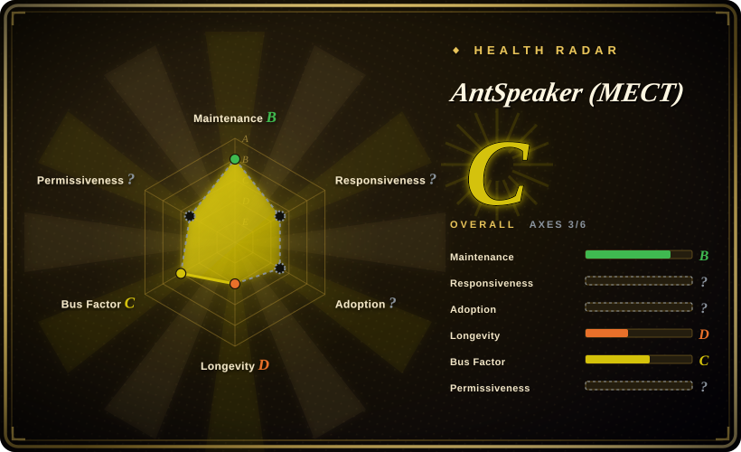

# AntSpeaker (MECT)

You need to decide whether two audio clips are the same person talking — a voiceprint login, "is this the enrolled speaker", tagging who spoke in a meeting — but you have no training data, no labeling budget, and no GPU cluster. AntSpeaker ships that as six ready-made PyTorch checkpoints (3.8M–9.6M parameters) that compress each clip into one embedding vector: same speaker, similar vector, one cosine call decides.

## When to use

You're building voiceprint login, speaker-based dedup of a call-recording archive, or a lightweight "same voice?" check inside a Python service, and the sensible baseline — fine-tune an ECAPA-TDNN yourself — is out of budget. You download `mect_b2_vc2.pt` (46 MB) from Hugging Face, load it with six lines of PyTorch from the README, and get paper-reported VoxCeleb1-O EER of 0.27% from a 9.57M-parameter model that also runs on CPU. The deciding tradeoff versus toolkits like SpeechBrain or WeSpeaker: those hand you training recipes and infrastructure but expect you to train or at least pick a model; AntSpeaker hands you the finished model and nothing else — no training loop to own, no recipe to tune, at the cost of a non-commercial license on the weights.

The second trigger is on-device or real-time speaker checks. MECT-B2-Causal is a streaming variant retrained to look only backwards, so it can emit embeddings on ~100 ms chunks for live meetings, voice assistants, or on-device use — at 9.57M parameters, small enough for embedded budgets — where a full-utterance model would have to wait for the sentence to end.

## How it works

The repository is deliberately thin: a ~2k-line inference package (`antspeaker`) plus six checkpoint files that live on Hugging Face. You never configure an architecture by hand — each `.pt` file carries its own `config` dict, and `create_model` reads it and rebuilds the exact network that was trained: convolution blocks eat the audio frame by frame, transformer blocks mix context across the whole utterance, and a mixture-of-experts layer — several small sub-networks plus a router that activates only some of them per input — adds capacity without proportionally adding compute. Your part of the deal is the front porch: load audio with `soundfile`, resample, compute 80-dimensional Mel filterbank features (the standard "which frequency bands are present in each 10 ms slice" speech representation) with torchaudio's Kaldi-compatible `fbank`, and call the model — it hands back one fixed-size embedding (192-dim by default). Same speaker means similar vectors, different speakers land far apart; you compare two embeddings with a cosine and choose the threshold yourself — the model gives you no "yes/no", only the distance. The causal (streaming) checkpoint swaps full-utterance attention for a cache that only looks backwards — chunked audio in, embedding out at ~100 ms granularity — but its usage tutorial was still "Coming Soon" at verification time.

<!-- flow-steps:begin (generated from flows/antspeaker.json by tools/flow_card.py — do not edit) -->

Text version of the flow

1. **You**: Install the PyTorch audio stack (the repo ships no pip package — clone it and import) — `pip install torch torchaudio soundfile`
2. **You**: Download one of the six checkpoints from Hugging Face — `hf download AntResearch/AntSpeaker mect_b2_vc2.pt --local-dir ./`
3. **You**: Build the model from the config baked into the checkpoint — `create_model(ckpt["config"]["model"])` — component: `antspeaker registry`
4. **You**: Turn each utterance into 80-dim Mel filterbank features — `kaldi.fbank(waveform * (1 << 15), ...)`
5. **You**: Feed the features to the model — `model(fbank.to(device))`
6. **AntSpeaker (MECT)**: Run CNN-Transformer blocks; the mixture-of-experts router activates only part of the expert sub-networks — component: `MECT backbone`
7. **AntSpeaker (MECT)**: Pool the frames and project them to one fixed-size speaker embedding (192-dim by default) — component: `pooling + linear head`
8. **You**: Compare two embeddings with cosine similarity and pick your own threshold — `F.cosine_similarity(emb1, emb2)`

**Value**: No training, no labels, no serving stack — a speaker check is two embeddings and one cosine; the only knob left is your threshold

<!-- flow-steps:end -->

## When NOT to use

- **Anything commercial.** The repo `LICENSE`, the README badge, and the Hugging Face tags all say **CC-BY-NC-SA 4.0** — no commercial use of the weights, share-alike on derivatives. Voiceprint products must look elsewhere: WeSpeaker (Apache-2.0, 未收录) or a SpeechBrain-trained ECAPA-TDNN (Apache-2.0, [indexed](speechbrain.md)), or a commercial speaker API.
- **You need to train or fine-tune on your own speakers.** The repo is inference-only: no training loop, no training dataloader, no VoxCeleb download recipe, no evaluation script. Use SpeechBrain recipes, WeSpeaker, or 3D-Speaker (all 未收录 except SpeechBrain) for actual training pipelines.
- **"Who spoke when" over a long multi-speaker recording.** This is verification (pairwise same/different on utterances), not diarization — no VAD, no segmentation, no clustering. Use pyannote.audio (未收录).
- **1:N identification at scale.** There is no enrollment store, scoring server, or ANN index here — you get raw embeddings and build the rest. WeSpeaker ships runtime/deployment pieces (ONNX, serving, language bindings) for exactly that.
- **Non-PyTorch deployment today.** Checkpoints are `.pt` only; `onnxruntime` sits in `requirements.txt` but no export script exists, and the one issue asking for ONNX models (2026-09-24) is unanswered. For ONNX/TensorRT/C++ runtimes use WeSpeaker or export ECAPA from SpeechBrain.
- **You need a pinnable, supported dependency.** No releases, no tags, no pip package, 3 commits total (as of 2026-09-28) — this is a paper artifact, not a product. Pin a commit SHA and vendor the ~2k-line package, or pick a toolkit with a release cadence.

## Comparison

| Alternative | In index | Our verdict | Tradeoff |
|---|---|---|---|
| [SpeechBrain](speechbrain.md) | ✅ | Choose SpeechBrain when you must adapt to your own speakers or domain (train/fine-tune) or need an Apache-2.0 commercial-friendly stack; choose MECT when the stock VoxCeleb-trained checkpoint is enough and you want better paper-reported EER with zero training. | Recipes, training infra, many tasks (ASR, separation, speaker ID) under one framework; its stock ECAPA-TDNN recipes report weaker VoxCeleb1-O EER than MECT-B2's numbers, and closing that gap means training yourself. |
| WeSpeaker | 未收录 | Choose WeSpeaker when you need a commercial-friendly (Apache-2.0) verification toolkit with deployment runtimes (ONNX, C++/language bindings) for 1:N production use; choose MECT for smaller, stronger ready-made checkpoints in a research context. | Full train→deploy toolkit (wenet lineage) with runtime deployment story; baseline model EER on the same VoxCeleb1-O benchmark is above MECT's reported numbers [未验证: cross-paper comparison, differing training data]. Not added in this tab-intake batch. |
| pyannote.audio | 未收录 | Use pyannote.audio when the task is diarization — "who spoke when" over an unlabeled multi-speaker recording; use MECT for pairwise same-speaker checks on known utterances. | MIT toolkit with pretrained diarization pipelines and embeddings; its pipelines sit behind Hugging Face user-agreement gating, and its speaker-embedding focus is diarization-first, not verification-first. Not added in this tab-intake batch. |
| 3D-Speaker | 未收录 | Choose 3D-Speaker when you want an Apache-2.0 zoo of speaker-task models (CAM++ embeddings, verification, speaker-aware tasks) integrated with ModelScope; choose MECT when you want the newest MoE architecture at 3.8M–9.6M params with stronger reported EER. | Alibaba-backed breadth across speaker tasks; last pushes date to 2025-12 and its flagship models are an older architecture generation [推断]. Not added in this tab-intake batch. |

## Tech stack

- **Language:** Python; the `antspeaker` package is registry-driven (`create_model` rebuilds the network from the config dict stored inside each checkpoint).
- **ML framework:** PyTorch + torchaudio; features are Kaldi-compatible 80-dim Mel filterbanks (`torchaudio.compliance.kaldi.fbank`); audio I/O via `soundfile`.
- **Architecture:** CNN-Transformer backbone (`mect.py`) with five mixture-of-experts variants (`moe.py`: TokenMoE/TokenSMoE/UtteranceMoE/UtteranceSMoE/HybridMoE), a pooling head + BatchNorm + linear projection to the embedding (192-dim default, `model.py`).
- **Model zoo:** four sizes (MECT-A1 3.78M, A2 4.12M, B1 8.26M, B2 9.57M params) × six checkpoints on Hugging Face (`AntResearch/AntSpeaker`, 19–46 MB each), trained on VoxCeleb2 (best on VoxCeleb2+VoxBlink2); one causal/streaming checkpoint (B2-Causal).
- **No packaging:** no `pyproject.toml`/`setup.py` — you import from a git clone; `requirements.txt` lists `tqdm`, `scikit-learn`, `matplotlib`, `onnxruntime`, `soundfile`.

## Dependencies

- **Runtime:** Python + `torch`, `torchaudio`, `soundfile` (README install line); plus the small `requirements.txt` set. CPU or CUDA — 3.8M–9.6M-parameter models are CPU-feasible [推断: inferred from parameter count; no published latency figures].
- **Checkpoints:** downloaded from Hugging Face via `git lfs` or `hf download` — a one-time network step; no runtime service, no API key, no DB.
- **No external services at inference** — fully local once weights are fetched.

## Ops difficulty

**Low.** Clone, `pip install torch torchaudio soundfile`, fetch one `.pt` file, run the README snippet — stateless embedding extraction, no daemon, no state to operate. The real burden is yours, not ops: choosing a per-application cosine threshold (none is shipped), building any enrollment store, and vendoring/pinning the package since there are no releases to depend on.

## Health & viability

- **Maintenance (2026-09-28):** created 2026-09-14, last push 2026-09-23, 3 commits, no releases or tags — an active *in the just-shipped sense* paper-artifact repo; cadence unknowable. The only issue so far (an ONNX export request, 2026-09-24) was unanswered 4 days later.
- **Governance / bus factor:** owned by `ant-research` (Ant Group corporate research org; code headers say "Copyright (c) 2026 Ant Group Co., Ltd."), authored by the paper's five authors, 2–3 committers. Roadmap is the next paper, not a community process — no CONTRIBUTING, no governance docs, no external maintainers.
- **Age & Lindy verdict:** 14 days old at verification — **no Lindy signal at all**; age × still-active cannot even be evaluated. Treat as perishable research code that may never see a second paper-cycle push.
- **Adoption & ecosystem:** ~56 stars, 7 forks; Hugging Face repo shows 12 likes and 0 downloads in the last month (2026-09-28) — day-one interest only, no downstream ecosystem, no dependent packages. Docs = one README; the streaming-inference tutorial is still "Coming Soon".
- **Risk flags:** the big one is the **license**: repo `LICENSE` + README + HF tags say CC-BY-NC-SA-4.0 (non-commercial, share-alike) while every source file carries an Apache-2.0 header — an unresolved split that blocks any commercial use of the weights until clarified. No CVE surface (nothing shipped as a package); results are from a 5-page arXiv preprint (2609.24061, 2026-09-21), not yet a peer-reviewed venue [未验证: no venue listed].

## Caveats (unverified)

- [未验证] All EER figures (VoxCeleb1-O 0.22–0.44%, streaming-at-100 ms "strong performance") are paper/README-reported; no independent reproduction was attempted and no third-party benchmark was found.
- [未验证] License split: code files carry Apache-2.0 headers while the repo `LICENSE`/README/HF say CC-BY-NC-SA-4.0; whether the code is Apache-2.0 and only the weights NC is unresolved — ask the contact (listed in README) before any commercial-adjacent use.
- [推断] CPU/embedded feasibility is inferred from 3.8M–9.6M parameter counts; the repo publishes no latency/throughput/RTF numbers.
- [未验证] CN-Celeb results are claimed in the abstract ("delivers strong results") but the numbers were not extracted or checked in this pass.
- [未验证] Star (56) and HF-like (12) counts as of 2026-09-28; day-one counts are volatile and mean little.
- [推断] "No pip package, import from clone" reflects the tree at HEAD (no `pyproject.toml`); packaging may arrive — the open ONNX issue suggests deployment demand exists.
- [未验证] The streaming checkpoint's usage path: `StreamingCache`/causal code exists in `mect.py`, but the README tutorial was still "Coming Soon" at verification, so the documented quick start covers only full-utterance inference.
