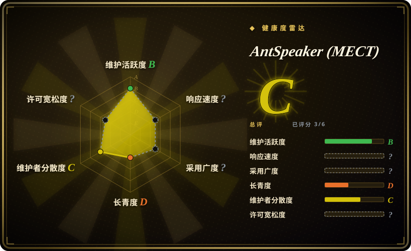
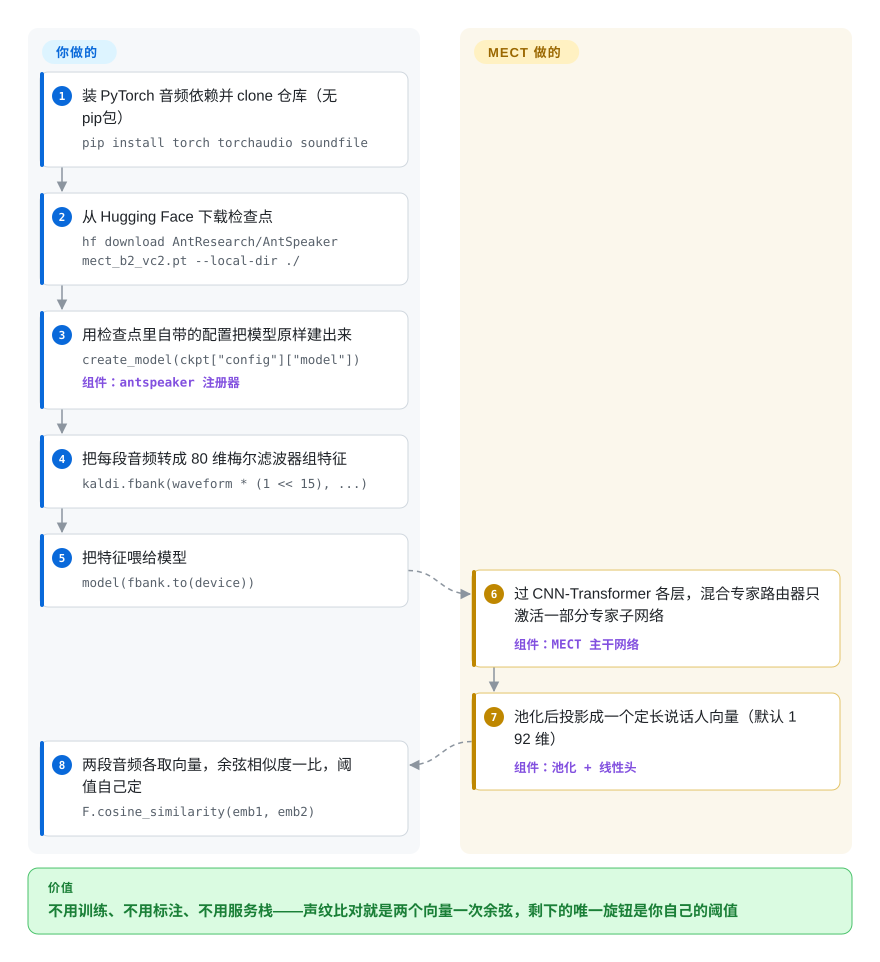

# AntSpeaker (MECT)

要判断两段音频是不是同一个人在说话——声纹登录、校验“是不是注册过的那个人”、给会议录音标谁在发言——但你没有训练数据、没有标注预算，也没有 GPU 集群。AntSpeaker 把这件事做成了六个现成 PyTorch 检查点（380 万到 960 万参数）：每段话压成一个向量，同一个人向量就相近，一次余弦相似度出答案。

## 何时使用

你要做声纹登录、通话录音库按说话人去重，或者在 Python 服务里加一个轻量的“是不是同一个人”校验，而最常规的路——自己微调一个 ECAPA-TDNN——预算上走不通。你从 Hugging Face 下载 mect_b2_vc2.pt（46 MB），按 README 里六行 PyTorch 代码加载，就能用一个 9.57M 参数的模型拿到论文报告的 VoxCeleb1-O EER 0.27%，CPU 也跑得动。相对 SpeechBrain、WeSpeaker 这类工具包，决定性取舍在于：它们给你训练配方和基础设施，但期望你自己训练（至少自己挑模型）；AntSpeaker 只给你做好的模型，别的什么都不给——不用养训练循环、不用调配方，代价是权重带非商用许可证。

第二个触发场景是端上或实时的说话人校验。MECT-B2-Causal 是只向后看的流式变体，能按约 100 毫秒的块持续吐出嵌入，适合直播会议、语音助手和端侧设备——9.57M 参数对嵌入式预算也算友好；而整句模型只能等一句话说完。

## 怎么用起来

这个仓库刻意做得很薄：一个约两千行的推理包 antspeaker，外加放在 Hugging Face 上的六个检查点文件。你不需要手工配置网络结构——每个 .pt 文件里自带一份 config 字典，create_model 照着它把训练时的网络原样重建出来（一个 CNN-Transformer：卷积块先吃掉逐帧音频特征，Transformer 块再跨整句话混合上下文，中间的混合专家层——多个小子网络加一个每次只激活其中一部分的路由器——用少量参数和计算量换来了更大容量）。你负责的是门前进料：用 soundfile 读音频、重采样，用 torchaudio 里 Kaldi 兼容的 fbank 算出 80 维梅尔滤波器组特征（也就是“每 10 毫秒这片声音里各频段能量多大”的标准语音表示），然后调一次模型，拿回一个定长向量（默认 192 维）。同一个人，向量相近；不同人，向量相距远；两条向量做一次余弦相似度，阈值由你自己定。流式（causal）检查点把整句注意力换成了只向后看的缓存，音频按约 100 毫秒的块进、嵌入按块出——但截至本次核验，它的使用教程在 README 里仍是 Coming Soon。

<!-- flow-steps:begin (generated from flows/antspeaker.json by tools/flow_card.py — do not edit) -->

流程文字版

1. **你**：装 PyTorch 音频依赖并 clone 仓库（无 pip 包） — `pip install torch torchaudio soundfile`
2. **你**：从 Hugging Face 下载检查点 — `hf download AntResearch/AntSpeaker mect_b2_vc2.pt --local-dir ./`
3. **你**：用检查点里自带的配置把模型原样建出来 — `create_model(ckpt["config"]["model"])` — 组件：`antspeaker 注册器`
4. **你**：把每段音频转成 80 维梅尔滤波器组特征 — `kaldi.fbank(waveform * (1 << 15), ...)`
5. **你**：把特征喂给模型 — `model(fbank.to(device))`
6. **AntSpeaker (MECT)**：过 CNN-Transformer 各层，混合专家路由器只激活一部分专家子网络 — 组件：`MECT 主干网络`
7. **AntSpeaker (MECT)**：池化后投影成一个定长说话人向量（默认 192 维） — 组件：`池化 + 线性头`
8. **你**：两段音频各取向量，余弦相似度一比，阈值自己定 — `F.cosine_similarity(emb1, emb2)`

**价值**：不用训练、不用标注、不用服务栈——声纹比对就是两个向量一次余弦，剩下的唯一旋钮是你自己的阈值

<!-- flow-steps:end -->

## 何时不用

- **任何商业用途。** 仓库 LICENSE、README 徽章、Hugging Face 标签都写着 CC-BY-NC-SA 4.0——权重不可商用，衍生需相同方式共享。声纹产品请另寻他路：WeSpeaker（Apache-2.0，未收录）、用 SpeechBrain 训练的 ECAPA-TDNN（Apache-2.0，[已收录](speechbrain.zh.md)），或商用声纹 API。
- **要在自己的说话人数据上训练或微调。** 仓库只有推理代码：没有训练循环、没有训练数据加载、没有 VoxCeleb 下载配方、没有评测脚本。要真正的训练管线，用 SpeechBrain 的 recipe、WeSpeaker 或 3D-Speaker（除 SpeechBrain 外均未收录）。
- **长录音上“谁在什么时候说话”。** 它做的是校验（两段已知音频同不同人），不是区分人——没有 VAD、没有分割、没有聚类。用 pyannote.audio（未收录）。
- **大规模 1:N 识别。** 这里没有注册库、打分服务或向量索引——只给裸嵌入，其余自己搭。WeSpeaker 恰好带运行时/部署件（ONNX、服务化、多语言绑定）。
- **今天就要非 PyTorch 部署。** 检查点只有 .pt；requirements.txt 里躺着一个 onnxruntime，但没有任何导出脚本，2026-09-24 提的 ONNX 模型请求至今无人回应。要 ONNX/TensorRT/C++ 运行时，用 WeSpeaker，或从 SpeechBrain 导出 ECAPA。
- **需要一个可锁定版本、有人维护的依赖。** 没有 release、没有 tag、没有 pip 包、总共 3 个提交（截至 2026-09-28）——这是论文产物，不是产品。要么锁定 commit SHA 把那约两千行包 vendor 进来，要么换有发布节奏的工具包。

## 横向对比

| 替代品 | 是否收录 | 我们的评价 | 取舍 |
|---|---|---|---|
| [SpeechBrain](speechbrain.zh.md) | ✅ | 如果你要在自己的说话人或领域上适配（训练/微调），或需要可商用的 Apache-2.0 技术栈，选 SpeechBrain；如果现成的 VoxCeleb 训练检查点够用、想要零训练拿到更强的论文 EER，选 MECT。 | recipe、训练设施、多任务（ASR、分离、说话人识别）一个框架全包；其现成 ECAPA-TDNN recipe 报告的 VoxCeleb1-O EER 低于 MECT-B2 的数字，要追平就得自己训练。 |
| WeSpeaker | 未收录 | 要商用友好（Apache-2.0）且带部署运行时（ONNX、C++/多语言绑定）做 1:N 生产校验，选 WeSpeaker；要更小、指标更强的现成检查点做研究，选 MECT。 | wenet 血统的训→部署全套工具链；同榜基线 EER 高于 MECT 报告值 [未验证：跨论文对比，训练数据不同]。本批次未收录。 |
| pyannote.audio | 未收录 | 问题是长录音区分人（“谁在什么时候说话”）时用 pyannote.audio；对两段已知音频做同人校验用 MECT。 | MIT 工具包，带预训练区分管线和嵌入；其管线要走 Hugging Face 用户协议门禁，嵌入以区分为先而非校验为先。本批次未收录。 |
| 3D-Speaker | 未收录 | 想要 Apache-2.0 的说话人任务模型动物园（CAM++ 嵌入、校验、说话人相关任务）并与 ModelScope 打通，选 3D-Speaker；想要最新 MoE 架构、380 万到 960 万参数和更强报告 EER，选 MECT。 | 阿里背景、说话人任务面广；最近推送停留在 2025-12，旗舰模型是上一代架构 [推断]。本批次未收录。 |

## 技术栈

- **语言：** Python；antspeaker 包按注册表驱动（create_model 从检查点内置的 config 字典重建网络）。
- **ML 框架：** PyTorch + torchaudio；特征用 Kaldi 兼容的 80 维梅尔滤波器组（torchaudio.compliance.kaldi.fbank）；音频读写走 soundfile。
- **结构：** CNN-Transformer 主干（mect.py）加五种混合专家变体（moe.py：TokenMoE/TokenSMoE/UtteranceMoE/UtteranceSMoE/HybridMoE），池化头加 BatchNorm 加线性投影得到嵌入（默认 192 维，model.py）。
- **模型动物园：** 四个尺寸（MECT-A1 3.78M、A2 4.12M、B1 8.26M、B2 9.57M 参数）共六个检查点放在 Hugging Face（AntResearch/AntSpeaker，每个 19–46 MB），训练数据为 VoxCeleb2（最好的加 VoxBlink2）；另有因果/流式检查点（B2-Causal）。
- **无打包：** 没有 pyproject.toml/setup.py——从 git clone 里 import；requirements.txt 列了 tqdm、scikit-learn、matplotlib、onnxruntime、soundfile。

## 依赖

- **运行时：** Python 加 torch、torchaudio、soundfile（README 安装行），外加 requirements.txt 里那几个小依赖。CPU 或 CUDA 均可——3.8M–9.6M 参数的模型 CPU 大概率能跑 [推断：由参数量推断，仓库未发布延迟数据]。
- **检查点：** 从 Hugging Face 用 git lfs 或 hf download 下载——一次性联网步骤；运行时无服务、无 API key、无数据库。
- **推理全程本地**——权重到手后不依赖任何外部服务。

## 运维难度

**低。** clone、pip install torch torchaudio soundfile、取一个 .pt 文件、照 README 代码片段跑——无状态地抽嵌入，没有常驻进程、没有要运维的状态。真正的负担在你这边而不是运维：为应用自选余弦阈值（仓库不提供）、自己搭注册库，以及因为没有 release 可依赖而要把包 vendor 进来并锁版本。

## 健康度与可持续性

- **维护（2026-09-28）：** 仓库 2026-09-14 创建，最后推送 2026-09-23，共 3 个提交，无 release 无 tag——“刚发布”意义上的活跃论文产物仓库，节奏无从判断。至今唯一 issue（求 ONNX 导出，2026-09-24）在 4 天后仍无人回应。
- **治理/巴士因子：** 归 ant-research（蚂蚁集团企业研究组织；代码文件头声明版权属于 Ant Group Co., Ltd.），论文五位作者，2–3 个提交者。路线图以下一篇论文为准，不是社区流程——没有 CONTRIBUTING、没有治理文档、没有外部维护者。
- **年龄与 Lindy 判定：** 核验时仓库 14 天大——完全没有 Lindy 信号，“年龄×仍活跃”无从谈起。当作易过期的研究代码对待，可能等不来第二个论文周期的推送。
- **采用与生态：** 约 56 star、7 fork；Hugging Face 仓库 12 个赞、上月下载为 0（2026-09-28）——只有发布当天的关注度，没有下游生态、没有依赖它的包。文档就是一份 README；流式推理教程仍标 Coming Soon。
- **风险信号：** 最大的一个是许可证：仓库 LICENSE、README、HF 标签写 CC-BY-NC-SA 4.0（非商用、相同方式共享），而每个源码文件头又是 Apache-2.0——这个未解决的分裂挡住了权重的任何商业使用，除非先得到澄清。没有 CVE 面（从未作为包发布）；结果出自 5 页 arXiv 预印本（2609.24061，2026-09-21），尚未见同行评审发表 [未验证：arXiv 页未列 venue]。

## 存疑（未验证）

- [未验证] 全部 EER 数字（VoxCeleb1-O 0.22–0.44%、流式 100 毫秒“性能强劲”）均为论文/README 自报；未做独立复现，也没找到第三方评测。
- [未验证] 许可证分裂：代码文件头是 Apache-2.0，仓库 LICENSE/README/HF 是 CC-BY-NC-SA-4.0；代码是否 Apache-2.0、仅权重非商用，尚无定论——任何靠近商用的使用先问 README 里的联系方式。
- [推断] CPU/端侧可行性由 380 万到 960 万的参数量推断；仓库未发布任何延迟/吞吐/RTF 数据。
- [未验证] 摘要称在 CN-Celeb 上“结果强劲”，本次未抽取或核对具体数字。
- [未验证] star（56）与 HF 点赞（12）为 2026-09-28 快照；首日数据波动大、参考价值低。
- [推断] “不发 pip 包、从 clone import”反映 HEAD 时点的目录树（无 pyproject.toml）；之后可能打包——开着的 ONNX issue 说明确有部署需求。
- [未验证] 流式检查点的使用路径：mect.py 里有 StreamingCache/因果代码，但核验时 README 教程仍是 Coming Soon，成文档的快速上手只覆盖整句推理。
