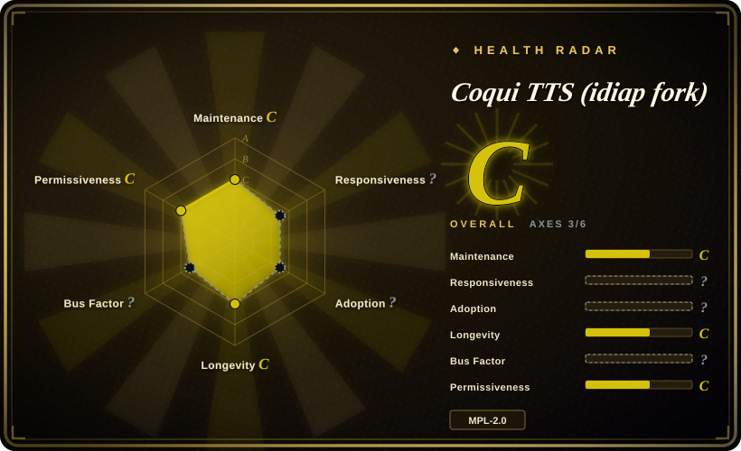

# Coqui TTS (idiap fork)

A deep-learning **text-to-speech library** — the maintained idiap fork of the now-unmaintained Coqui TTS — offering XTTS v2 voice cloning in 17 languages, ~1100-language Fairseq/MMS models, voice conversion, and training/fine-tuning utilities, consumed as the `coqui-tts` Python package.

## When to use

You're a Python engineer embedding speech synthesis into your own product or pipeline — a batch dubbing job, a call-center prompt generator, a game/app that needs runtime TTS — and you want a **library dependency**, not an application or a WebUI. You `pip install coqui-tts`, load a pretrained model (XTTS v2 for cloning, or a Fairseq/MMS model for one of ~1100 languages), and call it in-process, keeping full control of the serving layer. You pick it over [Voicebox](voicebox.md) because you want a library rather than a self-hosted studio with its own UI and MCP server; you pick it over [GPT-SoVITS](gpt-sovits.md) because you want `import` and an API surface rather than a Gradio WebUI plus fine-tuning. The deciding tradeoff is **library embedding and breadth of pretrained models** versus product packaging — and, for some teams, its MPL-2.0 license versus the MIT of both alternatives.

## When NOT to use

- **You want an all-in-one voice app (dictation, hotkey paste, agent voice, effects).** Use [Voicebox](voicebox.md) instead — Coqui TTS is a library with no dictation, no UI shell, and no MCP surface.
- **You want a ready-made cloning WebUI and a few-shot fine-tuning flow with dataset tooling.** Use [GPT-SoVITS](gpt-sovits.md) instead; it packages the training and data-prep steps that Coqui TTS leaves to you.
- **You need a general speech training framework spanning ASR, speaker ID, and separation, not just TTS.** Use [SpeechBrain](speechbrain.md) instead.
- **You need hosted, zero-setup quality TTS.** Use ElevenLabs or another hosted TTS instead of running models locally.
- **Your legal review rejects MPL-2.0.** MPL-2.0 is file-level copyleft, which some product teams won't accept; if that's you, choose MIT-licensed alternatives such as [Voicebox](voicebox.md), [GPT-SoVITS](gpt-sovits.md), or a permissive inference-only engine. (Not legal advice.)
- **You need a vendor SLA or commercial backing for the TTS stack.** Coqui the company is gone and the original `coqui-ai/TTS` is unmaintained; this fork is community/institute-maintained with no support contract, so budget to fix issues yourself.
- **You want a tiny dependency.** It pulls PyTorch and a research-grade stack; if you only need small-model inference, a lighter runtime fits better.

## Comparison

| Alternative | In index | Our verdict | Tradeoff |
|---|---|---|---|
| [Voicebox](voicebox.md) | ✅ | Choose Coqui TTS when you want a TTS library to embed and control yourself; choose Voicebox when you want a packaged studio (UI, dictation, effects, MCP agent voice) you run rather than code against. | Library gives integration freedom with no app shell; Voicebox gives a ready product but a heavier stack and a stalled release cadence. |
| [GPT-SoVITS](gpt-sovits.md) | ✅ | Choose Coqui TTS when you need a Python library plus broad pretrained-model coverage; choose GPT-SoVITS when you want a WebUI-driven cloning workflow with few-shot fine-tuning. | Coqui is easier to integrate as a dependency; GPT-SoVITS is easier to operate as an app for cloning a specific voice. |
| [SpeechBrain](speechbrain.md) | ✅ | Choose Coqui TTS when TTS/cloning is the task and you want ready models; choose SpeechBrain when you need a general framework to train ASR/speaker/separation/TTS from recipes. | Coqui is TTS-focused and model-first; SpeechBrain is task-broad and training-first. |
| ElevenLabs | 未收录 | Choose ElevenLabs when you want hosted quality without running models; choose Coqui TTS when you must keep inference in your own process and avoid per-character costs. | Hosted removes hardware and ops but adds cost and egress; Coqui needs local/GPU hardware and your own serving. |

## Tech stack

- **Language / packaging:** Python, distributed on PyPI as **`coqui-tts`** (requires Python 3.10–3.14).
- **Framework:** **PyTorch** (+ torchaudio); separate `coqui-tts-trainer` package for training.
- **Models:** **XTTS v2** (voice cloning, 17 languages, streaming with reported <200ms latency), Fairseq/MMS models covering ~1100 languages, plus voice-conversion models (OpenVoice, kNN-VC); a cloning-voice cache was added in 0.27.0.
- **Training:** recipes for fine-tuning and training new models, dataset analysis/curation utilities.
- **Docs / CI:** ReadTheDocs-hosted documentation; GitHub Actions for tests, style checks, Docker, and PyPI release.

## Dependencies

- **Runtime:** Python 3.10–3.14 and PyTorch (`torch>=2.2`, `torchaudio`) — install the correct CPU/CUDA/macOS wheel yourself; `numpy>=1.26`, `coqui-tts-trainer>=0.3,<0.4`, and optional `torchcodec` on newer torch.
- **Hardware:** a GPU is recommended for real-time/serving workloads; CPU works but is slower. Training needs a GPU.
- **Model assets:** pretrained models are downloaded on demand, so first use needs network and disk.
- **External services:** none at runtime; PyPI (install), the model zoo/Hugging Face (weights), and ReadTheDocs (docs) are integration/network dependencies.

## Ops difficulty

**Low to medium as a library; higher if you train.** `pip install coqui-tts`, load a model, call it — there is no server to operate, and the package handles model download. The costs are the PyTorch/CUDA wheel matrix, model-asset disk/network, and (for fine-tuning) dataset prep and GPU time. Anything production-facing — authentication, queueing, autoscaling, observability — is yours to build, since Coqui TTS ships no service.

## Health & viability

- **Maintenance (2026-09).** Judgment: **maintained but slow.** The last push is 2026-06-10, the most recent release is v0.27.5 (2026-01-26), and the fork exists specifically because the original `coqui-ai/TTS` stopped being maintained (original last push 2024-08). [推断]
- **Governance / bus factor.** **Better than a solo repo, weaker than a foundation.** It lives under the **idiap** organization (a Swiss research institute) and its contributor list includes former Coqui engineers, but there is no foundation or vendor SLA behind it. The health radar leaves this axis unscored because GitHub reports the repo as a native fork. [推断]
- **Age × Lindy.** **Moderate.** The fork was created 2023-10-31 (~2.9 years old at verification) and is still active; the underlying Coqui TTS lineage is older, but the *maintained artifact* is the fork, so judge the fork's own track record. [推断]
- **Adoption & ecosystem.** Modest on the fork itself (~2.3k stars) versus the original repo's much larger historical following; the published `coqui-tts` package, ReadTheDocs, and recurring releases indicate continued real use, and only ~18 open issues suggests a low-traffic but tended project. [推断]
- **Risk flags.** **MPL-2.0** (file-level copyleft — check your policy); no commercial backing after Coqui's shutdown; the package name differs from the old `TTS` package, so older tutorials may mislead. [推断]

## Caveats (unverified)

- [未验证] Star/fork counts (~2.3k stars, ~289 forks) are the fork's own numbers and date-sensitive; the original `coqui-ai/TTS` shows ~46k stars but is unmaintained (last push 2024-08), and stars are not transferable.
- [未验证] Feature claims (XTTS v2 17 languages, ~1100-language Fairseq/MMS models, <200ms streaming, OpenVoice/kNN-VC) come from the README, not reproduced here.
- [推断] "Maintained but slow" is inferred from the last push (2026-06-10) and latest release (v0.27.5, 2026-01); release cadence could change.
- [未验证] The MPL-2.0 licensing consequences for embedding are described at a high level and are not legal advice; have counsel review before shipping.
- [未验证] PyPI download volume for `coqui-tts` was not measured; "continued real use" is inferred from releases, docs, and issue activity.
- [推断] The contributor list includes names associated with the original Coqui project, which inflates apparent continuity; actual current maintainer activity was not audited per person.
