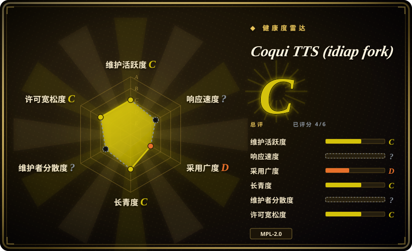

# Coqui TTS (idiap fork)

一个深度学习**文本转语音库**——已被 idiap 接手维护的 Coqui TTS 分支（原仓库已停止维护）——提供 17 种语言的 XTTS v2 声音克隆、约 1100 种语言的 Fairseq/MMS 模型、声音转换，以及训练/微调工具，以 `coqui-tts` Python 包的形式使用。

## 何时使用

你是 Python 工程师，要把语音合成嵌进自己的产品或管线——批处理配音、客服话术生成、需要运行时 TTS 的游戏/应用——而你想要一个**库依赖**，不是一个应用或 WebUI。你 `pip install coqui-tts`，加载预训练模型（克隆用 XTTS v2，或覆盖约 1100 种语言的 Fairseq/MMS 模型），在进程内调用，服务层完全自己掌控。你选它而不是 [Voicebox](voicebox.zh.md)，是因为你要的是库而非一个自带界面和 MCP 服务的自托管工作室；你选它而不是 [GPT-SoVITS](gpt-sovits.zh.md)，是因为你要 `import` 和 API 接口，而不是 Gradio WebUI 加微调流程。决定性取舍是**库式集成与预训练模型广度**对比产品化封装——对部分团队而言，还有它的 MPL-2.0 许可对比两个替代品的 MIT。

## 何时不用

- **你想要一个语音一体化应用（听写、热键粘贴、agent 发声、效果）。** 此时选 [Voicebox](voicebox.zh.md)——Coqui TTS 是库，没有听写、没有界面外壳、也没有 MCP 接口。
- **你想要开箱即用的克隆 WebUI 和带数据工具的小样本微调流程。** 此时选 [GPT-SoVITS](gpt-sovits.zh.md)；Coqui TTS 把训练和数据准备步骤留给了你。
- **你需要覆盖 ASR、说话人识别、分离而不仅是 TTS 的通用语音训练框架。** 此时选 [SpeechBrain](speechbrain.zh.md)。
- **你需要托管、零部署的高质量 TTS。** 用 ElevenLabs 或其他托管 TTS，而不是本地跑模型。
- **你的法务不接受 MPL-2.0。** MPL-2.0 是文件级 copyleft，部分产品团队不接受；若如此，请选 MIT 许可的替代品，如 [Voicebox](voicebox.zh.md)、[GPT-SoVITS](gpt-sovits.zh.md)，或仅推理的宽松许可引擎。（非法律意见。）
- **你需要厂商 SLA 或 TTS 技术栈的商业背书。** Coqui 公司已不存在，原 `coqui-ai/TTS` 已停止维护；本分支由社区/研究所维护，没有支持合同，出问题要自己修。
- **你想要极小的依赖。** 它会拉入 PyTorch 和一套研究级栈；如果只需小模型推理，更轻的运行时更合适。

## 横向对比

| 替代品 | 是否收录 | 我们的评价 | 取舍 |
|---|---|---|---|
| [Voicebox](voicebox.zh.md) | ✅ | 想要一个可嵌入、自己掌控的 TTS 库时，选 Coqui TTS；想要一个开箱即用的工作室（界面、听写、效果、MCP agent 发声）去运行而非写代码对接时，选 Voicebox。 | 库给集成自由但没有应用外壳；Voicebox 给现成产品，但栈更重、发布节奏已停。 |
| [GPT-SoVITS](gpt-sovits.zh.md) | ✅ | 需要 Python 库加广泛预训练模型覆盖时，选 Coqui TTS；想要 WebUI 驱动的克隆流程与小样本微调时，选 GPT-SoVITS。 | Coqui 作为依赖更好集成；GPT-SoVITS 作为应用更容易操作、更适合克隆特定音色。 |
| [SpeechBrain](speechbrain.zh.md) | ✅ | 任务就是 TTS/克隆、且想要现成模型时，选 Coqui TTS；需要用 recipe 从零训练 ASR/说话人/分离/TTS 的通用框架时，选 SpeechBrain。 | Coqui 聚焦 TTS 且模型优先；SpeechBrain 任务面更广且训练优先。 |
| ElevenLabs | 未收录 | 想不跑模型就有托管级质量时，选 ElevenLabs；必须把推理留在自己进程里、避免按字符计费时，选 Coqui TTS。 | 托管省掉硬件和运维，但增加费用与数据外流；Coqui 需要本地/GPU 硬件并自建服务。 |

## 技术栈

- **语言/打包：** Python，以 **`coqui-tts`** 发布在 PyPI（要求 Python 3.10–3.14）。
- **框架：** **PyTorch**（加 torchaudio）；训练用独立的 `coqui-tts-trainer` 包。
- **模型：** **XTTS v2**（声音克隆，17 种语言，流式据称延迟 <200ms）、覆盖约 1100 种语言的 Fairseq/MMS 模型，以及声音转换模型（OpenVoice、kNN-VC）；0.27.0 起加入克隆音色缓存。
- **训练：** 微调与训练新模型的 recipe，数据集分析与整理工具。
- **文档/CI：** 文档托管在 ReadTheDocs；GitHub Actions 负责测试、风格检查、Docker 与 PyPI 发布。

## 依赖

- **运行时：** Python 3.10–3.14 与 PyTorch（`torch>=2.2`、`torchaudio`）——CPU/CUDA/macOS 的 wheel 需你自己选装；另有 `numpy>=1.26`、`coqui-tts-trainer>=0.3,<0.4`，较新 torch 上可选 `torchcodec`。
- **硬件：** 实时/服务型负载建议用 GPU；CPU 可跑但更慢。训练需要 GPU。
- **模型资产：** 预训练模型按需下载，首次使用需要网络和磁盘。
- **外部服务：** 运行时无外部服务；PyPI（安装）、model zoo/Hugging Face（权重）、ReadTheDocs（文档）是集成/网络依赖。

## 运维难度

**作为库为低到中；要训练则更高。** `pip install coqui-tts`、加载模型、调用即可——没有要运维的服务，包自己处理模型下载。成本在 PyTorch/CUDA 的 wheel 矩阵、模型资产的磁盘/网络，以及（微调时）数据集准备与 GPU 时间。任何面向生产的部分——鉴权、队列、弹性伸缩、可观测性——都得你自己搭，因为 Coqui TTS 不提供任何服务。

## 健康度与可持续性

- **维护（2026-09）。** 判断：**仍在维护但节奏慢**。最后 push 是 2026-06-10，最新版本是 v0.27.5（2026-01-26）；这个分支的存在本身就是因为原 `coqui-ai/TTS` 停止维护（原仓库最后 push 为 2024-08）。[推断]
- **治理 / bus factor。** **好于单人仓库，弱于基金会。** 它挂在 **idiap** 组织下（瑞士的一家研究所），贡献者名单包含前 Coqui 工程师，但背后没有基金会或厂商 SLA。健康度雷达该项未计分，因为 GitHub 把它标记为原生 fork。[推断]
- **年龄 × Lindy。** **中等。** 分支创建于 2023-10-31（核实时尚约 2.9 年）且仍在活跃；Coqui TTS 的血统更久，但**被维护的实体**是这个分支，应按分支自身的履历来判断。[推断]
- **采用度与生态。** 分支本身规模不大（约 2.3k stars），远低于原仓库的历史关注度；已发布的 `coqui-tts` 包、ReadTheDocs 与持续发版表明仍被真实使用，约 18 个未关 issue 也说明流量不高但有人在照看。[推断]
- **风险标记。** **MPL-2.0**（文件级 copyleft——先查你的政策）；Coqui 倒闭后无商业背书；包名与旧 `TTS` 包不同，老教程可能误导。[推断]

## 存疑（未验证）

- [未验证] star/fork 数（约 2.3k stars、约 289 forks）是分支自身的数字且对时间敏感；原 `coqui-ai/TTS` 显示约 46k stars 但已停止维护（最后 push 2024-08），star 不能迁移。
- [未验证] 功能宣称（XTTS v2 17 种语言、约 1100 种语言的 Fairseq/MMS 模型、<200ms 流式、OpenVoice/kNN-VC）来自 README，未在此复现。
- [推断]「仍在维护但节奏慢」由最后 push（2026-06-10）与最新版本（v0.27.5，2026-01）推断；发布节奏可能变化。
- [未验证] 关于 MPL-2.0 在嵌入场景下的后果只做了高层描述，不构成法律意见；上线前请法务审阅。
- [未验证] 未测量 `coqui-tts` 在 PyPI 的下载量；「仍被真实使用」由发版、文档与 issue 活动推断。
- [推断] 贡献者名单包含与原 Coqui 项目相关的名字，会抬高表面的延续性；未逐人审计当前实际维护活跃度。
