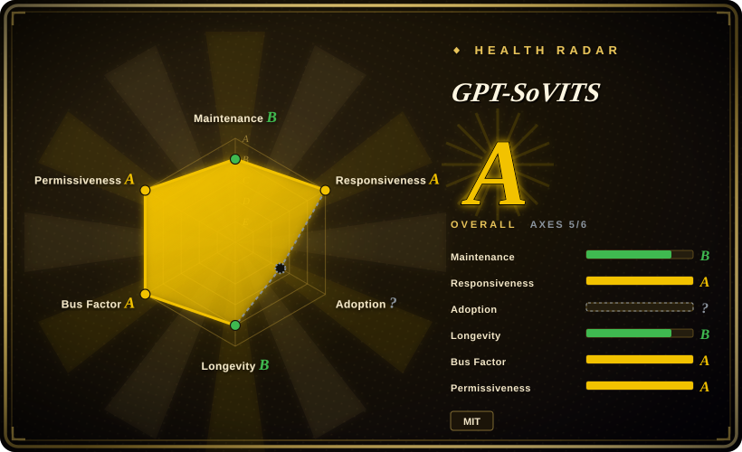

# GPT-SoVITS

A few-shot voice-cloning and text-to-speech WebUI: clone a voice zero-shot from a ~5s sample, or fine-tune on ~1 minute of audio for higher similarity, with dataset-prep tools (accompaniment separation, ASR, labeling) and a small HTTP API.

## When to use

You're building a voice-cloning workflow — a character voice for a game/app, a dubbed narrator, a personal TTS for a specific speaker — and the *similarity* of the clone matters more than having a broad product around it. You feed GPT-SoVITS a 5-second sample for an instant zero-shot test, or 1 minute of clean audio to fine-tune a speaker-specific model, then drive it from the bundled Gradio WebUI or its `api_v2.py` HTTP endpoint. You pick it over [Voicebox](voicebox.md) when you only need the TTS/cloning half (no dictation, hotkey paste, or MCP agent voice), when you want a training path to push similarity beyond generic zero-shot engines, or when your main languages are Chinese / Japanese / Korean / Cantonese alongside English. The deciding tradeoff is cloning depth plus dataset tooling versus Voicebox's all-in-one voice-I/O packaging.

## When NOT to use

- **You want an all-in-one voice I/O application (dictation + TTS + agent voice in one place).** Use [Voicebox](voicebox.md) instead: GPT-SoVITS is a TTS/cloning tool with no system dictation, no global-hotkey paste, and no MCP surface.
- **You want a Python library to embed TTS in your own service, without a WebUI or training pipeline.** Use [Coqui TTS (idiap fork)](coqui-ai-tts.md) instead, or a lighter inference library.
- **You need cloud-grade quality and zero local setup.** Use ElevenLabs or another hosted TTS instead — no GPU, no model downloads, per-character pricing instead of local hardware.
- **You have no GPU but need interactive latency.** Inference runs on CPU (the README reports roughly 0.53 RTF on an M4 CPU), but it is far slower than a 4060Ti/4090; for CPU-only, prefer the CPU-friendly small engines in [Voicebox](voicebox.md) (Kokoro, LuxTTS) or a hosted service.
- **You need to expose a TTS API to other people.** The bundled API server has no authentication; it defaults to binding `127.0.0.1`, so keep it local or put an authenticated reverse proxy in front rather than binding `0.0.0.0` on a shared network.
- **You need a stable, versioned API and long-term support.** This is a research-WebUI project with large, infrequent releases and docs hosted off-repo (Yuque/Rentry); pin a known-good commit and expect to read source when something changes.

## Comparison

| Alternative | In index | Our verdict | Tradeoff |
|---|---|---|---|
| [Voicebox](voicebox.md) | ✅ | Choose GPT-SoVITS when you only need deep voice cloning with a training path and a WebUI; choose Voicebox when you also want dictation, audio effects, and MCP/REST agent speech in one self-hosted app. | GPT-SoVITS is narrower and cloning-focused; Voicebox is a broader studio with a heavier multi-engine stack and a stalled release cadence. |
| [Coqui TTS (idiap fork)](coqui-ai-tts.md) | ✅ | Choose GPT-SoVITS when you want a ready-made cloning WebUI and a few-shot fine-tuning workflow; choose Coqui TTS when you want a Python library with XTTS and many pretrained models to embed in code. | WebUI + training recipes versus a library surface: GPT-SoVITS is easier to *use* as an app, Coqui is easier to *integrate* as a dependency. |
| [SpeechBrain](speechbrain.md) | ✅ | Choose SpeechBrain when you need a general speech-model training framework (ASR/speaker/separation/TTS) rather than a focused cloning product; choose GPT-SoVITS when cloning from a short sample is the whole job. | SpeechBrain gives breadth and research recipes; GPT-SoVITS gives a shorter path from a voice sample to cloned speech. |
| ElevenLabs | 未收录 | Choose ElevenLabs when hosted, high-quality TTS with no local GPU is the priority; choose GPT-SoVITS when the voice must be cloned locally and you accept running/training models yourself. | Hosted is turnkey and polished but per-character priced and cloud-bound; GPT-SoVITS is free and local but needs GPU setup and tuning. |

## Tech stack

- **Language / framework:** Python, built on **PyTorch** with **PyTorch Lightning** for training; Gradio powers the WebUI.
- **Models:** GPT + SoVITS (VITS-family) pipeline for zero-shot and few-shot cloning; multiple model versions (v2/v3/v4, v2Pro/v2ProPlus).
- **Serving:** bundled `api.py` / `api_v2.py` HTTP endpoints (e.g. `/tts`) with streaming-mode support; ONNX Runtime for some components.
- **Data tooling:** integrated accompaniment separation, automatic segmentation, and multilingual ASR (FunASR, SenseVoice) plus labeling tools to build training sets.
- **Packaging:** install scripts (`install.sh`/`.ps1`), a Docker image, and Colab notebooks.

## Dependencies

- **Runtime:** Python 3.10–3.12, PyTorch (CUDA 12.x, Apple Silicon, or CPU), plus a heavy scientific/audio dependency set (librosa, numba, ffmpeg, transformers, faster-whisper for data prep).
- **Hardware:** a CUDA GPU for training and fast inference; CPU and Apple Silicon are supported but slower.
- **Model assets:** pretrained weights are downloaded separately (Hugging Face / ModelScope), so first-run needs network and disk.
- **External services:** none required for inference; the hosted Hugging Face demo and Colab path are conveniences, not dependencies.

## Ops difficulty

**Medium to high.** There is no service to keep running, but you self-manage a research-grade install: pinned PyTorch/CUDA versions, large model downloads, and an off-repo docs situation (guides live on Yuque/Rentry). Training adds the usual ML burden (clean reference audio, GPU time, evaluating similarity). The bundled API server is convenient but unauthenticated and localhost-bound by default, so exposing it is on you.

## Health & viability

- **Maintenance (2026-09).** Judgment: **active but release-sparse**. The last push is 2026-08-18 and the last tagged release is `20250606v2pro` (2025-06) — commits continue while releases are infrequent. [推断]
- **Governance / bus factor.** **Concentrated historically, broader recently.** `RVC-Boss` dominates all-time commits (~607), but the health scorer's 12-month window shows ~16 active contributors with a top-1 share of 0.263 (~26%) — so the current bus factor is better than the all-time counts suggest. The owner is an individual User account, not a foundation or vendor. [推断]
- **Age × Lindy.** **Moderate.** Created 2024-01-14 — about 2.6 years old at verification and still active, which clears the young-hype bar but gives much less track record than a decade-old tool. [推断]
- **Adoption & ecosystem.** Very large for its niche: ~61.9k stars, ~6.7k forks, a public Hugging Face demo, Docker/Colab paths, and community CPU-optimized forks — strong evidence of real use. [推断]
- **Risk flags.** MIT license, no relicense signal found. Risks are project-shape risks: informal/solo maintenance, docs and guides hosted off-repo (so links can rot), infrequent tagged releases, and an unauthenticated-by-default API. [推断]

## Caveats (unverified)

- [未验证] Performance figures (RTF 0.028 on 4060Ti / 0.014 on 4090 / ~0.53 on M4 CPU) are the project's README claims, not measured here.
- [未验证] Cross-lingual coverage (English/Japanese/Korean/Cantonese/Chinese) and feature list (zero-shot 5s, few-shot 1min) are from the README/docs, not reproduced.
- [未验证] The API-server auth/binding description is from `api_v2.py`'s documented defaults (bind `127.0.0.1`, no auth mentioned); the full server code was not audited.
- [推断] "Solo-led with a contributor tail" is inferred from contributor counts; the exact maintainer/decision structure was not confirmed.
- [未验证] Star/fork counts are date-sensitive and may have moved since 2026-09-19.
- [推断] "Docs hosted off-repo (Yuque/Rentry) can rot" is a maintenance-risk inference, not an observed failure.
