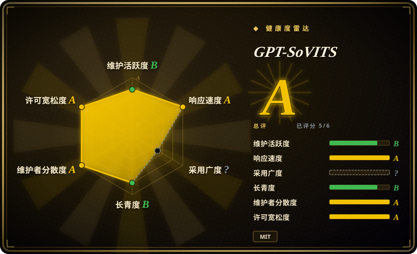

# GPT-SoVITS

一个小样本声音克隆与文本转语音的 WebUI：用约 5 秒样本做 zero-shot 即时克隆，或用约 1 分钟音频微调以提升相似度，并自带数据集准备工具（伴奏分离、ASR、打标）和一个轻量 HTTP API。

## 何时使用

你在搭一条声音克隆工作流——游戏/应用的角色音、旁白配音、某个特定说话人的个人 TTS——而且克隆的**相似度**比周边产品形态更重要。你把 5 秒样本丢给 GPT-SoVITS 做即时 zero-shot 试听，或喂 1 分钟干净音频微调出一个专属说话人模型，然后通过自带的 Gradio WebUI 或 `api_v2.py` 的 HTTP 端点驱动它。当你要的只是 TTS/克隆这一半（不需要听写、热键粘贴或 MCP agent 发声）、当你想要一条训练路径把相似度推到通用 zero-shot 引擎之上、或当你的主力语言是中文/日文/韩文/粤语加英文时，你会选它而不是 [Voicebox](voicebox.zh.md)。决定性取舍是克隆深度加数据工具链，对比 Voicebox 的语音 I/O 一体化封装。

## 何时不用

- **你想要一个语音 I/O 一体化的应用（听写 + TTS + agent 发声合在一处）。** 此时选 [Voicebox](voicebox.zh.md)：GPT-SoVITS 是 TTS/克隆工具，没有系统级听写、没有全局热键粘贴、也没有 MCP 接口。
- **你想把一个 Python 库嵌进自己的服务，不需要 WebUI 和训练管线。** 此时选 [Coqui TTS（idiap 分支）](coqui-ai-tts.zh.md) 或更轻的纯推理库。
- **你要云端级质量且零本地部署。** 此时选 ElevenLabs 或其他托管 TTS——不需要 GPU、不需要下模型，用按字符计费替代本地硬件。
- **你没有 GPU 又需要交互级延迟。** CPU 能推理（README 称 M4 CPU 上约 0.53 RTF），但远慢于 4060Ti/4090；纯 CPU 场景请优先用 [Voicebox](voicebox.zh.md) 里对 CPU 友好的小引擎（Kokoro、LuxTTS）或托管服务。
- **你要把 TTS API 开放给其他人调用。** 自带的 API 服务没有鉴权，默认绑定 `127.0.0.1`；请保持本地，或在其前面加带认证的反向代理，而不要在共享网络上绑 `0.0.0.0`。
- **你需要稳定、有版本语义的 API 和长期支持。** 这是一个研究型 WebUI 项目，发布大而稀疏，文档还托管在仓库外（语雀/Rentry）；请 pin 一个已知可用的提交，并预期要读源码应对变化。

## 横向对比

| 替代品 | 是否收录 | 我们的评价 | 取舍 |
|---|---|---|---|
| [Voicebox](voicebox.zh.md) | ✅ | 只需要带训练路径的深度声音克隆和 WebUI 时，选 GPT-SoVITS；当你还要在同一个自托管应用里有听写、音频效果和 MCP/REST agent 发声时，选 Voicebox。 | GPT-SoVITS 更窄、更聚焦克隆；Voicebox 是更宽的工作室，多引擎栈更重、发布节奏已停。 |
| [Coqui TTS（idiap 分支）](coqui-ai-tts.zh.md) | ✅ | 想要开箱即用的克隆 WebUI 和小样本微调流程时，选 GPT-SoVITS；想用带 XTTS 与大量预训练模型、可嵌进代码的 Python 库时，选 Coqui TTS。 | WebUI 加训练 recipe 对比库接口：GPT-SoVITS 作为应用更好*用*，Coqui 作为依赖更好*集成*。 |
| [SpeechBrain](speechbrain.zh.md) | ✅ | 需要通用的语音模型训练框架（ASR/说话人/分离/TTS）而非聚焦的克隆产品时，选 SpeechBrain；当从短样本克隆就是全部任务时，选 GPT-SoVITS。 | SpeechBrain 给广度和研究 recipe；GPT-SoVITS 给一条从声音样本到克隆语音的更短路径。 |
| ElevenLabs | 未收录 | 追求托管、高质量、无需本地 GPU 的 TTS 时，选 ElevenLabs；当音色必须在本地克隆、且你接受自己跑/训模型时，选 GPT-SoVITS。 | 托管开箱即用且完成度高，但按字符计费、受云端约束；GPT-SoVITS 免费本地，但要自己搭 GPU 和调参。 |

## 技术栈

- **语言/框架：** Python，构建在 **PyTorch** 上，训练用 **PyTorch Lightning**；WebUI 用 Gradio。
- **模型：** GPT + SoVITS（VITS 家族）管线，支持 zero-shot 与小样本克隆；有多个模型版本（v2/v3/v4、v2Pro/v2ProPlus）。
- **服务：** 自带 `api.py` / `api_v2.py` HTTP 端点（如 `/tts`），支持流式模式；部分组件用 ONNX Runtime。
- **数据工具：** 集成伴奏分离、自动切分、多语种 ASR（FunASR、SenseVoice）与打标工具，用于构建训练集。
- **打包：** 安装脚本（`install.sh`/`.ps1`）、Docker 镜像与 Colab notebook。

## 依赖

- **运行时：** Python 3.10–3.12、PyTorch（CUDA 12.x、Apple Silicon 或 CPU），外加一套很重的科学/音频依赖（librosa、numba、ffmpeg、transformers、数据准备用的 faster-whisper）。
- **硬件：** 训练和快速推理需要 CUDA GPU；CPU 与 Apple Silicon 可用但更慢。
- **模型资产：** 预训练权重需另行下载（Hugging Face / ModelScope），首次运行需要网络和磁盘。
- **外部服务：** 推理不依赖外部服务；Hugging Face 在线 demo 与 Colab 只是便利路径，不是依赖。

## 运维难度

**中到高。** 没有需要常驻的服务，但你要自己维护一套研究级安装：pin 住 PyTorch/CUDA 版本、下载大模型、以及应对文档在仓库外（语雀/Rentry）的现状。训练还要加上常规 ML 负担（干净参考音频、GPU 时间、评估相似度）。自带的 API 服务方便，但无鉴权且默认只绑 localhost，对外暴露的风险由你承担。

## 健康度与可持续性

- **维护（2026-09）。** 判断：**活跃但发布稀疏**。最后 push 是 2026-08-18，最后一个 tag 版本是 `20250606v2pro`（2025-06）——提交在继续，但版本发布不频繁。[推断]
- **治理 / bus factor。** **历史上集中，近期更分散。** `RVC-Boss` 在历史提交上遥遥领先（约 607 次），但健康度评分器取近 12 个月窗口，显示约 16 位活跃贡献者、头号占比 0.263（约 26%）——当前 bus factor 好于历史计数给人的印象。所有者是个人 User 账号，不是基金会或厂商。[推断]
- **年龄 × Lindy。** **中等。** 2024-01-14 创建——核实时尚约 2.6 年且仍在活跃，越过了“年轻爆红”的门槛，但历史积淀远不如十年老工具。[推断]
- **采用度与生态。** 在其细分领域极大：约 61.9k stars、约 6.7k forks、公开的 Hugging Face demo、Docker/Colab 路径，以及社区出的 CPU 优化分支——都是真实使用的强证据。[推断]
- **风险标记。** MIT 许可，未发现改协议信号。风险是项目形态风险：非正式/单人维护、文档与指南托管在仓库外（链接可能失效）、tag 版本稀疏、API 默认无鉴权。[推断]

## 存疑（未验证）

- [未验证] 性能数字（4060Ti 上 RTF 0.028 / 4090 上 0.014 / M4 CPU 约 0.53）是项目 README 的宣称，未在此环境测量。
- [未验证] 跨语种覆盖（英/日/韩/粤/中）与功能项（zero-shot 5 秒、few-shot 1 分钟）来自 README/文档，未复现。
- [未验证] API 服务的鉴权/绑定描述来自 `api_v2.py` 的文档默认值（绑 `127.0.0.1`，未提及鉴权）；未审计完整服务端代码。
- [推断]「单人主导 + 贡献者长尾」由贡献者计数推断；确切的维护者/决策结构未确认。
- [未验证] star/fork 数对时间敏感，可能自 2026-09-19 起已变化。
- [推断]「文档托管在仓库外（语雀/Rentry）可能失效」是维护风险推断，非已观察到的失效。
