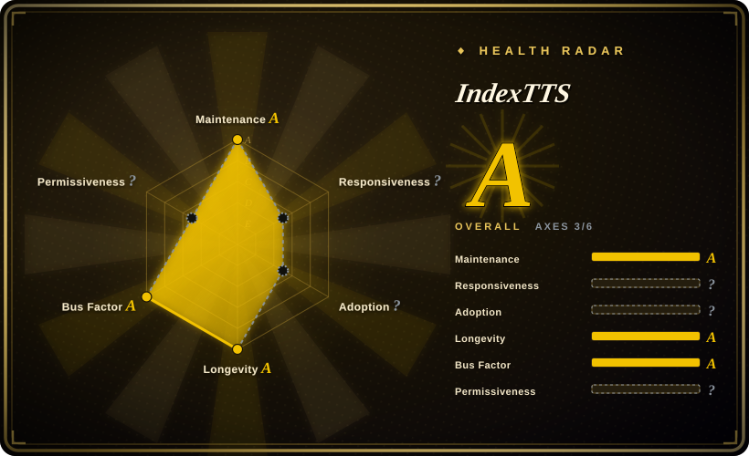
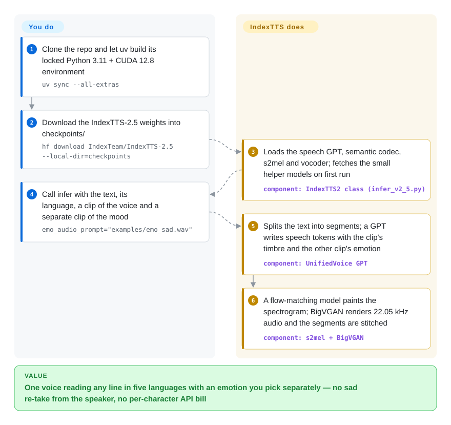

# IndexTTS

You need one cloned voice to sound calm in one line and terrified in the next, but a typical voice-cloning model copies whatever mood your reference clip happened to have — record the narrator once, calmly, and every line comes out calm. IndexTTS, from bilibili's Index team, takes the *voice* from one short clip and the *emotion* from a second clip, an eight-number emotion dial or a sentence describing the mood, and speaks Chinese, English, Japanese, Spanish or Arabic on your own GPU — free to use until your company crosses bilibili's licence thresholds.

## When to use

You're producing Chinese-first voice content with characters — short-video dubbing, an audio drama, game NPC barks — and you have exactly one clean 5–10 second recording of each voice. Chapter 12 needs the narrator weeping; with most zero-shot cloners the emotion is baked into the reference audio, so the only fix is to get the same person to record a sad take. IndexTTS lets you keep `spk_audio_prompt='examples/voice_07.wav'` for timbre and add `emo_audio_prompt="examples/emo_sad.wav"` recorded by *anyone*, or skip audio entirely with `emo_vector=[0, 0, 0.8, 0, 0, 0, 0, 0]` (the third slot is "sad"), and it fixes polyphone misreads inline — `银<行|XING2>` vs `<行|HANG2>` — instead of making you respell the script.

Pick it over [VoxCPM](voxcpm.md) when that timbre/emotion split and per-character pronunciation control matter more than VoxCPM's Apache-2.0 weights and 30-language coverage; pick it over [GPT-SoVITS](gpt-sovits.md) when you want good similarity from one clip with no training run, plus emotion control GPT-SoVITS does not offer. The deciding tradeoff: the most controllable expressive cloning in this category, paid for with a bespoke bilibili licence (separate grant needed above 100M monthly users or, per the governing Chinese text, RMB 100M annual revenue), five languages only, and no official training code.

## How it works

IndexTTS is a pipeline of four networks that you load as one Python object. First, an autoregressive "GPT" — a transformer that predicts the next item from everything before it, the way a phone keyboard predicts your next word — writes the speech as a sequence of *semantic tokens* (compact codes for "what is said, with what rhythm"), conditioned separately on a speaker fingerprint taken from your voice clip and an emotion vector taken from the emotion clip, the vector you pass, or a small fine-tuned Qwen model that reads the mood out of text. Then a flow-matching model (a network that turns noise into a target picture step by step) paints those codes into a mel spectrogram — a picture of the sound's frequencies over time — and the BigVGAN vocoder turns that picture into a 22.05 kHz waveform. Think of a dubbing booth where the actor's throat comes from one tape and the acting direction from another. The package does all of that, including text normalization, splitting long text into ~120-token segments and stitching them with short silences; what stays yours is installing its pinned environment, downloading the weights, choosing the speaker/emotion inputs per line, writing pinyin/phoneme fixes into the text, and — for anything beyond one process — standing up a serving layer (the README points to an external vLLM recipe; `backends/trt/` holds a TensorRT/Triton port for IndexTTS-2 only).

<!-- flow-steps:begin (generated from flows/index-tts.json by tools/flow_card.py — do not edit) -->

Text version of the flow

1. **You**: Clone the repo and let uv build its locked Python 3.11 + CUDA 12.8 environment — `uv sync --all-extras`
2. **You**: Download the IndexTTS-2.5 weights into checkpoints/ — `hf download IndexTeam/IndexTTS-2.5 --local-dir=checkpoints`
3. **IndexTTS**: Loads the speech GPT, semantic codec, s2mel and vocoder; fetches the small helper models on first run — component: `IndexTTS2 class (infer_v2_5.py)`
4. **You**: Call infer with the text, its language, a clip of the voice and a separate clip of the mood — `emo_audio_prompt="examples/emo_sad.wav"`
5. **IndexTTS**: Splits the text into segments; a GPT writes speech tokens with the clip's timbre and the other clip's emotion — component: `UnifiedVoice GPT`
6. **IndexTTS**: A flow-matching model paints the spectrogram; BigVGAN renders 22.05 kHz audio and the segments are stitched — component: `s2mel + BigVGAN`

**Value**: One voice reading any line in five languages with an emotion you pick separately — no sad re-take from the speaker, no per-character API bill

<!-- flow-steps:end -->

## When NOT to use

- **Your company is at or near the licence thresholds, or you want to train another model on its output.** The bilibili Model Use License requires a separate, discretionary grant once you or any affiliate had >100M monthly active users or annual revenue above RMB 100M — the English text says RMB 1 billion, but §9 makes the Chinese text prevail and it says 1亿 (issue #228 flagged the mismatch in 2026-08; no maintainer reply). §3.4(c) also forbids using the model *or its outputs* to improve any AI model other than IndexTTS itself or non-commercial ones, so synthetic-data generation for your own commercial TTS is out. Use [VoxCPM](voxcpm.md) (Apache-2.0 code and weights) or CosyVoice (Apache-2.0) instead.
- **Frame-exact dubbing to a fixed length.** The IndexTTS2 paper's headline feature — telling the model exactly how many tokens (i.e. how many seconds) to generate — is marked "not yet enabled in this release" in the README; IndexTTS-2.5 only exposes `duration_factor` (0.5–2.0× overall speed). A community PR adding target-duration control (#793) was still under review on 2026-09-29. Until that lands, generate freely and time-stretch afterwards (ffmpeg `atempo`, Rubber Band), or use a pipeline built for timed dubbing.
- **Long single-pass narration.** Users report each GPT pass tops out a little over 30 seconds, so long inputs come out rushed unless split (#789), and speaking rate drifts between the internally split segments (#800). Own a sentence-splitting layer, as you would with [VoxCPM](voxcpm.md), or use a hosted long-form TTS.
- **Chinese-only work where 2.0 already satisfies you.** A blind A/B in #801 (single listener, 6 pairs) preferred 2.0 over 2.5 in 5/6 Chinese pairs, echoing #759; 2.5 swapped the sequence-level speaker conditioning for a single CAMPPlus embedding and halved the semantic-codec frame rate. 2.0 weights still load (`uv run webui.py --version 2 --model_dir ./checkpoints_2`) — A/B both on your voices before switching.
- **Languages beyond zh / en / ja / es / ar.** Portuguese and other requests (#804, #391) are open and there is no official training code (#141 open since 2025) to add one yourself — only an unofficial community fork (#501). Use [VoxCPM](voxcpm.md) (30 languages) or Fish Speech if its research licence fits.
- **Dropping it into an existing Python service as a dependency.** It is not on PyPI (`pypi.org/pypi/indextts` 404s, checked 2026-10-01); you install from source with `uv`, and it pins `torch==2.8.*`, `transformers==4.52.1`, `numpy==2.2.6` and `requires-python <3.12`, which will fight your app's environment. Run it as a separate process, or choose [VoxCPM](voxcpm.md) (`pip install voxcpm`) or [Coqui TTS (idiap fork)](coqui-ai-tts.md) for an embeddable library.
- **Old GPUs, CPU-only boxes or a ready-made multi-user service.** The default wheels target CUDA 12.8, so Pascal cards such as a Tesla P100 fail (#815); CPU mode prints "it may take a while". There is no built-in HTTP API beyond the Gradio demo and the `indextts2` CLI. For a local app with an API on modest hardware use [Voicebox](voicebox.md) and its small engines; for multi-tenant serving plan on the external vLLM recipe or a hosted TTS.

## Comparison

| Alternative | In index | Our verdict | Tradeoff |
|---|---|---|---|
| [VoxCPM](voxcpm.md) | ✅ | Choose VoxCPM when licence simplicity, 30 languages, 48 kHz output or `pip install` matter; choose IndexTTS when you need emotion taken from a different clip than the voice, or pinyin/phoneme fixes inline. | VoxCPM is Apache-2.0 end to end with text-described voice design; IndexTTS is smaller (0.8B vs 2B) with finer emotion control, but scale-capped licensing and 22.05 kHz output. On IndexTTS's own CV3 table the two are close (avg WER 6.75 vs 7.22) — vendor numbers. |
| [GPT-SoVITS](gpt-sovits.md) | ✅ | Choose GPT-SoVITS when you will fine-tune one speaker on a minute of audio with its WebUI and dataset tools, under MIT; choose IndexTTS when one clip and no training must be enough and you need per-line emotion. | GPT-SoVITS buys similarity through a training workflow and a standard licence; IndexTTS buys zero-shot expressiveness but ships no training code and a custom licence. |
| [CosyVoice](https://github.com/QwenAudio/CosyVoice) | not indexed | Choose CosyVoice when you need an Apache-2.0 Chinese-strong multilingual TTS with no revenue threshold; choose IndexTTS when separate emotion inputs (clip, vector or text) are the requirement. | IndexTTS's own CV3 table shows CosyVoice3-0.5B with higher speaker similarity in zh/en/es and lists no Japanese or Arabic results for it — vendor-reported, one benchmark. Not added in this tab batch. |
| [Fish Speech](https://github.com/fishaudio/fish-speech) | not indexed | Choose Fish Speech for research or hobby work where its lower word-error rates on IndexTTS's own CV3 table matter; choose IndexTTS for a commercial product below bilibili's thresholds. | Fish Audio's research licence gives no commercial rights without a separate written deal; IndexTTS is commercial-usable below the caps but covers fewer languages. Not added in this tab batch. |
| [Coqui TTS (idiap fork)](coqui-ai-tts.md) | ✅ | Choose Coqui when you need a pip-installable library spanning XTTS v2, VITS and other families plus training recipes; choose IndexTTS when output quality and emotion control on Chinese matter more than a library surface. | IndexTTS credits tortoise-tts and XTTSv2 as ancestors and is the newer, more expressive model; Coqui is an MPL-2.0 community fork with broader integration but older models. |

## Tech stack

- **Language / framework:** Python 3.10–3.11 on PyTorch 2.8 (`torch==2.8.*` from the cu128 wheel index), `transformers` 4.52.1, `accelerate`, `omegaconf`; managed by `uv` with a committed lockfile; hatchling build with two console scripts, `indextts` (1.x) and `indextts2` (CLI v2).
- **Model (IndexTTS-2.5, ~0.8B per the README):** text front end (WeTextProcessing/wetext normalization, jieba, g2p-en, fugashi for Japanese, Pinyin / CMU / Kana annotations) → autoregressive `UnifiedVoice` GPT conditioned on a CAMPPlus speaker embedding and an emotion vector (optional Qwen 0.6B "QwenEmotion" text-to-emotion model) → MaskGCT-derived semantic codec (w2v-BERT 2.0 features) → `s2mel` flow-matching diffusion transformer → BigVGAN vocoder, 22.05 kHz.
- **Surfaces:** Python API (`IndexTTS2(...).infer(...)`, streaming via `stream_return`), Gradio WebUI (`webui.py`, defaults to 2.5), the `indextts2` CLI (`synth`, `batch`, `concat`, `download`, `check`), optional DeepSpeed / flash-attn GPT2 accel engine / `torch.compile`, and a TensorRT + TensorRT-LLM + PyTriton backend for IndexTTS-2 copied from the "Faster IndexTTS-2" authors.

## Dependencies

- **Hardware:** an NVIDIA GPU with a CUDA 12.8-capable driver is the documented path; the README quotes RTF ~0.21 on an RTX 4090 for 2.5. The code also runs on Apple MPS, Intel XPU and CPU (slowly). The WebUI treats < 10 GB VRAM as "low VRAM" and then forces half precision, chunks text and skips QwenEmotion — so plan on ≥ 10 GB for the full feature set.
- **Runtime:** Python ≥ 3.10, < 3.12 (`.python-version` pins 3.11.13); `uv` is described as "required for a reliable installation"; CUDA Toolkit 12.8+ if a native extension must compile. Optional DeepSpeed is hard to install on Windows (README). The TRT backend needs its own Python 3.12 venv plus host OpenMPI 4.x.
- **Model assets:** the main checkpoint from Hugging Face or ModelScope (`IndexTeam/IndexTTS-2.5`: `gpt.pth`, `codec.pth`, `s2mel.pth` and the `qwen0.6bemo4-merge` emotion model); w2v-BERT 2.0, CAMPPlus and BigVGAN helpers download automatically on first load; example voices download when the WebUI first starts. Set `HF_ENDPOINT` to a mirror if Hugging Face is slow.
- **External services:** none at inference time once weights are local.

## Ops difficulty

**Medium.** One GPU box is clone + `uv sync` + a weight download + `uv run webui.py`, and the README is careful about the traps (don't activate another venv, try DeepSpeed both ways, mirrors for China). The cost is everything around it: a heavily pinned environment you cannot merge into your own app, a source-only install that you upgrade by `git pull` (the repo history was reset in 2026-03, which invalidated old clones), choosing between 2.0 and 2.5 per language, owning segmentation and duration fitting for long or timed scripts, and — for concurrent traffic — adopting the external vLLM recipe or the IndexTTS-2-only TensorRT backend, whose own README lists batch size > 1 and multi-GPU as "Not verified". Plus a legal review of a custom Chinese-law licence before shipping.

## Health & viability

- **Maintenance (2026-10-01).** Bursty: IndexTTS 1.0 (2025-03), 1.5 (2025-05), 2.0 (2025-09), then near-silence from 2025-12 to 2026-06 apart from a history reset in 2026-03, followed by the 2.5 release (2026-08-10) and a batch of merges on 2026-09-29. Tags v2.0.0 and v2.5.0 were both created on 2026-08-13. Active, but releases follow paper cycles rather than a cadence. [推断]
- **Governance / bus factor.** Owned by bilibili's Index team (README contact `indexspeech@bilibili.com`), but the GitHub `index-tts` owner is a *User* account, not an organization. One collaborator (`nanaoto`) authors most recent commits and PR reviews; community contributors (e.g. `Arcitec`, 47 commits) carry much of the tooling. Issues are mostly answered by other users — 388 open vs 227 closed issues on 2026-10-01.
- **Backing & longevity.** A listed company's research team with three arXiv technical reports (2502.05512, 2506.21619, 2601.03888) behind four model generations is a stronger signal than a lone academic drop. But the repo is ~20 months old (created 2025-02-06), so the Lindy prior is weak; bet on the weights you download, not on the roadmap or on training code arriving.
- **Adoption & ecosystem.** ~24.3k stars and ~2.9k forks; Hugging Face reports ~13.9k last-month downloads for IndexTTS-2.5 and ~11.4k for IndexTTS-2 (2026-10-01); a vLLM recipe, a third-party TensorRT port merged upstream, and downstream desktop dubbing tools announced in the issue tracker (e.g. #810) — real use, mostly in the Chinese creator community.
- **Risk flags.** Relicensed on 2025-09-09: code moved from Apache-2.0 (weights then under a non-commercial model licence) to one custom bilibili licence covering code *and* weights — more permissive for weights, less for code. The EN/ZH revenue threshold differs tenfold with the Chinese text governing; the licence is revocable on breach, governed by PRC law with Shanghai arbitration; and the `DISCLAIMER` still contains unfilled template placeholders (`[开源许可证类型]`) while forbidding "unauthorized" commercial use of synthesized voices. Realistic cloning with no watermarking module adds misuse exposure.

## Caveats (unverified)

- [未验证] All quality and speed figures (CV3-Eval WER/SS tables, RTF ~0.21 / ~0.33 on RTX 4090, 0.8B parameters) are the vendor's README claims; not reproduced here (no GPU test environment).
- [未验证] The ~30-second-per-pass ceiling comes from a user comment in issue #789, not from the maintainers or docs.
- [未验证] The 2.0-vs-2.5 Chinese quality regression rests on one user's 6-pair single-listener blind test (#801) and similar reports (#759); no official evaluation confirms or refutes it.
- [推断] "Plan on ≥ 10 GB VRAM" is inferred from the WebUI's `LOW_VRAM_THRESHOLD_GB = 10.0` switch, not from a documented requirement.
- [推断] "No official training code" is based on the source tree (only MaskGCT codec trainer remnants under `indextts/utils/maskgct/`) and the still-open request #141.
- [推断] "No watermarking module" is based on the source tree listing; none of the inference modules embed one.
- [未验证] Licence reading (RMB 100M governing threshold, §3.4(c) output-training ban, scope over code) is a plain-language summary of LICENSE / LICENSE_ZH.txt as of 2026-10-01, not legal advice; bilibili may also read "Derivative Work" (which includes "model outputs") more broadly.
- [推断] Whether the DISCLAIMER's ban on "未经授权将合成声音用于商业目的" means "without the voice owner's consent" or "without bilibili's authorization" is ambiguous; the LICENSE grant is the more specific document.
- [推断] The maintenance pattern (bursts around releases, a quiet 2025-12 → 2026-06) is read from commit dates; work may have continued in private before the 2.5 merge.
- [未验证] Star, fork and download counts are date-sensitive (as of 2026-10-01).
