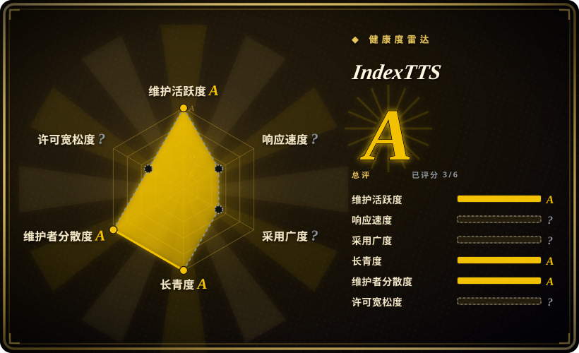
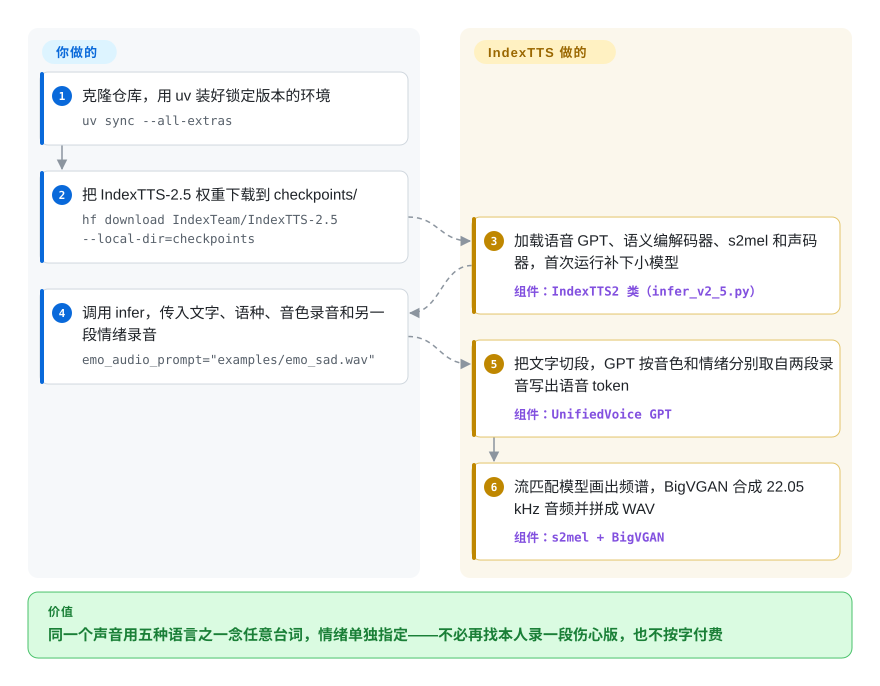

# IndexTTS

同一个克隆出来的声音，这一句要平静、下一句要惊恐，可常见的声音克隆模型会把参考录音里碰巧带着的情绪一起照搬——旁白只录过一段平静的样本，那每一句出来都是平静的。IndexTTS 是 B 站 Index 团队的模型：音色取自一段短录音，情绪另外取自第二段录音、一组八个数字的情绪旋钮或一句描述心情的话，在你自己的 GPU 上说中、英、日、西、阿五种语言；公司规模没超过 B 站许可的门槛之前免费可用。

## 何时使用

你在做以中文为主、带角色的语音内容——短视频配音、有声剧、游戏 NPC 台词——每个声音手里只有一段 5–10 秒的干净录音。第 12 章要旁白哭出来；用多数零样本克隆模型，情绪是焊死在参考音频里的，唯一的办法是让本人再录一段伤心版。IndexTTS 让你保留 `spk_audio_prompt='examples/voice_07.wav'` 作音色，再加一段*任何人*录的 `emo_audio_prompt="examples/emo_sad.wav"`，或者干脆不用音频，写 `emo_vector=[0, 0, 0.8, 0, 0, 0, 0, 0]`（第三位是“悲伤”）；多音字读错了就在文本里直接标 `银<行|XING2>` 和 `<行|HANG2>`，不用改写台词。

比起 [VoxCPM](voxcpm.zh.md)，当音色和情绪分开控制、逐字纠正发音比 Apache-2.0 权重和 30 种语言更要紧时选它；比起 [GPT-SoVITS](gpt-sovits.zh.md)，当你要一段录音、不训练就有不错的相似度，还要 GPT-SoVITS 没有的情绪控制时选它。决定性的取舍是：本分类里最可控的情感克隆，代价是 B 站的自定义许可（月活超 1 亿，或按起决定作用的中文版、年收入超 1 亿元人民币，就要另行申请授权）、只有五种语言、官方不提供训练代码。

## 怎么用起来

IndexTTS 是四个网络串成的流水线，你在 Python 里当一个对象加载。先是一个自回归“GPT”——一种根据前面所有内容预测下一项的 Transformer，就像手机输入法猜你下一个字——把语音写成一串*语义 token*（概括“说了什么、什么节奏”的紧凑编码），写的时候分别参考从音色录音里提取的说话人指纹，以及情绪向量；情绪向量可以来自情绪录音、你直接给的数字，或者一个微调过的小号 Qwen 模型从文字里读出的情绪。接着，一个流匹配模型（把噪声一步步变成目标图像的网络）把这串编码画成梅尔频谱——声音频率随时间变化的一张图——再由 BigVGAN 声码器把这张图变成 22.05 kHz 的波形。可以想象一间配音棚：演员的嗓子来自一盘录音带，表演指导来自另一盘。这些都由软件包替你做，包括文本规范化、把长文本切成约 120 token 一段再用短静音拼起来；留给你的是装好它锁死版本的环境、下载权重、每句话选定音色和情绪输入、在文本里写拼音或音素纠正，以及——超出单进程时——自己搭服务层（README 指向一个外部的 vLLM 部署方案；`backends/trt/` 里的 TensorRT/Triton 移植只支持 IndexTTS-2）。

<!-- flow-steps:begin (generated from flows/index-tts.json by tools/flow_card.py — do not edit) -->

流程文字版

1. **你**：克隆仓库，用 uv 装好锁定版本的环境 — `uv sync --all-extras`
2. **你**：把 IndexTTS-2.5 权重下载到 checkpoints/ — `hf download IndexTeam/IndexTTS-2.5 --local-dir=checkpoints`
3. **IndexTTS**：加载语音 GPT、语义编解码器、s2mel 和声码器，首次运行补下小模型 — 组件：`IndexTTS2 类（infer_v2_5.py）`
4. **你**：调用 infer，传入文字、语种、音色录音和另一段情绪录音 — `emo_audio_prompt="examples/emo_sad.wav"`
5. **IndexTTS**：把文字切段，GPT 按音色和情绪分别取自两段录音写出语音 token — 组件：`UnifiedVoice GPT`
6. **IndexTTS**：流匹配模型画出频谱，BigVGAN 合成 22.05 kHz 音频并拼成 WAV — 组件：`s2mel + BigVGAN`

**价值**：同一个声音用五种语言之一念任意台词，情绪单独指定——不必再找本人录一段伤心版，也不按字付费

<!-- flow-steps:end -->

## 何时不用

- **公司规模接近许可门槛，或者想拿它的输出训练别的模型。** bilibili 模型使用许可规定：你或任何关联方上个自然月月活超过 1 亿，或上一自然年年收入超过 1 亿元人民币，就必须另行申请授权，给不给由 B 站决定——英文版写的是 10 亿元，但第 9 条规定中文版优先，中文版写的是“1 亿”（issue #228 在 2026-08 指出了这个差异，维护者未回应）。第 3.4(c) 条还禁止用该模型*或其输出*改进 IndexTTS 自身及非商业模型以外的任何 AI 模型，所以拿它批量合成数据去训练你自己的商用 TTS 是不行的。这种情况用 [VoxCPM](voxcpm.zh.md)（代码和权重都是 Apache-2.0）或 CosyVoice（Apache-2.0）。
- **要把每句话卡进固定时长的逐帧对口型配音。** IndexTTS2 论文的头号卖点——直接告诉模型生成多少 token（也就是多少秒）——在 README 里标着“本版本暂未开放该功能”；IndexTTS-2.5 只提供 `duration_factor`（整体语速 0.5–2.0 倍）。社区提交的目标时长控制 PR（#793）到 2026-09-29 仍在评审中。在它合入之前，只能先自由生成再做变速（ffmpeg `atempo`、Rubber Band），或者换专门做定时配音的流水线。
- **单次生成长篇旁白。** 有用户报告每次 GPT 生成最多三十多秒，长输入不切分就会被压得很快（#789），内部切出的各段之间语速也不一致（#800）。要像用 [VoxCPM](voxcpm.zh.md) 一样自己负责切句，或者用托管的长文本 TTS。
- **只做中文、而 2.0 已经够用。** #801 里一位用户的盲听 A/B（单人、6 组）在 5/6 组中文样本上更偏好 2.0，与 #759 的反馈一致；2.5 把序列级的说话人条件换成了单个 CAMPPlus 向量，语义编解码器的帧率也减半了。2.0 权重仍能加载（`uv run webui.py --version 2 --model_dir ./checkpoints_2`）——切换前用你自己的音色两版都听一遍。
- **需要中、英、日、西、阿以外的语言。** 葡萄牙语等请求（#804、#391）都还开着，官方训练代码也没有发布（#141 自 2025 年开着），没法自己加——只有一个非官方社区分支（#501）。用 [VoxCPM](voxcpm.zh.md)（30 种语言），或者许可合适时用 Fish Speech。
- **想把它当依赖塞进现有 Python 服务。** 它不在 PyPI 上（2026-10-01 查 `pypi.org/pypi/indextts` 返回 404），只能用 `uv` 从源码装，而且锁死了 `torch==2.8.*`、`transformers==4.52.1`、`numpy==2.2.6` 和 `requires-python <3.12`，会和你应用的环境打架。要么作为独立进程跑，要么选能 `pip install voxcpm` 的 [VoxCPM](voxcpm.zh.md) 或可嵌入的 [Coqui TTS（idiap 分支）](coqui-ai-tts.zh.md)。
- **老显卡、纯 CPU 机器，或者要现成的多用户服务。** 默认 wheel 针对 CUDA 12.8，Tesla P100 这类 Pascal 卡跑不起来（#815）；CPU 模式会提示“可能需要一段时间”。除了 Gradio 演示和 `indextts2` 命令行，没有内置 HTTP API。要在普通硬件上用带 API 的本地应用，用 [Voicebox](voicebox.zh.md) 及其小引擎；多租户服务则要上外部的 vLLM 方案或托管 TTS。

## 横向对比

| 替代品 | 是否收录 | 我们的评价 | 取舍 |
|---|---|---|---|
| [VoxCPM](voxcpm.zh.md) | ✅ | 看重许可简单、30 种语言、48 kHz 输出或 `pip install` 时选 VoxCPM；需要情绪和音色来自不同录音，或要在文本里直接纠正拼音和音素时选 IndexTTS。 | VoxCPM 代码和权重全程 Apache-2.0，还能凭文字描述设计音色；IndexTTS 更小（0.8B 对 2B）、情绪控制更细，但许可有规模门槛、输出只有 22.05 kHz。在 IndexTTS 自己的 CV3 表上两者接近（平均 WER 6.75 对 7.22）——均为厂商数字。 |
| [GPT-SoVITS](gpt-sovits.zh.md) | ✅ | 打算用一分钟音频配合它的 WebUI 和数据集工具微调单个说话人、且要 MIT 许可时选 GPT-SoVITS；只有一段录音、不能训练、还要逐句控制情绪时选 IndexTTS。 | GPT-SoVITS 用训练流程和标准许可换相似度；IndexTTS 用零样本换表现力，但不给训练代码、许可是自定义的。 |
| [CosyVoice](https://github.com/QwenAudio/CosyVoice) | 未收录 | 需要 Apache-2.0、中文强、没有营收门槛的多语种 TTS 时选 CosyVoice；把独立的情绪输入（录音、向量或文字）当硬需求时选 IndexTTS。 | IndexTTS 自己的 CV3 表显示 CosyVoice3-0.5B 在中、英、西三语的说话人相似度更高，日语和阿拉伯语则没有列它的数据——厂商自报、单一基准。本批次（标签页收录）未新增该页。 |
| [Fish Speech](https://github.com/fishaudio/fish-speech) | 未收录 | 做研究或个人爱好、看重它在 IndexTTS 自家 CV3 表上更低的字词错误率时选 Fish Speech；做营收在 B 站门槛以下的商用产品时选 IndexTTS。 | Fish Audio 的研究许可不经单独书面协议就没有任何商用权；IndexTTS 在门槛以下可以商用，但语言更少。本批次（标签页收录）未新增该页。 |
| [Coqui TTS（idiap 分支）](coqui-ai-tts.zh.md) | ✅ | 需要一个能 pip 安装、涵盖 XTTS v2、VITS 等多个模型家族并带训练配方的库时选 Coqui；中文上的音质和情绪控制比库形态更重要时选 IndexTTS。 | IndexTTS 在致谢里列了 tortoise-tts 和 XTTSv2，是更新、更有表现力的模型；Coqui 是 MPL-2.0 的社区分支，集成面更广但模型更老。 |

## 技术栈

- **语言 / 框架：** Python 3.10–3.11，PyTorch 2.8（从 cu128 wheel 源装 `torch==2.8.*`）、`transformers` 4.52.1、`accelerate`、`omegaconf`；由 `uv` 和提交进仓库的锁文件管理；hatchling 构建，注册两个命令：`indextts`（1.x）和 `indextts2`（CLI v2）。
- **模型（IndexTTS-2.5，README 标约 0.8B）：** 文本前端（WeTextProcessing/wetext 规范化、jieba、g2p-en、日语用 fugashi，支持拼音 / CMU / 假名标注）→ 以 CAMPPlus 说话人向量和情绪向量为条件的自回归 `UnifiedVoice` GPT（可选 Qwen 0.6B 的“QwenEmotion”文字转情绪模型）→ 源自 MaskGCT 的语义编解码器（w2v-BERT 2.0 特征）→ `s2mel` 流匹配扩散 Transformer → BigVGAN 声码器，22.05 kHz。
- **使用入口：** Python API（`IndexTTS2(...).infer(...)`，`stream_return` 支持流式）、Gradio WebUI（`webui.py`，默认 2.5）、`indextts2` 命令行（`synth`、`batch`、`concat`、`download`、`check`），可选 DeepSpeed / flash-attn GPT2 加速引擎 / `torch.compile`，以及从“Faster IndexTTS-2”作者那里搬来的 TensorRT + TensorRT-LLM + PyTriton 后端（仅 IndexTTS-2）。

## 依赖

- **硬件：** 文档主路径是驱动支持 CUDA 12.8 的 NVIDIA GPU；README 给出 2.5 在 RTX 4090 上 RTF 约 0.21。代码也能跑在 Apple MPS、Intel XPU 和 CPU 上（较慢）。WebUI 把显存低于 10 GB 视为“低显存”，此时强制半精度、切分文本、不加载 QwenEmotion——想要全部功能就按 10 GB 以上准备。
- **运行时：** Python ≥ 3.10 且 < 3.12（`.python-version` 锁定 3.11.13）；README 说 `uv` 是“可靠安装所必需的”；需要编译本地扩展时要装 CUDA Toolkit 12.8+。可选的 DeepSpeed 在 Windows 上难装（README 原话）。TRT 后端需要自己的 Python 3.12 虚拟环境和宿主机上的 OpenMPI 4.x。
- **模型文件：** 主检查点从 Hugging Face 或 ModelScope 下载（`IndexTeam/IndexTTS-2.5`：`gpt.pth`、`codec.pth`、`s2mel.pth` 和 `qwen0.6bemo4-merge` 情绪模型）；w2v-BERT 2.0、CAMPPlus 和 BigVGAN 等辅助模型首次加载时自动下载；示例音色在 WebUI 首次启动时下载。Hugging Face 慢可以设置 `HF_ENDPOINT` 镜像。
- **外部服务：** 权重落到本地后，推理时不依赖任何外部服务。

## 运维难度

**中等。** 单台 GPU 机器就是克隆 + `uv sync` + 下载权重 + `uv run webui.py`，README 对坑也写得很细（别手动激活其他虚拟环境、DeepSpeed 两种都试试、国内用镜像）。成本在周边：一个锁得很死、没法并进你自己应用的环境；只能源码安装，升级靠拉取新代码（仓库历史在 2026-03 被重置过，旧的克隆随之失效）；按语言在 2.0 和 2.5 之间取舍；长文本和定时台词的切分、时长适配要自己负责；有并发流量时要么用外部的 vLLM 方案，要么用只支持 IndexTTS-2 的 TensorRT 后端——而后者自己的 README 把 batch size > 1 和多 GPU 列为“未验证”。另外上线前还得对一份适用中国法律的自定义许可做法务审查。

## 健康度与可持续性

- **维护（2026-10-01）。** 呈爆发式：IndexTTS 1.0（2025-03）、1.5（2025-05）、2.0（2025-09），之后从 2025-12 到 2026-06 几乎没动（2026-03 有一次历史重置），然后是 2.5 发布（2026-08-10）和 2026-09-29 的一批合并。v2.0.0 和 v2.5.0 两个标签都是 2026-08-13 才补打的。项目是活的，但发版跟着论文节奏走，没有固定节奏。[推断]
- **治理 / 巴士系数。** 归属 B 站 Index 团队（README 联系邮箱 `indexspeech@bilibili.com`），但 GitHub 上的 `index-tts` 所有者是*个人*账号而不是组织。最近的提交和 PR 评审大多出自一位协作者（`nanaoto`）；工具链很多是社区贡献者（如 `Arcitec`，47 次提交）做的。issue 大多由其他用户回答——2026-10-01 时开着 388 个、关闭 227 个。
- **背书与寿命。** 一家上市公司的研究团队、四代模型、三篇 arXiv 技术报告（2502.05512、2506.21619、2601.03888），比单篇学术论文附带的代码可靠。但仓库只有约 20 个月（创建于 2025-02-06），Lindy 先验很弱；押注你下载下来的权重，别押注路线图或训练代码会不会发布。
- **采用与生态。** 约 2.43 万 star、约 2.9k fork；Hugging Face 显示 IndexTTS-2.5 近一个月下载约 1.39 万、IndexTTS-2 约 1.14 万（2026-10-01）；有 vLLM 部署方案、并入上游的第三方 TensorRT 移植，issue 区也有人发布基于它的桌面配音工具（如 #810）——确有真实使用，主要在中文创作者圈。
- **风险信号。** 2025-09-09 改过许可：代码从 Apache-2.0（当时权重用另一份非商用模型许可）改为一份同时覆盖代码*和*权重的 B 站自定义许可——对权重更宽松，对代码更收紧。中英文版的营收门槛差十倍且以中文版为准；许可在违约时可撤销，适用中国法律、由上海仲裁委员会仲裁；`DISCLAIMER` 里还留着没填的模板占位符（`[开源许可证类型]`），同时禁止“未经授权将合成声音用于商业目的”。逼真的声音克隆又没有水印模块，滥用风险需要你自己兜。

## 存疑（未验证）

- [未验证] 所有质量和速度数字（CV3-Eval 的 WER/SS 表、RTX 4090 上 RTF 约 0.21 / 约 0.33、0.8B 参数）都是厂商 README 的自报，本页未复现（没有 GPU 测试环境）。
- [未验证] “每次生成上限三十多秒”来自 issue #789 里一位用户的评论，不是维护者或文档的说法。
- [未验证] 2.0 对 2.5 的中文质量退化只依据一位用户的单人 6 组盲听（#801）和类似反馈（#759），没有官方评测证实或否定。
- [推断] “按 10 GB 以上显存准备”是从 WebUI 的 `LOW_VRAM_THRESHOLD_GB = 10.0` 开关推出来的，不是文档写明的要求。
- [推断] “没有官方训练代码”依据源码树（只有 `indextts/utils/maskgct/` 下残留的 MaskGCT 编解码器训练器）和仍开着的请求 #141。
- [推断] “没有水印模块”依据源码树清单，推理模块里没有嵌入水印的代码。
- [未验证] 对许可的解读（以中文版 1 亿元为准、第 3.4(c) 条禁止用输出训练、覆盖代码）是按 2026-10-01 的 LICENSE / LICENSE_ZH.txt 做的白话概括，不构成法律意见；B 站对“衍生品”（定义里包含“模型输出”）的解释可能更宽。
- [推断] DISCLAIMER 里“未经授权将合成声音用于商业目的”指的是未经声音本人授权还是未经 B 站授权，并不明确；LICENSE 的授权条款更具体。
- [推断] 维护节奏（围绕发版爆发、2025-12 到 2026-06 沉寂）是从提交日期读出的；2.5 合入前的工作可能在私有仓库里进行。
- [未验证] star、fork 和下载数随时间变化（截至 2026-10-01）。
