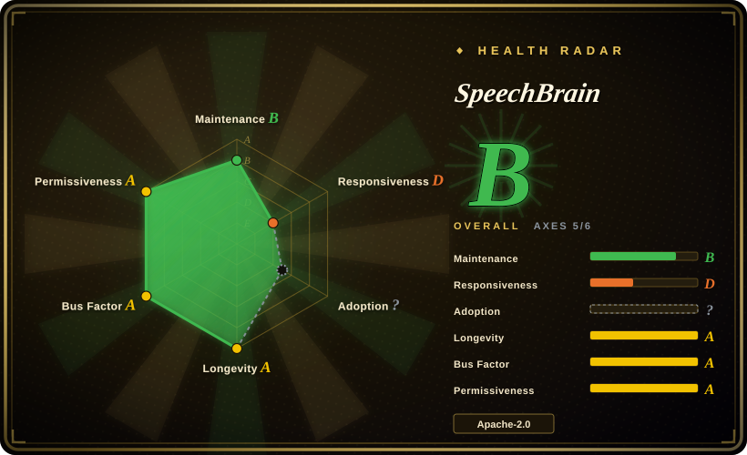
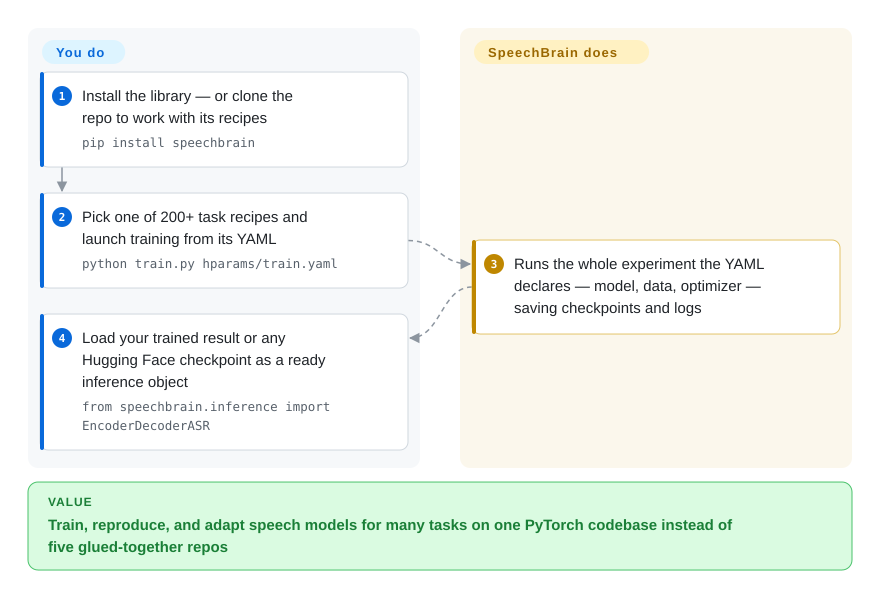

# SpeechBrain

An all-in-one, PyTorch-based speech toolkit covering speech recognition, speaker recognition, enhancement, separation, language identification, text-to-speech and more — with hundreds of ready-to-run training "recipes" on standard datasets.

## When to use

You're a speech ML researcher or an applied engineer who needs to train (not just call) a speech model — say a domain-specific ASR system, a speaker-verification model, or a source-separation pipeline — and you want to stand on a consistent PyTorch codebase instead of gluing together five incompatible research repos. You clone SpeechBrain, pick a recipe for your task and dataset (LibriSpeech ASR, VoxCeleb speaker ID, WSJ0-mix separation, …), and you get a runnable training script, a YAML-driven config (HyperPyYAML) describing the whole experiment, data pipelines, and a model you can fine-tune. Because everything shares one framework, swapping the encoder, the loss, or the dataset is editing config and a class, not porting code between projects.

You also reach for it when you want pretrained models you can both *use* and *retrain*: SpeechBrain publishes many checkpoints (often via Hugging Face) with simple inference interfaces, but unlike a black-box API you have the full recipe to reproduce or adapt them. It's most valuable when your work spans several speech tasks at once and you want them to live in one coherent, well-documented research toolkit rather than a pile of one-off scripts.

## How it works

SpeechBrain is a PyTorch library plus a recipe zoo. The unit of work is a recipe — a folder for one task on one dataset (LibriSpeech ASR, VoxCeleb speaker ID, …) containing a `train.py` and YAML files. The YAML is HyperPyYAML — a YAML superset in which one file declares the entire experiment, instantiating the model, data pipeline, optimizer, and hyperparameters as code references — so a single command, `python train.py hparams/train.yaml`, runs the whole training, and the exact configuration ships alongside the saved checkpoints for reproducibility. The same idiom (class factories like `EncoderDecoderASR.from_hparams(source=...)`) lets you use one of the project's 100-plus pretrained checkpoints on Hugging Face directly for inference. What the project does for you: the building blocks (models, interfaces, augmentation, decoding), the unified training loop, and reference recipes with published benchmark numbers. What stays yours: the datasets (fetched by each recipe's download scripts), the compute (GPU training is the norm), and everything past the research stage — serving, streaming, latency. Because every task shares one structure, porting a new architecture from one recipe to another is editing YAML and classes, not rewriting the pipeline.

<!-- flow-steps:begin (generated from flows/speechbrain.json by tools/flow_card.py — do not edit) -->

Text version of the flow

1. **You**: Install the library — or clone the repo to work with its recipes — `pip install speechbrain`
2. **You**: Pick one of 200+ task recipes and launch training from its YAML — `python train.py hparams/train.yaml`
3. **SpeechBrain**: Runs the whole experiment the YAML declares — model, data, optimizer — saving checkpoints and logs
4. **You**: Load your trained result or any Hugging Face checkpoint as a ready inference object — `from speechbrain.inference import EncoderDecoderASR`

**Value**: Train, reproduce, and adapt speech models for many tasks on one PyTorch codebase instead of five glued-together repos

<!-- flow-steps:end -->

## When NOT to use

- **You just want to transcribe audio with a SOTA model, no training.** If you only need inference, `faster-whisper` / Whisper or a hosted STT API is a shorter path than adopting a full training framework.
- **You need a hardened, low-latency production serving stack out of the box.** SpeechBrain is research-and-training-first; productionizing (serving, streaming, latency tuning, deployment) is your work, and some recipes target benchmarks rather than prod constraints. [推断]
- **You're locked to a non-PyTorch stack.** It is PyTorch-native; if your environment is JAX/TF-only or edge-runtime constrained, the fit is poor.
- **You want a tiny dependency.** It pulls in PyTorch and a research-grade dependency set; it's a toolkit, not a lightweight library to vendor into a small app.
- **You need guaranteed long-term API stability across versions.** It's an actively evolving research toolkit; recipes and APIs change across major versions (the v1.x line was a notable shift), so pin versions and budget for migrations. [推断]

## Comparison

| Alternative | In index | Our verdict | Tradeoff |
|---|---|---|---|
| NeMo (NVIDIA) | 未收录 | Choose NeMo when you need a larger, GPU/scale-oriented conversational-AI toolkit with NVIDIA tooling. | Strong ASR/TTS and NVIDIA integration, but heavier and more vendor-centric than SpeechBrain's lighter research framing. |
| ESPnet | 未收录 | Choose ESPnet when you need end-to-end speech processing with deep ASR/TTS recipe coverage and research lineage. | Powerful, but historically steeper and more Kaldi-flavored than SpeechBrain. |
| Hugging Face Transformers (audio) | 未收录 | Choose Transformers audio models when using or fine-tuning pretrained Whisper/Wav2Vec2-style models is enough. | Excellent model access, but not a full recipe/training framework spanning separation, enhancement, and diarization. |
| Kaldi | 未收录 | Choose Kaldi when you need the classic, highly optimized ASR toolkit and accept C++/shell-heavy workflows. | Maximizes control, not ergonomics; it is far steeper and not PyTorch-native. |
| faster-whisper / [Whisper](../media-processing/video-audio/speech-and-subtitles/whisper.md) | 部分已收录 | Choose inference-focused Whisper stacks when transcription is the job, not multi-task speech training. | Excellent if you only transcribe, but not a multi-task training toolkit. faster-whisper is not indexed separately. |

## Tech stack

- **Language / framework:** Python on **PyTorch**; models, training loops, and data pipelines are PyTorch-native.
- **Config:** **HyperPyYAML** — a YAML superset that describes the full experiment (model, optimizer, data, hyperparameters) so experiments are declarative and reproducible.
- **Scope:** 200+ training recipes across 40+ datasets and ~20 tasks (README, 2026-09) — ASR, speaker recognition/verification, speech enhancement, source separation, language ID, TTS, spoken-language understanding, even an EEG benchmark.
- **Models:** 100+ pretrained checkpoints distributed via the Hugging Face Hub with lightweight inference wrappers; fine-tuning against Whisper/Wav2Vec2/WavLM/Hubert/GPT-2/Llama2-style models is supported.

## Dependencies

- **Runtime:** Python + PyTorch, plus a scientific/audio dependency stack (numpy, torchaudio, etc.). A GPU is effectively required for serious training. [推断]
- **Install:** `pip install speechbrain` for use; the README recommends installing from GitHub (`git clone` → `pip install -r requirements.txt` → `pip install --editable .`) for anyone running or modifying recipes.
- **Data:** recipes assume you can obtain the relevant corpora (LibriSpeech, VoxCeleb, etc.) — datasets are downloaded/prepared by recipe scripts, not bundled.
- **Hugging Face:** pretrained-model inference typically fetches checkpoints from the HF Hub (network + HF availability).

## Ops difficulty

**Medium (research) / higher (production).** For its intended use — running and adapting training recipes — the ergonomics are good: install, pick a recipe, edit a YAML, train. The real cost is the ML lifecycle around it: acquiring and preparing large datasets, securing GPU/compute, long training runs, and reproducing benchmark numbers. Taking a trained model to production (serving, streaming, latency, monitoring) is entirely your responsibility and is the harder half. There's no service to operate from SpeechBrain itself — the burden is compute and ML-ops, not running a SpeechBrain daemon.

## Health & viability

- **Responsiveness**: Grade D — median first response ~988 hours (about six weeks) across 6 qualifying PRs in the window; issue traffic in the same period was too thin to measure (scorer, 2026-09-28).
- **Maintenance (2026-09).** v1.1.1 released 2026-08-27, the same day as the last push to `develop`; zero commits in the 30 days since (GitHub API, 2026-09-28), and the scorer's 13-week window shows only 1 active week, kept at grade B only by the scorer's mature-library Lindy carve-out — activity is **bursty and currently quiet between pushes**, not the steady cadence this page credited in 2026-06. Not archived, not abandoned — but plan around bursts, not weekly releases.
- **Governance / bus factor.** A research-community project driven by a recognizable maintainer group (academic/lab-affiliated core contributors — the scorer counted 30 distinct committers in the last 12 months) rather than a single person — broader bus factor than a solo project, but still community/academic-funded rather than a foundation. [未验证]
- **Age × Lindy (2026-09).** Created 2020-04 — ~6.4 years old and **still shipping releases** ⇒ a **moderate-to-strong Lindy** signal for a research toolkit; it has outlived the typical academic-repo half-life. [推断]
- **Adoption & ecosystem.** ~11.8k stars, 190 open issues (GitHub API, 2026-09-28); the README claims 200+ recipes, 100+ HF-hosted pretrained models, 30+ tutorials, and classroom use at Mila, Concordia, and Avignon — healthy adoption in its research niche. The radar cannot score its adoption axis this round (registry attribution ambiguous), so treat the narrative as README-claimed. [未验证：生产采用广度]
- **Risk flags.** Apache-2.0, no relicense history found. Main risks are research-toolkit risks: API/recipe churn across major versions, a production gap you must close yourself, and a visible release-cadence slowdown since v1.1.0 (2026-03 → v1.1.1 2026-08, patch-level). [推断]

## Caveats (unverified)

- [未验证] ~11.8k stars, 190 open issues, v1.1.1 (2026-08-27) as of 2026-09-28 (GitHub API) — star and version numbers are date-sensitive; treat as indicative only.
- [未验证] The recipe/model counts (200+ recipes, 40+ datasets, ~20 tasks, 100+ HF pretrained models, 30+ tutorials) and the named classroom users are README claims as of 2026-09, not independently enumerated.
- [未验证] The exact maintainer/governance structure and funding model were not confirmed beyond the visible contributor set; "research-community-driven" is inferred from the contributor list and the project's academic lineage.
- [推断] GPU requirement, dataset-download behavior, and HF-Hub dependency for pretrained inference are inferred from the toolkit's nature and README, not exhaustively verified per recipe.
- [推断] "Recipes/APIs change across major versions" is an inference from the existence of a v1.x major line; specific breaking-change scope was not enumerated.
- [推断] The "bursty activity / currently quiet" maintenance read is built from GitHub commit dates and the scorer's 13-week window; a quiet month is normal for a burst-driven academic project and is not itself abandonment.
- [未验证] Comparisons to NeMo/ESPnet/Kaldi reflect general positioning, not a measured benchmark.
