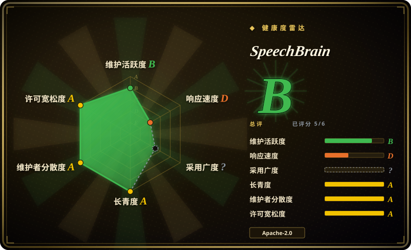
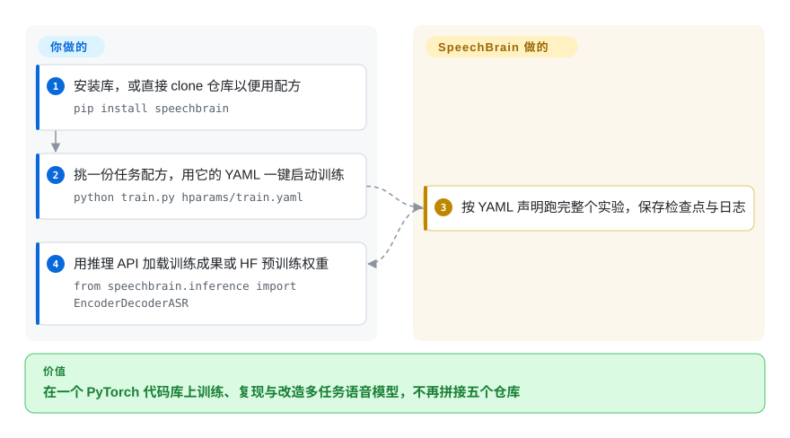

# SpeechBrain

一个一站式、基于 PyTorch 的语音工具箱，覆盖语音识别、说话人识别、增强、分离、语种识别、文本转语音等——并带数百份在标准数据集上可直接跑的训练“recipe”。

## 何时使用

你是语音 ML 研究者或应用工程师，需要训练（而不只是调用）一个语音模型——比如一个领域专用 ASR 系统、一个说话人确认模型，或一条声源分离管线——而你想站在一个一致的 PyTorch 代码库上，而不是把五个互不兼容的研究仓库硬粘起来。你 clone SpeechBrain，挑一份对应任务和数据集的 recipe（LibriSpeech ASR、VoxCeleb 说话人 ID、WSJ0-mix 分离……），就得到一个可跑的训练脚本、一份描述整个实验的 YAML 驱动配置（HyperPyYAML）、数据管线，以及一个你可以微调的模型。因为一切共享同一框架，换 encoder、换 loss 或换数据集，是改配置和一个类，而不是在项目之间移植代码。

当你既想*用*又想*重训*预训练模型时，你也会选它：SpeechBrain 发布了许多 checkpoint（常通过 Hugging Face），带简单的推理接口，但与黑盒 API 不同，你手里有完整 recipe 去复现或改造它们。当你的工作同时横跨多个语音任务、又希望它们活在一个连贯、文档良好的研究工具箱里而非一堆一次性脚本里时，它最有价值。

## 怎么用起来

SpeechBrain 是一个 PyTorch 库，外加一座配方（recipe）动物园。工作的单位是一份配方——某个任务在某个数据集上的文件夹（LibriSpeech 语音识别、VoxCeleb 说话人识别……），内含一个 `train.py` 和若干 YAML。YAML 用的是 HyperPyYAML——一个 YAML 超集，一个文件声明整个实验：模型、数据管线、优化器、超参都以代码引用的方式在其中实例化——于是一条命令 `python train.py hparams/train.yaml` 就能跑完整个训练，而且确切配置随检查点一起归档，保证可复现。同一套惯用法（形如 `EncoderDecoderASR.from_hparams(source=...)` 的类工厂）也让你把项目发布在 Hugging Face 上的一百多个预训练权重直接拿来推理。它替你做的：积木（模型、接口、数据增广、解码）、统一的训练循环、带基准数字的参考配方。仍然归你的：数据集（由配方脚本负责下载准备）、算力（以 GPU 训练为常态），以及研究阶段之外的一切——服务化、流式、延迟调优。因为所有任务共享同一套结构，把一个新架构从一份配方搬到另一份，是改 YAML 和类，而不是重写管线。

<!-- flow-steps:begin (generated from flows/speechbrain.json by tools/flow_card.py — do not edit) -->

流程文字版

1. **你**：安装库，或直接 clone 仓库以便用配方 — `pip install speechbrain`
2. **你**：挑一份任务配方，用它的 YAML 一键启动训练 — `python train.py hparams/train.yaml`
3. **SpeechBrain**：按 YAML 声明跑完整个实验，保存检查点与日志
4. **你**：用推理 API 加载训练成果或 HF 预训练权重 — `from speechbrain.inference import EncoderDecoderASR`

**价值**：在一个 PyTorch 代码库上训练、复现与改造多任务语音模型，不再拼接五个仓库

<!-- flow-steps:end -->

## 何时不用

- **你只想用 SOTA 模型转写音频、不训练。** 如果只要推理，`faster-whisper`/Whisper 或托管 STT API 比上手一整套训练框架路径更短。
- **你需要开箱即用的、加固的低延迟生产服务栈。** SpeechBrain 研究与训练优先；产品化（serving、流式、延迟调优、部署）是你的活，有些 recipe 瞄准的是基准而非生产约束。[推断]
- **你被绑死在非 PyTorch 栈上。** 它是 PyTorch 原生的；若你的环境只有 JAX/TF 或受边缘运行时约束，契合度差。
- **你想要一个极小的依赖。** 它拉入 PyTorch 和一整套研究级依赖；它是工具箱，不是可塞进小应用的轻量库。
- **你需要跨版本有保证的长期 API 稳定。** 它是活跃演进的研究工具箱；recipe 和 API 会跨大版本变化（v1.x 线就是一次显著转变），所以请 pin 版本并为迁移留预算。[推断]

## 横向对比

| 替代品 | 是否收录 | 我们的评价 | 取舍 |
|---|---|---|---|
| NeMo（NVIDIA） | 未收录 | 需要更大、面向 GPU/规模的对话式 AI 工具箱和 NVIDIA 工具链时，选 NeMo。 | ASR/TTS 强且带 NVIDIA 集成，但比 SpeechBrain 更重、更偏厂商生态。 |
| ESPnet | 未收录 | 需要端到端语音处理、深 ASR/TTS recipe 覆盖和研究血统时，选 ESPnet。 | 很强，但历来学习曲线更陡，也更带 Kaldi 味。 |
| Hugging Face Transformers（音频） | 未收录 | 使用或微调 Whisper/Wav2Vec2 这类预训练音频模型已经足够时，选 Transformers 音频模型。 | 模型获取极方便，但不是横跨分离、增强、说话人分割的完整 recipe/训练框架。 |
| Kaldi | 未收录 | 需要经典、高度优化的 ASR 工具箱，并能接受 C++/shell-heavy 工作流时，选 Kaldi。 | 它追求极致控制而非易用；学习曲线陡，且不是 PyTorch 原生。 |
| faster-whisper / [Whisper](../media-processing/video-audio/speech-and-subtitles/whisper.zh.md) | 部分已收录 | 只做转写而非多任务语音训练时，选聚焦推理的 Whisper 技术栈。 | 只转写时极佳，但不是多任务训练工具箱。faster-whisper 未单独收录。 |

## 技术栈

- **语言/框架：** Python 跑在 **PyTorch** 上；模型、训练循环和数据管线都是 PyTorch 原生。
- **配置：** **HyperPyYAML**——一个 YAML 超集，描述完整实验（模型、optimizer、数据、超参），让实验声明式且可复现。
- **范围：** 200+ 训练配方，覆盖 40+ 数据集、约 20 类任务（README，2026-09）——ASR、说话人识别/确认、语音增强、声源分离、语种识别、TTS、口语理解，甚至有 EEG 基准。
- **模型：** 100+ 预训练 checkpoint 经 Hugging Face Hub 分发，带轻量推理封装；支持对 Whisper/Wav2Vec2/WavLM/Hubert/GPT-2/Llama2 一类模型做微调。

## 依赖

- **运行时：** Python + PyTorch，外加一套科学/音频依赖栈（numpy、torchaudio 等）。认真训练实际上需要 GPU。[推断]
- **安装：** 使用场景 `pip install speechbrain` 即可；README 建议要跑或改配方的人从 GitHub 安装（`git clone` → `pip install -r requirements.txt` → `pip install --editable .`）。
- **数据：** recipe 假定你能拿到相关语料（LibriSpeech、VoxCeleb 等）——数据集由 recipe 脚本下载/准备，不随仓库捆绑。
- **Hugging Face：** 预训练模型推理通常从 HF Hub 拉 checkpoint（需要网络 + HF 可用）。

## 运维难度

**中（研究）/ 偏高（生产）。** 对其本意用途——跑并改造训练 recipe——人体工学不错：装好、挑 recipe、改 YAML、训练。真正的成本在围绕它的 ML 生命周期：获取并准备大数据集、搞定 GPU/算力、长时训练，以及复现基准数字。把训好的模型推到生产（serving、流式、延迟、监控）完全是你的责任，也是更难的那一半。SpeechBrain 本身没有要运维的服务——负担是算力和 ML-ops，而非跑一个 SpeechBrain 守护进程。

## 健康度与可持续性

- **响应速度**：Grade D——窗口内 6 个合格 PR 的中位首次响应约 988 小时（约六周）；同期 issue 流量太稀，无法测量（评分器，2026-09-28）。
- **维护（2026-09）。** v1.1.1 于 2026-08-27 发布，正是 `develop` 分支最后一次 push 的当天；此后 30 天内零 commit（GitHub API，2026-09-28），评分器的 13 周窗口里只有 1 周有活动，该轴靠评分器的成熟库 Lindy 豁免才停在 B 档——节奏是**阵发式、目前处于两次推送之间的安静期**，并非本页 2026-06 所述的那种平稳。未归档、未废弃——但请按阵发节奏做计划，别指望每周发版。
- **治理 / bus factor。** 一个研究社区项目，由一个可辨识的维护者群体（学术/实验室关联的核心贡献者——评分器统计近 12 个月有 30 位不同提交者）而非单人驱动——bus factor 比单人项目宽，但仍是社区/学术资助而非基金会。[未验证]
- **年龄 × Lindy（2026-09）。** 2020-04 创建——约 6.4 岁且**仍在发布版本**⇒ 对一个研究工具箱而言是**中到强 Lindy** 信号；它已熬过典型学术仓库的半衰期。[推断]
- **采用度与生态。** 约 11.8k star、190 个 open issue（GitHub API，2026-09-28）；README 声称 200+ 配方、100+ HF 预训练模型、30+ 教程，并被 Mila、Concordia、Avignon 等用于教学——在其研究细分领域采用度健康。本轮雷达无法给 adoption 轴计分（注册表口径歧义），所以上述数字按 README 声称对待。[未验证：生产采用广度]
- **风险标记。** Apache-2.0，未发现 relicense 历史。主要风险是研究工具箱的固有风险：跨大版本的 API/配方变动、一段需你自己补齐的生产落差，以及 v1.1.0 以来肉眼可见的发版减速（2026-03 的 v1.1.0 → 2026-08 的 v1.1.1，补丁级）。[推断]

## 存疑（未验证）

- [未验证] 截至 2026-09-28 约 11.8k star、190 个 open issue、v1.1.1（2026-08-27）（GitHub API）——star 与版本号对时间敏感，仅供参考。
- [未验证] 配方/模型数量（200+ 配方、40+ 数据集、约 20 类任务、100+ HF 预训练模型、30+ 教程）与点名的教学采用均为 README 2026-09 的声称，未独立清点。
- [未验证] 除可见的贡献者集合外，确切的维护者/治理结构和资助模型未确认；“研究社区驱动”由贡献者列表和项目学术血统推断。
- [推断] GPU 需求、数据集下载行为，以及预训练推理对 HF Hub 的依赖，由工具箱性质和 README 推断，未逐 recipe 详尽核实。
- [推断] “recipe/API 跨大版本变化”由 v1.x 大版本线的存在推断；具体破坏性变更范围未逐项列举。
- [推断] “阵发式活动、目前安静”的维护判断来自 GitHub 提交日期与评分器的 13 周窗口；对一个阵发驱动的学术项目来说，安静一个月本身不等于废弃。
- [未验证] 与 NeMo/ESPnet/Kaldi 的对比反映总体定位，而非实测基准。
