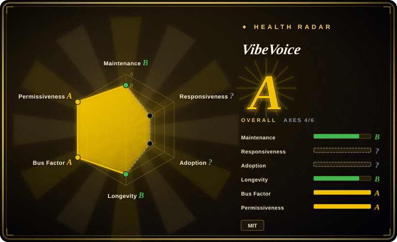
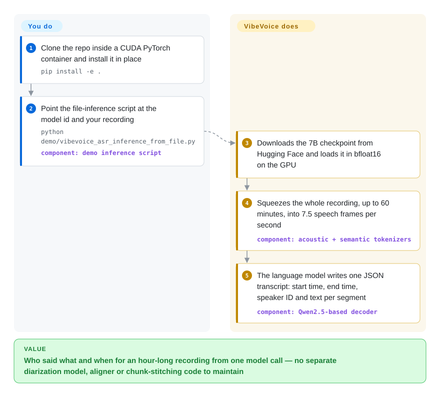

# VibeVoice

You record an hour-long meeting and want a transcript that says who spoke, when, and what — and today that means gluing a speech-to-text model, a separate "who is speaking" model and a timestamp aligner together, then repairing the seams where each one cut the audio differently. VibeVoice's speech-recognition model reads the whole hour in one go and writes that three-part transcript itself; the same repository also holds a small text-to-speech model that starts talking about a third of a second after the first words arrive.

## When to use

You run transcription for meetings, interviews or podcasts on your own GPUs, and your pipeline looks like this: Whisper cuts the file into 30-second windows, a diarization model (the one that labels "speaker 1 / speaker 2") runs separately, and a script merges the two by timestamp. The symptom is familiar: `SPEAKER_02` in minute 5 becomes `SPEAKER_00` in minute 40, and the product name "Kusto" comes out as "custom" forty times. You reach for VibeVoice-ASR when you want one 7B model to take up to 60 minutes of audio in a single request and return segments with `Start time`, `End time`, `Speaker ID` and `Content`, and when you can pass a list of names and jargon (`--hotwords "Microsoft,VibeVoice"`) so it spells them right. It auto-detects language across 50+ languages and handles mid-sentence language switches without a language flag.

Choose it over [OpenAI Whisper](../media-processing/video-audio/speech-and-subtitles/whisper.md) when speaker labels and hour-long consistency matter more than hardware cost — Whisper has no diarization at all and runs on a far smaller GPU. Choose it over WhisperX (Whisper plus wav2vec2 alignment plus pyannote diarization) when you would rather maintain one model than three and do not need per-word timestamps. The deciding tradeoff: one pass and one model for who/when/what, paid for with a 24 GB-plus GPU and a research-grade codebase that has no tagged release. For the speaking side, reach for VibeVoice-Realtime-0.5B only when you need an English voice agent to begin speaking while the LLM is still generating — not for voice cloning, and not for the long multi-speaker podcast synthesis the project became famous for (that code was removed; see below).

## How it works

Most speech recognizers look at audio through a small sliding window, like reading a book through a keyhole and stitching the pages back together afterwards. VibeVoice instead compresses sound very hard first: its two "speech tokenizers" — networks that turn a waveform into a short sequence of vectors, one capturing how it sounds (acoustic) and one what is being said (semantic) — emit only 7.5 frames per second, so an hour of audio becomes about 27,000 frames, short enough to fit inside the context window (the amount a language model can read at once) of a Qwen2.5-based language model. That model then simply *writes* the transcript as JSON, speaker labels and timestamps included, the way a chat model writes an answer. The repository does the audio decoding (via FFmpeg), the tokenizing, the generation and the JSON parsing for you, and ships a vLLM plugin that exposes the model behind an OpenAI-compatible `/v1/chat/completions` endpoint, a streaming variant that emits text per audio chunk over a WebSocket, and LoRA fine-tuning scripts. What stays yours: a GPU with enough memory, validating that the JSON actually closed (long recordings can fall into a repetition loop), mapping `Speaker 0/1/2` to real names, and everything a product needs around a research script. The text-to-speech side runs the idea in reverse — the language model reads text and a small diffusion head (a network that refines noise into detail step by step) produces the acoustic frames — but in this repository only the single-speaker Realtime model has runnable code.

<!-- flow-steps:begin (generated from flows/vibevoice.json by tools/flow_card.py — do not edit) -->

Text version of the flow

1. **You**: Clone the repo inside a CUDA PyTorch container and install it in place — `pip install -e .`
2. **You**: Point the file-inference script at the model id and your recording — `python demo/vibevoice_asr_inference_from_file.py` — component: `demo inference script`
3. **VibeVoice**: Downloads the 7B checkpoint from Hugging Face and loads it in bfloat16 on the GPU
4. **VibeVoice**: Squeezes the whole recording, up to 60 minutes, into 7.5 speech frames per second — component: `acoustic + semantic tokenizers`
5. **VibeVoice**: The language model writes one JSON transcript: start time, end time, speaker ID and text per segment — component: `Qwen2.5-based decoder`

**Value**: Who said what and when for an hour-long recording from one model call — no separate diarization model, aligner or chunk-stitching code to maintain

<!-- flow-steps:end -->

## When NOT to use

- **You came for the 90-minute, 4-speaker podcast TTS.** That is the feature behind most of the stars, and it is not runnable from this repository: on 2025-09-05 Microsoft removed the VibeVoice-TTS code citing misuse, and `docs/vibevoice-tts.md` now reads "Installation and Usage: Disabled due to widespread misuse" (the 1.5B weights remain on Hugging Face under MIT; VibeVoice-Large is marked "Disabled"). If you need long multi-speaker synthesis, evaluate the unofficial community fork [vibevoice-community/VibeVoice](https://github.com/vibevoice-community/VibeVoice) knowing Microsoft does not support it, or use [VoxCPM](voxcpm.md) and stitch turns yourself.
- **You need to clone or design a voice.** VibeVoice-Realtime ships voices only as precomputed embedding files (`demo/voices/streaming_model/*.pt`); its doc says this is deliberate "to mitigate deepfake risks" and that customization requires contacting the team. Use [VoxCPM](voxcpm.md), [GPT-SoVITS](gpt-sovits.md) or [IndexTTS](index-tts.md) for cloning.
- **Your GPU has 24 GB or less and you want the 7B ASR model.** The checkpoint is 8.67B BF16 parameters (~17 GB of weights). In issue #210 users could not fit it on 24 GB cards; one measured ~22 GB just loaded, 27 GB for a 30-minute file and 34 GB for a 60-minute file on a 48 GB card. [未验证：user reports, no GPU here to reproduce] Use [OpenAI Whisper](../media-processing/video-audio/speech-and-subtitles/whisper.md) (large fits ~10 GB), the smaller `VibeVoice-ASR-Streaming-1.5B`, or the separate CPU engine `microsoft/VibeASR.cpp` (a quantized BitNet build, its own repository).
- **You need per-word timestamps for subtitles or karaoke-style highlighting.** The output schema is segment-level (`Start time`, `End time`, `Speaker ID`, `Content` per utterance). [推断：read from the processor's prompt keys, no word-level field found] Use WhisperX, whose wav2vec2 forced alignment produces word-level times.
- **Unattended batch transcription with no output validation.** The model generates the transcript autoregressively, so a bad stretch can loop: the repo itself ships `vllm_plugin/tests/test_api_auto_recover.py` "with auto-recovery from repetition loops (for long audio)", and issue #373 shows a 36-minute file ending in endless `Yes. Yes. Yes.` with unterminated JSON (on a community 4-bit MLX port). A chunked Whisper pipeline fails one 30-second window at a time; here a failure can cost the whole tail of the hour, so budget retry-and-validate logic or stay with Whisper.
- **You need a supported product, not a research artifact.** The README says "We do not recommend using VibeVoice in commercial or real-world applications without further testing and development"; there are no releases or tags to pin, CONTRIBUTING calls it "an academic-oriented research project", and the core install drags in Gradio, aiortc and FastAPI demo dependencies. For an SLA use a hosted speech API; for a self-hosted toolkit with recipes and versioned releases use [SpeechBrain](speechbrain.md).
- **Real-time TTS in anything but plain English prose.** Realtime-0.5B is single-speaker and "currently intended for English speech only"; the nine extra languages are labelled experimental, and its doc lists code, formulas, unusual symbols and inputs of three words or fewer as unstable. For multilingual synthesis use [VoxCPM](voxcpm.md); for a tiny CPU-friendly English voice, Kokoro.
- **Far-field Mandarin meeting rooms.** The project's own table reports cpWER (word error rate that also counts speaker mix-ups) of 24.99 on AISHELL-4 and 29.33 on AliMeeting, versus 11.48 on the English MLC-Challenge set — test on your own recordings and compare with FunASR before committing.

## Comparison

| Alternative | In index | Our verdict | Tradeoff |
|---|---|---|---|
| [OpenAI Whisper](../media-processing/video-audio/speech-and-subtitles/whisper.md) | ✅ | Choose Whisper when you only need the words, on a modest GPU or CPU, with the largest ecosystem of ports and wrappers; choose VibeVoice-ASR when the transcript must carry consistent speaker labels across a full hour and you can afford a 24 GB-plus GPU. | Whisper is far cheaper to run and four years proven, but sees 30 seconds at a time and has no diarization; VibeVoice does who/when/what in one pass at several times the memory and without a versioned release. |
| [WhisperX](https://github.com/m-bain/whisperX) | not indexed | Choose WhisperX when you need word-level timestamps or must fit a small GPU; choose VibeVoice-ASR when you want a single model instead of an ASR + aligner + pyannote pipeline and segment-level times are enough. | WhisperX reports 70x realtime with word alignment, but diarization needs a Hugging Face token plus accepting a gated pyannote model and its README admits "diarization is far from perfect"; VibeVoice removes the glue but costs far more VRAM. Not added in this tab batch. |
| [SpeechBrain](speechbrain.md) | ✅ | Choose SpeechBrain when you want to train or assemble your own ASR, speaker-recognition and diarization components from recipes; choose VibeVoice-ASR when you want a pretrained end-to-end model and at most a LoRA adapter on top. | SpeechBrain gives control, versioned releases and small task-specific models, at the price of building the pipeline yourself; VibeVoice gives a finished 7B model you can only adapt, not restructure. |
| [VoxCPM](voxcpm.md) | ✅ | Choose VoxCPM for text-to-speech that must clone or design a voice in many languages; choose VibeVoice-Realtime only when sub-second first audio from streamed English text with a preset voice is the whole requirement. | VoxCPM is a 2B Apache-2.0 model with cloning and 30 languages but needs ~8 GB VRAM and sentence splitting; VibeVoice-Realtime is 0.5B and fast to first sound but English-only with fixed voices. |
| [Kokoro](https://github.com/hexgrad/kokoro) | not indexed | Choose Kokoro when you need a very small (82M-parameter) Apache-licensed TTS that runs cheaply anywhere; choose VibeVoice-Realtime when you need to feed text incrementally from an LLM and keep one coherent voice over ~10 minutes. | Kokoro is roughly a tenth the size and pip-installable, but its repo has not been pushed since 2025-08; VibeVoice-Realtime is heavier and install-from-source only. Not added in this tab batch. |

## Tech stack

- **Language / framework:** Python ≥ 3.10 on PyTorch with Hugging Face `transformers` (`>=4.51.3,<5.0.0`; the Realtime extra pins `==4.51.3`), `diffusers`, `accelerate`, `librosa`; packaged with setuptools as `vibevoice` 1.0.0, installed from a clone.
- **Models (weights on Hugging Face, MIT):** VibeVoice-ASR (8.67B parameters, Qwen2.5-7B-shaped decoder), VibeVoice-ASR-Streaming 7B and 1.5B, VibeVoice-Realtime-0.5B (Hugging Face lists 1.02B parameters in total), and VibeVoice-1.5B TTS weights whose inference code is no longer here. A Transformers-native ASR checkpoint (`VibeVoice-ASR-HF`) also exists.
- **Core design:** continuous acoustic and semantic speech tokenizers at 7.5 Hz (24 kHz audio, 3200x compression), a language-model decoder, and a DPM-Solver diffusion head for speech generation ("next-token diffusion").
- **Surfaces in the repo:** demo scripts (file inference, Gradio ASR demo, FastAPI/WebSocket streaming demos), a `vllm_plugin` registered through the `vllm.general_plugins` entry point with launchers `start_server.py` / `start_streaming_server.py`, and `finetuning-asr/` LoRA scripts using `peft`.

## Dependencies

- **Hardware:** an NVIDIA GPU is the documented path (the docs recommend the `nvcr.io/nvidia/pytorch` container). The 7B ASR model realistically wants more than 24 GB of VRAM for long files (see When NOT to use); Realtime-0.5B is reported real-time on an NVIDIA T4 and a Mac M4 Pro. MPS, XPU and CPU are selectable in the scripts, in float32.
- **System:** FFmpeg for decoding audio and video; optionally `flash-attn` on CUDA (falls back to SDPA).
- **Serving (optional):** Docker plus the `vllm/vllm-openai:v0.14.1` image the docs pin; with `--dp N` the launcher starts N vLLM processes behind an nginx reverse proxy inside the container.
- **Model assets:** weights download from Hugging Face on first run (~17 GB for ASR-7B); extra Realtime voices come from `demo/download_experimental_voices.sh`.
- **External services:** none at inference time once weights are local; the streaming demo's `--cloudflared` flag is the one opt-in path that downloads a binary and opens a public tunnel.

## Ops difficulty

**Medium-high.** Trying it is easy — a container, `pip install -e .`, one script. Running it for real is where the cost sits: there are no tags, so you pin a commit SHA yourself; the vLLM plugin is tied to a specific vLLM image version, and the pending Transformers 5 bump is an open Dependabot branch; GPU memory grows with audio length and the demo default `--max_new_tokens 32768` reserves a large cache even for short clips; long-file output needs loop detection and JSON validation; and streaming sessions cannot be load-balanced per chunk (each session's audio lives in one replica's cache, so you route whole sessions). The bundled tests are API smoke scripts that need a running server, not a CI suite.

## Health & viability

- **Maintenance (2026-10-08).** Active but bursty: 159 commits on `main` since 2025-08-25, the latest on 2026-09-03 (streaming ASR release), with gaps of one to two months between bursts; 129 open vs 118 closed issues and 71 open pull requests suggest triage lags well behind the audience. No GitHub releases or tags exist. [推断：read from commit dates and issue counts]
- **Governance / bus factor.** A Microsoft research-team project (Microsoft Research Asia authorship on the papers), not a product team: 21 people committed in the last 12 months (top contributor ~33%, top three ~52% per the health scorer), but merges go through a few Microsoft employees, CONTRIBUTING rejects refactors and style PRs, and roadmap decisions are internal — the TTS removal was announced in a README line, not discussed.
- **Backing & longevity.** Microsoft backing means the weights and papers (ICLR 2026 Oral for the TTS model, arXiv reports for ASR) are unlikely to vanish, and a fourth model family landed about a year after launch. But the repo is only ~13 months old, so the Lindy prior is weak, and its history already contains one unilateral capability withdrawal — bet on the checkpoint you downloaded, not on what the repo will contain next year.
- **Adoption & ecosystem.** ~54.7k stars and ~6.1k forks, ~723k Hugging Face downloads listed for VibeVoice-ASR and ~712k for the 1.5B TTS weights, integration into Transformers and Azure AI Foundry Labs, plus community MLX ports and forks. Much of the star count dates from the TTS launch whose code is gone, so read stars as attention, not as usage of what is runnable today.
- **Risk flags.** MIT for code and weights with no relicense — the risk is not the license but availability and intent: code removed once for misuse, an explicit "research and development purposes only" statement, no watermarking code in the tree, and a past README endorsement of a closed third-party client that a maintainer retracted in issue #269.

## Caveats (unverified)

- [未验证] All accuracy and latency figures (DER/cpWER/tcpWER tables, ~200–300 ms first-audio latency, real-time on T4 / M4 Pro, 60-minute single pass, LibriSpeech and SEED TTS scores) are the project's own docs; not reproduced here because no GPU test environment was available. The Realtime doc itself says ~200 ms in one place and ~300 ms in another.
- [未验证] The VRAM figures (22 GB loaded, 27 GB / 34 GB for 30 / 60 minutes, failures on 24 GB cards) come from user comments in issue #210, not from maintainers or a controlled test; quantized community ports may fit smaller cards.
- [推断] "No per-word timestamps" is inferred from the prompt keys and post-processing in `vibevoice/processor/vibevoice_asr_processor.py`; a fine-tune or different prompt was not tested.
- [推断] The repetition-loop risk for the official checkpoint is inferred from the existence of the repo's auto-recover test script and from issue #373, which concerns a community 4-bit MLX port rather than the official weights; frequency on the official model is unknown.
- [推断] "No watermarking code" rests on a GitHub code search for `watermark` in this repo returning zero hits on 2026-10-08; the removed TTS code or the hosted demos may have behaved differently.
- [未验证] Microsoft Research Asia as the owning team is read from paper authorship and contributor profiles, not from an official governance statement.
- [未验证] The unofficial fork `vibevoice-community/VibeVoice` (~1.6k stars, MIT, last push 2026-08-29) was confirmed to exist but its code, provenance and safety were not reviewed.
- [未验证] WhisperX's "70x realtime" and Kokoro's quality claims are quoted from their READMEs, not measured; the ~10 GB figure for Whisper large is the rule-of-thumb number from this index's Whisper page.
- [未验证] A PyPI project named `vibevoice` (0.0.1) exists with Microsoft-looking metadata, but the docs install from a clone and the repo's `pyproject.toml` says 1.0.0; treat the PyPI package as stale rather than as the supported install path.
- [未验证] Star, fork, issue and download counts are date-sensitive (as of 2026-10-08).
