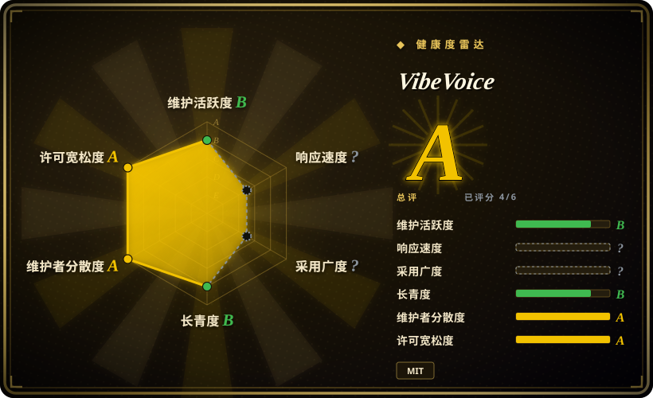
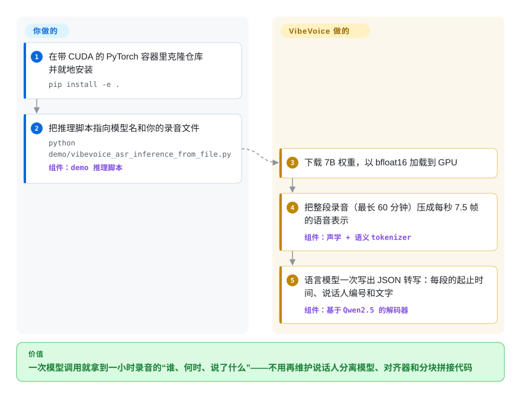

# VibeVoice

你录了一小时的会，想要一份写清“谁、什么时候、说了什么”的文字稿——现在的做法是把语音转文字、说话人区分、时间戳对齐三个模型拼起来，再去修它们各自切音频时对不上的接缝。VibeVoice 的语音识别模型把整整一小时一次读完，直接写出这份三合一的文字稿；同一个仓库里还有一个小的文字转语音模型，拿到开头几个词后约三分之一秒就开口。

## 何时使用

你在自己的 GPU 上给会议、访谈或播客做转写，流水线长这样：Whisper 把文件切成 30 秒一段，说话人分离模型（负责标“说话人 1 / 说话人 2”的那个）另跑一遍，再用脚本按时间戳把两边合并。症状你很熟：第 5 分钟的 `SPEAKER_02` 到第 40 分钟变成了 `SPEAKER_00`，产品名“Kusto”被写成“custom”四十次。这时候可以想到 VibeVoice-ASR：一个 7B 模型一次请求吃下最长 60 分钟的音频，返回带 `Start time`、`End time`、`Speaker ID`、`Content` 的分段，还能传一串人名和术语（`--hotwords "Microsoft,VibeVoice"`）让它把专有名词写对。它在 50 多种语言之间自动识别语种，句中切换语言也不用指定语言参数。

和 [OpenAI Whisper](../media-processing/video-audio/speech-and-subtitles/whisper.zh.md) 比：说话人标签和整小时的一致性比硬件成本更重要时选它——Whisper 完全不做说话人分离，但能跑在小得多的 GPU 上。和 WhisperX（Whisper 加 wav2vec2 对齐加 pyannote 说话人分离）比：宁愿维护一个模型而不是三个、且不需要逐词时间戳时选它。决定性的取舍是：一个模型一遍出“谁、何时、什么”，代价是 24 GB 以上的 GPU 和一个没有任何发布版本的研究级代码库。至于“说”的那一半，只有当你要让英文语音助手在大模型还没生成完时就开口，才考虑 VibeVoice-Realtime-0.5B——它不做声音克隆，也不是让这个项目出名的多人长播客合成（那部分代码已被移除，见下文）。

## 怎么用起来

多数语音识别模型是透过一个小滑动窗口看音频的，像从钥匙孔里读一本书，读完再把一页页拼回去。VibeVoice 的做法是先把声音压得非常狠：它有两个“语音 tokenizer”——把波形变成一小串向量的网络，一个记录听起来什么样（声学），一个记录说的是什么（语义）——每秒只输出 7.5 帧，于是一小时音频只有约 27,000 帧，短到能整个放进一个基于 Qwen2.5 的语言模型的上下文窗口（语言模型一次能读进去的长度）。然后这个语言模型像聊天模型写回答一样，直接把文字稿*写*成 JSON，说话人编号和时间戳都在里面。音频解码（走 FFmpeg）、tokenize、生成、JSON 解析都由仓库替你做；它还带一个 vLLM 插件，把模型挂在 OpenAI 兼容的 `/v1/chat/completions` 接口后面，另有通过 WebSocket 按音频块吐字的流式版本，以及 LoRA 微调脚本。留给你的是：一块显存够大的 GPU、检查 JSON 是否真的收尾了（长录音可能陷入重复循环）、把 `Speaker 0/1/2` 对应到真实姓名，以及把研究脚本变成产品所需的一切。文字转语音那一半是把这套思路反过来——语言模型读文字，一个小的扩散头（把噪声一步步细化成细节的网络）生成声学帧——但在这个仓库里，只有单说话人的 Realtime 模型有可运行的代码。

<!-- flow-steps:begin (generated from flows/vibevoice.json by tools/flow_card.py — do not edit) -->

流程文字版

1. **你**：在带 CUDA 的 PyTorch 容器里克隆仓库并就地安装 — `pip install -e .`
2. **你**：把推理脚本指向模型名和你的录音文件 — `python demo/vibevoice_asr_inference_from_file.py` — 组件：`demo 推理脚本`
3. **VibeVoice**：下载 7B 权重，以 bfloat16 加载到 GPU
4. **VibeVoice**：把整段录音（最长 60 分钟）压成每秒 7.5 帧的语音表示 — 组件：`声学 + 语义 tokenizer`
5. **VibeVoice**：语言模型一次写出 JSON 转写：每段的起止时间、说话人编号和文字 — 组件：`基于 Qwen2.5 的解码器`

**价值**：一次模型调用就拿到一小时录音的“谁、何时、说了什么”——不用再维护说话人分离模型、对齐器和分块拼接代码

<!-- flow-steps:end -->

## 何时不用

- **你是冲着 90 分钟、4 人对话的播客 TTS 来的。** 大部分 star 就是这个功能带来的，而它在本仓库里跑不起来：2025-09-05 微软以滥用为由移除了 VibeVoice-TTS 代码，`docs/vibevoice-tts.md` 现在写着“Installation and Usage: Disabled due to widespread misuse”（1.5B 权重仍以 MIT 挂在 Hugging Face 上，VibeVoice-Large 标为“Disabled”）。需要多人长对话合成时，可以评估非官方的社区 fork [vibevoice-community/VibeVoice](https://github.com/vibevoice-community/VibeVoice)，但要清楚微软不为它背书；或者用 [VoxCPM](voxcpm.zh.md) 自己按轮次拼接。
- **你需要克隆或设计音色。** VibeVoice-Realtime 的音色只以预先算好的嵌入文件提供（`demo/voices/streaming_model/*.pt`）；文档说这是为了“mitigate deepfake risks”有意为之，定制音色要联系团队。克隆请用 [VoxCPM](voxcpm.zh.md)、[GPT-SoVITS](gpt-sovits.zh.md) 或 [IndexTTS](index-tts.zh.md)。
- **你的 GPU 只有 24 GB 或更少，却想跑 7B 的 ASR 模型。** 这个 checkpoint 是 8.67B 个 BF16 参数（权重约 17 GB）。issue #210 里有用户在 24 GB 卡上装不下；有人在 48 GB 卡上测到仅加载就约 22 GB，30 分钟文件 27 GB，60 分钟文件 34 GB。[未验证：用户报告，这里没有 GPU 可复现] 改用 [OpenAI Whisper](../media-processing/video-audio/speech-and-subtitles/whisper.zh.md)（large 约 10 GB 可跑）、更小的 `VibeVoice-ASR-Streaming-1.5B`，或独立的 CPU 推理引擎 `microsoft/VibeASR.cpp`（量化后的 BitNet 版本，另一个仓库）。
- **你要逐词时间戳做字幕或卡拉 OK 式高亮。** 输出是按句段的（每段一组 `Start time`、`End time`、`Speaker ID`、`Content`）。[推断：依据 processor 里的提示词字段，没找到逐词字段] 改用 WhisperX，它靠 wav2vec2 强制对齐给出逐词时间。
- **无人值守的批量转写，且不校验输出。** 文字稿是自回归逐字生成的，一段糟糕的音频就可能让它打转：仓库自己就带了 `vllm_plugin/tests/test_api_auto_recover.py`，说明写的是“with auto-recovery from repetition loops (for long audio)”；issue #373 里一段 36 分钟的录音最后变成无穷的 `Yes. Yes. Yes.`，JSON 也没闭合（发生在社区的 4-bit MLX 移植版上）。分块的 Whisper 流水线一次只坏一个 30 秒窗口；这里一次失败可能赔掉一小时的后半段，所以要么预留重试加校验的逻辑，要么继续用 Whisper。
- **你要的是有人负责的产品，而不是研究产物。** README 写明“We do not recommend using VibeVoice in commercial or real-world applications without further testing and development”；没有 release 或 tag 可以锁定，CONTRIBUTING 自称“an academic-oriented research project”，核心安装还会连带装上 Gradio、aiortc、FastAPI 这些 demo 依赖。要 SLA 就用托管语音 API；要带 recipe 和版本发布的自托管工具包，用 [SpeechBrain](speechbrain.zh.md)。
- **实时 TTS 要说的不是普通英文句子。** Realtime-0.5B 只支持单说话人，且“currently intended for English speech only”；另外九种语言标注为实验性，文档还列出代码、公式、生僻符号和三个词以内的输入都不稳定。多语言合成用 [VoxCPM](voxcpm.zh.md)；想要一个很小、CPU 也跑得动的英文音色，用 Kokoro。
- **远场中文会议室录音。** 项目自己的表格里，cpWER（把说话人认错也算进去的词错误率）在 AISHELL-4 上是 24.99、AliMeeting 上是 29.33，而英文 MLC-Challenge 是 11.48——先拿自己的录音测，并和 FunASR 对比后再决定。

## 横向对比

| 替代品 | 是否收录 | 我们的评价 | 取舍 |
|---|---|---|---|
| [OpenAI Whisper](../media-processing/video-audio/speech-and-subtitles/whisper.zh.md) | ✅ | 只要文字、GPU 一般甚至只有 CPU、又想要最大的移植和封装生态时，选 Whisper；文字稿必须在整整一小时里保持一致的说话人标签、且负担得起 24 GB 以上 GPU 时，选 VibeVoice-ASR。 | Whisper 运行成本低得多，且已经历四年检验，但一次只看 30 秒、完全没有说话人分离；VibeVoice 一遍做完“谁、何时、什么”，代价是数倍显存和没有版本化发布。 |
| [WhisperX](https://github.com/m-bain/whisperX) | 未收录 | 需要逐词时间戳、或只有一块小 GPU 时，选 WhisperX；想用一个模型取代“ASR + 对齐器 + pyannote”流水线、且句段级时间够用时，选 VibeVoice-ASR。 | WhisperX 自称 70 倍实时并带逐词对齐，但说话人分离要 Hugging Face token 并接受受限的 pyannote 模型协议，README 也承认“diarization is far from perfect”；VibeVoice 省掉了胶水代码，却要多得多的显存。本次 tab 批次未收录（not added in this tab batch）。 |
| [SpeechBrain](speechbrain.zh.md) | ✅ | 想按 recipe 自己训练或组装 ASR、声纹识别和说话人分离组件时，选 SpeechBrain；想要一个预训练好的端到端模型、最多再叠一个 LoRA 适配器时，选 VibeVoice-ASR。 | SpeechBrain 给你掌控力、版本化发布和小而专的模型，代价是流水线要自己搭；VibeVoice 给你一个成品 7B 模型，只能适配，不能改结构。 |
| [VoxCPM](voxcpm.zh.md) | ✅ | 文字转语音需要在多种语言里克隆或设计音色时，选 VoxCPM；全部需求只是“流式英文文本进来、不到一秒就出声、用预置音色”时，才选 VibeVoice-Realtime。 | VoxCPM 是 2B 的 Apache-2.0 模型，能克隆、支持 30 种语言，但要约 8 GB 显存并自己拆句；VibeVoice-Realtime 只有 0.5B、首声很快，却只有英文和固定音色。 |
| [Kokoro](https://github.com/hexgrad/kokoro) | 未收录 | 需要一个极小（8200 万参数）、Apache 许可、到处都能便宜跑的 TTS 时，选 Kokoro；需要把大模型的输出边生成边喂进去、并在约 10 分钟里保持同一个连贯声音时，选 VibeVoice-Realtime。 | Kokoro 体积约为十分之一，且能 pip 安装，但它的仓库自 2025-08 起没有新的推送；VibeVoice-Realtime 更重，而且只能从源码安装。本次 tab 批次未收录（not added in this tab batch）。 |

## 技术栈

- **语言 / 框架：** Python ≥ 3.10，基于 PyTorch 和 Hugging Face `transformers`（`>=4.51.3,<5.0.0`；Realtime 的 extra 锁死 `==4.51.3`）、`diffusers`、`accelerate`、`librosa`；用 setuptools 打包为 `vibevoice` 1.0.0，从克隆的仓库安装。
- **模型（权重在 Hugging Face，MIT）：** VibeVoice-ASR（8.67B 参数，解码器形状与 Qwen2.5-7B 一致）、VibeVoice-ASR-Streaming 的 7B 和 1.5B 两个版本、VibeVoice-Realtime-0.5B（Hugging Face 显示总参数 1.02B），以及推理代码已不在本仓库的 VibeVoice-1.5B TTS 权重。另有一个 Transformers 原生的 ASR checkpoint（`VibeVoice-ASR-HF`）。
- **核心设计：** 7.5 Hz 的连续声学与语义语音 tokenizer（24 kHz 音频，3200 倍压缩）、语言模型解码器，以及用于语音生成的 DPM-Solver 扩散头（“next-token diffusion”）。
- **仓库里的入口：** demo 脚本（文件推理、Gradio ASR demo、FastAPI/WebSocket 流式 demo）、通过 `vllm.general_plugins` 入口点注册的 `vllm_plugin`（启动脚本 `start_server.py` / `start_streaming_server.py`），以及 `finetuning-asr/` 下基于 `peft` 的 LoRA 脚本。

## 依赖

- **硬件：** 文档走的是 NVIDIA GPU 路线（推荐 `nvcr.io/nvidia/pytorch` 容器）。7B ASR 模型处理长文件实际需要 24 GB 以上显存（见“何时不用”）；Realtime-0.5B 据称在 NVIDIA T4 和 Mac M4 Pro 上能实时。脚本里可以选 MPS、XPU 和 CPU，用 float32。
- **系统：** 解码音视频要 FFmpeg；CUDA 上可选 `flash-attn`（没有就回退到 SDPA）。
- **部署服务（可选）：** Docker 加文档锁定的 `vllm/vllm-openai:v0.14.1` 镜像；带 `--dp N` 时，启动脚本会在容器内起 N 个 vLLM 进程，并在前面放一个 nginx 反向代理。
- **模型资产：** 首次运行从 Hugging Face 下载权重（ASR-7B 约 17 GB）；Realtime 的额外音色用 `demo/download_experimental_voices.sh` 下载。
- **外部服务：** 权重落到本地后，推理不依赖外部服务；流式 demo 的 `--cloudflared` 开关是唯一会下载二进制并打开公网隧道的路径，需要你主动开启。

## 运维难度

**中偏高。** 试一下很容易——一个容器、`pip install -e .`、一条脚本命令。真正跑起来才是成本所在：没有 tag，只能自己锁 commit SHA；vLLM 插件绑定特定版本的 vLLM 镜像，升级到 Transformers 5 的改动还停在一个未合并的 Dependabot 分支上；显存随音频长度增长，而 demo 默认的 `--max_new_tokens 32768` 连短音频也会预留一大块缓存；长文件的输出要做循环检测和 JSON 校验；流式会话不能按音频块做负载均衡（每个会话的音频存在某一个副本的缓存里，只能整个会话路由到同一副本）。仓库自带的测试是需要先起服务的 API 冒烟脚本，不是 CI 测试套件。

## 健康度与可持续性

- **维护（2026-10-08）。** 活跃但成批爆发：自 2025-08-25 以来 `main` 上共 159 次提交，最近一次在 2026-09-03（流式 ASR 发布），两批之间常有一到两个月的空档；129 个未关闭 issue 对 118 个已关闭，另有 71 个未合并 PR，说明分诊速度远跟不上关注度。没有任何 GitHub release 或 tag。[推断：依据提交日期和 issue 计数]
- **治理 / bus factor。** 这是微软研究团队的项目（论文作者来自微软亚洲研究院），不是产品团队：过去 12 个月有 21 人提交过代码（健康度打分器给出的数字：第一名约占 33%，前三名约占 52%），但合并都经过少数几名微软员工，CONTRIBUTING 明确拒绝重构和纯格式 PR，路线图在内部决定——移除 TTS 只是在 README 里加了一行公告，没有公开讨论。
- **背书与长期性。** 有微软背书，权重和论文（TTS 模型是 ICLR 2026 Oral，ASR 有 arXiv 报告）不太会消失，而且发布约一年后还在推出第四个模型家族。但仓库只有约 13 个月，Lindy 先验很弱，历史上还已经有过一次单方面收回能力——把注押在你已经下载的 checkpoint 上，而不是押在明年仓库里还会有什么上。
- **采用与生态。** 约 5.47 万 star、约 6100 个 fork，Hugging Face 上 VibeVoice-ASR 显示约 72.3 万次下载、1.5B TTS 权重约 71.2 万次，已集成进 Transformers 和 Azure AI Foundry Labs，另有社区的 MLX 移植和 fork。很大一部分 star 来自代码已被移除的 TTS 发布，所以 star 数代表的是关注度，不代表今天可运行部分的使用量。
- **风险信号。** 代码和权重都是 MIT，没有改过许可证——风险不在许可证，而在可用性和定位：代码因滥用被移除过一次，明确声明“research and development purposes only”，源码树里没有水印代码，README 还曾推荐过一个闭源的第三方客户端，后来由维护者在 issue #269 里撤回。

## 存疑（未验证）

- [未验证] 所有准确率和延迟数字（DER/cpWER/tcpWER 表格、约 200–300 ms 首声延迟、T4 / M4 Pro 上实时、60 分钟单遍处理、LibriSpeech 和 SEED 的 TTS 分数）都来自项目自己的文档；因为没有 GPU 测试环境，这里没有复现。Realtime 文档自己就一处写约 200 ms、另一处写约 300 ms。
- [未验证] 显存数字（加载后 22 GB、30 / 60 分钟分别 27 GB / 34 GB、24 GB 卡上失败）来自 issue #210 的用户评论，不是维护者给的，也不是受控测试；社区的量化移植版可能装得进更小的卡。
- [推断] “没有逐词时间戳”是从 `vibevoice/processor/vibevoice_asr_processor.py` 里的提示词字段和后处理推断的；没有测试过微调或换提示词的情况。
- [推断] 官方 checkpoint 的重复循环风险，是从仓库自带的 auto-recover 测试脚本和 issue #373 推断的，而 #373 说的是社区的 4-bit MLX 移植版，不是官方权重；官方模型上的发生频率未知。
- [推断] “没有水印代码”依据的是 2026-10-08 在本仓库做 GitHub 代码搜索 `watermark` 得到零结果；被移除的 TTS 代码或托管 demo 的行为可能不同。
- [未验证] “归属微软亚洲研究院团队”是从论文作者和贡献者资料读出来的，没有官方的治理说明。
- [未验证] 非官方 fork `vibevoice-community/VibeVoice`（约 1600 star，MIT，最近推送 2026-08-29）只确认了存在，没有审查它的代码、来源和安全性。
- [未验证] WhisperX 的“70 倍实时”和 Kokoro 的质量说法引自它们各自的 README，没有实测；Whisper large 约 10 GB 是本索引 Whisper 页面里的经验数字。
- [未验证] PyPI 上有一个名为 `vibevoice` 的项目（0.0.1），元数据看起来来自微软，但文档是从克隆的仓库安装，仓库的 `pyproject.toml` 写的是 1.0.0；应把这个 PyPI 包当作过期的，而不是受支持的安装方式。
- [未验证] star、fork、issue 和下载数都随时间变化（截至 2026-10-08）。
