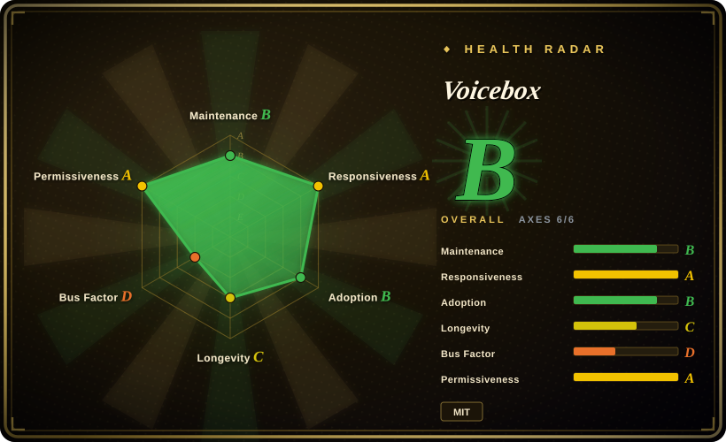

# Voicebox

A local-first "AI voice studio" that bundles TTS voice cloning (7 engines incl. Qwen3-TTS, Chatterbox, Kokoro), Whisper dictation with global-hotkey auto-paste, audio effects, and an MCP/REST server that lets AI agents speak in a cloned voice — running on your own machine, no cloud.

## When to use

You're a developer who already runs local AI coding agents (Claude Code, Cursor, Cline) and wants a two-way voice loop without sending audio to a cloud: you hold a global hotkey to dictate a prompt into whatever text field has focus, and the agent answers by calling `voicebox.speak` over MCP in a voice you cloned from a few seconds of reference audio. You pick Voicebox over the cloud incumbents (ElevenLabs for speech output, WisprFlow for dictation input) specifically because it covers *both halves* of the voice I/O loop inside one self-hosted process, and because models, voice data, and captures stay on the machine — the deciding tradeoff is local privacy plus agent-native MCP integration versus the incumbents' higher polish and zero-hardware setup.

You also reach for it when you want a self-hosted TTS studio with a GUI rather than a library: clone and preset voices, long-text auto-chunking with crossfade, post-processing effects, a multi-track "Stories" timeline, generation versioning, and a REST API (`/generate`, `/speak`, `/transcribe`, `/profiles`) — and you're willing to run a GPU-backed server or Docker yourself. If all you need is an embeddable TTS engine rather than an application, go to the underlying model repos/libraries instead; Voicebox's value is the integration and the UI, not a new model.

## When NOT to use

- **You need to ship a stable production TTS/STT API.** Voicebox is a young, single-maintainer application: `main` stops at 2026-07, the last release is v0.5.0 (2026-04), and ~699 issues/PRs are open. For a service you must keep up, self-host a focused engine instead — [Whisper](../media-processing/video-audio/speech-and-subtitles/whisper.md) for STT plus a library-grade TTS (e.g. Coqui XTTS or Kokoro) behind your own wrapper — and own the API contract yourself.
- **You only need cloud-quality off-the-shelf TTS and have no GPU.** Use ElevenLabs or another hosted TTS: a few API calls, no local hardware, broad voice/language coverage — at the cost of per-character pricing and your audio leaving your machine.
- **You only need dictation.** A focused dictation tool is less surface area: WisprFlow (SaaS) gives turnkey cross-platform paste, and Voicebox's auto-paste is **macOS-only today** (Windows/Linux paste is still roadmap). If you need transcription alone, use Whisper directly.
- **You have no GPU and need long-form or high-quality generation.** The docs put CPU generation at roughly 5–50x slower than GPU. Use the CPU-friendly small engines (Kokoro, LuxTTS) instead, or offload to a remote GPU via the documented Remote Mode.
- **You need multi-tenant or permissioned serving.** The REST/MCP API has no authentication and is designed for `127.0.0.1`/trusted networks. Exposing it publicly without a reverse proxy and auth is unsafe; use a hosted TTS vendor or your own authenticated service instead.
- **You need uniform behavior across engines.** Seven engines have per-engine quirks — paralinguistic tags (`[laugh]`) only work on Chatterbox Turbo, and language coverage differs per engine — so behavior depends on which engine you pick. If you need one predictable engine, use that engine's own repo/server directly.

## Comparison

| Alternative | In index | Our verdict | Tradeoff |
|---|---|---|---|
| ElevenLabs | 未收录 | Choose ElevenLabs when you want cloud-grade TTS quality and voice breadth with no local hardware; choose Voicebox when the audio must stay on your machine and you also want dictation plus agent voice output. | Hosted means no GPU and high polish, but per-character cost, data leaves your machine, and no local cloning or agent loop. |
| WisprFlow | 未收录 | Choose WisprFlow for turnkey, cross-platform dictation; choose Voicebox only if you also need the TTS/agent half or refuse to send audio to a cloud. | SaaS dictation is polished and cross-platform, while Voicebox bundles both directions but its auto-paste is macOS-only. |
| [GPT-SoVITS](gpt-sovits.md) | ✅ | Choose GPT-SoVITS when you want a focused local few-shot voice-cloning TTS with its own WebUI; choose Voicebox when you also need dictation, effects, and an MCP/agent output path. | GPT-SoVITS is narrower and cloning-quality-focused; Voicebox is a whole studio with more moving parts and a heavier stack. |
| [Coqui TTS (idiap fork)](coqui-ai-tts.md) | ✅ | Choose Coqui TTS when you want to embed cloning TTS as a Python library in your own pipeline; choose Voicebox when you want a product with a UI and an HTTP/MCP surface. | A library gives full control and no app shell, but you build the server, UI, queueing, and effects yourself. |
| [Whisper](../media-processing/video-audio/speech-and-subtitles/whisper.md) | ✅ | Choose Whisper alone when transcription is the whole job; choose Voicebox when you need transcription wired into a voice I/O application (hotkey dictation + TTS + agent speak). | Whisper is the STT component Voicebox itself uses — lighter and focused, but with no dictation UI, TTS, or MCP. |

## Tech stack

- **Desktop shell / native layer:** Tauri v2 (Rust) for the app plus the native pieces — global hotkey capture, focus introspection, and macOS paste injection.
- **Frontend:** React + TypeScript + Tailwind CSS; Zustand and React Query for state; WaveSurfer.js for waveforms.
- **Backend:** FastAPI (Python 3.11+) serving REST and MCP; SQLite (SQLAlchemy + Alembic) for persistence; SSE for generation and model-download progress.
- **Inference:** MLX (Apple Silicon) or PyTorch (CUDA / ROCm / XPU / DirectML / CPU); Spotify `pedalboard` for audio effects; librosa/soundfile; Whisper for STT.
- **TTS engines:** Qwen3-TTS, Qwen CustomVoice, LuxTTS (ZipVoice), Chatterbox / Chatterbox Turbo, HumeAI TADA, Kokoro.
- **Local LLM:** Qwen3 (0.6B / 1.7B / 4B) for dictation refinement and voice personalities, sharing the same inference runtime as TTS/STT.
- **MCP:** FastMCP mounted at `/mcp` (Streamable HTTP) plus a bundled stdio shim binary for stdio-only clients.
- **Packaging:** Bun/Vite frontend build, PyInstaller server binary, Docker (CPU default + ROCm overlay), `just` for dev tasks.

## Dependencies

- **Runtime you must provide:** Python 3.11+, Bun, Rust and the Tauri prerequisites, and `just` for the dev path; or Docker (`ffmpeg` is installed in the image).
- **Hardware:** a GPU is strongly recommended — Apple Silicon (MLX, 4–5x), NVIDIA (CUDA cu128; Windows downloads a ~4GB CUDA libs archive on first use), AMD (ROCm), Intel Arc (XPU), DirectML fallback, or CPU (5–50x slower). The troubleshooting doc cites 6GB+ VRAM for GPU mode; the Docker compose defaults to 4 CPU / 8GB RAM, and the docs call 8GB the single-engine floor and 16GB+ the multi-engine recommendation.
- **Model downloads:** models come from the Hugging Face Hub on first use — 300MB (LuxTTS) to 8GB (TADA 3B), plus Whisper at 300MB–3GB. Budget ~20GB+ of disk and a working first-run network.
- **External services:** none for inference, but Hugging Face Hub (first-run downloads) and an MCP client (Claude Code/Cursor/etc., if you want agent voice) are integration dependencies.

## Ops difficulty

**Medium.** The desktop path is install-and-run. Self-hosting is a first-class path (`docker compose up`, or `uvicorn` on a GPU box with Remote Mode from the app), but you own GPU/CUDA/ROCm driver alignment, multi-GB model downloads and cache management, and memory pressure (unload models to free VRAM). The sharpest cost is **security**: the REST/MCP API has no authentication, so it should stay on localhost or sit behind an authenticated reverse proxy/VPN. Operationally, preserve the Docker `voicebox-data` and `huggingface-cache` volumes — losing the cache re-downloads everything.

## Health & viability

- **Maintenance (2026-09).** Judgment: **cooling**. The `main` branch's last commit is 2026-07-27, and the last release is v0.5.0 (2026-04-25) — roughly five months before this verification. Issues and PRs are still arriving and issue first-response remains healthy, but merges to `main` stop inside the visible window. [推断]
- **Governance / bus factor.** **High risk.** A single human owner (`jamiepine`, a User account) authored ~527 of 638 commits (~83%); the next contributor has 7. No foundation, vendor, or CODEOWNERS-style governance was found. [推断]
- **Age × Lindy.** **Weak/negative.** Created 2026-01-25 — about eight months old at verification, with an extremely steep star curve (55.1k stars). Under the Lindy prior a young, fast-hyped repo is a risk flag rather than social proof, and the visible activity drop compounds it. [推断]
- **Adoption & ecosystem.** There is a real integration surface (REST + MCP, documented Claude Code/Cursor setup, Docker, a DeepWiki badge, and an agent skill for adding engines) and a large fork/star count. But the watcher-to-star ratio is low (~260 watchers against 55.1k stars) and ~699 open issues/PRs sit largely unreviewed, i.e. high popularity with uncertain follow-through. [推断]
- **Risk flags.** MIT license, with no relicense, open-core/feature-gating, or CLA signal found, and no telemetry/analytics-looking files in the tracked tree (consistent with the local-first claim, though not an exhaustive egress audit). The material risks are project-level: bus factor, stalled release cadence, and a very broad surface (7 engines × 4 backends × dictation/stories/MCP) carried by one maintainer, plus the unauthenticated local API. [推断]

## Caveats (unverified)

- [未验证] Engine and language coverage (7 engines, 23 languages, 50+ preset voices) and README performance claims (LuxTTS ~150x realtime on CPU, MLX 4–5x faster) come from the project's README/docs, not independent measurement.
- [未验证] The documented GPU matrix (Windows CUDA auto-download, Intel XPU, DirectML, ROCm) was not reproduced here.
- [推断] "Maintenance cooling" is inferred from `main`'s last commit (2026-07-27) and the last release (2026-04-25); the author has 30+ branches, so work could exist unmerged — this is not proof of abandonment.
- [推断] The bus-factor reading is inferred from contributor statistics; the no-telemetry reading is inferred from the absence of analytics-looking file paths, not from a full source audit for egress.
- [未验证] "Auto-paste is macOS-only today" is taken from the README/roadmap; Windows and Linux paste behavior was not tested.
- [未验证] Whether the `voicebox.sh` site offers a paid tier or open-core upsell was not confirmed; the repository code is MIT.
- [未验证] Model-to-hardware runtime expectations (VRAM numbers, CPU slowdown factors) are the project's own documented figures, not benchmarked.
