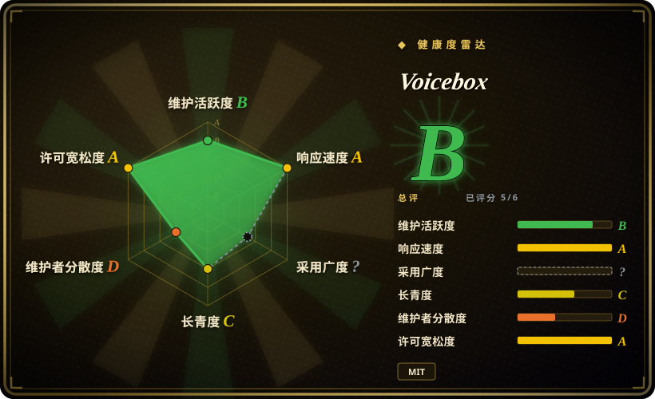

# Voicebox

一个本地优先的「AI 语音工作室」：把 TTS 声音克隆（7 个引擎，含 Qwen3-TTS、Chatterbox、Kokoro）、带全局热键自动粘贴的 Whisper 听写、音频效果，以及让 AI agent 用克隆音色说话的 MCP/REST 服务打包在一起——全部跑在你自己机器上，不经过云端。

## 何时使用

你是已经在本地跑 AI coding agent（Claude Code、Cursor、Cline）的开发者，想要一条不把音频送到云端的双向语音回路：按住全局热键，把提示词口述进当前获得焦点的任意输入框；agent 干完活后通过 MCP 调 `voicebox.speak`，用你从几秒参考音频克隆出的音色回答你。你之所以选 Voicebox 而不是云端两强（输出侧的 ElevenLabs、输入侧的 WisprFlow），是因为它在同一个自托管进程里同时覆盖了语音 I/O 回路的**两端**，且模型、声音数据与录音都留在本机——决定性取舍是本地隐私加 agent 原生 MCP 集成，对比两强更高的完成度和零硬件门槛。

当你想要一个有界面的自托管 TTS 工作室、而不是一个库时，也会选它：克隆与预置音色、带交叉淡入的长文本自动分块、后期效果、多轨「Stories」时间线、生成版本管理，以及一套 REST API（`/generate`、`/speak`、`/transcribe`、`/profiles`）——代价是你得自己跑一台带 GPU 的服务或 Docker。如果你要的只是可嵌入的 TTS 引擎而非一个应用，请直接用底层的模型仓库/库；Voicebox 的价值在集成与界面，而不在模型本身。

## 何时不用

- **你要交付一个稳定的生产级 TTS/STT API。** Voicebox 是一个年轻、单人维护的应用：`main` 停在 2026-07，最新 release 是 v0.5.0（2026-04），约 699 个 issue/PR 未关。要维护一个长期在线服务，应自托管专用引擎——STT 用 [Whisper](../media-processing/video-audio/speech-and-subtitles/whisper.zh.md)，TTS 用库级的 Coqui XTTS 或 Kokoro，包在你自己的封装后面——API 契约由你自己承担。
- **你只需要开箱即用的云端级 TTS 且没有 GPU。** 用 ElevenLabs 或其他托管 TTS：几次 API 调用、无需本地硬件、音色和语种覆盖广；代价是按字符计费、音频离开你的机器。
- **你只需要听写。** 专用听写工具的面更小：WisprFlow（SaaS）提供跨平台的开箱粘贴；而 Voicebox 的自动粘贴**目前仅 macOS**（Windows/Linux 粘贴仍在路线图上）。若只需转写，直接用 Whisper。
- **你没有 GPU 又需要长文本或高质量生成。** 官方文档把 CPU 生成标为比 GPU 慢约 5–50 倍。此时应改用对 CPU 友好的小引擎（Kokoro、LuxTTS），或通过官方 Remote Mode 把重活卸载到远端 GPU。
- **你需要多租户或带权限的服务。** REST/MCP API 没有鉴权，设计前提是 `127.0.0.1` 或可信网络。不带反向代理和认证就对外暴露是不安全的；此时应改用托管 TTS 厂商，或你自己的带鉴权服务。
- **你需要跨引擎行为一致。** 7 个引擎各有特性——副语言标签（`[laugh]`）只在 Chatterbox Turbo 生效，语种覆盖也逐引擎不同——行为取决于你选哪个引擎。若你需要一个可预测的引擎，请直接用它自己的仓库/服务。

## 横向对比

| 替代品 | 是否收录 | 我们的评价 | 取舍 |
|---|---|---|---|
| ElevenLabs | 未收录 | 想要云端级 TTS 质量和音色广度、且不想上本地硬件时，选 ElevenLabs；当音频必须留在本机、且你还要听写和 agent 语音输出时，选 Voicebox。 | 托管意味着免 GPU、完成度高，但按字符计费、数据离开本机，且没有本地克隆与 agent 回路。 |
| WisprFlow | 未收录 | 要开箱即用的跨平台听写，选 WisprFlow；只有当你还需要 TTS/agent 那一半、或拒绝把音频送到云端时，才选 Voicebox。 | SaaS 听写完成度高且跨平台；Voicebox 两个方向都包，但自动粘贴仅限 macOS。 |
| [GPT-SoVITS](gpt-sovits.zh.md) | ✅ | 想要一个专注本地小样本声音克隆、自带 WebUI 的 TTS 时，选 GPT-SoVITS；当你还要听写、效果和 MCP/agent 输出链路时，选 Voicebox。 | GPT-SoVITS 更窄、更聚焦克隆质量；Voicebox 是一整个工作室，活动部件更多、技术栈更重。 |
| [Coqui TTS（idiap 分支）](coqui-ai-tts.zh.md) | ✅ | 想把克隆 TTS 作为 Python 库嵌进自己的管线时，选 Coqui TTS；想要带界面和 HTTP/MCP 接口的成品时，选 Voicebox。 | 用库换来完全控制且没有应用外壳，但服务、界面、队列和效果都得你自己搭。 |
| [Whisper](../media-processing/video-audio/speech-and-subtitles/whisper.zh.md) | ✅ | 转写就是全部任务时，单选 Whisper；需要把转写接进语音 I/O 应用（热键听写 + TTS + agent 发声）时，选 Voicebox。 | Whisper 正是 Voicebox 自己用的 STT 组件——更轻更专，但没有听写界面、TTS 和 MCP。 |

## 技术栈

- **桌面外壳 / 原生层：** Tauri v2（Rust）承载应用本身与原生能力——全局热键捕获、焦点探测、macOS 粘贴注入。
- **前端：** React + TypeScript + Tailwind CSS；状态用 Zustand 与 React Query；波形用 WaveSurfer.js。
- **后端：** FastAPI（Python 3.11+）提供 REST 与 MCP；SQLite（SQLAlchemy + Alembic）持久化；SSE 推送生成与模型下载进度。
- **推理：** MLX（Apple Silicon）或 PyTorch（CUDA / ROCm / XPU / DirectML / CPU）；音频效果用 Spotify `pedalboard`；librosa/soundfile；STT 用 Whisper。
- **TTS 引擎：** Qwen3-TTS、Qwen CustomVoice、LuxTTS（ZipVoice）、Chatterbox / Chatterbox Turbo、HumeAI TADA、Kokoro。
- **本地 LLM：** Qwen3（0.6B / 1.7B / 4B），用于听写精修与声音人格，和 TTS/STT 共用同一推理运行时。
- **MCP：** FastMCP 挂在 `/mcp`（Streamable HTTP），外加一个捆绑的 stdio shim 二进制供仅支持 stdio 的客户端。
- **打包：** Bun/Vite 构建前端、PyInstaller 打服务端二进制、Docker（默认 CPU + ROCm overlay）、`just` 管开发任务。

## 依赖

- **你必须自备的运行时：** Python 3.11+、Bun、Rust 与 Tauri 前置依赖，开发路径还需 `just`；或直接用 Docker（镜像内已装 `ffmpeg`）。
- **硬件：** 强烈建议有 GPU——Apple Silicon（MLX，4–5x）、NVIDIA（CUDA cu128；Windows 首次使用会下载约 4GB 的 CUDA 库压缩包）、AMD（ROCm）、Intel Arc（XPU）、DirectML 兜底，或纯 CPU（慢 5–50x）。故障文档称 GPU 模式需 6GB+ 显存；Docker compose 默认限 4 CPU / 8GB 内存，文档称 8GB 是单引擎下限、多引擎建议 16GB+。
- **模型下载：** 首次使用从 Hugging Face Hub 拉取——300MB（LuxTTS）到 8GB（TADA 3B），Whisper 另占 300MB–3GB。请预留约 20GB+ 磁盘和首次可用的网络。
- **外部服务：** 推理不需要外部服务，但 Hugging Face Hub（首次下载）和 MCP 客户端（Claude Code/Cursor 等，若要 agent 发声）是集成依赖。

## 运维难度

**中。** 桌面路径是装完即用。自托管是一等路径（`docker compose up`，或在 GPU 机器上跑 `uvicorn` 并在 App 里用 Remote Mode 连过去），但 GPU/CUDA/ROCm 驱动对齐、数 GB 模型下载与缓存管理、显存压力（需卸载模型释放）都由你负责。最尖锐的成本是**安全**：REST/MCP API 没有鉴权，应停留在 localhost，或置于带认证的反向代理/VPN 之后。运维上要保住 Docker 的 `voicebox-data` 与 `huggingface-cache` 两个卷——缓存一丢就得整批重下。

## 健康度与可持续性

- **维护（2026-09）。** 判断：**正在降温**。`main` 分支最后一次提交是 2026-07-27，最新 release 是 v0.5.0（2026-04-25）——距核实约五个月。issue 与 PR 仍在涌入，且 issue 首响时间仍属健康，但在可见窗口内合并进 `main` 的动作已经停止。[推断]
- **治理 / bus factor。** **高风险。** 单一自然人所有者（`jamiepine`，User 账号）贡献了 638 次提交中的约 527 次（约 83%）；第二名贡献者只有 7 次。未发现基金会、厂商或 CODEOWNERS 式治理。[推断]
- **年龄 × Lindy。** **偏弱/负面。** 2026-01-25 创建——核实时尚约 8 个月，却已有极陡的 star 曲线（55.1k stars）。按 Lindy 先验，年轻且快速爆红的仓库是风险标记而非社会证明，可见的活动下滑进一步加重这一点。[推断]
- **采用度与生态。** 确有真实的集成面（REST + MCP、有文档的 Claude Code/Cursor 接入、Docker、DeepWiki 徽章、以及一个用于接新引擎的 agent skill），fork/star 数也很大。但 watch 与 star 之比偏低（约 260 watchers 对 55.1k stars），且约 699 个未关 issue/PR 基本未被审查，即高热度但后续跟进存疑。[推断]
- **风险标记。** MIT 许可，未发现改协议、open-core/功能阉割或 CLA 信号；在受版本控制的文件树中也没有像遥测/分析的文件（与本地优先的说法一致，但并非穷尽的出网审计）。实质风险在项目层面：bus factor、release 节奏停滞、以及一个人扛着极宽的面（7 引擎 × 4 后端 × 听写/Stories/MCP），外加无鉴权的本地 API。[推断]

## 存疑（未验证）

- [未验证] 引擎与语种覆盖（7 引擎、23 语种、50+ 预置音色）以及 README 的性能宣称（LuxTTS 在 CPU 上约 150x 实时、MLX 快 4–5x）来自项目自身的 README/文档，非独立测量。
- [未验证] 文档中的 GPU 矩阵（Windows CUDA 自动下载、Intel XPU、DirectML、ROCm）未在此环境复现。
- [推断]「维护降温」由 `main` 最后提交（2026-07-27）与最新 release（2026-04-25）推断；作者有 30+ 分支，可能仍有未合并的工作——这不构成弃坑证明。
- [推断] bus factor 的判断由贡献者统计推断；「无遥测」由缺少疑似遥测/分析的文件路径推断，并非对源码做了完整的出网审计。
- [未验证]「自动粘贴目前仅 macOS」取自 README/路线图；未实测 Windows 与 Linux 的粘贴行为。
- [未验证] 未确认 `voicebox.sh` 站点是否提供付费档或 open-core 增值；仓库代码是 MIT。
- [未验证] 模型与硬件的运行时预期（显存数字、CPU 降速倍数）是项目自报数据，未做基准测试。
