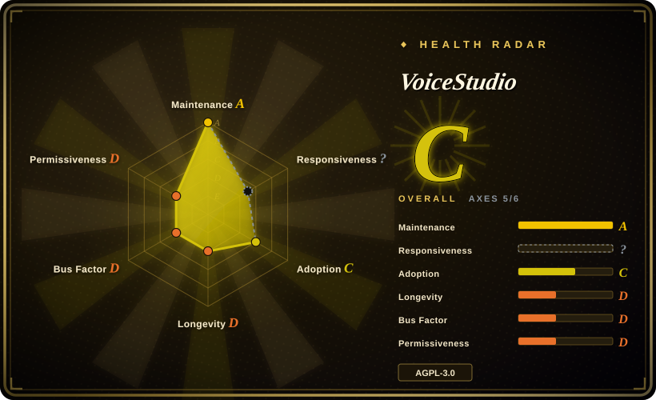
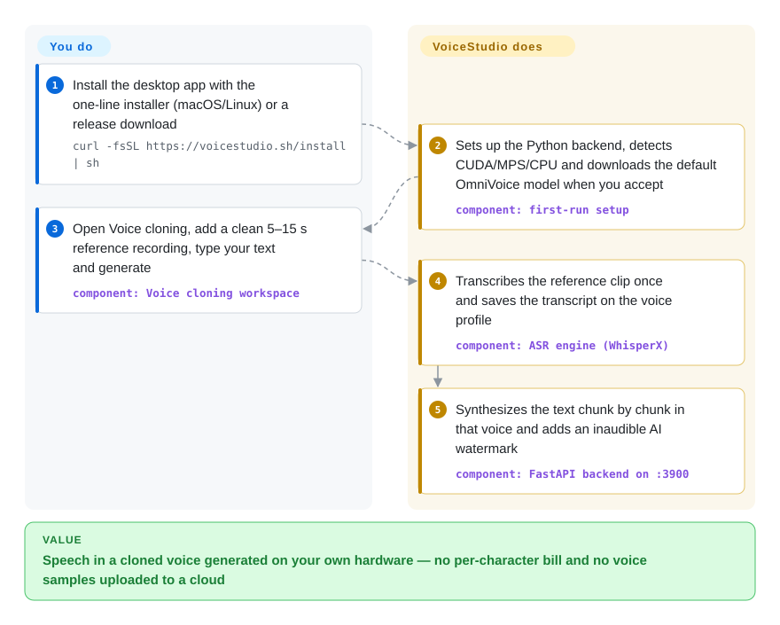

# VoiceStudio

You want to clone a voice, dub a video into another language or dictate into any app, but the polished way to do it is a cloud service that bills per character and keeps your recordings. VoiceStudio is a desktop app that runs the whole studio on your own machine: it downloads open speech models (OmniVoice by default, plus a dozen swappable engines), keeps them warm in a local backend, and gives you clone / dub / dictate screens plus a local API and MCP server for agents.

## When to use

You're a creator or developer on an Apple Silicon Mac or an NVIDIA box who keeps reaching for ElevenLabs-style workflows — "make this 4-minute YouTube clip speak Spanish in the same voice", "read this chapter in my narrator's voice", "let Claude Code answer me out loud" — and every one of them means uploading voice samples to a SaaS and watching a character meter. You install VoiceStudio once (`curl -fsSL https://voicestudio.sh/install | sh`), let it pull the ~2.4 GB default model, and then the same app does voice cloning from a 5–15 s clip, voice design from a text description, a dubbing pipeline (vocal separation → WhisperX transcript → offline Argos/NLLB or your own translation → per-segment synthesis → remix), a floating dictation widget, and an MCP endpoint at `http://localhost:3900/mcp/` that agents call with `generate_speech` / `transcribe`.

Pick it over [Voicebox](voicebox.md) when you want **dubbing and audiobook production in the same app** and a project that is shipping constantly (42 releases since April 2026, five in September alone), and you accept AGPL-3.0 plus an emerging paid "Pro" tier. Pick it over a single model repo such as [VoxCPM](voxcpm.md) or [GPT-SoVITS](gpt-sovits.md) when you want a finished GUI that manages many engines — VoxCPM2, IndexTTS 2.5, CosyVoice 3, GPT-SoVITS and others plug in as alternate engines — rather than a Python API you wire up yourself. The deciding tradeoff: breadth and polish of a fast-moving all-in-one studio, paid for with a heavy local install, a single-maintainer bus factor, and a default model whose weights are **non-commercial**.

## How it works

VoiceStudio is three local processes wearing one window: an Electron desktop shell (the UI), a Python FastAPI backend on port 3900 that loads speech models and does the actual work, and a small Rust sidecar on port 3902 that owns the microphone, the global dictation shortcut and pasting text into whatever app has focus. The installer and first-run setup build the Python environment, detect your accelerator (CUDA, Apple's MPS/MLX, ROCm on Linux, or CPU) and download the default engine — OmniVoice, an open multilingual voice-cloning model from k2-fsa — from Hugging Face. From then on the backend does the heavy lifting for you: it transcribes your reference clip once and saves the transcript on the voice profile, splits long text into chunks, synthesizes them, and adds an inaudible AudioSeal watermark (a hidden signal marking the audio as AI-generated; on by default, switchable under Settings → Privacy). What stays yours: picking the engine and device, recording a clean, consented reference clip, choosing a translation engine for dubs, and keeping the models (many with their own licenses) within your rights. The same backend serves a REST API and the MCP tools, so an agent integration is "point your client at `/mcp/`" rather than a second deployment.

<!-- flow-steps:begin (generated from flows/voicestudio.json by tools/flow_card.py — do not edit) -->

Text version of the flow

1. **You**: Install the desktop app with the one-line installer (macOS/Linux) or a release download — `curl -fsSL https://voicestudio.sh/install | sh`
2. **VoiceStudio**: Sets up the Python backend, detects CUDA/MPS/CPU and downloads the default OmniVoice model when you accept — component: `first-run setup`
3. **You**: Open Voice cloning, add a clean 5–15 s reference recording, type your text and generate — component: `Voice cloning workspace`
4. **VoiceStudio**: Transcribes the reference clip once and saves the transcript on the voice profile — component: `ASR engine (WhisperX)`
5. **VoiceStudio**: Synthesizes the text chunk by chunk in that voice and adds an inaudible AI watermark — component: `FastAPI backend on :3900`

**Value**: Speech in a cloned voice generated on your own hardware — no per-character bill and no voice samples uploaded to a cloud

<!-- flow-steps:end -->

## When NOT to use

- **You will sell or ship the generated audio commercially on the default model.** The default OmniVoice weights are CC-BY-NC (the k2-fsa model card: "pre-trained model is licensed under the CC-BY-NC"), and several other bundled engines carry research or custom licenses (audio.cpp's Breeze weights are flagged research/non-commercial; Supertonic and PocketTTS ask for a separate license acceptance). VoiceStudio's AGPL only covers its own code. For commercial output, switch the engine to an Apache-licensed model such as [VoxCPM](voxcpm.md), or use a hosted vendor (ElevenLabs) whose terms grant commercial rights.
- **You want to embed it in a closed-source product or SaaS.** The app is AGPL-3.0-only: serving a modified version over a network obligates you to publish your source, and the maintainer sells a separate commercial license for closed-source embedding. If you need a component, not an app, build on a permissively licensed model repo ([VoxCPM](voxcpm.md), or [Coqui TTS (idiap fork)](coqui-ai-tts.md) under MPL-2.0) behind your own API.
- **You are on an Intel Mac, a Windows AMD/Intel GPU, or an ARM64 Linux server.** The install docs state the local backend cannot run on Intel Macs (PyTorch dropped the wheels), Windows GPU acceleration is NVIDIA-only (AMD runs CPU-only), and Docker images are `linux/amd64` only. CPU fallback works but is several times slower. Use a hosted TTS, or a lighter CPU engine on its own (Kokoro / KittenTTS) instead.
- **You need a stable, versioned production speech service.** It is a ~6-month-old app at v0.5.x that renamed itself (OmniVoice Studio → VoiceStudio), replaced its Tauri shell with Electron in September 2026, and whose issue tracker is dominated by "backend failed to start / not responding on port 3900" reports (281 issues with "backend" in the title as of 2026-10-01). For a service you must keep up, run a single engine (e.g. [VoxCPM](voxcpm.md) behind its serving stack, or [Whisper](../media-processing/video-audio/speech-and-subtitles/whisper.md) for STT) and own the API contract.
- **You only need one thing — dictation, or a single cloned voice.** The install pulls PyTorch, WhisperX, pyannote, Demucs and a 2.4 GB model; budget ~10 GB of disk. For voice-cloning alone with a training path, [GPT-SoVITS](gpt-sovits.md) is smaller in scope; for transcription alone, use [Whisper](../media-processing/video-audio/speech-and-subtitles/whisper.md) directly.
- **You need a permissive, MIT-licensed voice-I/O app with no paid tier on the roadmap.** VoiceStudio's code is AGPL and a "Pro" plan ($99/user/year) is being built to gate remote workers, remote-device compute and GPU sharing. [Voicebox](voicebox.md) covers cloning + dictation + MCP under MIT, though with a slower release cadence.
- **You plan to clone voices you have no permission to use.** The README asks you to "clone voices only with permission" and output is watermarked by default; this is a legal and ethical constraint, not a technical one, and no substitute removes it.

## Comparison

| Alternative | In index | Our verdict | Tradeoff |
|---|---|---|---|
| [Voicebox](voicebox.md) | ✅ | Choose Voicebox when you want an MIT-licensed local voice-I/O app (cloning, hotkey dictation, MCP) and can live with a slower release cadence; choose VoiceStudio when you also need dubbing, audiobooks/Stories and batch jobs, and want a project that ships fixes weekly. | Voicebox gives a permissive license and smaller surface but its `main` stalled in mid-2026; VoiceStudio gives more workflows and faster fixes under AGPL with a paid Pro tier forming. Both are single-maintainer. |
| [VoxCPM](voxcpm.md) | ✅ | Choose VoxCPM when you are building a product and need a pip-installable model with Apache-2.0 code *and* weights; choose VoiceStudio when you want a GUI studio and are fine running VoxCPM2 as one of its engines. | VoxCPM is a library you integrate and serve yourself; VoiceStudio wraps it (and others) in an app but defaults to a non-commercial model and adds AGPL to your stack. |
| [GPT-SoVITS](gpt-sovits.md) | ✅ | Choose GPT-SoVITS when your goal is maximum similarity to one speaker via its few-shot training WebUI; choose VoiceStudio when you want zero-shot cloning plus dubbing/dictation without training. | GPT-SoVITS is TTS-only with a training path under MIT; VoiceStudio can call a GPT-SoVITS server as an engine but adds a much heavier install. |
| [OmniVoice](https://github.com/k2-fsa/OmniVoice) | not indexed | Choose the upstream OmniVoice repo when you only need the multilingual cloning model in your own Python code or want to fine-tune it; choose VoiceStudio when you want that model behind a desktop UI, API and MCP. | The model repo is Apache-2.0 code with CC-BY-NC weights — the same weight restriction applies either way; VoiceStudio adds app conveniences and AGPL. Not added in this tab batch. |
| [pyVideoTrans](https://github.com/jianchang512/pyvideotrans) | not indexed | Choose pyVideoTrans when video translation and subtitle embedding is the whole job and you want a three-year-old, GPL-3.0 tool focused on that; choose VoiceStudio when dubbing is one step in a broader voice workflow (cloned voices, audiobooks, agent speech). | pyVideoTrans is older and dubbing-centric; VoiceStudio is newer with cloned-voice dubbing built in but a wider, less settled surface. Not added in this tab batch. |
| ElevenLabs | not a repo | Choose ElevenLabs when you have no capable local GPU or need commercial rights and top-tier voices with no setup; choose VoiceStudio when audio must stay on your machine and per-character billing is the problem. | Hosted SaaS: zero hardware and clear commercial terms, but usage-priced and your samples leave the device. |

## Tech stack

- **Backend:** Python ≥ 3.11, FastAPI + Uvicorn (REST, WebSocket streaming, OpenAI-compatible `/v1/audio/*` routes), Alembic migrations, PyTorch / torchaudio / transformers, PyInstaller-packaged.
- **Speech engines:** default VoiceStudio/OmniVoice (k2-fsa, bundled `omnivoice/` package, Apache-2.0 code); optional VoxCPM2, IndexTTS 2.5 (sidecar install), CosyVoice 3, GPT-SoVITS (external server), MLX-Audio (Kokoro/CSM/Dia… on Apple Silicon), KittenTTS, Sherpa-ONNX, MOSS-TTS, dots.tts, Supertonic-3, PocketTTS, audio.cpp. ASR: WhisperX (default), Faster-Whisper, MLX Whisper, Parakeet, Moonshine, FunASR, or any OpenAI-compatible endpoint.
- **Audio pipeline:** Demucs (vocal isolation), pyannote (diarization), Pedalboard (effects), AudioSeal (watermark), yt-dlp (video fetch), ffmpeg.
- **Desktop/UI:** Electron + React/TypeScript renderer (Bun, Turborepo); a Rust control sidecar for mic capture, global shortcut and native text insertion. The Tauri shell was retired after v0.5.3.
- **Distribution:** installer script, per-OS release assets, Docker images on GHCR/Docker Hub (CUDA and ROCm variants, amd64 only), an agent skill (`npx skills add debpalash/VoiceStudio`).

## Dependencies

- **Hardware:** Apple Silicon (macOS 13.3+), an NVIDIA GPU (Windows/Linux), an AMD GPU via ROCm (Linux only), or CPU fallback. Intel Macs can run only the UI against a remote backend.
- **Disk & network:** ~10 GB free for the app, Python environment and default model; the default model alone is ~2.4 GB from Hugging Face (with an automatic hf-mirror fallback). Extra engines add several GB each.
- **Optional services:** online translation providers (DeepL, Google, Microsoft, an OpenAI-compatible LLM — keys required for most), an MCP client (Claude Code, Cursor, …), Twilio for the call-agent feature, Hugging Face access for gated pyannote diarization.
- **Docker path:** a GPU host with the NVIDIA (or ROCm) container runtime and an `OMNIVOICE_API_KEY` you generate for admin endpoints.

## Ops difficulty

**Medium.** The desktop path is install-and-run, and the installer preserves settings, voices and models across upgrades. The cost sits in the environment: a multi-GB PyTorch stack whose GPU path depends on driver/CUDA/ROCm alignment, silent CPU fallback that makes generation several times slower (the performance guide spends a section on detecting it), memory pressure on 16 GB machines, and per-engine sidecar installs. The issue tracker shows backend start-up and "port 3900 not responding" as the most common failure class. Self-hosting via Docker is documented with stable/preview tags; keep the API on loopback or behind the API key, and pin `:stable` rather than the rolling `:latest`.

## Health & viability

- **Maintenance (2026-10-01).** **Very active.** 42 releases since April 2026 (18 in July, five in September; latest v0.5.6 on 2026-09-23), commits on `main` within the last days, and only 60 of 989 issues open — the maintainer closes and consolidates community fixes in large batch PRs.
- **Governance / bus factor.** **High risk.** A personal account (`debpalash`) authored ~2,870 commits; the next contributor has 54. Roadmap, licensing and the commercial plan are owned by one person. [推断]
- **Age × Lindy.** **Weak.** Created 2026-04-09 (under six months old), renamed once, and moved its whole desktop shell from Tauri to Electron in September 2026. 51.2k stars and 5.7k forks in that window is a hype curve, not a track record; the Lindy prior gives it little credit yet.
- **Adoption & ecosystem.** Real usage signals beyond stars: ~613k release-asset downloads across its releases, Docker images, an agent skill, MCP and OpenAI-compatible API surfaces, and contributors whose fixes are credited in the changelog. Watchers (205) are low relative to stars.
- **Risk flags.** AGPL-3.0-only with a separately sold commercial license (dual licensing is the business model); an in-progress "Pro" tier (Lemon Squeezy license keys) planned to gate remote workers, remote compute and GPU sharing — an open-core drift to watch; opt-in PostHog-style analytics in packaged builds (off by default, absent from source builds per the changelog); default model weights are non-commercial.

## Caveats (unverified)

- [未验证] The "646 languages" claim comes from the README and the OmniVoice model card; quality across that many languages was not tested here, and the repo's own benchmarks table has no verified rows yet.
- [未验证] Hardware claims (Intel Mac backend unsupported, Windows GPU NVIDIA-only, ~10 GB disk, ~2.4 GB default model) are from the project's install docs, not reproduced on hardware.
- [推断] The bus-factor reading comes from contributor commit counts; co-maintainers may review or triage without appearing there.
- [推断] Reading the 281 "backend"-titled issues as a dominant failure class is a title-search heuristic; some are duplicates or user-environment problems.
- [未验证] Whether the planned Pro tier will remove any capability from the AGPL build is not settled: the Pro spec says free local workflows remain unlimited, and the gated features are unreleased behind build flags as of 2026-10-01.
- [未验证] The analytics opt-in behavior (off by default, metadata allowlist, no destination in source builds) is taken from the changelog; no network egress audit was performed.
- [推断] The star-to-watcher ratio and the speed of star growth are treated as hype signals; whether any of the star growth is inorganic was not investigated.
- [推断] The health radar's responsiveness axis is `?` (`no_window_signal`) on two runs; the maintainer mostly answers by closing issues through consolidated batch PRs rather than issue comments, which the scorer's sampled window may not count — it is not evidence of an unresponsive project.
