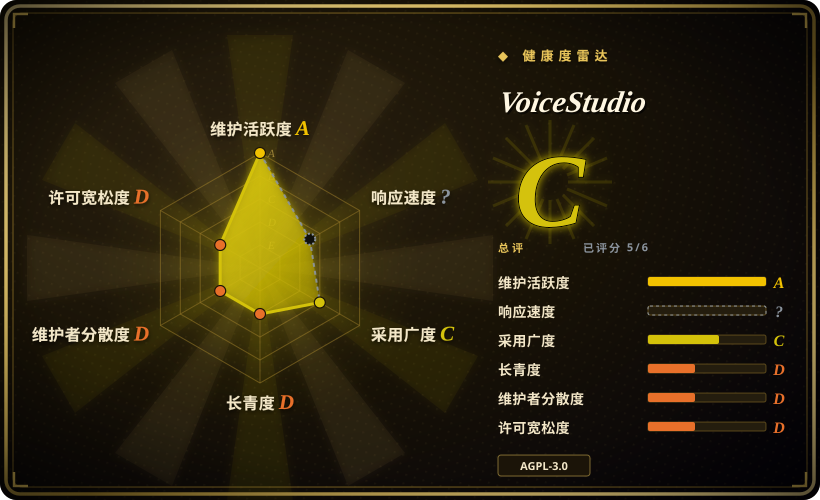
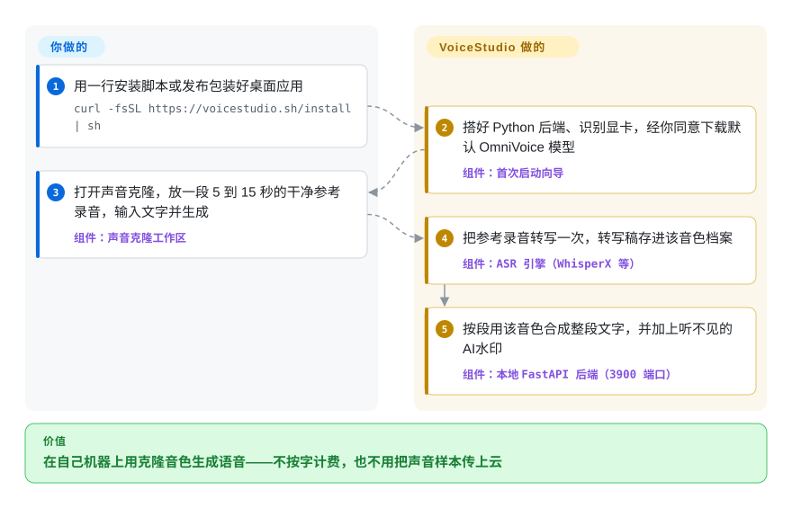

# VoiceStudio

想克隆一个声音、把视频配成另一种语言、或者对着任意软件口述打字，顺手的做法都是按字收费、还要把录音传上去的云服务。VoiceStudio 是一个把整套“配音工作室”搬到你本机的桌面应用：它下载开源语音模型（默认 OmniVoice，另有十几个可切换引擎），在本地后端里常驻，给你克隆、配音、听写三类界面，外加给 agent 用的本地 API 和 MCP 服务。

## 何时使用

你是做内容或做开发的人，手上是一台 Apple Silicon Mac 或一台带 NVIDIA 显卡的机器，经常想要 ElevenLabs 那一类能力——“把这段 4 分钟的 YouTube 视频用原声配成西班牙语”“用旁白的声音把这一章读出来”“让 Claude Code 用声音回我”——而每一件都意味着把声音样本上传到 SaaS、盯着字符额度。你装一次 VoiceStudio（`curl -fsSL https://voicestudio.sh/install | sh`），让它拉下约 2.4 GB 的默认模型，之后同一个应用就能：用 5 到 15 秒的录音克隆音色、用一句文字描述设计音色、跑一条配音流水线（人声分离 → WhisperX 转写 → 离线 Argos/NLLB 或你自己的译文 → 逐段合成 → 混音）、弹出悬浮听写小窗，还在 `http://localhost:3900/mcp/` 开一个 MCP 端点，agent 直接调 `generate_speech` / `transcribe`。

当你要的是**在同一个应用里做配音和有声书**、并且希望项目持续高频发版（2026 年 4 月以来 42 个版本，仅 9 月就 5 个），同时能接受 AGPL-3.0 和正在成形的付费 Pro 档时，选它而不是 [Voicebox](voicebox.zh.md)。当你想要一个现成的图形界面来统一管理多个引擎——VoxCPM2、IndexTTS 2.5、CosyVoice 3、GPT-SoVITS 等都能作为备选引擎接进来——而不是自己去接一个 Python API 时，选它而不是单个模型仓库，比如 [VoxCPM](voxcpm.zh.md) 或 [GPT-SoVITS](gpt-sovits.zh.md)。决定性的取舍：你得到一个迭代很快、功能齐全的一体化工作室，代价是很重的本地安装、单人维护的巴士因子，以及一个权重**禁止商用**的默认模型。

## 怎么用起来

VoiceStudio 其实是三个本地进程共用一个窗口：Electron 桌面外壳负责界面；Python FastAPI 后端监听 3900 端口，加载语音模型、干真正的活；一个小的 Rust 边车进程监听 3902 端口，管麦克风、全局听写快捷键，以及把文字粘进当前焦点所在的软件。安装脚本和首次启动向导会搭好 Python 环境、识别你的加速硬件（CUDA、苹果的 MPS/MLX、Linux 上的 ROCm，或者纯 CPU），再从 Hugging Face 下载默认引擎 OmniVoice——k2-fsa 开源的多语言声音克隆模型。之后重活都由后端替你做：参考录音只转写一次并存进音色档案，长文本自动切段合成，最后加上一道听不见的 AudioSeal 水印（一种标记“这是 AI 生成音频”的隐藏信号；默认开启，可在设置 → 隐私里关掉）。留给你的是：选引擎和设备，录一段干净且经过本人同意的参考音，给配音选翻译引擎，以及确认各模型（很多有自己的许可）的用法在你的权利范围内。REST API 和 MCP 工具由同一个后端提供，所以接 agent 只是“把客户端指向 `/mcp/`”，不用再部署第二套服务。

<!-- flow-steps:begin (generated from flows/voicestudio.json by tools/flow_card.py — do not edit) -->

流程文字版

1. **你**：用一行安装脚本或发布包装好桌面应用 — `curl -fsSL https://voicestudio.sh/install | sh`
2. **VoiceStudio**：搭好 Python 后端、识别显卡，经你同意下载默认 OmniVoice 模型 — 组件：`首次启动向导`
3. **你**：打开声音克隆，放一段 5 到 15 秒的干净参考录音，输入文字并生成 — 组件：`声音克隆工作区`
4. **VoiceStudio**：把参考录音转写一次，转写稿存进该音色档案 — 组件：`ASR 引擎（WhisperX 等）`
5. **VoiceStudio**：按段用该音色合成整段文字，并加上听不见的 AI 水印 — 组件：`本地 FastAPI 后端（3900 端口）`

**价值**：在自己机器上用克隆音色生成语音——不按字计费，也不用把声音样本传上云

<!-- flow-steps:end -->

## 何时不用

- **你要用默认模型生成音频去卖或商用。** 默认 OmniVoice 的权重是 CC-BY-NC（k2-fsa 模型卡原文：预训练模型因训练数据限制采用 CC-BY-NC），其他几个内置引擎也有研究用或自定义许可（audio.cpp 的 Breeze 权重标注为仅研究、非商用；Supertonic 和 PocketTTS 要单独接受许可）。VoiceStudio 的 AGPL 只管它自己的代码。要商用，就把引擎换成 Apache 许可的模型，比如 [VoxCPM](voxcpm.zh.md)，或者用条款明确授予商用权的托管服务（ElevenLabs）。
- **你要把它嵌进闭源产品或 SaaS。** 应用是 AGPL-3.0-only：改过的版本通过网络提供服务就必须公开源码，作者另售闭源嵌入用的商业许可。如果你要的是组件而不是应用，就基于宽松许可的模型仓库（[VoxCPM](voxcpm.zh.md)，或 MPL-2.0 的 [Coqui TTS（idiap 分支）](coqui-ai-tts.zh.md)）自己包一层 API。
- **你用的是 Intel Mac、Windows 上的 AMD/Intel 显卡、或 ARM64 Linux 服务器。** 安装文档写明：Intel Mac 跑不了本地后端（PyTorch 已不再提供对应 wheel），Windows 上 GPU 加速只支持 NVIDIA（AMD 只能走 CPU），Docker 镜像只有 `linux/amd64`。CPU 兜底能用但慢好几倍。这种情况用托管 TTS，或单独跑一个轻量 CPU 引擎（Kokoro / KittenTTS）。
- **你需要一个稳定、有版本承诺的生产语音服务。** 它是一个约 6 个月大、版本号 v0.5.x 的应用，改过一次名（OmniVoice Studio → VoiceStudio），2026 年 9 月把 Tauri 外壳整体换成了 Electron，issue 区大量是“后端起不来 / 3900 端口无响应”（截至 2026-10-01 标题含 “backend” 的 issue 有 281 个）。要长期托管的服务，应只跑单个引擎（比如 [VoxCPM](voxcpm.zh.md) 配它的服务化方案，转写用 [Whisper](../media-processing/video-audio/speech-and-subtitles/whisper.zh.md)），API 契约自己掌握。
- **你只要一样东西——听写，或者一个克隆音色。** 安装会拉下 PyTorch、WhisperX、pyannote、Demucs 和一个 2.4 GB 的模型，磁盘要留约 10 GB。只做声音克隆且想走训练路线，[GPT-SoVITS](gpt-sovits.zh.md) 范围更小；只做转写，直接用 [Whisper](../media-processing/video-audio/speech-and-subtitles/whisper.zh.md)。
- **你要一个 MIT 许可、路线图上没有付费档的语音 I/O 应用。** VoiceStudio 代码是 AGPL，而且正在做 Pro 计划（每人每年 99 美元），准备把远程 worker、远程设备算力和 GPU 共享放进付费档。[Voicebox](voicebox.zh.md) 以 MIT 许可覆盖克隆、听写和 MCP，只是发版节奏慢得多。
- **你打算克隆没经过本人许可的声音。** README 要求“只在获得许可时克隆声音”，输出默认带水印；这是法律和伦理约束，不是技术约束，换哪个替代品都绕不开。

## 横向对比

| 替代品 | 是否收录 | 我们的评价 | 取舍 |
|---|---|---|---|
| [Voicebox](voicebox.zh.md) | ✅ | 想要 MIT 许可的本地语音 I/O 应用（克隆、热键听写、MCP），能接受发版变慢时选 Voicebox；还需要配音、有声书/Stories 和批量任务，并希望项目每周都在修问题时选 VoiceStudio。 | Voicebox 许可宽松、面更小，但 `main` 在 2026 年年中就停了；VoiceStudio 工作流更多、修得更快，代价是 AGPL 和正在成形的付费 Pro。两者都是单人维护。 |
| [VoxCPM](voxcpm.zh.md) | ✅ | 做产品、需要代码和权重都是 Apache-2.0、能 pip 安装的模型时选 VoxCPM；想要图形化工作室、并且愿意把 VoxCPM2 当成其中一个引擎来跑时选 VoiceStudio。 | VoxCPM 是要你自己集成、自己做服务的库；VoiceStudio 把它（以及别的模型）包进应用，但默认模型禁止商用，还会给你的技术栈带进 AGPL。 |
| [GPT-SoVITS](gpt-sovits.zh.md) | ✅ | 目标是通过小样本训练 WebUI 把某一个人的相似度拉满时选 GPT-SoVITS；想要零样本克隆加配音、听写、不用训练时选 VoiceStudio。 | GPT-SoVITS 只做 TTS、带训练路线、MIT 许可；VoiceStudio 可以把 GPT-SoVITS 服务当引擎调用，但安装重得多。 |
| [OmniVoice](https://github.com/k2-fsa/OmniVoice) | 未收录 | 只需要在自己的 Python 代码里用这个多语言克隆模型、或者要微调它时选上游 OmniVoice 仓库；想把这个模型放在桌面界面、API 和 MCP 后面用时选 VoiceStudio。 | 模型仓库是 Apache-2.0 代码加 CC-BY-NC 权重——这道权重限制两边都一样；VoiceStudio 多了应用层便利，也多了 AGPL。本批次（标签页收录）未新增该页。 |
| [pyVideoTrans](https://github.com/jianchang512/pyvideotrans) | 未收录 | 视频翻译加字幕嵌入就是全部需求、想要一个三年历史、GPL-3.0、专注这件事的工具时选 pyVideoTrans；配音只是更大语音工作流（克隆音色、有声书、agent 发声）中的一步时选 VoiceStudio。 | pyVideoTrans 更老、以配音为中心；VoiceStudio 更新、内置克隆音色配音，但功能面更宽也更没定型。本批次（标签页收录）未新增该页。 |
| ElevenLabs | 非仓库 | 本地没有像样的 GPU、或者需要商用授权和顶级音色且不想折腾时选 ElevenLabs；音频必须留在本机、按字计费正是痛点时选 VoiceStudio。 | 托管 SaaS：不用硬件、商用条款清楚，但按用量计费，样本要离开你的设备。 |

## 技术栈

- **后端：** Python ≥ 3.11，FastAPI + Uvicorn（REST、WebSocket 流式、兼容 OpenAI 的 `/v1/audio/*` 路由），Alembic 迁移，PyTorch / torchaudio / transformers，用 PyInstaller 打包。
- **语音引擎：** 默认 VoiceStudio/OmniVoice（k2-fsa，仓库内置 `omnivoice/` 包，代码 Apache-2.0）；可选 VoxCPM2、IndexTTS 2.5（边车一键安装）、CosyVoice 3、GPT-SoVITS（外部服务）、MLX-Audio（Apple Silicon 上的 Kokoro/CSM/Dia 等）、KittenTTS、Sherpa-ONNX、MOSS-TTS、dots.tts、Supertonic-3、PocketTTS、audio.cpp。语音识别：WhisperX（默认）、Faster-Whisper、MLX Whisper、Parakeet、Moonshine、FunASR，或任意兼容 OpenAI 的端点。
- **音频处理链：** Demucs（人声分离）、pyannote（说话人分离）、Pedalboard（音效）、AudioSeal（水印）、yt-dlp（拉取视频）、ffmpeg。
- **桌面与界面：** Electron + React/TypeScript 渲染层（Bun、Turborepo）；一个 Rust 控制边车负责麦克风采集、全局快捷键和原生文字插入。Tauri 外壳在 v0.5.3 之后退役。
- **分发：** 安装脚本、各平台发布包、GHCR/Docker Hub 上的 Docker 镜像（CUDA 和 ROCm 两种，仅 amd64）、一个 agent skill（`npx skills add debpalash/VoiceStudio`）。

## 依赖

- **硬件：** Apple Silicon（macOS 13.3 及以上）、NVIDIA 显卡（Windows/Linux）、Linux 上经 ROCm 的 AMD 显卡，或 CPU 兜底。Intel Mac 只能跑界面、连远程后端。
- **磁盘与网络：** 应用、Python 环境和默认模型约需 10 GB 空闲；默认模型本身约 2.4 GB，从 Hugging Face 下载（自动回退到 hf-mirror 镜像）。每多一个引擎再加几 GB。
- **可选服务：** 在线翻译（DeepL、Google、Microsoft、兼容 OpenAI 的大模型，多数要密钥）、MCP 客户端（Claude Code、Cursor 等）、打电话 agent 功能用的 Twilio、需授权才能下载的 pyannote 说话人分离模型。
- **Docker 路线：** 一台装了 NVIDIA（或 ROCm）容器运行时的 GPU 主机，以及你自己生成、用于管理接口的 `OMNIVOICE_API_KEY`。

## 运维难度

**中等。** 桌面路线是装上就用，安装器升级时会保留设置、音色和模型。成本在环境：几 GB 的 PyTorch 栈，GPU 路线取决于驱动和 CUDA/ROCm 是否对齐；悄悄回退到 CPU 会让生成慢好几倍（性能指南专门用一节讲怎么发现）；16 GB 内存的机器有内存压力；每个额外引擎都要单独装边车。issue 区里最常见的故障类型是后端启动失败和“3900 端口无响应”。Docker 自托管有文档，分 stable 和预览标签；API 要么只绑本机回环，要么放在 API 密钥后面，并且固定用 `:stable`，别用滚动的 `:latest`。

## 健康度与可持续性

- **维护（2026-10-01）。** **非常活跃。** 2026 年 4 月以来发了 42 个版本（7 月 18 个、9 月 5 个，最新 v0.5.6 发布于 2026-09-23），`main` 最近几天仍有提交，989 个 issue 里只有 60 个未关——作者会把社区修复合并进大批量 PR 里统一收口。
- **治理与巴士因子。** **风险高。** 个人账号 `debpalash` 贡献了约 2,870 次提交，第二名只有 54 次。路线图、许可和商业计划都由一个人掌握。[推断]
- **年龄 × Lindy。** **偏弱。** 创建于 2026-04-09（不到半年），改过一次名，2026 年 9 月整体从 Tauri 换到 Electron。这段时间涨到 5.12 万星、5,700 个 fork，是热度曲线而不是长期记录，Lindy 先验目前给不了它多少分。
- **采用与生态。** 星数之外有真实使用信号：各版本发布包累计约 61.3 万次下载，有 Docker 镜像、agent skill、MCP 和兼容 OpenAI 的 API，changelog 里有署名致谢的外部贡献者。关注者（205）相对星数偏少。
- **风险信号。** AGPL-3.0-only，另售商业许可（双许可就是商业模式）；正在开发的 Pro 档（Lemon Squeezy 许可证密钥）计划把远程 worker、远程算力和 GPU 共享放进付费档——属于要盯着的 open-core 漂移；打包版本带可选的用量分析（默认关闭，按 changelog 源码构建里没有上报目标）；默认模型权重禁止商用。

## 存疑（未验证）

- [未验证] “646 种语言”来自 README 和 OmniVoice 模型卡，这么多语言的实际质量这里没有测；仓库自己的基准表目前还没有任何已验证的行。
- [未验证] 硬件相关说法（Intel Mac 跑不了后端、Windows GPU 仅 NVIDIA、约 10 GB 磁盘、默认模型约 2.4 GB）取自项目安装文档，没有在真机上复现。
- [推断] 巴士因子的判断依据是贡献者提交数，可能有协作者只做评审或分诊而不出现在提交统计里。
- [推断] 把 281 个标题含 “backend” 的 issue 当作主要故障类型，是按标题搜索的粗略判断，其中有重复项，也有用户环境本身的问题。
- [未验证] 计划中的 Pro 档会不会从 AGPL 构建里拿走能力还没定：Pro 规格文档写明免费的本地工作流不限量，截至 2026-10-01 被收费的功能都在构建开关后面、尚未发布。
- [未验证] 用量分析的行为（默认关闭、只发白名单元数据、源码构建没有上报目标）取自 changelog，没有做网络出站审计。
- [推断] 把星数对关注者的比例和涨星速度当作热度信号；是否存在非自然涨星没有调查。
- [推断] 健康度雷达的响应度轴两次评分都是 `?`（`no_window_signal`）；作者多通过合并批量 PR 来关 issue、较少在 issue 里回复，评分器的采样窗口可能没计入——这不代表项目没人响应。
