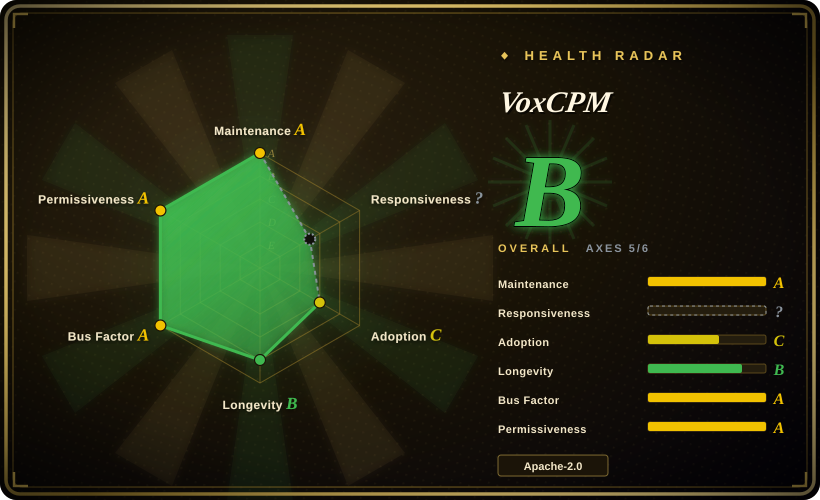
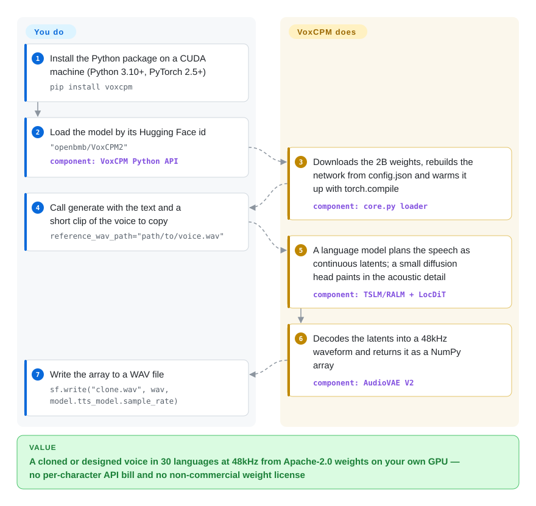

# VoxCPM

You want a product to speak in a specific voice — yours, a narrator's, a brand character's — in Chinese, English or Thai, but the good hosted voices bill per character, and many open voice-cloning models forbid commercial use in their weight license. VoxCPM is a 2B-parameter text-to-speech model with Apache-2.0 code *and* weights: give it text plus a few seconds of the target voice (or a one-line description of a voice that doesn't exist yet) and it returns 48kHz audio on your own GPU.

## When to use

You're building something that has to talk — an audiobook pipeline, a dubbing tool, a game's NPC voices, a voice agent — and you've hit one of two walls. Either the hosted API bill scales with every character you synthesize, or the open model you liked turns out to ship its weights under a research-only license (Fish Speech's `FISH AUDIO RESEARCH LICENSE`: "Any Commercial use … requires a separate written license") or a bespoke one with user caps (IndexTTS2's bilibili license requires a separate grant once you pass 100 million monthly active users). You reach for VoxCPM2 when you need one self-hosted model that clones a voice from a short `voice.wav`, can invent a new voice from text like `"(A young woman, gentle and sweet voice)Hello…"`, covers 30 languages plus nine Chinese dialects without language tags, and is Apache-2.0 end to end so legal review is a one-liner.

Choose it over [GPT-SoVITS](gpt-sovits.md) when you want a pip-installable Python API and CLI rather than a WebUI, and when voice *design* from a description and wide language coverage matter more than GPT-SoVITS's few-shot training workflow. Choose it over [Coqui TTS (idiap fork)](coqui-ai-tts.md) when you want one current, vendor-maintained frontier model instead of a library of older model families under MPL-2.0 (XTTS v2 weights carry their own Coqui Public Model License). The deciding tradeoff: permissive license plus modern quality, paid for with an ~8 GB-VRAM GPU and weak long single-pass generation.

## How it works

Most recent open TTS models first chop audio into discrete "audio tokens" — a bit like repainting a photo using a fixed 1,024-colour palette — and then have a language model predict tokens. VoxCPM skips that palette ("tokenizer-free"): a language model built on OpenBMB's MiniCPM-4 plans the speech directly as continuous latent vectors (compressed numbers that describe a slice of sound), one step per 160 ms, and a small diffusion model — a network that turns noise into detail step by step — fills in the fine acoustic texture of each step; AudioVAE V2 then decodes those latents into a 48kHz waveform. The package does all of that for you, including the Hugging Face download, text normalization, a `torch.compile` warm-up, optional ZipEnhancer denoising of your reference clip, and a streaming generator. What stays yours: choosing the mode by arguments (plain text, a parenthesized voice description, a `reference_wav_path`, or a reference clip *plus* its transcript for "ultimate cloning"), splitting long text into sentences, re-rolling unstable designs, and — for concurrency or an OpenAI-style endpoint — standing up a separate serving engine (Nano-vLLM-VoxCPM or vLLM-Omni), because this repo itself is a single-process library, CLI (`voxcpm design|clone|batch`) and Gradio demo.

<!-- flow-steps:begin (generated from flows/voxcpm.json by tools/flow_card.py — do not edit) -->

Text version of the flow

1. **You**: Install the Python package on a CUDA machine (Python 3.10+, PyTorch 2.5+) — `pip install voxcpm`
2. **You**: Load the model by its Hugging Face id — `"openbmb/VoxCPM2"` — component: `VoxCPM Python API`
3. **VoxCPM**: Downloads the 2B weights, rebuilds the network from config.json and warms it up with torch.compile — component: `core.py loader`
4. **You**: Call generate with the text and a short clip of the voice to copy — `reference_wav_path="path/to/voice.wav"`
5. **VoxCPM**: A language model plans the speech as continuous latents; a small diffusion head paints in the acoustic detail — component: `TSLM/RALM + LocDiT`
6. **VoxCPM**: Decodes the latents into a 48kHz waveform and returns it as a NumPy array — component: `AudioVAE V2`
7. **You**: Write the array to a WAV file — `sf.write("clone.wav", wav, model.tts_model.sample_rate)`

**Value**: A cloned or designed voice in 30 languages at 48kHz from Apache-2.0 weights on your own GPU — no per-character API bill and no non-commercial weight license

<!-- flow-steps:end -->

## When NOT to use

- **Long single-pass narration with a cloned voice.** Users report timbre drift, echo and "howling" once one call runs past roughly 100–300 Chinese characters (issues #234, #302, #372); a maintainer answered in #372 that long-text distortion "has not been fully solved" and advised splitting into short sentences and lowering CFG to ~1.5. If you cannot own a sentence-splitting and stitching layer, use a hosted long-form TTS such as ElevenLabs instead, or evaluate [CosyVoice](https://github.com/QwenAudio/CosyVoice) on your text before committing.
- **CPU-only or edge boxes that must keep up with real time.** VoxCPM2 needs ~8 GB VRAM for RTF ~0.3 on an RTX 4090 (vendor figure); the FAQ calls CPU inference "slow", and the GGUF port via llama.cpp-omni reports RTF ~1.76 on an M4 Pro — slower than real time. Use Kokoro or the small engines bundled in [Voicebox](voicebox.md) when there is no GPU.
- **A multi-tenant TTS API out of the box.** This repo gives you a Python object, a CLI and a Gradio demo; batching, concurrency and the OpenAI-compatible `/v1/audio/speech` endpoint live in other repositories (vLLM-Omni, Nano-vLLM-VoxCPM) with their own versions to pin. If you just want a local voice service with an API and a UI, [Voicebox](voicebox.md) is closer to a finished app.
- **Languages where its own benchmark shows it is weak.** On the README's MiniMax multilingual test VoxCPM2 posts WER 13.0 for Arabic and 19.7 for Hindi versus ~1.7 / ~5.8 for ElevenLabs, and Czech/Romanian/Ukrainian are worse still (they are not in the 30-language list). For those markets use a hosted multilingual TTS, or fine-tune first and measure.
- **A brand voice that must come out identical every run.** The README itself says Voice Design and controllable cloning "can vary between runs — you may try to generate 1~3 times". Design once, keep the best take as a reference clip and clone from it (or LoRA-fine-tune on it), or use [GPT-SoVITS](gpt-sovits.md) with a speaker-specific fine-tune if run-to-run consistency is the whole requirement.
- **Full fine-tuning on consumer cards.** A user could not fit full-parameter fine-tuning on 4× RTX 3090 (issue #335); the maintainer's answer implies a single ≥40 GB card with small batches. On 24 GB cards plan for LoRA only (`conf/voxcpm_v2/voxcpm_finetune_lora.yaml`).
- **Regulated deployments that need provenance marks on synthetic speech.** No watermarking module ships in the source tree; realistic cloning plus a permissive license means consent checks and AI-audio labelling are entirely on you — add an audio watermarker such as Meta's AudioSeal (not indexed) or choose a hosted provider with built-in safeguards.

## Comparison

| Alternative | In index | Our verdict | Tradeoff |
|---|---|---|---|
| [GPT-SoVITS](gpt-sovits.md) | ✅ | Choose GPT-SoVITS when you want a WebUI with dataset tooling and a few-shot training path to maximize similarity to one speaker; choose VoxCPM when you want a pip-installable API/CLI, text-described voice design and 30-language coverage. | GPT-SoVITS gives an app plus training workflow for CJK+English under MIT; VoxCPM gives a bigger, newer model with broader languages but a heavier GPU requirement. |
| [Coqui TTS (idiap fork)](coqui-ai-tts.md) | ✅ | Choose Coqui when you need a library spanning many model families (XTTS v2, VITS, Tacotron) behind one API; choose VoxCPM when one current model with permissive weights is what you actually ship. | Coqui trades breadth and MPL-2.0 code (plus per-model weight licenses) for a community fork's pace; VoxCPM is a single vendor-maintained model family with Apache-2.0 weights. |
| [CosyVoice](https://github.com/QwenAudio/CosyVoice) | not indexed | Choose CosyVoice when you want an Apache-2.0 multilingual TTS stack with its own inference/training/deployment tooling from Alibaba's speech team; choose VoxCPM when text-described voice design and 48kHz output matter. | Both are permissive and Chinese-strong; the README's own Seed-TTS numbers favor VoxCPM2 on similarity, but those are vendor-reported and CosyVoice brings a larger deployment toolchain. Not added in this tab-intake batch. |
| [Fish Speech](https://github.com/fishaudio/fish-speech) | not indexed | Choose Fish Speech (S2) for research, hobby or evaluation work where its lower error rates on VoxCPM's own multilingual tables matter; choose VoxCPM for anything commercial. | Fish Audio's research license grants no commercial rights without a separate written deal; VoxCPM's Apache-2.0 has no such gate but scores worse on several languages. Not added in this tab-intake batch. |
| [IndexTTS2](https://github.com/index-tts/index-tts) | not indexed | Choose IndexTTS2 when you need precise duration and emotion control for dubbing and your product sits under the bilibili license's user and revenue caps; choose VoxCPM when you want a standard license with no scale threshold. | IndexTTS2 adds dubbing-oriented controls under a custom license that requires a separate grant above 100M MAU or RMB 1B revenue; VoxCPM is Apache-2.0 without that clause. Not added in this tab-intake batch. |

## Tech stack

- **Language / framework:** Python (package `voxcpm`, `src/` layout, setuptools-scm versioning) on **PyTorch ≥ 2.5** with `torchaudio`/`torchcodec`, `transformers`, `einops`; `torch.compile` on by default (`optimize=True`).
- **Model:** tokenizer-free diffusion-autoregressive TTS — four stages LocEnc → TSLM → RALM → LocDiT operating in the latent space of AudioVAE V2 (16kHz in, 48kHz out); MiniCPM-4 language-model backbone, 2B parameters, 6.25Hz LM step rate (VoxCPM2). Older VoxCPM1.5 (0.6B, 44.1kHz) and VoxCPM-0.5B (16kHz) weights still load via `config.json`'s `architecture` field.
- **Surfaces:** Python API (`generate`, `generate_streaming`), a `voxcpm` CLI (`design`, `clone`, `batch`, optional stable-ts timestamps), a Gradio demo (`app.py`), a LoRA fine-tuning WebUI (`lora_ft_webui.py`) and training script with SFT/LoRA YAML configs.
- **Ecosystem ports (separate repos):** Nano-vLLM-VoxCPM and vLLM-Omni for GPU serving, llama.cpp-omni / VoxCPM.cpp for GGUF on CPU/Metal/Vulkan, an ONNX export, an Apple Neural Engine backend and ComfyUI nodes.

## Dependencies

- **Hardware:** an NVIDIA GPU with CUDA ≥ 12.0 is the supported path — ~8 GB VRAM for VoxCPM2 inference; Apple MPS and CPU work but slowly, and ROCm is community-only. Fine-tuning wants much more (LoRA on 24 GB cards; full FT ~40 GB+ per issue #335).
- **Runtime:** Python ≥ 3.10 (README says < 3.13; `pyproject.toml` sets no upper bound), PyTorch ≥ 2.5; the FAQ recommends Triton 3.1+ and einops 0.8.1 to avoid `torch.compile` errors. The dependency list is heavy: `gradio` 6, `funasr`, `modelscope`, `datasets`, `librosa`, `matplotlib` all install even for pure inference.
- **Model assets:** first run downloads weights from Hugging Face (`openbmb/VoxCPM2`) or ModelScope; with the default `load_denoiser=True` it also pulls the ZipEnhancer denoiser from ModelScope. Pass `local_files_only=True` with a pre-downloaded path for offline hosts.
- **External services:** none at inference time once weights are local.

## Ops difficulty

**Medium.** A single-GPU inference box is `pip install voxcpm` plus a weight download, and the Python API is small. The cost shows up around it: pinning a PyTorch/CUDA/Triton combination that `torch.compile` accepts (or turning it off), the large transitive dependency set, splitting long text and stitching audio, re-rolling unstable voice designs, and — for any real traffic — running and version-pinning a separate serving engine (vLLM-Omni's README tells you to install from `main` because it is "rapidly evolving"). The repo's only CI workflow publishes to PyPI; tests exist but are not run on push, so validate each upgrade yourself.

## Health & viability

- **Maintenance (2026-09-30).** Active but slowing after launch bursts: releases 1.0.1 → 2.0.3 between 2025-09 and 2026-05, then no tag for ~4.5 months; last push 2026-09-02 with sporadic merges (Docker/nginx fixes, README ecosystem links). 101 open vs 230 closed issues. [推断]
- **Governance / bus factor.** Owned by the OpenBMB organization with ModelBest and Tsinghua's THUHCSI credited as institutions; 26 people committed in the last 12 months (top contributor ~34% of commits per the health scorer), but one contributor (`a710128`, also author of Nano-vLLM-VoxCPM) answers most technical issues — a thin maintainer bench behind a large user base.
- **Backing & longevity.** OpenBMB/ModelBest have kept the MiniCPM line going across multiple releases and published two technical reports for VoxCPM, which is a better signal than a lone academic drop. But the repo is only ~1 year old (created 2025-09-16), so the Lindy prior is weak; bet on the weights you download, not on the roadmap.
- **Adoption & ecosystem.** ~38.2k stars, ~4.3k forks, ~403k Hugging Face downloads for VoxCPM2, 83,892 PyPI downloads of `voxcpm` in the last month (health scorer, 2026-09-30), and a community ecosystem (vLLM-Omni integration, GGUF/ONNX/ANE/Rust ports, ComfyUI nodes) — real usage, not just trending stars.
- **Risk flags.** Apache-2.0 for code and weights (HF model card agrees), no relicense seen. Risks are technical: `Development Status :: 3 - Alpha` classifier, known long-form instability, run-to-run variance in voice design, and misuse exposure of a permissive voice-cloning model with no built-in watermark.

## Caveats (unverified)

- [未验证] All quality and speed numbers (Seed-TTS-eval, CV3-eval, MiniMax multilingual WER/SIM, internal 30-language ASR benchmark, RTF ~0.30 / ~0.13 on RTX 4090, RTF ~1.76 on M4 Pro, ~8 GB VRAM) are the vendor's README claims; not reproduced here (no GPU test environment).
- [未验证] The ~100–300-character threshold for long-form drift comes from user reports in issues #234 and #372, not from a controlled test; it likely depends on reference-audio quality, CFG and mode.
- [推断] "No watermarking module" is based on the source tree listing (no such module under `src/voxcpm/`) and a zero-hit GitHub code search for "watermark"; a downstream serving engine could add one.
- [推断] The full-fine-tuning memory estimate (~40 GB+ single card) is inferred from the maintainer's replies in issue #335, not from docs.
- [未验证] License terms of Fish Speech and IndexTTS2 are summarized from their LICENSE files as of 2026-09-30; both are custom licenses that may change and were not legally reviewed.
- [推断] The maintenance judgment ("slowing after launch bursts") is read from release dates and the last 13 weeks of commit activity (13 commits over 6 active weeks); it may simply reflect work moving to other repos (vLLM-Omni, llama.cpp-omni).
- [未验证] Star, fork and download counts are date-sensitive (as of 2026-09-30).
