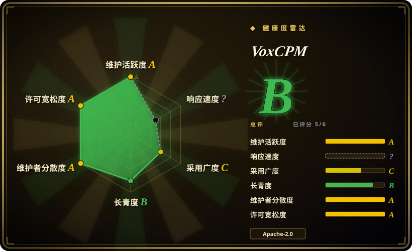
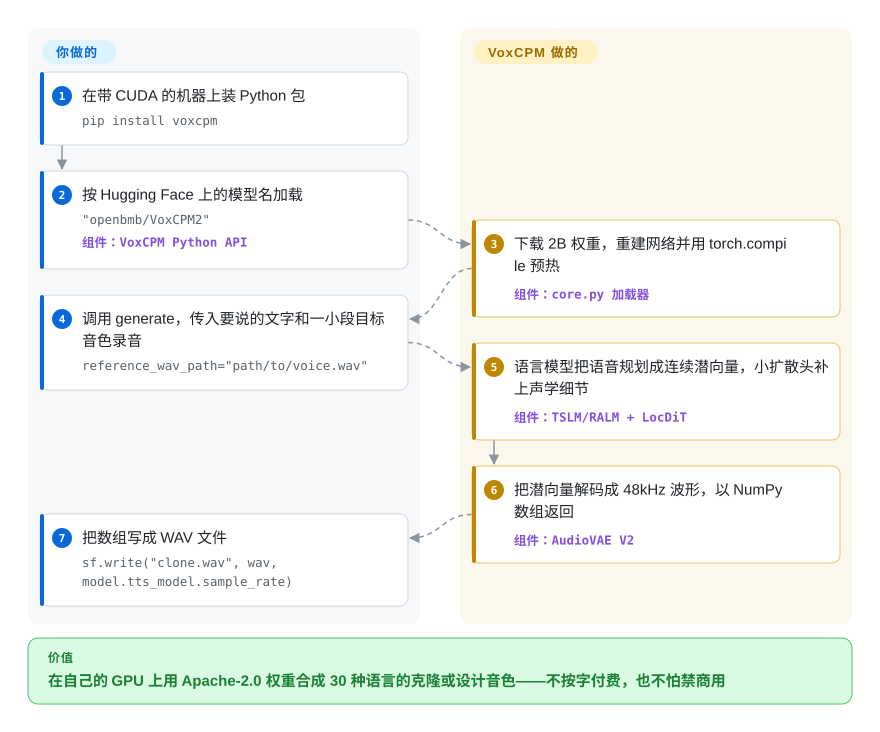

# VoxCPM

你想让产品用某个特定的声音说话——你自己的、某位播音员的、某个品牌角色的——还要能说中文、英文甚至泰语，可好用的托管语音按字计费，不少开源克隆模型又在权重许可里写明不许商用。VoxCPM 是一个 20 亿参数的语音合成模型，代码和权重都是 Apache-2.0：给它一段文字加几秒目标音色的录音（或者一句话描述一个还不存在的声音），它在你自己的 GPU 上吐出 48kHz 音频。

## 何时使用

你在做一个要“开口说话”的东西——有声书流水线、视频配音工具、游戏 NPC 语音、语音 agent——然后撞上了两堵墙之一：要么托管 API 的账单随每一个合成的字往上涨；要么你看中的开源模型，权重许可只给研究用（Fish Speech 的 `FISH AUDIO RESEARCH LICENSE` 原话是任何商业用途都需要另签书面许可），或者是带用户数门槛的自定义许可（IndexTTS2 的 bilibili 许可在月活超过 1 亿后要另行申请授权）。这时你会想到 VoxCPM2：一个自托管模型，能用一小段 `voice.wav` 克隆音色，也能凭 `"(A young woman, gentle and sweet voice)Hello…"` 这样的文字描述凭空设计新声音，覆盖 30 种语言外加九种中文方言且不需要语言标签，代码和权重全程 Apache-2.0，法务审查一句话就能过。

和 [GPT-SoVITS](gpt-sovits.zh.md) 比，当你要的是能 pip 安装的 Python API 和命令行而不是 WebUI，并且“用文字描述设计音色”和多语言覆盖比 GPT-SoVITS 的小样本训练流程更重要时，选 VoxCPM。和 [Coqui TTS（idiap 分支）](coqui-ai-tts.zh.md) 比，当你要的是一个仍由厂商维护的新一代模型，而不是一个装着多代旧模型、代码 MPL-2.0 的库（XTTS v2 权重另有 Coqui Public Model License）时，选 VoxCPM。决定性的取舍是：宽松许可加新一代音质，代价是一张约 8 GB 显存的 GPU，以及长文本单次生成不稳。

## 怎么用起来

多数新近的开源 TTS 会先把音频切成离散的“音频 token”——有点像把一张照片强行改用固定 1024 色的调色板重画——再让语言模型去预测这些 token。VoxCPM 跳过了这块调色板（所谓 tokenizer-free）：一个基于 OpenBMB 自家 MiniCPM-4 的语言模型直接把语音规划成连续的潜向量（描述一小段声音的一串压缩数字），每步对应 160 毫秒；再由一个小的扩散模型——一种把噪声一步步“显影”成细节的网络——补上每一步的精细声学纹理；最后 AudioVAE V2 把潜向量解码成 48kHz 波形。这些都由这个包替你完成，包括从 Hugging Face 下载权重、文本规范化、`torch.compile` 预热、可选的 ZipEnhancer 参考音频降噪，以及流式生成器。留给你的部分是：用参数选模式（纯文本、括号里写音色描述、`reference_wav_path`，或者参考音频加它的逐字稿做“极致克隆”）；把长文本切成短句；对不稳定的音色设计多抽几次；如果要并发或 OpenAI 风格的接口，还得另外部署一个推理服务引擎（Nano-vLLM-VoxCPM 或 vLLM-Omni）——因为这个仓库本身只是单进程的 Python 库、命令行（`voxcpm design|clone|batch`）和 Gradio 演示页。

<!-- flow-steps:begin (generated from flows/voxcpm.json by tools/flow_card.py — do not edit) -->

流程文字版

1. **你**：在带 CUDA 的机器上装 Python 包 — `pip install voxcpm`
2. **你**：按 Hugging Face 上的模型名加载 — `"openbmb/VoxCPM2"` — 组件：`VoxCPM Python API`
3. **VoxCPM**：下载 2B 权重，重建网络并用 torch.compile 预热 — 组件：`core.py 加载器`
4. **你**：调用 generate，传入要说的文字和一小段目标音色录音 — `reference_wav_path="path/to/voice.wav"`
5. **VoxCPM**：语言模型把语音规划成连续潜向量，小扩散头补上声学细节 — 组件：`TSLM/RALM + LocDiT`
6. **VoxCPM**：把潜向量解码成 48kHz 波形，以 NumPy 数组返回 — 组件：`AudioVAE V2`
7. **你**：把数组写成 WAV 文件 — `sf.write("clone.wav", wav, model.tts_model.sample_rate)`

**价值**：在自己的 GPU 上用 Apache-2.0 权重合成 30 种语言的克隆或设计音色——不按字付费，也不怕禁商用

<!-- flow-steps:end -->

## 何时不用

- **用克隆音色一次性合成长篇旁白。** 用户反馈单次调用超过大约 100–300 个汉字后会出现音色漂移、回声和“啸叫”（issue #234、#302、#372）；维护者在 #372 里回复长文本失真“一直在优化，但是还没彻底解决”，建议切短句、把 CFG 调到 1.5 左右。如果你没法自己维护一层切句加拼接逻辑，改用 ElevenLabs 这类托管长文本 TTS，或者先拿你的真实文本评测 [CosyVoice](https://github.com/QwenAudio/CosyVoice) 再决定。
- **只有 CPU 或边缘设备、又要跟上实时。** VoxCPM2 需要约 8 GB 显存，在 RTX 4090 上 RTF 约 0.3（厂商数字）；FAQ 说 CPU 推理“很慢”，经 llama.cpp-omni 的 GGUF 移植在 M4 Pro 上 RTF 约 1.76——比实时还慢。没有 GPU 时，用 Kokoro 或 [Voicebox](voicebox.zh.md) 里打包的小引擎。
- **想开箱即得一个多租户 TTS 服务。** 这个仓库给你的是一个 Python 对象、一个命令行和一个 Gradio 演示；批处理、并发、OpenAI 兼容的 `/v1/audio/speech` 接口都在别的仓库里（vLLM-Omni、Nano-vLLM-VoxCPM），各自有版本要锁。如果你只想要一个带 API 和界面的本地语音服务，[Voicebox](voicebox.zh.md) 更接近成品应用。
- **它自家评测就显示偏弱的语种。** 在 README 的 MiniMax 多语言测试里，VoxCPM2 阿拉伯语 WER 13.0、印地语 19.7，而 ElevenLabs 分别约 1.7 和 5.8；捷克语、罗马尼亚语、乌克兰语更差（它们本就不在 30 种语言清单里）。面向这些市场，用托管多语言 TTS，或者先微调再实测。
- **品牌音色要求每次生成都一模一样。** README 自己写明音色设计和可控克隆“每次运行结果会有差异，可能要生成 1~3 次”。做法是设计一次、留下最好的那条当参考音频再克隆（或拿它做 LoRA 微调）；如果逐次一致性就是全部需求，用做了说话人微调的 [GPT-SoVITS](gpt-sovits.zh.md)。
- **在消费级显卡上做全参数微调。** 有用户用 4 张 RTX 3090 跑全参数微调显存溢出（issue #335），维护者的回复意味着需要单卡 40 GB 以上并调小 batch。24 GB 显卡请只规划 LoRA（`conf/voxcpm_v2/voxcpm_finetune_lora.yaml`）。
- **受监管场景、合成语音必须带来源标记。** 源码树里没有水印模块；高度逼真的克隆加上宽松许可，意味着授权核验和 AI 音频标注全由你负责——自己加一个音频水印器（例如 Meta 的 AudioSeal，未收录），或选内置防护的托管服务。

## 横向对比

| 替代品 | 是否收录 | 我们的评价 | 取舍 |
|---|---|---|---|
| [GPT-SoVITS](gpt-sovits.zh.md) | ✅ | 想要带数据集工具的 WebUI、并通过小样本训练把某一个说话人的相似度拉满时选 GPT-SoVITS；想要能 pip 安装的 API 和命令行、文字描述设计音色、30 种语言覆盖时选 VoxCPM。 | GPT-SoVITS 以 MIT 许可给你一个应用加训练流程，主攻中日韩和英语；VoxCPM 模型更大更新、语种更广，但 GPU 门槛更高。 |
| [Coqui TTS（idiap 分支）](coqui-ai-tts.zh.md) | ✅ | 需要一个库、用统一 API 覆盖多代模型（XTTS v2、VITS、Tacotron）时选 Coqui；真正要上线的就是一个带宽松权重的新模型时选 VoxCPM。 | Coqui 用广度和 MPL-2.0 代码（外加各模型各自的权重许可）换来社区分支的节奏；VoxCPM 是单一厂商维护的一个模型家族，权重 Apache-2.0。 |
| [CosyVoice](https://github.com/QwenAudio/CosyVoice) | 未收录 | 想要阿里语音团队出品、自带推理/训练/部署全套工具的 Apache-2.0 多语言 TTS 时选 CosyVoice；文字描述设计音色和 48kHz 输出更重要时选 VoxCPM。 | 两者都宽松许可、中文都强；VoxCPM 自家 README 的 Seed-TTS 数字在相似度上占优，但那是厂商自报，而 CosyVoice 的部署工具链更完整。本批次（标签页收录）未新增该页。 |
| [Fish Speech](https://github.com/fishaudio/fish-speech) | 未收录 | 做研究、个人爱好或评测，并且在意它在 VoxCPM 自家多语言表格里更低的错误率时选 Fish Speech（S2）；任何商业用途选 VoxCPM。 | Fish Audio 的研究许可不授予任何商业权利，需另签书面协议；VoxCPM 的 Apache-2.0 没有这道闸，但在若干语种上得分更低。本批次（标签页收录）未新增该页。 |
| [IndexTTS2](https://github.com/index-tts/index-tts) | 未收录 | 做配音、需要精确的时长和情绪控制，且你的产品规模在 bilibili 许可的用户数和营收门槛以下时选 IndexTTS2；想要没有规模门槛的标准许可时选 VoxCPM。 | IndexTTS2 多了面向配音的控制能力，但自定义许可规定月活超 1 亿或年营收超 10 亿元须另行授权；VoxCPM 的 Apache-2.0 没有这一条。本批次（标签页收录）未新增该页。 |

## 技术栈

- **语言/框架：** Python（包名 `voxcpm`，`src/` 布局，setuptools-scm 管版本），基于 **PyTorch ≥ 2.5**，配 `torchaudio`/`torchcodec`、`transformers`、`einops`；默认开启 `torch.compile`（`optimize=True`）。
- **模型：** 无离散 token 的“扩散 + 自回归”TTS——LocEnc → TSLM → RALM → LocDiT 四段流水线，全部在 AudioVAE V2 的潜空间里运行（16kHz 输入，48kHz 输出）；语言模型骨干是 MiniCPM-4，VoxCPM2 为 20 亿参数、语言模型步频 6.25Hz。旧版 VoxCPM1.5（0.6B，44.1kHz）和 VoxCPM-0.5B（16kHz）权重仍可通过 `config.json` 的 `architecture` 字段加载。
- **使用入口：** Python API（`generate`、`generate_streaming`）、`voxcpm` 命令行（`design`、`clone`、`batch`，可选 stable-ts 时间戳）、Gradio 演示页（`app.py`）、LoRA 微调 WebUI（`lora_ft_webui.py`），以及带 SFT/LoRA YAML 配置的训练脚本。
- **生态移植（独立仓库）：** Nano-vLLM-VoxCPM 和 vLLM-Omni 负责 GPU 服务化，llama.cpp-omni / VoxCPM.cpp 在 CPU/Metal/Vulkan 上跑 GGUF，另有 ONNX 导出、Apple 神经引擎后端和 ComfyUI 节点。

## 依赖

- **硬件：** 官方支持路径是 CUDA ≥ 12.0 的 NVIDIA GPU——VoxCPM2 推理约需 8 GB 显存；Apple MPS 和 CPU 能跑但慢，ROCm 只有社区方案。微调需要多得多（24 GB 卡只能 LoRA；按 issue #335，全参数微调约需 40 GB 以上）。
- **运行时：** Python ≥ 3.10（README 写 < 3.13，`pyproject.toml` 没设上限），PyTorch ≥ 2.5；FAQ 建议 Triton 3.1+ 和 einops 0.8.1 以避开 `torch.compile` 报错。依赖清单很重：哪怕只做推理，也会装上 `gradio` 6、`funasr`、`modelscope`、`datasets`、`librosa`、`matplotlib`。
- **模型资产：** 首次运行从 Hugging Face（`openbmb/VoxCPM2`）或 ModelScope 下载权重；默认 `load_denoiser=True` 时还会从 ModelScope 拉 ZipEnhancer 降噪模型。离线机器请预先下载并传 `local_files_only=True`。
- **外部服务：** 权重落地后推理不依赖任何外部服务。

## 运维难度

**中等。** 单卡推理机就是 `pip install voxcpm` 加一次权重下载，Python API 也很小。成本在外围：锁定一套 `torch.compile` 能接受的 PyTorch/CUDA/Triton 组合（或者干脆关掉它）、庞大的传递依赖、长文本切句与音频拼接、对不稳定的音色设计反复重抽，以及——只要有真实流量——另外运行并锁版本一个推理服务引擎（vLLM-Omni 的 README 让你从 `main` 安装，因为它“迭代很快”）。仓库唯一的 CI 工作流是发布到 PyPI，测试文件存在但不会在推送时运行，每次升级都得自己验证。

## 健康度与可持续性

- **维护（2026-09-30）。** 活跃，但发布热潮后在放缓：2025-09 到 2026-05 间从 1.0.1 发到 2.0.3，此后约 4.5 个月没有新 tag；最后一次推送是 2026-09-02，合并零星（Docker/nginx 修复、README 生态链接）。issue 未关 101、已关 230。[推断]
- **治理/巴士因子。** 归属 OpenBMB 组织，README 列出面壁智能（ModelBest）和清华 THUHCSI 为署名机构；近 12 个月有 26 人提交过代码（按健康度评分器统计，头号贡献者约占 34%），但技术 issue 大多由一位贡献者（`a710128`，也是 Nano-vLLM-VoxCPM 的作者）回复——用户基数大，维护者梯队薄。
- **背书与长期性。** OpenBMB/面壁智能已持续多代维护 MiniCPM 系列，并为 VoxCPM 发了两份技术报告，这比学者单次甩出的代码更可信。但仓库才一岁左右（2025-09-16 创建），Lindy 先验很弱；押注你下载到手的权重，别押注它的路线图。
- **采用与生态。** 约 3.82 万星、约 4.3 千 fork，VoxCPM2 在 Hugging Face 上约 40.3 万次下载，`voxcpm` 在 PyPI 上月下载 83,892 次（健康度评分器，2026-09-30），还有社区生态（vLLM-Omni 集成、GGUF/ONNX/ANE/Rust 移植、ComfyUI 节点）——是真实使用，不只是趋势榜上的星星。
- **风险信号。** 代码与权重都是 Apache-2.0（HF 模型卡一致），未见改许可历史。风险在技术面：PyPI 分类标注 `Development Status :: 3 - Alpha`、已知的长文本不稳、音色设计逐次差异，以及宽松许可的逼真克隆模型没有内置水印带来的滥用暴露面。

## 存疑（未验证）

- [未验证] 所有音质与速度数字（Seed-TTS-eval、CV3-eval、MiniMax 多语言 WER/SIM、内部 30 语种 ASR 评测、RTX 4090 上 RTF 约 0.30 / 0.13、M4 Pro 上 RTF 约 1.76、约 8 GB 显存）均来自厂商 README，本页未复现（没有 GPU 测试环境）。
- [未验证] 长文本漂移的“约 100–300 字”阈值来自 issue #234 和 #372 的用户反馈，不是受控测试；它很可能随参考音频质量、CFG 和模式而变。
- [推断] “没有水印模块”依据的是源码树清单（`src/voxcpm/` 下无此模块）和 GitHub 代码搜索“watermark”零命中；下游推理服务引擎可能另行加上。
- [推断] 全参数微调显存估计（单卡约 40 GB 以上）是从维护者在 issue #335 的回复推出来的，文档里没有写。
- [未验证] Fish Speech 与 IndexTTS2 的许可条款按其 2026-09-30 的 LICENSE 文件概括；两者都是可能变动的自定义许可，未经法律审阅。
- [推断] “发布热潮后在放缓”的维护判断依据是发版日期和最近 13 周的提交活跃度（6 个活跃周共 13 次提交）；也可能只是工作转移到了其他仓库（vLLM-Omni、llama.cpp-omni）。
- [未验证] 星数、fork 数和下载量随时间变化（截至 2026-09-30）。
