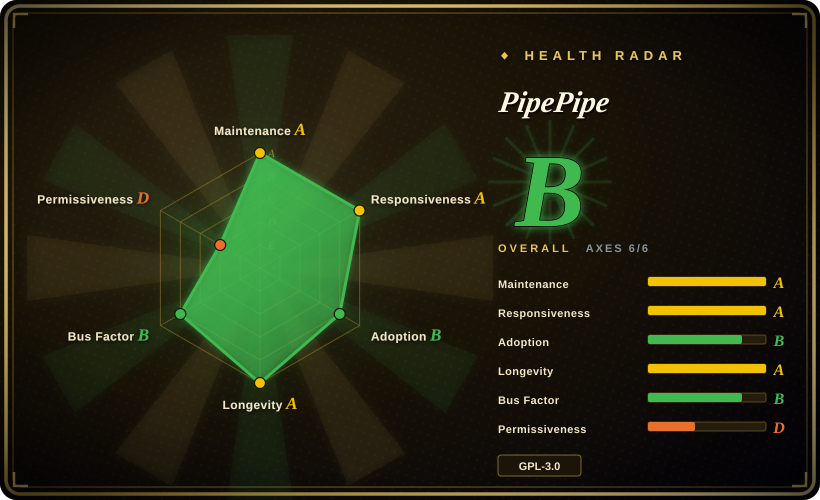
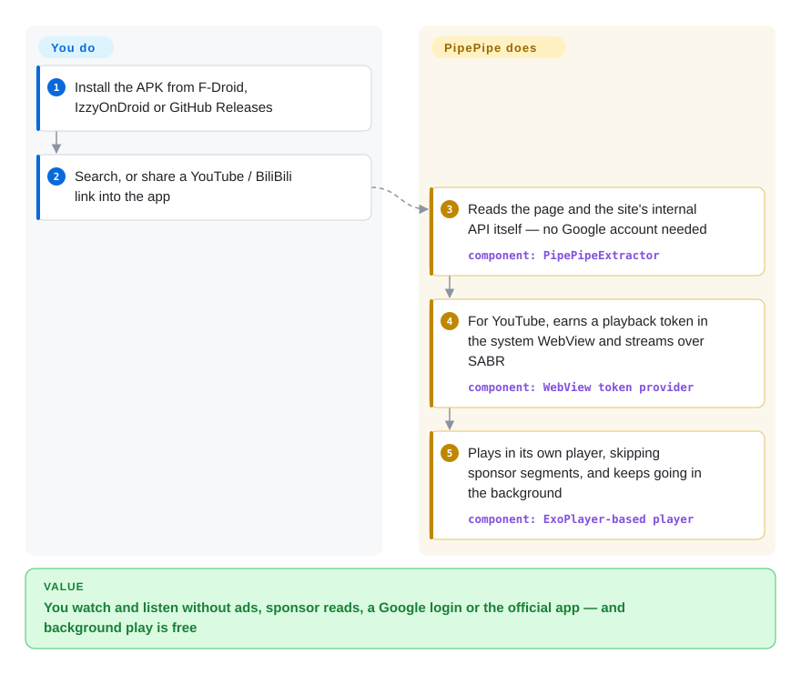

# PipePipe

On an Android phone the official YouTube app plays an ad before the video, stops the moment you lock the screen unless you pay for Premium, wants your Google account before it will remember a subscription — and the sponsor read inside the video plays either way. PipePipe is a free Android app that reads YouTube (and BiliBili, NicoNico, SoundCloud, PeerTube, Bandcamp, media.ccc.de) itself, plays it in its own player with sponsor segments skipped and background play on, and keeps your subscriptions on the phone.

## When to use

You watch a lot of YouTube, and some BiliBili or NicoNico, on an Android phone. You are tired of the unskippable pre-roll, of `Premium required` when you switch to the maps app mid-podcast, and of the "this video is sponsored by…" minute that no ad blocker can touch because it is part of the video. You'd also rather your watch history not be tied to your Google account. The obvious answer is NewPipe — but NewPipe does not skip sponsor segments, does not show dislike counts, and does not do BiliBili or NicoNico.

PipePipe is the pick when you want **the NewPipe model — no Google account, no Play Services, the app talks to the sites directly — plus the extras NewPipe declines to ship**: SponsorBlock skipping (YouTube and BiliBili), Return YouTube Dislike counts, live chat drawn as danmaku (bullet comments across the video), keyword and channel filters that also block Shorts and paid videos, gestures, a sleep timer, and an optional cookie login used only where you allow it. It is a **hard fork** of NewPipe since early 2022 with its own YouTube code, so fixes land on its own schedule — for YouTube's 2026 SABR change it shipped a workaround within days. Over LibreTube the deciding difference is that PipePipe contacts YouTube from your phone instead of routing through a Piped proxy server; over Grayjay it is a GPL license rather than FUTO's source-first one.

## How it works

PipePipe is two parts. The **extractor** (PipePipeExtractor, a Java library inherited from NewPipe) is a set of per-site readers: for each service it fetches the web page or the site's own internal JSON API — the same calls the official website makes — and turns them into a list of streams, comments and related videos, so no account or official API key is involved. The **client** (PipePipeClient, the Android app) takes those streams and plays them in an ExoPlayer-based player, adds SponsorBlock and dislike data from their community servers, and stores subscriptions, playlists and history in a database on the phone. YouTube is the hard case: it now streams through SABR — its own protocol that hands out video in small pieces only to a client that proves it is a real browser — so PipePipe runs YouTube's check script inside Android's built-in WebView (the system browser engine apps can embed) to earn that proof, the way a visitor gets a stamped ticket at the door before being let in. You pick what to watch and which extras to enable; PipePipe does the fetching, the token dance, the playback and the skipping. The GitHub repository you install from is only a wrapper: the code lives in two submodules, and releases are APKs.

<!-- flow-steps:begin (generated from flows/pipepipe.json by tools/flow_card.py — do not edit) -->

Text version of the flow

1. **You**: Install the APK from F-Droid, IzzyOnDroid or GitHub Releases
2. **You**: Search, or share a YouTube / BiliBili link into the app
3. **PipePipe**: Reads the page and the site's internal API itself — no Google account needed — component: `PipePipeExtractor`
4. **PipePipe**: For YouTube, earns a playback token in the system WebView and streams over SABR — component: `WebView token provider`
5. **PipePipe**: Plays in its own player, skipping sponsor segments, and keeps going in the background — component: `ExoPlayer-based player`

**Value**: You watch and listen without ads, sponsor reads, a Google login or the official app — and background play is free

<!-- flow-steps:end -->

## When NOT to use

- **You are not on an Android phone.** The app is Android-only (minimum Android 6.0); there is no iOS, desktop or web build. On Android TV boxes use SmartTube, which is built for the TV remote; on a desktop use a desktop client such as FreeTube, or the browser with extensions.
- **Playback must never break.** Everything rests on reading YouTube's pages and internal APIs, which YouTube changes without notice and actively defends. In May 2026 YouTube's SABR enforcement stopped playback (issue #2330, fixed in 5.1.1 four days later) and another SABR thread followed in July (#2638). Devices whose system WebView is older than version 80 cannot play YouTube at all. If a day without video is unacceptable, pay for YouTube Premium in the official app.
- **You want one app for many platforms, or a service PipePipe lacks.** The README states that requests for new services will not be accepted. Grayjay covers far more platforms through plugins (under a source-available, non-OSI license); for a single new site, fork the extractor.
- **You want your library synced across devices.** Subscriptions, playlists and history live in the app's local database; moving them means export and import by hand. LibreTube can sync through an optional Piped account.
- **You only want files, not a player.** For downloading, archiving or scripting, use [yt-dlp](../media-download/yt-dlp.md); PipePipe's downloader is a convenience inside a phone app, not something you can batch or automate.
- **You need a project with a team and a clear upstream.** One person writes almost all of PipePipe, and the bug template asks reporters to accept that "issues … occurring on specific devices or under specific network conditions, will not be fixed". If you want a multi-maintainer project with an established process, use NewPipe itself and accept its narrower feature set.
- **You plan to sign in with your main Google account.** The optional login hands your YouTube cookie to a third-party client, which YouTube's terms do not sanction; whether that puts the account at risk is not documented. Use it without signing in, or keep account-bound content in the official app.

## Comparison

| Alternative | In index | Our verdict | Tradeoff |
|---|---|---|---|
| NewPipe (`TeamNewPipe/NewPipe`) | not indexed | If you want the original project with a multi-person team and a slower, more conservative feature policy, pick NewPipe; pick PipePipe when SponsorBlock, dislikes, BiliBili/NicoNico and filters matter more than governance. | NewPipe has a decade of history (2015) and ~39.8k stars but lacks the extras; PipePipe adds them on a single maintainer's hard fork that no longer receives NewPipe's fixes. Not added in this tab-intake batch. |
| LibreTube (`libre-tube/LibreTube`) | not indexed | If you want a Material 3 YouTube client with optional account sync, pick LibreTube; pick PipePipe when your phone should talk to YouTube directly and you also watch BiliBili or NicoNico. | LibreTube leans on Piped (a proxy front end) for its account and sync features, so availability also depends on Piped instances; PipePipe has no server in the middle but also no sync. Not added in this tab-intake batch. |
| Grayjay (`futo-org/grayjay-android`) | not indexed | When you follow creators across many platforms and want one feed, pick Grayjay; pick PipePipe when a GPL-licensed, YouTube-and-BiliBili-focused client is enough. | Grayjay's plugin system reaches more platforms and has a funded company (FUTO) behind it, but its Source First License is not an open-source license; PipePipe is GPL-3.0 with fewer services. Not added in this tab-intake batch. |
| SmartTube (`yuliskov/SmartTube`) | not indexed | On an Android TV or Fire TV box, pick SmartTube; on a phone pick PipePipe — SmartTube says phones and tablets are not supported. | SmartTube is TV-optimised with SponsorBlock and ~34k stars; PipePipe declares TV support as optional but is designed for touch. Not added in this tab-intake batch. |
| Tubular (`polymorphicshade/Tubular`) | not indexed | Do not start with Tubular: the repository is archived and its README points users to PipePipe; keep it only as a reference for the SponsorBlock-on-NewPipe approach. | Tubular tracked upstream NewPipe closely and added SponsorBlock and dislikes; discontinued, so YouTube breakages will not be fixed. Not added in this tab-intake batch. |

## Tech stack

- **Client app:** Java and Kotlin Android app (PipePipeClient, forked from NewPipe), `compileSdk` 37, `targetSdk` 36, `minSdk` 23; ExoPlayer 2 with the media-session extension for playback; Room for the local database; RxJava 3; OkHttp 5; jsoup; ACRA for crash reports the user chooses to send
- **Extractor:** pure-Java library (PipePipeExtractor) with per-service readers for YouTube, BiliBili, NicoNico, SoundCloud, PeerTube, Bandcamp and media.ccc.de; SponsorBlock and Return YouTube Dislike helpers; YouTube SABR support
- **YouTube attestation:** a bundled JavaScript (`sabr_po_token.js`) executed in the Android System WebView to obtain the proof-of-origin token SABR requires
- **Repository shape:** the `InfinityLoop1308/PipePipe` repo holds README, fastlane metadata, translation notes and a `release.sh` that mirrors to Codeberg; the code is in two git submodules (which is why GitHub labels the repo "Shell")
- **Distribution:** per-ABI APKs on GitHub Releases, F-Droid and IzzyOnDroid, package `InfinityLoop1309.NewPipeEnhanced`

## Dependencies

- **An Android 6.0+ device.** Android TV and Android Auto are declared in the manifest but the UI targets phones.
- **Android System WebView ≥ 80, kept up to date,** for YouTube playback (a WebView that fails to start shows as a playback error — issue #2961).
- **Network access to each site you watch** (YouTube, BiliBili, …), plus the SponsorBlock and Return YouTube Dislike community servers if those features are on. No Google Play Services, no Google account, no server of your own.
- **Optional:** a login cookie per service, used only for the functions you enable under "Cookie Functions" (for YouTube, only when fetching playback streams).
- **To build from source:** Android SDK/Gradle, with the submodules checked out.

## Ops difficulty

**Low** to install — sideload an APK or add it from F-Droid/IzzyOnDroid. The ongoing cost is keeping up: when YouTube changes something, the fix comes as a new release, often a beta first, so you update often (roughly every week or two in 2026) and occasionally switch the YouTube endpoint or update WebView to get playback back. F-Droid can lag behind GitHub (5.3.1 there against 5.4.0 on GitHub on 2026-09-28), and in 2025 the F-Droid build was broken for about a year (issue #673), so users who need fixes fast tend to install from GitHub or IzzyOnDroid. There is nothing to self-host.

## Health & viability

- **Maintenance (2026-09-28).** Very active: 149 GitHub releases since 2022-05-11 (betas included), v5.4.0 on 2026-09-24, and at least four releases (betas included) in each of August and September 2026. YouTube breakages are handled in days, not weeks.
- **Governance / bus factor.** A single maintainer (`InfinityLoop1308`) owns the roadmap and writes nearly all post-fork code — 100 of ~107 commits in the wrapper repo, and the top contributor in both submodules. Outside help is occasional (SABR research by `Priveetee`, who also maintains the community wiki). If the maintainer stops, the project stops; Tubular's own shutdown in 2026 shows how quickly a one-person fork can end.
- **Backing & Lindy.** No company or foundation; funded by Ko-fi and Liberapay donations. The fork is about 4.4 years old and still active, and its code lineage goes back to NewPipe (2015) — a moderate Lindy prior, discounted by the single maintainer and by an adversarial upstream (YouTube) that can raise the cost of staying alive at any time.
- **Adoption.** ~6.7k stars and 226 forks; GitHub release assets downloaded about 3.6 million times across all releases (F-Droid and IzzyOnDroid installs not counted). The archived Tubular points its users to PipePipe.
- **Risk flags.** GPL-3.0 (fine for personal use; forks must stay GPL). Playback depends on scraping a service that actively resists third-party clients. The maintainer refuses service requests and does not fix device- or network-specific issues. Distribution lag on F-Droid.

## Caveats (unverified)

- **Account risk of signing in.** Whether using your YouTube cookie in PipePipe can get an account flagged is not documented by YouTube or the project. `[未验证：无公开的官方说明或可复现案例]`
- **SABR and WebView mechanism** is described from the client source file names (`sabr_po_token.js`, `LocalDomPoTokenProvider.kt`, `SharedWebViewRuntime.java`) and maintainer issue posts, not by running the app. `[推断]`
- **No cross-device sync** is inferred from the local Room database inherited from NewPipe and the absence of a sync feature in the README; not checked in the app settings. `[推断]`
- **Download total** (~3.6M) sums GitHub release-asset counts on 2026-09-28; it counts downloads including betas and repeats, not users. `[推断]`
- **Android TV / Android Auto quality.** The manifest declares leanback (optional) and an automotive descriptor; how usable either is was not tested. `[未验证：未在电视或车机上运行]`
- **Health radar scope.** The machine-scored radar reads the wrapper repository only; its governance grade (top contributor ~40% of the last 12 months' commits) does not see the two code submodules, where the maintainer dominates, so it likely overstates how spread-out maintenance is. `[推断]`
- **Competitor facts** (NewPipe lacking SponsorBlock, LibreTube's Piped dependency, SmartTube not supporting phones, Grayjay's Source First License, Tubular archived) are taken from their READMEs, LICENSE files and GitHub metadata on 2026-09-28, not from running them. `[推断]`
