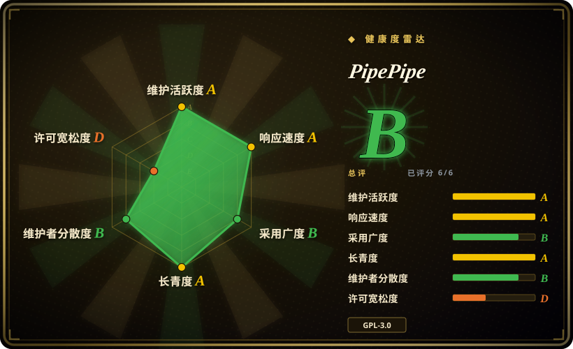
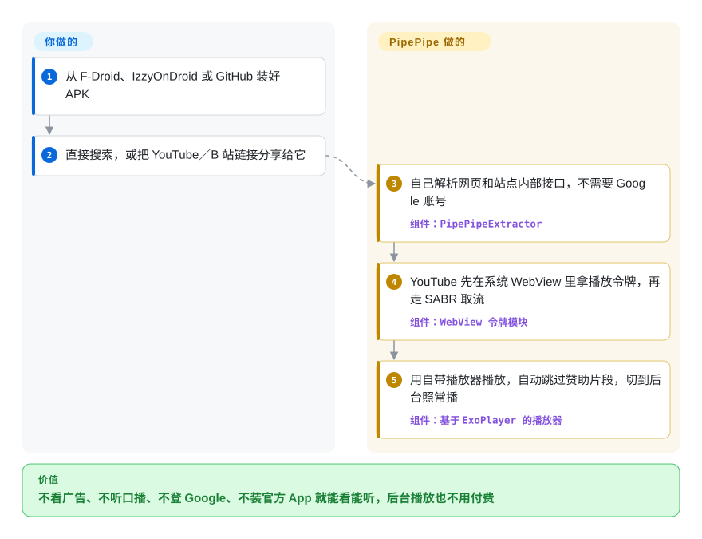

# PipePipe

在安卓手机上用官方 YouTube App：片头先放广告，一锁屏声音就停（除非买 Premium），想记住订阅得先登 Google 账号，视频里博主念的赞助口播照样一秒不少。PipePipe 是一个免费的安卓 App，自己去读 YouTube（还有 B 站、NicoNico、SoundCloud、PeerTube、Bandcamp、media.ccc.de）的内容，用自带播放器播放、自动跳过赞助片段、默认支持后台播放，订阅列表只存在你手机里。

## 何时使用

你在安卓手机上大量刷 YouTube，偶尔也看 B 站或 NicoNico。你受够了跳不过的片头广告，受够了听播客时切去地图就弹出 `Premium required`，也受够了视频中间那一分钟“本视频由某某赞助”——那是视频本身的一部分，任何广告拦截器都管不到。你也不想让观看记录挂在自己的 Google 账号上。最先想到的是 NewPipe，但 NewPipe 不跳赞助片段、不显示点踩数，也不支持 B 站和 NicoNico。

这时选 PipePipe：它保留了 **NewPipe 的做法——不要 Google 账号、不要 Play 服务、App 直接和网站对话——再补上 NewPipe 不打算做的那些功能**：SponsorBlock 自动跳过（YouTube 和 B 站）、Return YouTube Dislike 点踩数、把直播聊天画成弹幕、按关键词和频道过滤（还能屏蔽 Shorts 和付费视频）、手势操作、睡眠定时，以及一个只在你允许的场景才会用到的 Cookie 登录。它从 2022 年初起就是 NewPipe 的**硬分叉**，YouTube 那部分代码自己维护，修复按自己的节奏发——2026 年 YouTube 推 SABR 时，它几天内就发了应对版本。和 LibreTube 比，决定性的差别是 PipePipe 从你手机直连 YouTube，而不是经过 Piped 代理服务器；和 Grayjay 比，差别是它用 GPL，而不是 FUTO 的“源码优先”许可。

## 怎么用起来

PipePipe 分两块。**提取器**（PipePipeExtractor，从 NewPipe 继承来的 Java 库）是一组按网站分开的“读取器”：对每个服务，它去抓网页或者该站点自己的内部 JSON 接口——也就是官方网站本身在调的那些请求——整理成视频流、评论和相关推荐，所以不需要账号，也不需要官方 API 密钥。**客户端**（PipePipeClient，安卓 App）拿到这些视频流，用基于 ExoPlayer 的播放器播放，再从社区服务器取来 SponsorBlock 片段和点踩数据，订阅、播放列表和历史记录都存在手机上的数据库里。YouTube 是最难的：它现在用 SABR 推流——一种自有协议，只把切成小段的视频发给能证明自己是真浏览器的客户端——所以 PipePipe 在安卓系统自带的 WebView（App 可以内嵌的系统浏览器内核）里跑一遍 YouTube 的校验脚本，换来这份证明，就像进门前先在门口领一张盖了章的票。看什么、开哪些附加功能由你决定；抓取、换令牌、播放和跳过片段由 PipePipe 完成。你装 App 的这个 GitHub 仓库只是个外壳：代码在两个子模块里，发布物是 APK。

<!-- flow-steps:begin (generated from flows/pipepipe.json by tools/flow_card.py — do not edit) -->

流程文字版

1. **你**：从 F-Droid、IzzyOnDroid 或 GitHub 装好 APK
2. **你**：直接搜索，或把 YouTube／B 站链接分享给它
3. **PipePipe**：自己解析网页和站点内部接口，不需要 Google 账号 — 组件：`PipePipeExtractor`
4. **PipePipe**：YouTube 先在系统 WebView 里拿播放令牌，再走 SABR 取流 — 组件：`WebView 令牌模块`
5. **PipePipe**：用自带播放器播放，自动跳过赞助片段，切到后台照常播 — 组件：`基于 ExoPlayer 的播放器`

**价值**：不看广告、不听口播、不登 Google、不装官方 App 就能看能听，后台播放也不用付费

<!-- flow-steps:end -->

## 何时不用

- **你用的不是安卓手机。** 只有安卓版（最低 Android 6.0），没有 iOS、桌面或网页版。安卓电视盒子上用 SmartTube，它是为遥控器设计的；电脑上用 FreeTube 这类桌面客户端，或者浏览器加扩展。
- **播放一天都不能断。** 一切都建立在读取 YouTube 网页和内部接口上，而 YouTube 会不打招呼地改，还会主动设防。2026 年 5 月 YouTube 强推 SABR，播放直接失败（issue #2330，四天后在 5.1.1 修好），7 月又开了一个 SABR 问题帖（#2638）。系统 WebView 低于 80 版的设备完全放不了 YouTube。如果断一天都不能接受，就在官方 App 里买 YouTube Premium。
- **你想一个 App 看遍很多平台，或者要的平台它没有。** README 明确说不接受新增服务的请求。Grayjay 通过插件覆盖的平台多得多（但许可是源码可见、非 OSI）；只缺一个站点的话，自己 fork 提取器。
- **你要多台设备同步片库。** 订阅、播放列表和历史都存在 App 本地数据库里，换设备只能手动导出导入。LibreTube 可以借助可选的 Piped 账号同步。
- **你只要文件，不要播放器。** 下载、归档、写脚本批量处理，用 [yt-dlp](../media-download/yt-dlp.zh.md)；PipePipe 的下载功能是手机 App 里的便利功能，没法批量或自动化。
- **你需要一个有团队、有清晰上游的项目。** PipePipe 几乎全由一个人写，bug 模板还要求报告者认可“特定设备或特定网络条件下的问题不会修复”。想要多人维护、流程成熟的项目，就用 NewPipe 本体，接受它更少的功能。
- **你打算用主力 Google 账号登录。** 可选的登录会把你的 YouTube Cookie 交给第三方客户端，这不在 YouTube 条款允许的范围内；会不会因此影响账号，没有公开说明。要么不登录使用，要么把跟账号绑定的内容留在官方 App 里看。

## 横向对比

| 替代品 | 是否收录 | 我们的评价 | 取舍 |
|---|---|---|---|
| NewPipe（`TeamNewPipe/NewPipe`） | 未收录 | 想要原版项目、多人团队和更保守的功能策略，选 NewPipe；更看重 SponsorBlock、点踩数、B 站／NicoNico 和过滤功能而不是治理结构时，选 PipePipe。 | NewPipe 有十年历史（2015 年起）、约 3.98 万星，但没有这些附加功能；PipePipe 把它们加上了，代价是单人维护的硬分叉，也不再接收 NewPipe 的修复。本批次（tab-intake）未收录。 |
| LibreTube（`libre-tube/LibreTube`） | 未收录 | 想要 Material 3 风格、可选账号同步的 YouTube 客户端，选 LibreTube；想让手机直连 YouTube、同时还看 B 站或 NicoNico，选 PipePipe。 | LibreTube 的账号和同步功能依赖 Piped（一种代理前端），可用性也受 Piped 实例影响；PipePipe 中间没有服务器，但也没有同步。本批次（tab-intake）未收录。 |
| Grayjay（`futo-org/grayjay-android`） | 未收录 | 在很多平台追创作者、想要一个统一信息流，选 Grayjay；一个 GPL 许可、主打 YouTube 和 B 站的客户端就够用时，选 PipePipe。 | Grayjay 的插件体系覆盖更多平台，背后有出资公司 FUTO，但它的 Source First License 不是开源许可；PipePipe 是 GPL-3.0，服务少一些。本批次（tab-intake）未收录。 |
| SmartTube（`yuliskov/SmartTube`） | 未收录 | 在安卓电视或 Fire TV 盒子上，选 SmartTube；在手机上选 PipePipe——SmartTube 自己说不支持手机和平板。 | SmartTube 为电视优化、带 SponsorBlock，约 3.4 万星；PipePipe 在清单里把电视支持标为可选，但界面是为触屏设计的。本批次（tab-intake）未收录。 |
| Tubular（`polymorphicshade/Tubular`） | 未收录 | 不要从 Tubular 起步：仓库已归档，README 直接把用户指向 PipePipe；只把它当作“在 NewPipe 上加 SponsorBlock”这种做法的参考。 | Tubular 紧跟 NewPipe 上游并加了 SponsorBlock 和点踩数；已停止维护，YouTube 再出问题不会有人修。本批次（tab-intake）未收录。 |

## 技术栈

- **客户端 App：** Java 和 Kotlin 写的安卓 App（PipePipeClient，从 NewPipe 分叉），`compileSdk` 37、`targetSdk` 36、`minSdk` 23；播放用 ExoPlayer 2 加媒体会话扩展；本地数据库用 Room；RxJava 3；OkHttp 5；jsoup；崩溃报告用 ACRA，由用户自己决定是否发送
- **提取器：** 纯 Java 库（PipePipeExtractor），按服务分别实现 YouTube、B 站、NicoNico、SoundCloud、PeerTube、Bandcamp、media.ccc.de 的读取；带 SponsorBlock 和 Return YouTube Dislike 辅助模块；支持 YouTube SABR
- **YouTube 校验：** 内置一段 JavaScript（`sabr_po_token.js`），在安卓系统 WebView 里执行，换取 SABR 要求的来源证明令牌
- **仓库形态：** `InfinityLoop1308/PipePipe` 仓库里只有 README、fastlane 元数据、翻译说明和一个同步到 Codeberg 的 `release.sh`；代码在两个 git 子模块里（所以 GitHub 把这个仓库的语言标成 Shell）
- **分发：** GitHub Releases 上按 CPU 架构分开的 APK，外加 F-Droid 和 IzzyOnDroid，包名 `InfinityLoop1309.NewPipeEnhanced`

## 依赖

- **一台 Android 6.0 以上的设备。** 清单里声明了 Android TV 和 Android Auto，但界面面向手机。
- **Android System WebView 80 以上并保持更新**，YouTube 播放要用（WebView 启动失败会表现为播放错误，见 issue #2961）。
- **能访问你要看的各个网站**（YouTube、B 站……），开了相应功能的话还要能访问 SponsorBlock 和 Return YouTube Dislike 的社区服务器。不需要 Google Play 服务、不需要 Google 账号，也不需要自己的服务器。
- **可选：** 每个服务一个登录 Cookie，只用于你在“Cookie Functions”里打开的功能（YouTube 只在获取播放流时使用）。
- **自己编译：** 需要 Android SDK／Gradle，并拉取子模块。

## 运维难度

**低**——侧载一个 APK，或者从 F-Droid／IzzyOnDroid 安装即可。持续的成本在于跟版本：YouTube 一改，修复就以新版本的形式出来，常常先出 beta，所以更新得勤（2026 年大约一两周一次），偶尔还要切换 YouTube 接口类型或升级 WebView 才能恢复播放。F-Droid 可能落后于 GitHub（2026-09-28 时 F-Droid 上是 5.3.1，GitHub 已是 5.4.0），2025 年 F-Droid 构建还坏了将近一年（issue #673），所以想尽快拿到修复的用户多从 GitHub 或 IzzyOnDroid 装。没有任何需要自托管的东西。

## 健康度与可持续性

- **维护（2026-09-28）：** 非常活跃——自 2022-05-11 起 GitHub 上共 149 个发布（含 beta），v5.4.0 发于 2026-09-24，2026 年 8 月和 9 月各至少四个发布（含 beta）。YouTube 出问题通常几天内处理，而不是几周。
- **治理与巴士系数：** 单人维护（`InfinityLoop1308`），路线图由这一位维护者掌握——外壳仓库约 107 次提交里有 100 次出自该账号，两个子模块里也是头号贡献者。外部帮助零星（`Priveetee` 做了 SABR 研究并维护社区 wiki）。维护者一停，项目就停；Tubular 在 2026 年停更，说明单人分叉结束起来有多快。
- **背后支持与 Lindy：** 没有公司或基金会，靠 Ko-fi 和 Liberapay 捐赠。分叉约 4.4 年、仍然活跃，代码血统可追溯到 NewPipe（2015 年）——Lindy 先验中等，但要因单人维护、以及上游（YouTube）随时可能抬高“活下去”的成本而打折扣。
- **采用度：** 约 6.7k 星、226 个 fork；所有发布的 GitHub 附件累计下载约 360 万次（不含 F-Droid 和 IzzyOnDroid 的安装）。已归档的 Tubular 把用户指向 PipePipe。
- **风险信号：** GPL-3.0（个人使用没问题，fork 必须保持 GPL）。播放依赖抓取一个主动抵制第三方客户端的服务。维护者不接受新增服务请求，也不修特定设备或网络的问题。F-Droid 分发有滞后。

## 存疑（未验证）

- **登录的账号风险：** 在 PipePipe 里使用 YouTube Cookie 是否会导致账号被标记，YouTube 和项目方都没有说明。`[未验证：无公开的官方说明或可复现案例]`
- **SABR 与 WebView 机制**是根据客户端源码文件名（`sabr_po_token.js`、`LocalDomPoTokenProvider.kt`、`SharedWebViewRuntime.java`）和维护者在 issue 里的说明描述的，没有实际运行 App 验证。`[推断]`
- **不支持跨设备同步**是根据从 NewPipe 继承的本地 Room 数据库、以及 README 没有同步功能推断的，没有在 App 设置里核对。`[推断]`
- **下载总数**（约 360 万）是 2026-09-28 把 GitHub 发布附件下载数相加得到的，含 beta 和重复下载，不等于用户数。`[推断]`
- **Android TV／Android Auto 的可用程度：** 清单声明了 leanback（可选）和车机描述文件，实际好不好用没有测试。`[未验证：未在电视或车机上运行]`
- **健康度雷达的范围：** 机器评分只读外壳仓库；它的治理档（近 12 个月头号贡献者约占 40% 提交）看不到两个代码子模块，而维护者在子模块里占绝对多数，所以这一档很可能高估了维护的分散程度。`[推断]`
- **竞品事实**（NewPipe 没有 SponsorBlock、LibreTube 依赖 Piped、SmartTube 不支持手机、Grayjay 用 Source First License、Tubular 已归档）取自 2026-09-28 它们的 README、LICENSE 和 GitHub 元数据，没有实际运行。`[推断]`
