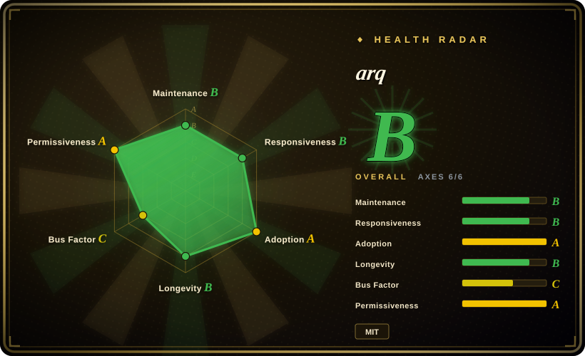
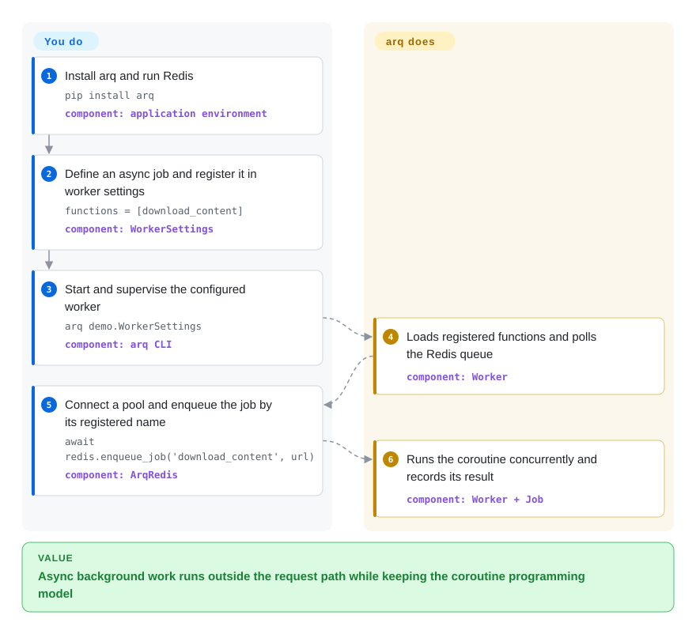

# arq

An asyncio-native Python job queue that sends named coroutine calls through Redis to concurrently executing workers.

## When to use

You are building an asyncio-first Python service, already operate Redis, and need to move network-heavy work out of the request path without translating coroutine code into a synchronous worker model. Choose arq when sharing the event-loop programming model between producer and worker matters more than RQ's broader maintenance activity or Celery's broker choice and larger routing ecosystem.

It fits compact services whose jobs are naturally async and can tolerate at-least-once execution. The decisive gain is concurrent coroutine execution without one process per job; the cost is Redis lock-in, named-function registration, and a project whose maintainers explicitly limit work to critical security fixes.

## How it works

You define async job functions, register them in a `WorkerSettings` class, and run that settings class with the arq CLI. Producer code opens an arq Redis pool and enqueues a function by its registered name rather than importing and calling the worker function directly. arq serializes the job into Redis; a worker polls the queue, runs multiple jobs as asyncio tasks, and stores status and results. You own Redis, idempotent job behavior, worker supervision, and compatible producer/worker naming; arq owns queue bookkeeping, retries, deferred or cron scheduling, health records, and async task execution.

<!-- flow-steps:begin (generated from flows/arq.json by tools/flow_card.py — do not edit) -->

Text version of the flow

1. **You**: Install arq and run Redis — `pip install arq` — component: `application environment`
2. **You**: Define an async job and register it in worker settings — `functions = [download_content]` — component: `WorkerSettings`
3. **You**: Start and supervise the configured worker — `arq demo.WorkerSettings` — component: `arq CLI`
4. **arq**: Loads registered functions and polls the Redis queue — component: `Worker`
5. **You**: Connect a pool and enqueue the job by its registered name — `await redis.enqueue_job('download_content', url)` — component: `ArqRedis`
6. **arq**: Runs the coroutine concurrently and records its result — component: `Worker + Job`

**Value**: Async background work runs outside the request path while keeping the coroutine programming model

<!-- flow-steps:end -->

## When NOT to use

- **You want an actively developed Redis-only queue for mostly synchronous Python functions.** Choose [RQ](rq.md), because arq is maintenance-only and its main advantage depends on an asyncio-native workload.
- **You need RabbitMQ, broker portability, complex routing, or workflow composition.** Choose [Celery](celery.md), because arq is coupled to Redis and deliberately exposes a smaller task-processing surface.
- **Your jobs cannot safely run more than once.** Choose a design with application-level deduplication or a durable workflow engine rather than arq, because a cancelled job remains queued and may execute again after a worker restart.
- **You need a compact Python worker library but cannot standardize on Redis.** Choose Dramatiq, which supports RabbitMQ and Redis brokers; arq requires Redis.
- **You need a centrally managed cross-language scheduler with a built-in operational console.** Choose PowerJob rather than arq; arq is a Python library and CLI, not an enterprise scheduling control plane.
- **Untrusted producers can write queue payloads.** Isolate and authenticate Redis or use a safer serializer and threat model, because arq uses Python `pickle` by default and deserializing malicious payloads can execute code.

## Comparison

| Alternative | In index | Our verdict | Tradeoff |
|---|---|---|---|
| [RQ](rq.md) | ✅ | Choose arq when an asyncio service needs concurrent coroutine jobs in each worker; choose RQ for ordinary synchronous callables and a project with active feature maintenance. | arq aligns producer and worker code with asyncio, while RQ offers a more actively maintained and established Redis/Valkey queue model. |
| [Celery](celery.md) | ✅ | Choose arq for a compact Redis-backed asyncio service; choose Celery when broker choice, routing, task composition, and ecosystem breadth justify higher operational and configuration complexity. | arq removes broker abstraction and much of Celery's surface, but also gives up that portability and control depth. |
| [Dramatiq](dramatiq.md) | ✅ | Choose Dramatiq when a smaller-than-Celery Python processor still needs RabbitMQ or Redis; choose arq when coroutine-native execution on Redis is the deciding requirement. | Dramatiq adds broker choice and an actor model; arq stays Redis-only and centers asyncio jobs. |
| [PowerJob](powerjob.md) | ✅ | Choose PowerJob for centrally administered, cross-language distributed scheduling; choose arq when a Python service should own a small asyncio worker beside its application code. | PowerJob adds a server, console, and broader scheduling control plane; arq keeps deployment smaller but leaves operations and visibility to your stack. |

## Tech stack

- **Language and packaging:** Python 3.9+ packaged with Hatchling; the repository is predominantly Python and ships type information.
- **Async model:** asyncio drives producer calls and concurrent worker tasks; blocking functions must be moved to a thread or process executor.
- **Queue and state:** Redis stores queued jobs, results, uniqueness keys, health records, retries, and deferred or cron work.
- **Interface:** Python APIs provide pools, jobs, retry and cron primitives; a Click-based `arq` CLI starts workers and checks worker health.
- **Serialization:** Python `pickle` is the default, with matching custom serializer/deserializer functions supported on producers and workers.

## Dependencies

- **Required infrastructure:** a Redis server reachable by producers and workers; arq does not bundle it.
- **Required runtime:** Python 3.9+ and the `arq` package on producer and worker environments.
- **Required processes:** one or more supervised arq worker processes, each configured through an importable `WorkerSettings` class.
- **Package dependencies:** `redis[hiredis]>=4.2.0,<6` and `click>=8.0`; file watching is an optional `watchfiles>=0.16` extra, as declared in `pyproject.toml` on 2026-09-22.

## Ops difficulty

**Medium.** The basic topology is only Redis plus producer and worker processes, but production operation must cover Redis durability and access control, worker lifecycle and health checks, queue and failure monitoring, compatible registered names and serializers across deployments, and idempotency for jobs that may run again after cancellation. Async concurrency reduces process count for I/O-heavy work, but blocking jobs require explicit executor isolation.

## Health & viability

- **Maintenance:** Grade B — the last commit was 159 days before scoring, with no active weeks in the latest 13-week window; the mature-library Lindy carve-out lifts the raw C signal, but the README and issue #510 explicitly declare maintenance-only mode.
- **Responsiveness:** Grade B — median first response was 0.0 hours across 3 qualifying pull requests in the measured window.
- **Adoption:** Grade A — the snapshot measured 3,910,883 monthly PyPI downloads and 83 dependent repositories; GitHub also reported 3,014 stars on 2026-09-22.
- **Longevity:** Grade B — the repository was 3,714 days old with its last commit 159 days before scoring; that age-plus-release history is a positive Lindy signal, tempered by the maintenance-only policy. [推断]
- **Governance:** Grade C — 4 maintainers were active in the measured 12-month window, with the top contributor accounting for 72.7% and the top three for 90.9% of contributions. The maintenance notice says the Pydantic team and original maintainer lack time for significant work.
- **Risk / License:** Grade A — GitHub, `LICENSE`, and `pyproject.toml` identify MIT, with no relicense detected in the measured 36-month window; the default `pickle` serializer remains a trust boundary.

## Caveats (unverified)

- [推断] “Medium” operations difficulty is an architectural judgment from the required Redis, worker supervision, deployment compatibility, monitoring, and idempotency work, not a measured benchmark.
- [推断] The Lindy verdict combines repository age and recent compatibility releases; it is a selection prior, not a prediction of future maintenance.
