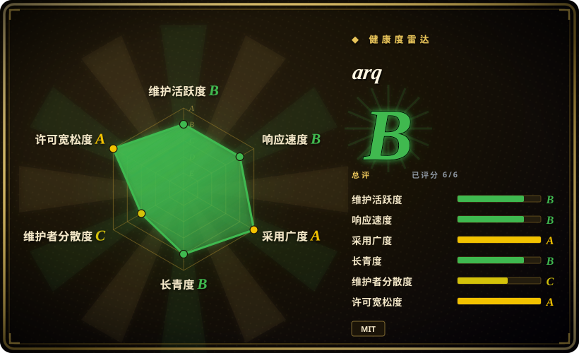
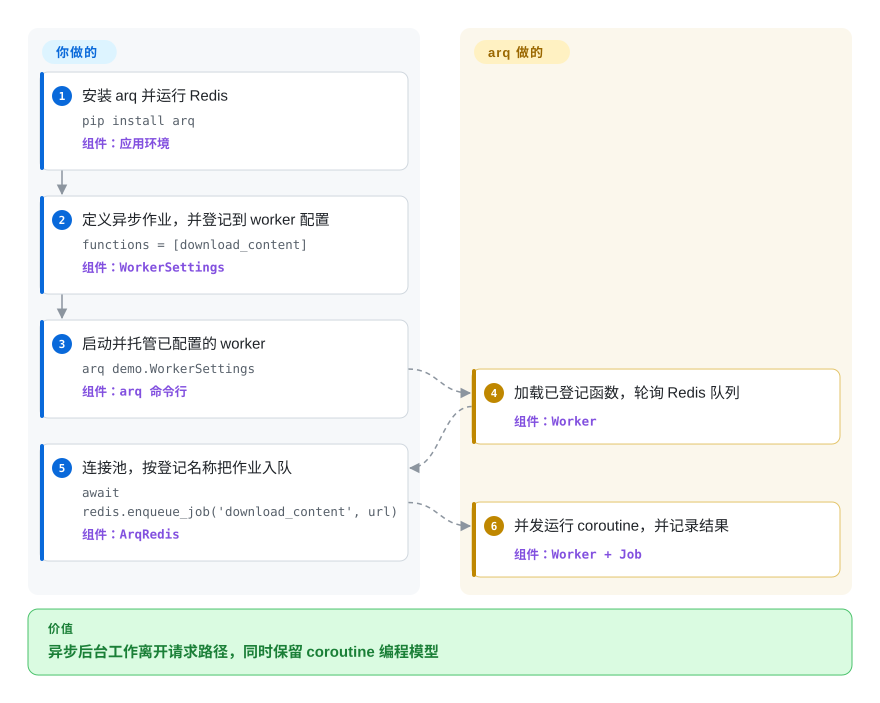

# arq

一个 asyncio-native Python 作业队列：通过 Redis 发送具名 coroutine 调用，再由 worker 并发执行。

## 何时使用

你正在构建 asyncio-first Python 服务，已经运行 Redis，又需要把网络 I/O 密集工作移出请求路径，同时不想把 coroutine 代码改写成同步 worker 模型。当生产端与 worker 共用事件循环编程模型，比 RQ 更活跃的维护状态或 Celery 的 broker 选择和更大路由生态更重要时，选 arq。

它适合小型服务：作业天然异步，并且能够承受至少一次执行语义。决定性收益是无需为每项作业创建一个进程即可并发执行 coroutine；代价是绑定 Redis、按名称注册函数，而且维护者已明确只处理关键安全问题。

## 怎么用起来

你定义异步作业函数，把它们登记在 `WorkerSettings` 类中，再用 arq CLI 运行该配置类。生产端代码打开 arq Redis 连接池，按登记名称把函数入队，而不是导入并直接调用 worker 函数。arq 将作业序列化进 Redis；worker 轮询队列，以 asyncio task 并发运行多项作业，再保存状态与结果。Redis、作业幂等性、worker 托管以及生产端和 worker 的名称兼容由你负责；队列账目、重试、延迟或 cron 调度、健康记录和异步 task 执行由 arq 负责。

<!-- flow-steps:begin (generated from flows/arq.json by tools/flow_card.py — do not edit) -->

流程文字版

1. **你**：安装 arq 并运行 Redis — `pip install arq` — 组件：`应用环境`
2. **你**：定义异步作业，并登记到 worker 配置 — `functions = [download_content]` — 组件：`WorkerSettings`
3. **你**：启动并托管已配置的 worker — `arq demo.WorkerSettings` — 组件：`arq 命令行`
4. **arq**：加载已登记函数，轮询 Redis 队列 — 组件：`Worker`
5. **你**：连接池，按登记名称把作业入队 — `await redis.enqueue_job('download_content', url)` — 组件：`ArqRedis`
6. **arq**：并发运行 coroutine，并记录结果 — 组件：`Worker + Job`

**价值**：异步后台工作离开请求路径，同时保留 coroutine 编程模型

<!-- flow-steps:end -->

## 何时不用

- **你想为大多为同步函数的 Python 作业选一个仍活跃开发的 Redis-only 队列。** 选 [RQ](rq.zh.md)；arq 已进入 maintenance-only 模式，其主要优势也依赖 asyncio-native 工作负载。
- **你需要 RabbitMQ、broker 可移植性、复杂路由或任务组合。** 选 [Celery](celery.zh.md)；arq 绑定 Redis，并有意维持更小的任务处理表面。
- **你的作业不能安全地重复运行。** 选带应用级去重的设计或耐久工作流引擎；arq 中被取消的作业仍留在队列里，worker 重启后可能再次执行。
- **你需要紧凑的 Python worker library，但不能统一使用 Redis。** 选同时支持 RabbitMQ 与 Redis broker 的 Dramatiq；arq 必须使用 Redis。
- **你需要带内置运维控制台的跨语言集中调度。** 选 PowerJob；arq 是 Python library 与 CLI，并非企业调度控制面。
- **不受信任的生产端能写入队列载荷。** 隔离并鉴权 Redis，或采用更安全的 serializer 与威胁模型；arq 默认使用 Python `pickle`，反序列化恶意载荷可能执行代码。

## 横向对比

| 替代品 | 是否收录 | 我们的评价 | 取舍 |
|---|---|---|---|
| [RQ](rq.zh.md) | ✅ | asyncio 服务需要每个 worker 并发运行 coroutine 作业时选 arq；普通同步 callable 或重视活跃功能维护时选 RQ。 | arq 让生产端和 worker 都贴合 asyncio；RQ 提供维护更活跃、历史更成熟的 Redis/Valkey 队列模型。 |
| [Celery](celery.zh.md) | ✅ | 紧凑的 Redis-backed asyncio 服务选 arq；当 broker 选择、路由、任务组合和生态广度值得更高运维与配置复杂度时选 Celery。 | arq 去掉 broker 抽象和 Celery 的大量表面，同时也放弃了对应的可移植性与控制深度。 |
| [Dramatiq](dramatiq.zh.md) | ✅ | 比 Celery 更小的 Python 处理器仍需选择 RabbitMQ 或 Redis 时选 Dramatiq；coroutine-native Redis 执行是决定性需求时选 arq。 | Dramatiq 增加 broker 选择与 actor 模型；arq 只用 Redis，并以 asyncio 作业为中心。 |
| [PowerJob](powerjob.zh.md) | ✅ | 需要集中管理的跨语言分布式调度时选 PowerJob；Python 服务要在应用代码旁运行小型 asyncio worker 时选 arq。 | PowerJob 增加 server、console 与更广的调度控制面；arq 部署更小，但运维和可见性由你的技术栈承担。 |

## 技术栈

- **语言与打包：** Python 3.9+，使用 Hatchling 打包；仓库以 Python 为主，并附带类型信息。
- **异步模型：** asyncio 驱动生产端调用与 worker 并发 task；阻塞函数必须移入线程或进程 executor。
- **队列与状态：** Redis 保存排队作业、结果、唯一性 key、健康记录、重试以及延迟或 cron 工作。
- **接口：** Python API 提供连接池、作业、重试和 cron 原语；基于 Click 的 `arq` CLI 启动 worker 并检查健康状态。
- **序列化：** 默认使用 Python `pickle`；生产端和 worker 也可配置相互匹配的自定义 serializer 与 deserializer。

## 依赖

- **必需基础设施：** 生产端与 worker 都能访问的 Redis server；arq 不附带 Redis。
- **必需运行时：** 生产端与 worker 环境中的 Python 3.9+ 和 `arq` 包。
- **必需进程：** 一个或多个受托管的 arq worker 进程，每个进程通过可导入的 `WorkerSettings` 类配置。
- **包依赖：** 截至 2026-09-22，`pyproject.toml` 声明 `redis[hiredis]>=4.2.0,<6` 与 `click>=8.0`；文件监视是可选的 `watchfiles>=0.16` extra。

## 运维难度

**中。** 基础拓扑只有 Redis、生产端与 worker 进程，但生产环境还要处理 Redis 持久化和访问控制、worker 生命周期与健康检查、队列和失败监控、不同部署间登记名称与 serializer 的兼容，以及可能重复运行作业的幂等性。异步并发能减少 I/O 密集工作所需进程数，但阻塞作业需要显式移入 executor 隔离。

## 健康度与可持续性

- **维护：** Grade B——最近一次提交距评分 159 天，最近 13 周没有活跃周；成熟 library 的 Lindy carve-out 把原始 C 信号提升，但 README 与 issue #510 明确声明 maintenance-only 模式。
- **响应速度：** Grade B——评分快照中，3 个 qualifying pull requests 的中位首次响应时间为 0.0 小时。
- **采用广度：** Grade A——评分快照测得 PyPI 月下载量 3,910,883，依赖仓库数 83；GitHub 在 2026-09-22 另显示 3,014 stars。
- **长青度：** Grade B——仓库已创建 3,714 天，最近一次提交距评分 159 天；年龄与发版历史构成正向 Lindy 信号，但 maintenance-only 政策削弱了它。[推断]
- **治理集中度：** Grade C——评分所测 12 个月窗口有 4 名活跃维护者，头部一人占贡献的 72.7%，前三人占 90.9%。维护声明同时说明 Pydantic 团队和原维护者没有时间投入大量工作。
- **许可风险：** Grade A——GitHub、`LICENSE` 与 `pyproject.toml` 均标识 MIT，所测 36 个月窗口没有发现换证；默认 `pickle` serializer 仍是信任边界。

## 存疑（未验证）

- [推断]“中”等运维难度来自 Redis、worker 托管、部署兼容、监控与幂等性工作的架构判断，并非实测基准。
- [推断] Lindy 判断结合了仓库年龄与近期兼容性发布；它是选型先验，不是对未来维护的预测。
