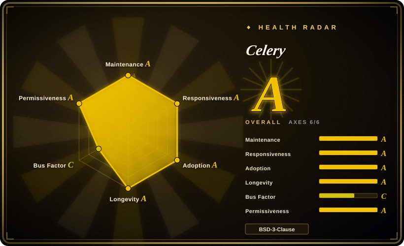
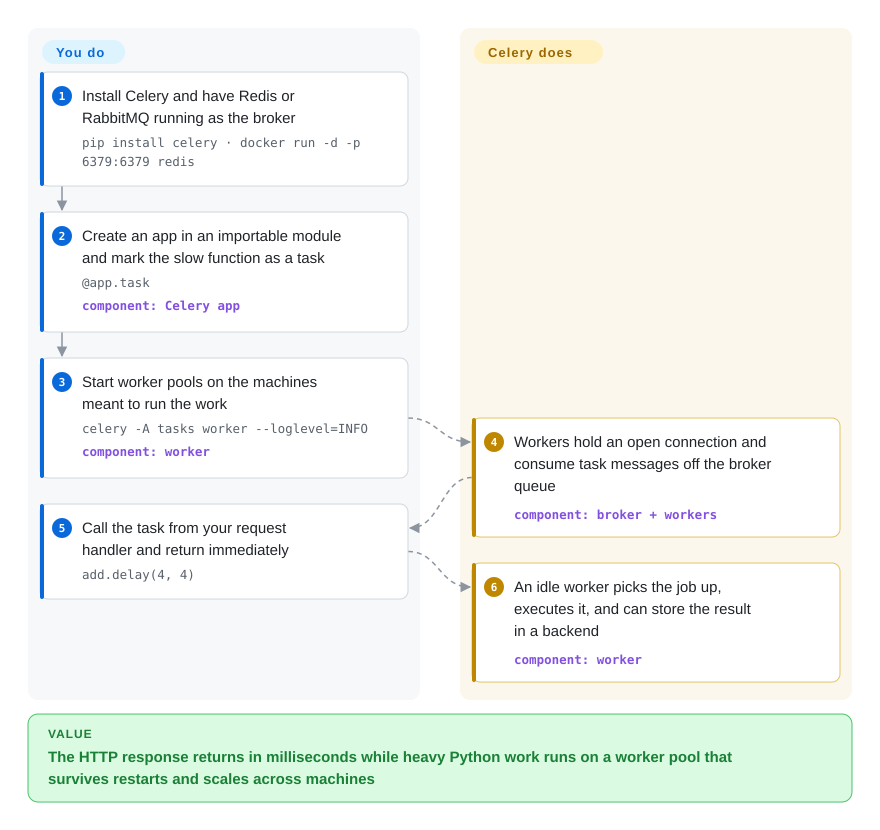

# Celery

The de-facto Python distributed task queue: hand off asynchronous and background jobs to a pool of workers over a message broker (RabbitMQ/Redis), with retries, scheduling (beat), routing, and an optional result backend.

## When to use

You're building a Python web app — Django or FastAPI — and your request handlers are starting to do too much. Sending the welcome email, generating the PDF invoice, transcoding the upload, calling three slow third-party APIs: all of it is blocking the HTTP response and your p99 is climbing. You don't want users staring at a spinner while a 20-second job runs inline, and you can't just spawn threads because you need the work to survive a process restart and scale across machines. You reach for Celery: you decorate the slow function as a `@app.task`, call `process_upload.delay(upload_id)` from the view, and the request returns immediately. A separate pool of Celery workers — on the same box or a fleet of them — pulls the job off RabbitMQ or Redis and runs it, retrying with backoff if the third-party API times out.

As the app grows you lean on the rest of the framework: `beat` for cron-like periodic tasks (nightly reports, cache warmups), routing so heavy GPU jobs go to a dedicated queue and worker pool, `chain`/`group`/`chord` canvas primitives to fan out and join work, rate limiting, and a result backend (Redis/DB) when a caller actually needs the return value. It's the boring, proven default for "run this Python work later, elsewhere, reliably" — and the surrounding ecosystem (Flower for monitoring, Django integration, mature broker support) means you're rarely the first to hit a problem.

## How it works

Celery splits "what to run" from "when to run it". You attach Python functions to an *app* object (the `celery -A tasks` in the worker command refers to that module); calling `task.delay(...)` executes nothing in your process — it serializes the call into a message and publishes it onto a queue in your broker (the message-queue service, RabbitMQ or Redis, that you run separately). The other half is the **worker** process you start: workers keep long-lived connections to the broker, pull messages when a slot frees up, deserialize and execute them, and if configured retry on failure with exponential backoff (doubling the wait between attempts). `beat` is another process you run, which just turns periodic tasks into ordinary queued calls at the scheduled moment. What stays yours: operating the broker, supervising and scaling workers, and making tasks idempotent — delivery is at-least-once, so a task can run twice after a crash or redelivery. The transport plumbing underneath (connection pooling, reconnection, serialization) is `kombu`'s job, and the local process pool is `billiard`'s — you configure both, you don't write either.

<!-- flow-steps:begin (generated from flows/celery.json by tools/flow_card.py — do not edit) -->

Text version of the flow

1. **You**: Install Celery and have Redis or RabbitMQ running as the broker — `pip install celery · docker run -d -p 6379:6379 redis`
2. **You**: Create an app in an importable module and mark the slow function as a task — `@app.task` — component: `Celery app`
3. **You**: Start worker pools on the machines meant to run the work — `celery -A tasks worker --loglevel=INFO` — component: `worker`
4. **Celery**: Workers hold an open connection and consume task messages off the broker queue — component: `broker + workers`
5. **You**: Call the task from your request handler and return immediately — `add.delay(4, 4)`
6. **Celery**: An idle worker picks the job up, executes it, and can store the result in a backend — component: `worker`

**Value**: The HTTP response returns in milliseconds while heavy Python work runs on a worker pool that survives restarts and scales across machines

<!-- flow-steps:end -->

## When NOT to use

- **Your jobs are simple and your scale is modest.** Celery carries real operational weight — a broker *plus* worker processes *plus* (often) a result backend, plus the failure modes of all three. For a single app that just needs a few background jobs, lighter task queues like **RQ**, **Dramatiq**, or **arq** are far less to stand up and reason about.
- **You need a data-pipeline / DAG orchestrator.** Celery runs independent tasks; it is not built to express "step B runs after A succeeds, then C and D in parallel, backfill last Tuesday, show me the DAG." For scheduled multi-step data workflows with dependencies and lineage, use [Airflow](../workflow-orchestration/airflow.md) (or Prefect/Dagster).
- **You're not on Python.** Celery is a Python framework. A JVM/Spring shop wanting a managed, dashboard-driven scheduler should look at [XXL-JOB](xxl-job.md); other ecosystems have their own (Sidekiq for Ruby, BullMQ for Node).
- **You need exactly-once or strict ordering guarantees.** Celery is at-least-once by default — tasks can run more than once (redelivery, visibility timeouts), so your tasks must be idempotent. If you need strong delivery/ordering semantics, that's a broker/stream design problem, not something Celery hands you for free. [推断]
- **You want deep visibility out of the box.** Knowing *why* a task is stuck, lost, or duplicated has historically been a Celery foot-gun — debugging the worker/broker/backend triangle (especially Redis as broker) takes operational maturity. Budget for Flower/metrics and broker-level inspection.

## Comparison

| Alternative | In index | Our verdict | Tradeoff |
|---|---|---|---|
| [RQ (Redis Queue)](rq.md) | ✅ | Choose RQ when Redis-only simplicity matters more than broker choice, routing, scheduling, and throughput tuning. | Dead-simple to run and read, but narrower than Celery's broker/backend and workflow surface. |
| [Dramatiq](dramatiq.md) | ✅ | Choose Dramatiq when you want a modern Python task queue with RabbitMQ/Redis support and fewer Celery-era foot-guns. | Smaller ecosystem and fewer canvas/workflow primitives than Celery. |
| [arq](arq.md) | ✅ | Choose arq when your app is already asyncio-first and a lightweight Redis queue is enough. | Good async ergonomics, but minimal compared with Celery's routing, beat, and canvas. |
| [Airflow](../workflow-orchestration/airflow.md) | ✅ | Choose Airflow when dependency-aware multi-step DAG **workflows**, lineage, backfills, and UI matter more than low-latency task offload. | Data-pipeline orchestration, not a direct background-job queue. |
| [XXL-JOB](xxl-job.md) | ✅ | Choose XXL-JOB when a JVM/Spring distributed scheduler with built-in admin dashboard is the requirement. | The Java-world scheduler answer; not a natural fit for a Python codebase. |
| Sidekiq / BullMQ | 未收录 | Choose Sidekiq or BullMQ when the same background-job problem lives in Ruby or Node instead of Python. | Same problem shape, different language ecosystem. |

## Tech stack

- **Language:** Python — the 5.6.x line runs on CPython 3.9–3.13 and PyPy3.9+; v5.7 (in alpha since 2026-09) drops Python 3.9. Pure-Python framework, no compiled core.
- **Brokers (pluggable transport):** RabbitMQ (AMQP, the reference broker) and Redis are feature-complete per the docs; Amazon SQS and Google Pub/Sub ship with the release, other transports are experimental — verify your transport's feature parity.
- **Result backend (optional):** Redis, databases (SQLAlchemy/Django ORM), AMQP/RPC, memcached, Elasticsearch, Google Cloud Storage and others — only needed when callers consume task return values or states.
- **Core libraries:** `kombu` (messaging/transport abstraction), `billiard` (process pool), `click` (CLI). Scheduling via `celery beat`; monitoring commonly via Flower.
- **Primitives:** tasks, queues/routing, retries, rate limits, and canvas (`chain`, `group`, `chord`, `map`, `chunks`) for composing workflows.

## Dependencies

- **A message broker (required):** you must run RabbitMQ or Redis (or another supported transport). This is the backbone — Celery does not ship one.
- **A result backend (optional):** required only if you need task results/states (Redis or a DB are common). Many fire-and-forget setups skip it.
- **Worker processes:** one or more Celery worker processes (and `beat` if you use periodic tasks) running alongside your app, supervised by systemd/Docker/Kubernetes.
- **Python runtime + the broker client libs** (e.g. `redis`/`amqp` via kombu) installed in your environment.

## Ops difficulty

**Medium-to-high.** A toy setup is easy — `pip install celery`, point it at a local Redis, start a worker. Production is where the weight shows: you're now operating (at least) a broker and a worker fleet as long-running stateful infrastructure, plus often a result backend. You have to supervise and autoscale workers, size prefetch/concurrency, set acks-late and visibility timeouts correctly (especially with Redis as broker, where misconfiguration causes duplicate or lost tasks), watch queue depth and dead/stuck tasks, and roll out worker code without dropping in-flight jobs. The classic pain is observability: when a task vanishes or runs twice, you're debugging across the worker, the broker, and the backend at once. Flower, broker dashboards, and task-level metrics/idempotency are not optional at scale.

## Health & viability

- **Responsiveness**: Grade A — median first-response time 42.3 hours across 21 qualifying issues/PRs.
- **Maintenance (2026-09).** Repo last pushed 2026-09 and shipping on the v5.x line (latest stable v5.6.3, 2026-03; v5.7.0a1 in alpha on the main branch since 2026-09) — **active**, not coasting; not archived.
- **Governance / bus factor.** Owned by the `celery` GitHub **organization** with a broad contributor base over many years rather than a single author — community/volunteer-maintained, not foundation-governed, but funding is no longer zero: the README points to Open Collective sponsors, a Tidelift subscription, and a "Celery now powered by Blacksmith" sponsorship announcement (2026-09). Sustained maintainer bandwidth remains the thing to watch. [推断：Blacksmith 背书对路线图的实际约束力未见公开说明]
- **Age & Lindy verdict.** Created **2009-04** (GitHub `created_at`, 2026-09) and **still actively maintained** ⇒ a **very strong Lindy** signal — one of the longest-lived, most battle-tested task queues in any language, the boring proven default rather than a hyped newcomer. [推断]
- **Adoption & ecosystem.** Ubiquitous in Python: the default background-job framework for Django/Flask/FastAPI stacks, huge real-world deployment base, mature docs, first-class broker support, and an ecosystem (Flower, django-celery-beat/results, integrations). ~28.9k stars (2026-09) and 42,357,772 monthly PyPI downloads are indicative of broad adoption.
- **Risk flags.** No relicense history — **BSD-3-Clause** permissive throughout, now machine-confirmed: the LICENSE body is a single BSD-3 text with a Creative Commons BY-SA 4.0 addendum for `docs/` only, and PyPI metadata corroborates (radar risk_license A, `license_basis: registry`). Main risk is the operational complexity / debuggability discussed above, plus reliance on community maintenance rather than a funded backer. [推断]

## Caveats (unverified)

- [未验证] ~28.9k GitHub stars and latest stable v5.6.3 (2026-03) read from the GitHub/PyPI APIs on 2026-09-28 — star counts and version numbers drift; treat as indicative.
- [推断] Broker/transport feature parity differs (RabbitMQ/Redis feature-complete vs SQS/GCP Pub/Sub and the rest) and shifts release-to-release; confirm your transport supports the features you rely on.
- [推断] At-least-once delivery and the "tasks must be idempotent" / no exactly-once guarantee framing is general distributed-queue reasoning applied to Celery, not a quoted guarantee — and behavior depends on broker + ack/visibility config.
- [推断] "Medium-to-high" ops difficulty and the "visibility foot-gun" framing are judgment from the worker/broker/backend architecture, not a measured benchmark.
