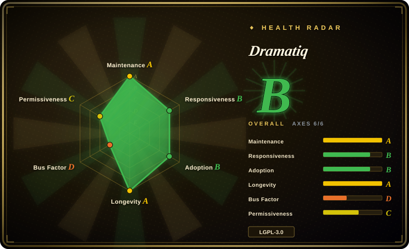
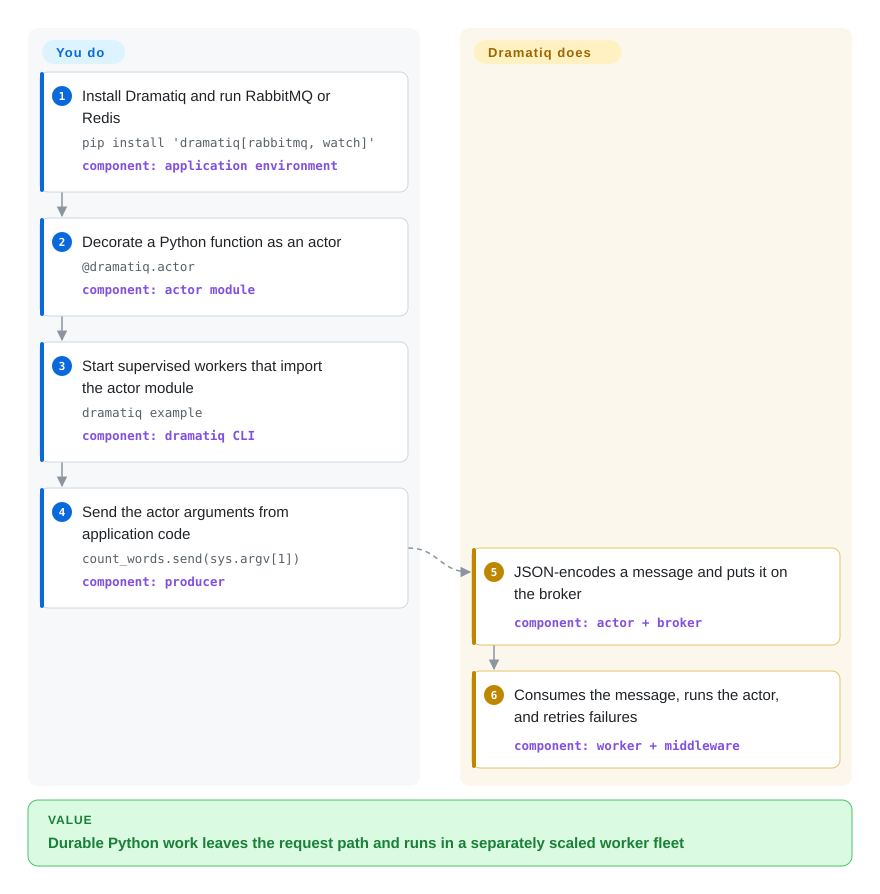

# Dramatiq

A Python distributed task-processing library built around actor functions, RabbitMQ or Redis brokers, worker processes, retries, and middleware.

## When to use

You maintain a Python service whose request path needs to hand off email, media processing, webhook delivery, or other durable background work. You want RabbitMQ or Redis support and automatic retries, but Celery's larger configuration and workflow surface would be excess machinery. Choose Dramatiq when a compact actor-and-middleware model is worth accepting LGPL obligations and a smaller ecosystem.

It is a particularly direct fit when tasks can accept short JSON-encodable messages and be written idempotently. You decorate ordinary functions as actors, send messages from application code, and scale separately supervised worker processes without adopting Celery's full canvas and scheduler stack.

## How it works

You install the extra for RabbitMQ or Redis, configure that broker, and mark Python functions with `@dramatiq.actor`. Calling an actor's `send` method serializes its arguments into a message and puts it on the broker instead of running the function in the caller. Separately supervised Dramatiq workers import the module, consume messages, invoke the matching actor, and use middleware for behavior such as retries, time limits, results, and metrics. You own broker availability, worker deployment, idempotent actor code, and monitoring; Dramatiq owns message dispatch and the worker execution lifecycle.

<!-- flow-steps:begin (generated from flows/dramatiq.json by tools/flow_card.py — do not edit) -->

Text version of the flow

1. **You**: Install Dramatiq and run RabbitMQ or Redis — `pip install 'dramatiq[rabbitmq, watch]'` — component: `application environment`
2. **You**: Decorate a Python function as an actor — `@dramatiq.actor` — component: `actor module`
3. **You**: Start supervised workers that import the actor module — `dramatiq example` — component: `dramatiq CLI`
4. **You**: Send the actor arguments from application code — `count_words.send(sys.argv[1])` — component: `producer`
5. **Dramatiq**: JSON-encodes a message and puts it on the broker — component: `actor + broker`
6. **Dramatiq**: Consumes the message, runs the actor, and retries failures — component: `worker + middleware`

**Value**: Durable Python work leaves the request path and runs in a separately scaled worker fleet

<!-- flow-steps:end -->

## When NOT to use

- **You require permissive dependency terms for a distributed product.** Choose [RQ](rq.md) under BSD-2-Clause or [Celery](celery.md) under BSD-3-Clause: Dramatiq is LGPL-3.0-or-later, not permissive. Conveying a combined work requires LGPL notices and license copies and must preserve the user's ability to replace or relink the library; modifications to Dramatiq remain LGPL-covered and their corresponding source must be available. Vendoring or tightly bundling it does not erase those duties.
- **You need Celery's broader routing, periodic scheduling, canvas, and monitoring ecosystem.** Choose [Celery](celery.md); Dramatiq provides groups and pipelines, but its own cookbook recommends APScheduler for recurring scheduling and external integrations for dashboards and framework glue.
- **You already operate only Redis and want the smallest synchronous queue model.** Choose [RQ](rq.md); Dramatiq earns its extra actor and middleware surface when RabbitMQ choice or its built-in retry and composition model matters.
- **Your service and jobs must be asyncio-native end to end.** Choose [arq](arq.md); Dramatiq can run async actors through optional AsyncIO middleware, but each worker thread still waits for the async actor result, so it is not an asyncio-native concurrency model.
- **You need exactly-once execution or actors cannot be idempotent.** Redesign around transactional outbox or broker-level deduplication rather than choosing Dramatiq: its best-practices guide says a worker failure can deliver the same message multiple times.
- **You need dependency-aware backfills, lineage, and a workflow UI.** Choose [Airflow](../workflow-orchestration/airflow.md); Dramatiq pipelines and groups compose tasks but do not turn the task queue into a data-orchestration control plane.

## Comparison

| Alternative | In index | Our verdict | Tradeoff |
|---|---|---|---|
| [Celery](celery.md) | ✅ | Choose Dramatiq when RabbitMQ/Redis background jobs need a smaller actor-and-middleware surface; choose Celery when its broader routing, periodic scheduling, canvas, and integration ecosystem justify more machinery. | Dramatiq is easier to bound conceptually, while Celery offers a larger operational and extension ecosystem under a permissive license. |
| [RQ](rq.md) | ✅ | Choose Dramatiq when broker choice and automatic actor retries matter; choose RQ when an existing Redis or Valkey deployment and direct enqueueing of ordinary functions are the simpler, permissively licensed fit. | Dramatiq adds RabbitMQ, actors, middleware, and LGPL duties; RQ stays Redis/Valkey-only with a narrower BSD-licensed model. |
| [arq](arq.md) | ✅ | Choose arq for an asyncio-native Redis application; choose Dramatiq when RabbitMQ support, synchronous actors, and optional rather than foundational asyncio are a better match. | arq aligns its worker lifecycle with asyncio but binds transport to Redis; Dramatiq supports two brokers but async actors still occupy worker-thread capacity. |
| [PowerJob](powerjob.md) | ✅ | Choose PowerJob for a Java estate that needs a central scheduling server and web console; choose Dramatiq for code-first background work embedded in a Python service. | PowerJob brings a heavier JVM control plane and scheduling UI; Dramatiq keeps orchestration in Python code and external operations tooling. |

## Tech stack

- **Language and packaging:** Python 3.10+ with setuptools; the repository is predominantly Python with small Lua scripts for Redis broker operations.
- **Programming model:** actor functions declared with `@dramatiq.actor`, JSON-encoded messages by default, and `group` and `pipeline` composition primitives.
- **Brokers:** RabbitMQ through `pika>=1.0,<2.0` or Redis through `redis>=4.0,<9.0`; RabbitMQ is the documented default.
- **Execution model:** the CLI starts multiple worker processes with worker threads; gevent and optional AsyncIO middleware are additional concurrency paths.
- **Extension surface:** middleware implements retries, age and time limits, callbacks, results, Prometheus metrics, rate limiting, and custom lifecycle hooks.

## Dependencies

- **Required infrastructure:** a RabbitMQ or Redis broker; Dramatiq does not bundle either service.
- **Required runtime:** Python 3.10+ and the `dramatiq` package installed with the matching `rabbitmq` or `redis` extra.
- **Required processes:** one or more supervised Dramatiq worker processes importing the same actor modules as producers.
- **Optional services and packages:** Redis or Memcached can back results or rate limits; Prometheus metrics, gevent, and file watching are optional extras. APScheduler is the documented recommendation for recurring schedules.

## Ops difficulty

**Medium.** The basic topology is one broker plus a worker fleet, and JSON messages avoid executable deserialization by default. Production still requires broker durability and access control, worker supervision and graceful rollout, queue-depth and dead-letter monitoring, error reporting, and idempotent actors because delivery can repeat. Startup broker connection failures return a dedicated exit code rather than retrying internally, time limits are best-effort, and recurring schedules require another scheduler, so container restart policy and operational instrumentation are part of the deployment rather than optional polish. [推断]

## Health & viability

- **Maintenance:** Grade A — the last commit was 8 days old and 8 of the previous 13 weeks had activity; v2.2.1 was released on 2026-09-02.
- **Responsiveness:** Grade B — median first-response time was 74.0 hours across 3 qualifying issues.
- **Adoption:** Grade B — the measured snapshot found 1,519,753 monthly PyPI downloads and 276 dependent repositories; GitHub also reported 5,312 stars on 2026-09-22.
- **Longevity:** Grade A — the repository was 3,402 days old with a commit 8 days ago; age plus current activity is a positive Lindy signal for a Python task library. [推断]
- **Governance:** Grade D — 12 active maintainers were measured over 12 months, but the top contributor accounted for 85.1% and the top three for 90.4% of contributions.
- **Risk / License:** Grade C — GitHub reports LGPL-3.0 and no relicense in the measured 36-month window; source headers and the package classifier specify LGPL-3.0-or-later. Distribution must satisfy its combined-work, notice, relinking or replacement, and corresponding-source duties, so embedding it is materially more restrictive than BSD or MIT alternatives.

## Caveats (unverified)

- [推断] “Medium” operations difficulty is an architectural judgment from the broker, worker, scheduler, and observability responsibilities, not a measured benchmark.
- [推断] The positive Lindy verdict combines repository age with current commits and releases; it is a selection prior, not a prediction of future maintenance.
