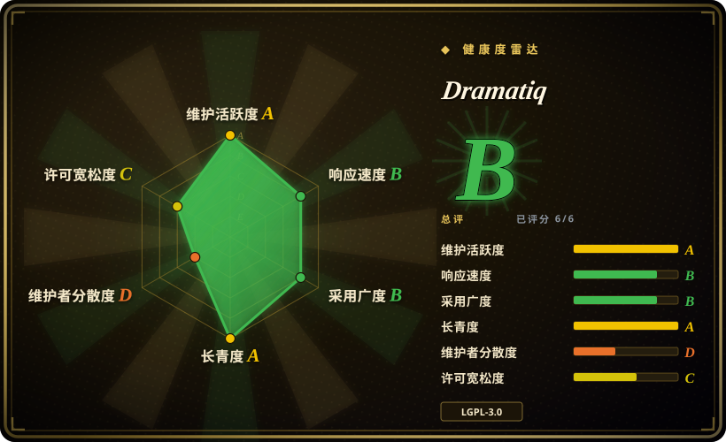
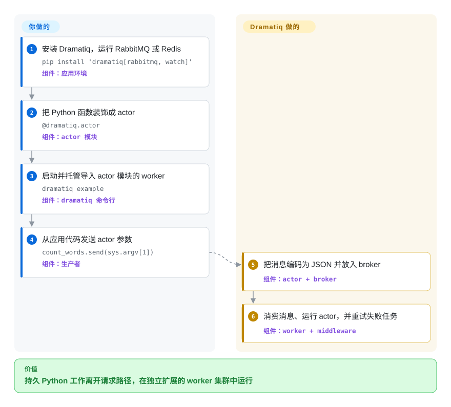

# Dramatiq

一个围绕 actor 函数、RabbitMQ 或 Redis broker、worker 进程、重试与 middleware 构建的 Python 分布式任务处理 library。

## 何时使用

你维护一个 Python 服务，请求路径需要把邮件、媒体处理、webhook 投递或其他持久后台工作交出去。你需要 RabbitMQ 或 Redis 以及自动重试，但 Celery 更大的配置与工作流表面对当前任务过重。当紧凑的 actor 加 middleware 模型值得你承担 LGPL 义务和较小生态时，选 Dramatiq。

如果任务可以接收短小、能用 JSON 编码的消息，并且能写成幂等操作，它尤其直接。你把普通函数装饰成 actor，从应用代码发送消息，再独立扩展受托管的 worker 进程，无需采用 Celery 的完整 canvas 与 scheduler 栈。

## 怎么用起来

你安装 RabbitMQ 或 Redis 对应的 extra，配置 broker，再用 `@dramatiq.actor` 标记 Python 函数。调用 actor 的 `send` 方法会把参数序列化为消息并放入 broker，而不是在调用方执行函数。独立托管的 Dramatiq worker 导入模块、消费消息并调用对应 actor，再由 middleware 提供重试、时间限制、结果和指标等行为。broker 可用性、worker 部署、幂等 actor 代码与监控由你负责；消息分发和 worker 执行生命周期由 Dramatiq 负责。

<!-- flow-steps:begin (generated from flows/dramatiq.json by tools/flow_card.py — do not edit) -->

流程文字版

1. **你**：安装 Dramatiq，运行 RabbitMQ 或 Redis — `pip install 'dramatiq[rabbitmq, watch]'` — 组件：`应用环境`
2. **你**：把 Python 函数装饰成 actor — `@dramatiq.actor` — 组件：`actor 模块`
3. **你**：启动并托管导入 actor 模块的 worker — `dramatiq example` — 组件：`dramatiq 命令行`
4. **你**：从应用代码发送 actor 参数 — `count_words.send(sys.argv[1])` — 组件：`生产者`
5. **Dramatiq**：把消息编码为 JSON 并放入 broker — 组件：`actor + broker`
6. **Dramatiq**：消费消息、运行 actor，并重试失败任务 — 组件：`worker + middleware`

**价值**：持久 Python 工作离开请求路径，在独立扩展的 worker 集群中运行

<!-- flow-steps:end -->

## 何时不用

- **你要求分发产品中的依赖采用宽松许可证。** 选 BSD-2-Clause 的 [RQ](rq.zh.md) 或 BSD-3-Clause 的 [Celery](celery.zh.md)：Dramatiq 是 LGPL-3.0-or-later，并非宽松许可证。分发组合产物需要提供 LGPL 通知与许可证副本，还必须保留用户替换或重新链接该 library 的能力；对 Dramatiq 的修改仍受 LGPL 约束，必须提供对应源码。vendor 或紧密打包不会消除这些义务。
- **你需要 Celery 更广的路由、周期调度、canvas 与监控生态。** 选 [Celery](celery.zh.md)；Dramatiq 有 group 和 pipeline，但其 cookbook 建议周期调度使用 APScheduler，dashboard 与框架衔接也依赖外部集成。
- **你只运行 Redis，并想要最小的同步队列模型。** 选 [RQ](rq.zh.md)；只有在 RabbitMQ 选择或内置重试与组合模型重要时，Dramatiq 额外的 actor 与 middleware 表面才值得承担。
- **你的服务与作业必须端到端 asyncio-native。** 选 [arq](arq.zh.md)；Dramatiq 可通过可选 AsyncIO middleware 运行 async actor，但每个 worker thread 仍会等待 async actor 的结果，因此它不是 asyncio-native 并发模型。
- **你需要 exactly-once 执行，或 actor 无法保持幂等。** 应围绕 transactional outbox 或 broker 层去重重新设计，而不是选择 Dramatiq；其 best-practices 指出 worker 故障可能让同一消息投递多次。
- **你需要带依赖的回填、血缘和工作流 UI。** 选 [Airflow](../workflow-orchestration/airflow.zh.md)；Dramatiq 的 pipeline 与 group 能组合任务，但不会把任务队列变成数据编排控制面。

## 横向对比

| 替代品 | 是否收录 | 我们的评价 | 取舍 |
|---|---|---|---|
| [Celery](celery.zh.md) | ✅ | RabbitMQ/Redis 后台作业需要更小的 actor 加 middleware 表面时选 Dramatiq；当更广的路由、周期调度、canvas 与集成生态值得额外复杂度时选 Celery。 | Dramatiq 的概念边界更小；Celery 则以宽松许可证提供更大的运维与扩展生态。 |
| [RQ](rq.zh.md) | ✅ | broker 选择与 actor 自动重试重要时选 Dramatiq；已有 Redis 或 Valkey，且直接把普通函数入队更简单、更适合宽松许可要求时选 RQ。 | Dramatiq 增加 RabbitMQ、actor、middleware 与 LGPL 义务；RQ 以更窄的 BSD 模型绑定 Redis/Valkey。 |
| [arq](arq.zh.md) | ✅ | asyncio-native Redis 应用选 arq；需要 RabbitMQ、同步 actor，并希望 asyncio 只是可选能力时选 Dramatiq。 | arq 的 worker 生命周期贴合 asyncio，但绑定 Redis；Dramatiq 支持两种 broker，但 async actor 仍占用 worker thread 容量。 |
| [PowerJob](powerjob.zh.md) | ✅ | Java 技术栈需要中央调度服务器与 Web 控制台时选 PowerJob；Python 服务要在代码中嵌入后台工作时选 Dramatiq。 | PowerJob 带来更重的 JVM 控制面与调度 UI；Dramatiq 把编排留在 Python 代码与外部运维工具中。 |

## 技术栈

- **语言与打包：** Python 3.10+，使用 setuptools；仓库主要是 Python，另有少量用于 Redis broker 操作的 Lua 脚本。
- **编程模型：** 用 `@dramatiq.actor` 声明 actor 函数，默认使用 JSON 编码消息，并提供 `group` 与 `pipeline` 组合原语。
- **Broker：** RabbitMQ 使用 `pika>=1.0,<2.0`，Redis 使用 `redis>=4.0,<9.0`；文档默认采用 RabbitMQ。
- **执行模型：** CLI 启动多个带 worker thread 的 worker 进程；gevent 和可选 AsyncIO middleware 提供其他并发路径。
- **扩展表面：** middleware 实现重试、年龄与时间限制、callback、结果、Prometheus 指标、限流及自定义生命周期 hook。

## 依赖

- **必需基础设施：** RabbitMQ 或 Redis broker；Dramatiq 不附带这两种服务。
- **必需运行时：** Python 3.10+，以及带对应 `rabbitmq` 或 `redis` extra 的 `dramatiq` 包。
- **必需进程：** 一个或多个受托管的 Dramatiq worker 进程，并能导入与生产者相同的 actor 模块。
- **可选服务与包：** Redis 或 Memcached 可作为结果或限流 backend；Prometheus 指标、gevent 与文件监视均为可选 extra。文档建议周期调度使用 APScheduler。

## 运维难度

**中。** 基础拓扑是一个 broker 加一个 worker 集群，默认 JSON 消息避免了可执行反序列化。生产环境仍要负责 broker 持久化与访问控制、worker 托管与平滑发布、队列深度与 dead-letter 监控、错误上报，以及消息可能重复投递时的 actor 幂等性。broker 启动连接失败会返回专用退出码而不是内部重试，时间限制属于 best-effort，周期任务还需要另一个 scheduler，因此容器重启策略与运维可观测性是部署组成部分，而不是可选装饰。[推断]

## 健康度与可持续性

- **维护：** Grade A——最近一次提交距评分 8 天，过去 13 周中有 8 周活跃；v2.2.1 发布于 2026-09-02。
- **响应速度：** Grade B——中位首次响应时间为 74.0 小时，基于 3 个 qualifying issues。
- **采用广度：** Grade B——评分快照测得 PyPI 月下载量为 1,519,753，依赖仓库数为 276；GitHub 在 2026-09-22 还报告了 5,312 stars。
- **长青度：** Grade A——仓库已创建 3,402 天，最近提交距评分 8 天；年龄与当前活跃度的组合对 Python 任务 library 是正向 Lindy 信号。[推断]
- **治理集中度：** Grade D——过去 12 个月测得 12 名活跃维护者，但头部一人占贡献的 85.1%，前三人占 90.4%。
- **许可风险：** Grade C——GitHub 报告 LGPL-3.0，评分所测 36 个月内没有重新许可；源码文件头与 package classifier 则明确为 LGPL-3.0-or-later。分发必须履行组合产物、通知、重新链接或替换以及对应源码义务，因此嵌入它实质上比 BSD 或 MIT 替代品更严格。

## 存疑（未验证）

- [推断]“中”的运维难度来自 broker、worker、scheduler 与可观测性职责的架构判断，并非实测基准。
- [推断] 正向 Lindy 判断结合了仓库年龄与当前提交、发版活动；它是选型先验，不是对未来维护的预测。
