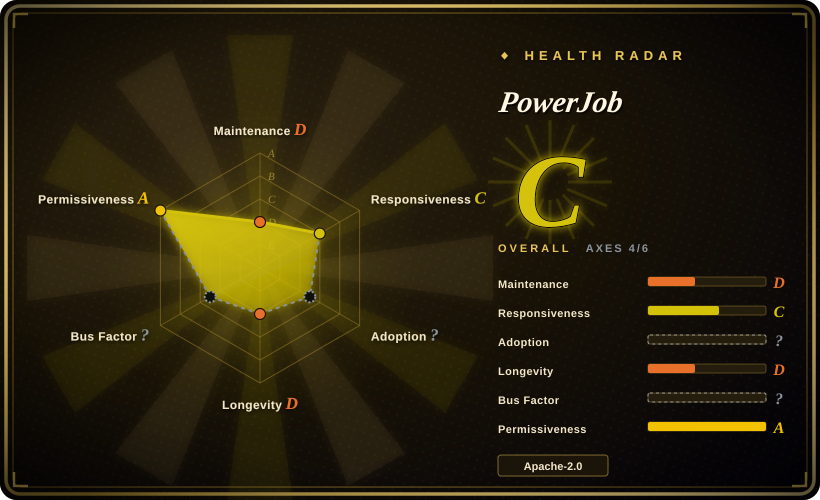
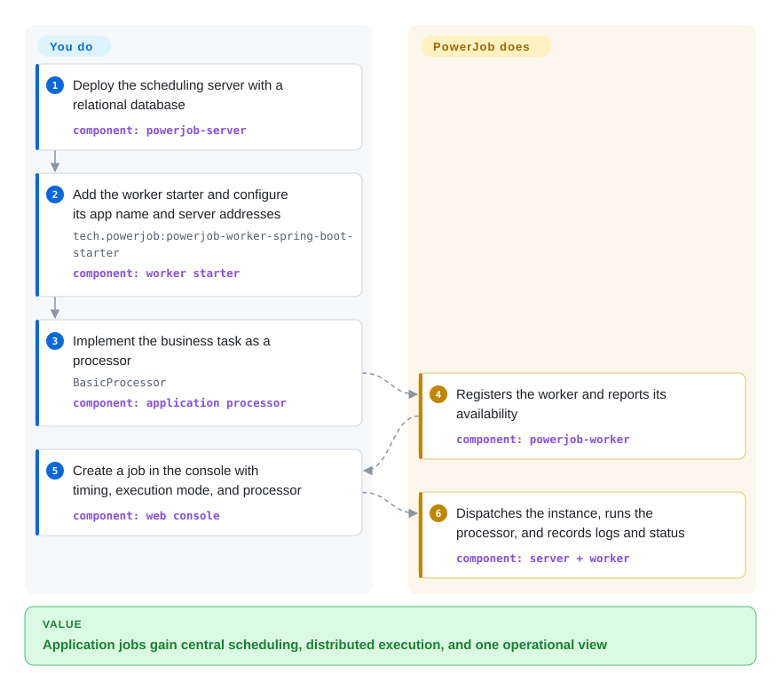

# PowerJob

A Java distributed job-scheduling and computing framework that pairs a central web console and scheduler with workers embedded in applications.

## When to use

You operate several Java or Spring services and want one internal scheduling plane for recurring jobs, delayed work, broadcast execution, and jobs that split into Map or MapReduce tasks. Choose PowerJob when a visual console plus DAG workflows and distributed-computing modes matter more than the smaller, cron-focused surface of [XXL-JOB](xxl-job.md).

The framework classification is deliberate: your application embeds the worker starter and supplies processors, while a separately deployed PowerJob server schedules and governs their execution. This is a better fit for a JVM platform team standardizing job execution across services than for an application that only needs an in-process timer.

## How it works

You deploy `powerjob-server` with a relational database, then add the worker starter to each application and configure its application name and server addresses. Your code supplies a `BasicProcessor` implementation, while the worker registers with the server and reports its availability. You create a job in the web console by choosing its timing strategy, execution mode, and processor; the server dispatches each instance to workers, which run the processor and return status and logs. You own the business logic, database, server and worker deployment, network policy, and capacity; PowerJob owns scheduling, dispatch, retries, workflow coordination, and execution records.

<!-- flow-steps:begin (generated from flows/powerjob.json by tools/flow_card.py — do not edit) -->

Text version of the flow

1. **You**: Deploy the scheduling server with a relational database — component: `powerjob-server`
2. **You**: Add the worker starter and configure its app name and server addresses — `tech.powerjob:powerjob-worker-spring-boot-starter` — component: `worker starter`
3. **You**: Implement the business task as a processor — `BasicProcessor` — component: `application processor`
4. **PowerJob**: Registers the worker and reports its availability — component: `powerjob-worker`
5. **You**: Create a job in the console with timing, execution mode, and processor — component: `web console`
6. **PowerJob**: Dispatches the instance, runs the processor, and records logs and status — component: `server + worker`

**Value**: Application jobs gain central scheduling, distributed execution, and one operational view

<!-- flow-steps:end -->

## When NOT to use

- **You only need an embedded JVM scheduler.** Choose Quartz instead; PowerJob adds a server, database, console, network path, and worker lifecycle that are unnecessary for a single-process timer.
- **You want the narrowest central cron scheduler for Spring services.** Choose [XXL-JOB](xxl-job.md); PowerJob earns its larger surface when DAG workflows, broadcast jobs, or Map/MapReduce execution are real requirements.
- **You are building Python-first data pipelines with backfills and a broad operator ecosystem.** Choose [Airflow](../workflow-orchestration/airflow.md); PowerJob's workflow feature is centered on application jobs rather than data-platform authoring and lineage.
- **You need a currently fast-moving stable release line.** Evaluate another maintained scheduler or wait for a published PowerJob release: the latest stable release and default-branch commit are both dated 2025-08, despite later work on an unreleased `6.0.0` branch.
- **You cannot isolate the console/OpenAPI or audit processor privileges.** Do not expose the default deployment; open issue #1186 reports unauthenticated OpenAPI job creation and worker-side command execution in the default configuration, and other 2026 security reports remained unresolved at verification time.

## Comparison

| Alternative | In index | Our verdict | Tradeoff |
|---|---|---|---|
| [XXL-JOB](xxl-job.md) | ✅ | Choose PowerJob when DAG workflows and Map/MapReduce-style distributed execution justify a broader platform; choose XXL-JOB when centralized cron dispatch and a smaller operational surface are enough. | PowerJob adds execution modes and workflow coordination, but brings more concepts and currently has a less recent stable release line. |
| Quartz | not indexed | Choose Quartz when scheduling must stay inside one JVM and you do not need a shared console or worker fleet; choose PowerJob when multiple applications need centrally governed execution. | Quartz avoids a separate control plane, while PowerJob adds cross-service visibility, dispatch, and operational state. |
| [Airflow](../workflow-orchestration/airflow.md) | ✅ | Choose Airflow for Python-authored data DAGs, backfills, and its operator ecosystem; choose PowerJob for Java application processors, broadcast tasks, and worker-side distributed computing. | Airflow is a fuller data-orchestration platform; PowerJob fits JVM application jobs more directly but offers less data-pipeline lineage and ecosystem breadth. |

## Tech stack

- **Language and build:** a Java 8 Maven multi-module project at stable version 5.1.2; an unreleased `6.0.0` branch moves to JDK 21 and Spring Boot 4.
- **Server:** Spring Boot 2.7.18, Spring Web, WebSocket, Spring Data JPA, Actuator, Undertow, and a bundled static web console.
- **Worker:** `powerjob-worker` plus an optional Spring Boot starter; processors implement SDK interfaces such as `BasicProcessor`, `BroadcastProcessor`, `MapProcessor`, or `MapReduceProcessor`.
- **Transport and state:** HTTP is the configured main protocol, with Akka and MU implementations also present; server state is stored through JPA in a relational database.
- **Execution model:** standalone, broadcast, Map, and MapReduce modes, plus DAG workflow records and cron, fixed-rate, fixed-delay, or OpenAPI triggering.

## Dependencies

- **Control plane:** one or more `powerjob-server` instances and a JDBC relational database; the stable server POM includes drivers for MySQL, Oracle, SQL Server, DB2, PostgreSQL, and H2.
- **Application integration:** Java 8+ for stable 5.1.2, the `tech.powerjob:powerjob-worker-spring-boot-starter` or worker library, and application-defined processor code.
- **Network:** workers must reach server endpoints for registration, heartbeats, dispatch, logs, and results; the sample config uses server port 7700 and worker transport port 27777.
- **Optional storage and processors:** MongoDB, Aliyun OSS, or S3-compatible storage implementations and bundled Java, shell, Python, or SQL processors expand both dependency and security surfaces.

## Ops difficulty

**Medium-to-high.** A useful production deployment has more than a scheduler process: it needs a durable relational database, a secured and redundant server tier, worker rollout and version compatibility, reachable transport ports, log and instance-data retention, alerting, and capacity controls for distributed tasks. DAG and MapReduce modes can consolidate capabilities that would otherwise require separate systems, but they also increase failure modes and upgrade testing. The unresolved 2026 security reports make network isolation, OpenAPI authentication, least-privilege worker accounts, and processor allow-listing part of the minimum operating posture rather than optional hardening.

## Health & viability

- **Overall:** Grade C across 4 of 6 scored axes; the missing adoption and governance grades should remain visible rather than treated as low scores.
- **Maintenance:** Grade `?` — the scorer could not read default-branch recency this run (`recency_unreadable`). GitHub's repository-level `pushed_at` is 2026-03-07, but that reflects work outside the default branch; the latest stable release remains v5.1.2 from 2025-08.
- **Responsiveness:** Grade C — median first-response time was 290.4 hours across 4 qualifying issues in the scorer's window.
- **Adoption / Governance:** Both are unscored — registry signals were ambiguous, and recent maintainer attribution was unavailable. GitHub still reported 7,796 stars on 2026-09-22, while lifetime contributor totals were heavily concentrated in the original maintainer.
- **Longevity:** Grade `?` — the scorer could not find longevity data this run (`not_found`); without a readable current stable-line signal, age alone cannot be graded as a Lindy signal. [推断]
- **Risk / License:** Grade A for the confirmed Apache-2.0 license with no detected relicense in 36 months. That license score does not cover unresolved 2026 security reports or the open fastjson security-upgrade PR, which remain material production risks.

## Caveats (unverified)

- [推断] “Medium-to-high” operations difficulty is an architectural judgment from the server, database, worker fleet, networking, retention, and security duties, not a measured deployment benchmark.
- [未验证] The exploit claims in issues #1186 and #1193 and PR #1194 were not independently reproduced; their open state and the affected configuration or dependency references were verified from the repository.
- [推断] PowerJob's workflow layer is less suitable than Airflow for data-platform lineage and backfill-heavy authoring; this is a selection judgment, not a feature-by-feature benchmark.
- [推断] The weak Lindy verdict combines repository age with stale default-branch and stable-release activity; it is a selection prior, not a prediction of future maintenance.
