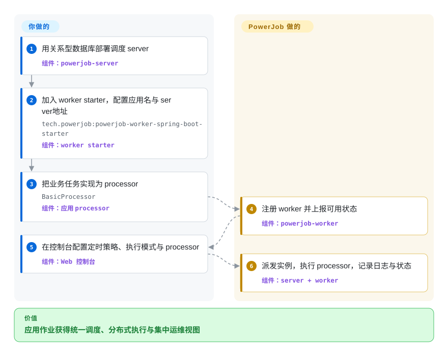

# PowerJob

一个 Java 分布式作业调度与计算框架，由中心化 Web 控制台和调度服务配合嵌入应用的 worker 工作。

## 何时使用

你运维多个 Java 或 Spring 服务，希望用一个内部调度平面统一管理周期作业、延迟任务、广播执行，以及拆分成 Map 或 MapReduce 子任务的计算。当可视化控制台、DAG 工作流与分布式计算模式比 [XXL-JOB](xxl-job.zh.md) 更小、更偏 cron 的能力面重要时，选择 PowerJob。

把它归类为 framework 是有意为之：你的应用嵌入 worker starter 并提供 processor，另行部署的 PowerJob server 负责调度与治理执行。它更适合想跨服务统一作业执行的 JVM 平台团队，而不是只需要进程内定时器的单个应用。

## 怎么用起来

你先部署带关系型数据库的 `powerjob-server`，再给每个应用加入 worker starter，配置应用名与 server 地址。业务代码实现 `BasicProcessor`，worker 向 server 注册并上报可用状态。你在 Web 控制台选择定时策略、执行模式和 processor 来创建作业；server 将每个实例派发给 worker，worker 执行 processor 并回传状态与日志。业务逻辑、数据库、server 与 worker 部署、网络策略和容量由你负责；调度、派发、重试、工作流协调和执行记录由 PowerJob 负责。

<!-- flow-steps:begin (generated from flows/powerjob.json by tools/flow_card.py — do not edit) -->

流程文字版

1. **你**：用关系型数据库部署调度 server — 组件：`powerjob-server`
2. **你**：加入 worker starter，配置应用名与 server 地址 — `tech.powerjob:powerjob-worker-spring-boot-starter` — 组件：`worker starter`
3. **你**：把业务任务实现为 processor — `BasicProcessor` — 组件：`应用 processor`
4. **PowerJob**：注册 worker 并上报可用状态 — 组件：`powerjob-worker`
5. **你**：在控制台配置定时策略、执行模式与 processor — 组件：`Web 控制台`
6. **PowerJob**：派发实例，执行 processor，记录日志与状态 — 组件：`server + worker`

**价值**：应用作业获得统一调度、分布式执行与集中运维视图

<!-- flow-steps:end -->

## 何时不用

- **你只需要 JVM 内嵌调度器。** 选 Quartz；单进程定时器不值得额外引入 server、数据库、控制台、网络链路和 worker 生命周期。
- **你只想为 Spring 服务使用尽量窄的中心化 cron 调度器。** 选 [XXL-JOB](xxl-job.zh.md)；只有 DAG 工作流、广播作业或 Map/MapReduce 执行是实际需求时，PowerJob 更大的能力面才值得。
- **你构建的是 Python-first 数据流水线，需要回填与广泛的 operator 生态。** 选 [Airflow](../workflow-orchestration/airflow.zh.md)；PowerJob 的工作流能力围绕应用作业，而不是数据平台的创作与血缘。
- **你需要仍在快速更新的稳定版本线。** 评估其他仍维护的调度器，或等待 PowerJob 发布新版本：尽管未发布的 `6.0.0` 分支后来仍有开发，最新稳定版与默认分支提交都停在 2025 年 8 月。
- **你无法隔离控制台与 OpenAPI，也无法审计 processor 权限。** 不要暴露默认部署；未关闭的 issue #1186 报告了默认配置下可未经认证创建 OpenAPI 作业并在 worker 侧执行命令，核验时其他 2026 年安全报告也仍未解决。

## 横向对比

| 替代品 | 是否收录 | 我们的评价 | 取舍 |
|---|---|---|---|
| [XXL-JOB](xxl-job.zh.md) | 已收录 | DAG 工作流与 Map/MapReduce 式分布式执行值得更宽平台能力时选 PowerJob；中心化 cron 派发与更小运维面已经够用时选 XXL-JOB。 | PowerJob 增加执行模式与工作流协调，但概念更多，当前稳定版本线也更久未更新。 |
| Quartz | 未收录 | 调度必须留在单个 JVM 内，而且不需要共享控制台或 worker 集群时选 Quartz；多个应用需要统一治理执行时选 PowerJob。 | Quartz 省去独立控制面；PowerJob 换来跨服务可见性、派发与运维状态。 |
| [Airflow](../workflow-orchestration/airflow.zh.md) | 已收录 | Python 编写的数据 DAG、回填和 operator 生态是核心时选 Airflow；Java 应用 processor、广播任务和 worker 侧分布式计算是核心时选 PowerJob。 | Airflow 是更完整的数据编排平台；PowerJob 更直接贴合 JVM 应用作业，但数据流水线的血缘与生态较弱。 |

## 技术栈

- **语言与构建：** 稳定版 5.1.2 是 Java 8 Maven 多模块项目；未发布的 `6.0.0` 分支转向 JDK 21 与 Spring Boot 4。
- **Server：** Spring Boot 2.7.18、Spring Web、WebSocket、Spring Data JPA、Actuator、Undertow，以及内置静态 Web 控制台。
- **Worker：** `powerjob-worker` 加可选 Spring Boot starter；processor 实现 `BasicProcessor`、`BroadcastProcessor`、`MapProcessor` 或 `MapReduceProcessor` 等 SDK 接口。
- **传输与状态：** 配置默认以 HTTP 为主要协议，仓库还包含 Akka 与 MU 实现；server 通过 JPA 把状态存入关系型数据库。
- **执行模型：** 单机、广播、Map 与 MapReduce 模式，加上 DAG 工作流记录，以及 cron、固定频率、固定延迟或 OpenAPI 触发。

## 依赖

- **控制面：** 一个或多个 `powerjob-server` 实例和 JDBC 关系型数据库；稳定版 server POM 包含 MySQL、Oracle、SQL Server、DB2、PostgreSQL 与 H2 驱动。
- **应用接入：** 稳定版 5.1.2 需要 Java 8+、`tech.powerjob:powerjob-worker-spring-boot-starter` 或 worker library，以及应用自定义的 processor 代码。
- **网络：** worker 必须能访问 server 端点以完成注册、心跳、派发、日志与结果传输；示例配置使用 server 端口 7700 和 worker 传输端口 27777。
- **可选存储与 processor：** MongoDB、Aliyun OSS 或 S3 兼容存储实现，以及内置 Java、Shell、Python 或 SQL processor，会同时扩大依赖面与安全面。

## 运维难度

**中到高。** 可用的生产部署不只有一个 scheduler 进程，还需要持久化关系型数据库、受保护且有冗余的 server 层、worker 滚动发布与版本兼容、可达的传输端口、日志与实例数据保留、告警，以及分布式任务容量控制。DAG 与 MapReduce 模式可以整合原本需要不同系统承担的能力，但也增加故障模式和升级验证成本。2026 年仍未解决的安全报告意味着网络隔离、OpenAPI 鉴权、worker 最小权限账号和 processor 白名单属于最低运维基线，而非可选加固。

## 健康度与可持续性

- **总体：** 6 个轴中有 4 个可评分，总体为 Grade C；采用与治理缺少分数，应显式保留未知，而不是当作低分。
- **维护：** Grade D——默认分支最近提交距评分 400 天，最近 13 周没有测得活跃周。GitHub 仓库级 `pushed_at` 是 2026-03-07，但它来自默认分支之外的工作；最新稳定版仍是 2025 年 8 月的 v5.1.2。
- **响应速度：** Grade C——评分窗口内 4 个 qualifying issues 的中位首次响应时间为 290.4 小时。
- **采用与治理：** 两项均未评分——registry 信号不明确，近期维护者归属也无法判断。GitHub 在 2026-09-22 仍显示 7,796 stars，而全周期贡献量高度集中在最初维护者。
- **长青度：** Grade D——仓库已有 2,381 天，但默认分支提交距评分 400 天；只有年龄而缺少当前稳定版本线活动，Lindy 信号较弱。[推断]
- **风险与许可：** 已确认的 Apache-2.0 许可为 Grade A，36 个月内未检测到换证。该许可分数不覆盖 2026 年未决安全报告与仍开放的 fastjson 安全升级 PR，后两项仍是生产使用的重要风险。

## 存疑（未验证）

- [推断]“中到高”的运维难度来自 server、数据库、worker 集群、网络、保留策略与安全职责的架构判断，并非实测部署基准。
- [未验证] 未独立复现 issue #1186、#1193 与 PR #1194 的漏洞主张；已核实它们仍为开放状态，以及其中引用的受影响配置或依赖。
- [推断] PowerJob 的工作流层不如 Airflow 适合数据平台血缘与重回填创作；这是选型判断，并非逐功能 benchmark。
- [推断] 较弱的 Lindy 判断结合了仓库年龄、默认分支停滞与稳定版发版间隔；它是选型先验，不是对未来维护的预测。
