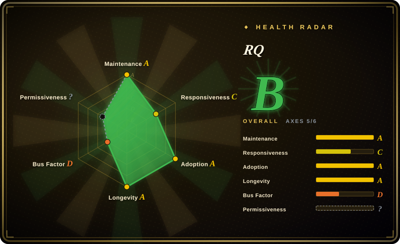
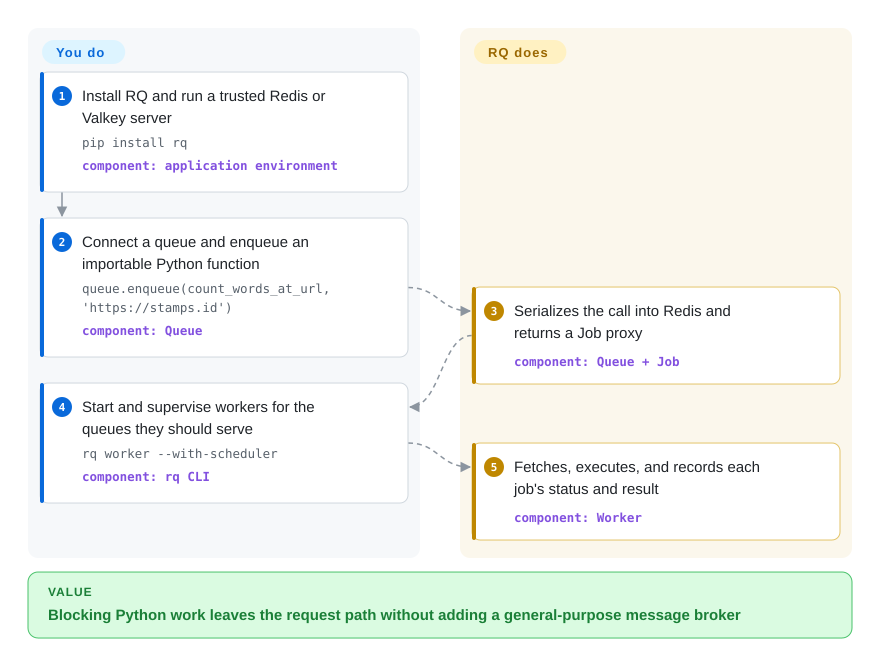

# RQ

A lightweight Python job queue that stores work in Redis or Valkey and runs ordinary functions in separate worker processes.

## When to use

You maintain a Python application that already operates Redis or Valkey, and a request path needs to hand off email delivery, report generation, or another blocking function. You want the function to remain plain Python, the enqueue call to be readable, and the worker topology to stay small. Choose RQ when that Redis-only simplicity matters more than Celery's broker choice and broader routing or workflow surface.

RQ is especially legible for a small team: name queues for priorities, run more workers for concurrency, and add built-in retries or scheduling only where needed. The tradeoff is deliberate coupling to Redis/Valkey and Python rather than a portable messaging protocol.

## How it works

You install RQ, connect a `Queue` to Redis or Valkey, and enqueue an importable Python function with its arguments. RQ serializes the job into the chosen queue and immediately returns a `Job` proxy; a separately supervised worker fetches jobs, executes each one in a child process by default, and records status and results back in the datastore. You own the function code, datastore, worker processes, deployment compatibility, and monitoring; RQ owns queue bookkeeping, execution lifecycle, retries, scheduling, and job registries.

<!-- flow-steps:begin (generated from flows/rq.json by tools/flow_card.py — do not edit) -->

Text version of the flow

1. **You**: Install RQ and run a trusted Redis or Valkey server — `pip install rq` — component: `application environment`
2. **You**: Connect a queue and enqueue an importable Python function — `queue.enqueue(count_words_at_url, 'https://stamps.id')` — component: `Queue`
3. **RQ**: Serializes the call into Redis and returns a Job proxy — component: `Queue + Job`
4. **You**: Start and supervise workers for the queues they should serve — `rq worker --with-scheduler` — component: `rq CLI`
5. **RQ**: Fetches, executes, and records each job's status and result — component: `Worker`

**Value**: Blocking Python work leaves the request path without adding a general-purpose message broker

<!-- flow-steps:end -->

## When NOT to use

- **You need RabbitMQ or broker portability.** Choose [Celery](celery.md), or Dramatiq for a smaller surface, because RQ intentionally depends on Redis/Valkey and does not speak a portable queue protocol.
- **Your service is asyncio-first and jobs should follow that programming model.** Choose arq instead; RQ can run coroutine jobs, but its primary worker lifecycle and API are not designed around an asyncio-native queue.
- **You need dependency-rich DAGs, backfills, lineage, and an operator UI.** Choose [Airflow](../workflow-orchestration/airflow.md) rather than stretching RQ's job dependencies and scheduler into a workflow orchestrator.
- **Untrusted parties can write to the queue datastore.** Isolate and authenticate Redis/Valkey or choose a design with a non-executable wire format: RQ's default `pickle` serializer can execute malicious data during deserialization. `JSONSerializer` removes that risk at the cost of limiting arguments to JSON-compatible values.
- **You need an integrated operational console and a larger ecosystem of routing controls.** Choose [Celery](celery.md) with [Flower](flower.md); RQ exposes worker/job state and has separate dashboards, but the core package does not bundle that control plane.

## Comparison

| Alternative | In index | Our verdict | Tradeoff |
|---|---|---|---|
| [Celery](celery.md) | ✅ | Choose RQ for a Python application already committed to Redis/Valkey when a smaller queue-and-worker model matters most; choose Celery when broker choice, richer routing, and composition primitives justify more machinery. | RQ removes broker abstraction and much of Celery's configuration surface, but also gives up that flexibility and ecosystem breadth. |
| Dramatiq | 未收录 | Choose Dramatiq when a compact Python task processor still needs a supported choice between RabbitMQ and Redis; choose RQ when direct enqueueing of ordinary functions and Redis-only operation are the simpler fit. | Dramatiq adds broker choice and actor-based messaging; RQ keeps the datastore and programming model narrower. |
| arq | 未收录 | Choose arq for an asyncio-native Python service whose jobs and worker hooks should be async; choose RQ for a synchronous codebase or when RQ's job registries, scheduling, and established ecosystem matter more. | arq aligns with asyncio and Redis but is in maintenance-only mode; RQ remains actively releasing and centers ordinary callable jobs. |

## Tech stack

- **Language and packaging:** Python 3.10+ packaged with Hatchling; the repository is predominantly Python.
- **Core API:** `Queue`, `Job`, and worker classes; the `rq` Click CLI starts workers, worker pools, schedulers, cron jobs, and inspection commands.
- **Persistence and transport:** Redis 5+ or Valkey 7.2+ stores queues, job metadata, registries, results, and worker state.
- **Execution model:** the default worker uses a fetch-fork-execute loop; `SpawnWorker` supports environments where `fork()` is unavailable, while `SimpleWorker` trades process isolation and heartbeats for in-process execution.
- **Serialization:** `pickle` by default, with JSON or a custom serializer supported.

## Dependencies

- **Required infrastructure:** a trusted Redis 5+ or Valkey 7.2+ instance; RQ does not bundle the datastore.
- **Required runtime:** Python 3.10+ with the `rq` package and application code importable by both producers and workers.
- **Required processes:** one or more supervised RQ workers; delayed retries require workers started with scheduler support, while recurring cron definitions use `rq cron`.
- **Package dependencies:** `redis>=5.0.1`, `click>=5`, and `croniter`, as declared in `pyproject.toml` on 2026-09-22.

## Ops difficulty

**Low-to-medium.** A basic deployment adds one datastore and one or more worker processes, with no exchange or routing topology to declare. Production still requires Redis/Valkey durability and access control, worker supervision and scaling, queue-depth and failed-job monitoring, compatible code on producer and worker hosts, and a safe serializer choice. Each default worker handles one job at a time, so concurrency comes from running more workers or a worker pool; scheduled work adds scheduler or cron processes.

## Health & viability

- **Maintenance:** Grade A — last commit 2 days ago and activity in 11 of the last 13 weeks; seven stable releases shipped from February through August 2026, most recently v2.12.
- **Responsiveness:** Grade C — median first-response time 332.9 hours across 5 qualifying issues.
- **Adoption:** Grade A — 17,250,345 monthly downloads on PyPI and 4,031 dependent repositories in the measured snapshot.
- **Longevity:** Grade A — 5,426 days old with a commit 2 days ago; that age-plus-activity combination is a strong Lindy signal for a task-queue library. [推断]
- **Governance:** Grade D — 6 active maintainers in the last 12 months, with the top contributor accounting for 89.4% and the top three for 94.1% of measured contributions.
- **Risk / License:** Cannot be scored — GitHub reports `NOASSERTION`, while `pyproject.toml` declares BSD-2-Clause and the repository `LICENSE` contains the corresponding two-clause BSD terms. The default executable `pickle` serializer remains a security boundary.

## Caveats (unverified)

- [推断] “Low-to-medium” operations difficulty is an architectural judgment from the required datastore, worker, scheduler, and monitoring processes, not a measured benchmark.
- [推断] The strong Lindy verdict combines repository age with current commits and releases; it is a selection prior, not a prediction of future maintenance.
