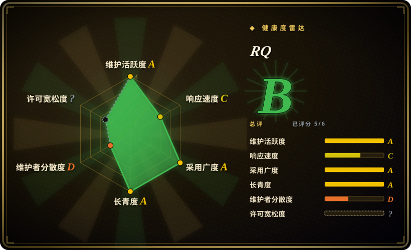
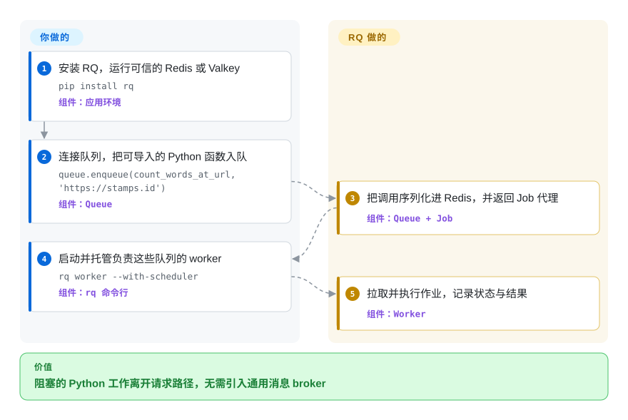

# RQ

一个轻量 Python 作业队列：把任务存入 Redis 或 Valkey，再由独立 worker 进程执行普通函数。

## 何时使用

你维护一个已经运行 Redis 或 Valkey 的 Python 应用，请求路径需要把发邮件、生成报表或其他阻塞函数交给后台。你希望函数保持为普通 Python，入队调用一眼能读懂，worker 拓扑也尽量小。当 Redis-only 的简单性比 Celery 的 broker 选择和更广的路由、工作流能力更重要时，选 RQ。

RQ 对小团队尤其直观：用队列名表达优先级，用更多 worker 换并发，只在需要时添加内置重试或调度。对应的代价是绑定 Redis/Valkey 与 Python，而不是采用可移植的消息协议。

## 怎么用起来

你安装 RQ，把 `Queue` 连到 Redis 或 Valkey，再把一个可导入的 Python 函数及其参数入队。RQ 将作业序列化到指定队列并立即返回 `Job` 代理；另行托管的 worker 拉取作业，默认在子进程中执行，再把状态与结果写回数据存储。函数代码、数据存储、worker 进程、部署兼容性和监控由你负责；队列账目、执行生命周期、重试、调度和作业 registry 由 RQ 负责。

<!-- flow-steps:begin (generated from flows/rq.json by tools/flow_card.py — do not edit) -->

流程文字版

1. **你**：安装 RQ，运行可信的 Redis 或 Valkey — `pip install rq` — 组件：`应用环境`
2. **你**：连接队列，把可导入的 Python 函数入队 — `queue.enqueue(count_words_at_url, 'https://stamps.id')` — 组件：`Queue`
3. **RQ**：把调用序列化进 Redis，并返回 Job 代理 — 组件：`Queue + Job`
4. **你**：启动并托管负责这些队列的 worker — `rq worker --with-scheduler` — 组件：`rq 命令行`
5. **RQ**：拉取并执行作业，记录状态与结果 — 组件：`Worker`

**价值**：阻塞的 Python 工作离开请求路径，无需引入通用消息 broker

<!-- flow-steps:end -->

## 何时不用

- **你需要 RabbitMQ 或 broker 可移植性。** 选 [Celery](celery.zh.md)，若想保持较小表面也可选 Dramatiq；RQ 有意绑定 Redis/Valkey，并不使用可移植队列协议。
- **你的服务以 asyncio 为先，作业也应沿用该编程模型。** 选 arq；RQ 可以运行 coroutine 作业，但主要 worker 生命周期和 API 并非围绕 asyncio-native 队列设计。
- **你需要依赖丰富的 DAG、回填、血缘和运维 UI。** 选 [Airflow](../workflow-orchestration/airflow.zh.md)，不要把 RQ 的作业依赖与调度器硬拉成工作流编排器。
- **不受信任的一方能写入队列数据存储。** 隔离并鉴权 Redis/Valkey，或选择不含可执行载荷的线格式：RQ 默认的 `pickle` serializer 在反序列化恶意数据时可能执行代码。`JSONSerializer` 能移除这项风险，代价是参数只能使用 JSON 兼容值。
- **你需要集成式运维控制台和更大的路由控制生态。** 选 [Celery](celery.zh.md) 配 [Flower](flower.zh.md)；RQ 会暴露 worker 与作业状态，也有独立 dashboard，但核心包不自带这层控制面。

## 横向对比

| 替代品 | 是否收录 | 我们的评价 | 取舍 |
|---|---|---|---|
| [Celery](celery.zh.md) | ✅ | Python 应用已经绑定 Redis/Valkey，且更看重更小的队列加 worker 模型时选 RQ；当 broker 选择、更丰富的路由和组合原语值得额外复杂度时选 Celery。 | RQ 去掉 broker 抽象和 Celery 的大量配置表面，同时也放弃了相应的灵活性与生态广度。 |
| [Dramatiq](dramatiq.zh.md) | ✅ | 紧凑的 Python 任务处理器仍需在 RabbitMQ 和 Redis 之间选择时选 Dramatiq；直接把普通函数入队、只用 Redis 更合适时选 RQ。 | Dramatiq 增加 broker 选择和 actor 消息模型；RQ 把数据存储和编程模型收得更窄。 |
| [arq](arq.zh.md) | ✅ | asyncio-native Python 服务希望作业与 worker hook 都异步时选 arq；同步代码库，或更看重 RQ 的作业 registry、调度和既有生态时选 RQ。 | arq 贴合 asyncio 与 Redis，但已进入 maintenance-only 模式；RQ 仍在活跃发版，并以普通 callable 作业为中心。 |

## 技术栈

- **语言与打包：** Python 3.10+，使用 Hatchling 打包；仓库主要语言为 Python。
- **核心 API：** `Queue`、`Job` 与各类 worker；基于 Click 的 `rq` CLI 用来启动 worker、worker pool、scheduler、cron 作业和检查命令。
- **持久化与传输：** Redis 5+ 或 Valkey 7.2+ 存放队列、作业元数据、registry、结果与 worker 状态。
- **执行模型：** 默认 worker 采用 fetch-fork-execute 循环；`SpawnWorker` 支持没有 `fork()` 的环境，`SimpleWorker` 则以放弃进程隔离与执行中 heartbeat 为代价在进程内运行。
- **序列化：** 默认使用 `pickle`，也支持 JSON 或自定义 serializer。

## 依赖

- **必需基础设施：** 一个可信的 Redis 5+ 或 Valkey 7.2+ 实例；RQ 不附带数据存储。
- **必需运行时：** Python 3.10+ 与 `rq` 包，且生产者和 worker 都必须能导入应用代码。
- **必需进程：** 一个或多个受托管的 RQ worker；延迟重试需要用 scheduler 支持启动 worker，周期 cron 定义则由 `rq cron` 运行。
- **包依赖：** 截至 2026-09-22，`pyproject.toml` 声明了 `redis>=5.0.1`、`click>=5` 与 `croniter`。

## 运维难度

**低到中。** 基础部署只增加一个数据存储和一个或多个 worker 进程，不需要声明 exchange 或路由拓扑。生产环境仍要处理 Redis/Valkey 的持久化与访问控制、worker 托管和扩缩容、队列深度与失败作业监控、生产者和 worker 的代码兼容，以及安全的 serializer 选择。每个默认 worker 同时只处理一个作业，因此并发来自更多 worker 或 worker pool；定时任务还会增加 scheduler 或 cron 进程。

## 健康度与可持续性

- **维护：** Grade A——最近一次提交距评分 2 天，过去 13 周中有 11 周活跃；2026 年 2 月至 8 月发布了七个稳定版本，最新为 v2.12。
- **响应速度：** Grade C——中位首次响应时间 332.9 小时，基于 5 个 qualifying issues。
- **采用广度：** Grade A——评分快照中，PyPI 月下载量为 17,250,345，依赖仓库数为 4,031。
- **长青度：** Grade A——仓库已创建 5,426 天，最近提交距评分 2 天；年龄与活跃度的组合对任务队列 library 是很强的 Lindy 信号。[推断]
- **治理集中度：** Grade D——过去 12 个月有 6 名活跃维护者，头部一人占评分所测贡献的 89.4%，前三人占 94.1%。
- **许可风险：** 无法评分——GitHub 返回 `NOASSERTION`，但 `pyproject.toml` 声明 BSD-2-Clause，仓库 `LICENSE` 也包含对应的两条款 BSD 文本。默认可执行的 `pickle` serializer 仍是安全边界。

## 存疑（未验证）

- [推断]“低到中”的运维难度来自所需数据存储、worker、scheduler 和监控进程的架构判断，并非实测基准。
- [推断] 强 Lindy 判断结合了仓库年龄与当前提交、发版活动；它是选型先验，不是对未来维护的预测。
