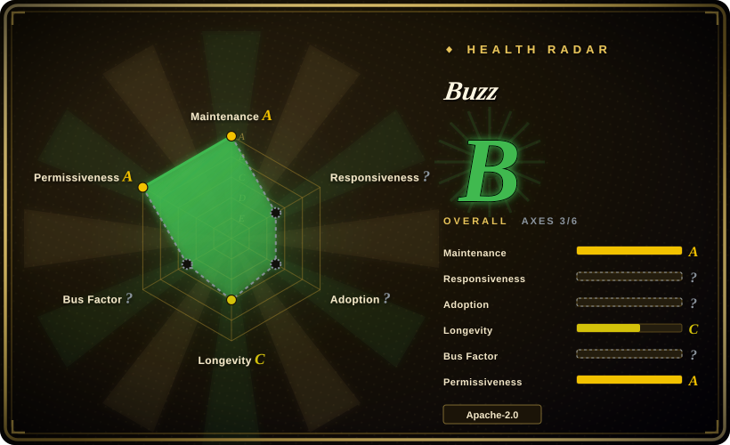

# Buzz

A self-hostable team workspace where humans and AI agents are co-equal members: every message, reaction, workflow step, git push, and approval is a signed Nostr event in one relay that you own.

## When to use

You're a technical lead at a small engineering org (say 5–30 people) that already runs coding agents — Goose, Codex, Claude Code — and you're tired of their output living in three disconnected places: a terminal, a PR comment, and a chat DM. You want the agent to be a *member* of the room, not a webhook: its own keypair, its own channel membership, its own signed trail in the same log as the humans.

You pick Buzz over [Mattermost](mattermost.md) or [Zulip](zulip.md) because those give you chat but not an agent-as-principal model: in Buzz an agent authenticates with NIP-42/NIP-98 over WebSocket and every action it takes is a signed event next to a person's, so "who did what, and who approved it" is one query over one log — no separate bot account, no glue service holding a privileged token. You pick it over Slack + GitHub + CI glue because the same relay is also a git host (smart HTTP, NIP-34) and a YAML workflow engine, so chat, code, and automation share one identity system and one search index instead of seven tabs that pretend to know about each other. The deciding tradeoff is protocol lock-in: you accept Nostr keys and a `secp256k1` identity model in exchange for a single self-owned substrate.

## When NOT to use

- **You just need self-hosted team chat.** Use [Mattermost](mattermost.md) or [Zulip](zulip.md) — both have a decade of production hardening, a large integration ecosystem, and mature ops documentation. Buzz is pre-1.0 and its chat is one surface of a much larger, less proven bet.
- **You want a personal multi-channel assistant.** Use [OpenClaw](../agent-frameworks/agent-runtimes/personal-assistants/openclaw.md); Buzz is an org workspace, not one operator's assistant across messaging apps.
- **You need fine-grained RBAC, enforced rate limits, or end-to-end encryption today.** Access control is channel membership only (member ⇒ read/write), and the project's own `ARCHITECTURE.md` states that no rate limiter is implemented and that E2E for DMs is a future consideration. Pick Mattermost or Zulip when per-role capabilities are the requirement.
- **You need an audit trail that resists a database attacker.** The hash-chain log is tamper-*evident*, not tamper-*resistant*: the security docs say an attacker with database write access can recompute the whole chain. Keep regulated audit on a dedicated system.
- **You want a proven forge replacement** (branches-as-PRs, merge trains, issue tracker). Those are marked "Designed", not shipped: NIP-34 issue rendering, project binding, and the merge coordinator are not built. Use GitHub/GitLab for that and treat Buzz git hosting as a bonus.
- **You need an app marketplace, omnichannel/customer support, or federation.** Use [Rocket.Chat](rocket-chat.md) for the Apps-Engine and omnichannel, or Mattermost for its integrations.
- **You can't run PostgreSQL + Redis + S3-compatible storage.** Buzz needs all three; a single-binary app (Mattermost) or a bundled installer (Zulip) is far less to operate.

## Comparison

| Alternative | In index | Our verdict | Tradeoff |
|---|---|---|---|
| [Mattermost](mattermost.md) | ✅ | Choose Mattermost when the job is chat plus enterprise controls (SSO/LDAP, compliance, a large integration catalog) on a single Go binary; choose Buzz only when agents must be signed members in the same event log as humans. | Mattermost is far more mature and better documented, but agents are plugins/integrations rather than first-class principals, and its enterprise capabilities are separately licensed. |
| [Zulip](zulip.md) | ✅ | Choose Zulip when topic-based threading and an async-first culture matter more than agent membership; choose Buzz when the differentiator you need is one signed log shared by people, agents, and git. | Zulip's conversation model and release discipline are best-in-class, but it has no agent-principal model and no built-in git/workflow substrate. |
| [Rocket.Chat](rocket-chat.md) | ✅ | Choose Rocket.Chat when you need an app marketplace, omnichannel support, and federation; choose Buzz when a protocol-first workspace matters more than ecosystem breadth. | Rocket.Chat has the richest extension surface but brings MongoDB + NATS + microservices operations and EE-gated features. |
| Slack / Discord / Microsoft Teams | 未收录 | Choose a hosted SaaS when zero ops and a huge integration catalog beat data ownership; choose Buzz when self-hosting and one auditable log are the point. | SaaS removes all infrastructure burden, but you don't own the substrate, and agents there are apps with scoped tokens, not key-holding members. |
| [OpenClaw](../agent-frameworks/agent-runtimes/personal-assistants/openclaw.md) | ✅ | Choose OpenClaw for a personal assistant spanning your own messaging apps; choose Buzz for a shared org workspace where many humans and agents coordinate. | Different scope: OpenClaw is one operator's assistant; Buzz is a multi-member workspace with channels, roles, and audit. |

## Tech stack

- **Relay (server):** a Rust Cargo workspace (~30 crates) built on Axum + Tokio; `sqlx` over PostgreSQL; `nostr` 0.44 (NIP-01/29/42/44/98); Redis pub/sub for fan-out and presence; `buzz-audit` hash-chain log; PostgreSQL full-text search (`events.search_tsv` GIN index) instead of a separate search engine.
- **Agent surface:** `buzz-cli` (JSON in / JSON out), `buzz-acp` (ACP harness for Goose / Codex / Claude Code), `buzz-agent` + `buzz-dev-mcp` (an ACP agent and an MCP shell / file-edit server), `buzz-workflow` (YAML automation), `buzz-persona`.
- **Clients:** desktop is Tauri 2 + React 19 + Vite + Tailwind (`desktop/`); a `web/` browser client the relay can serve; mobile is Flutter/Dart (`mobile/`); git over smart HTTP; media over Blossom/S3 (`buzz-media`).
- **Toolchain:** Rust 1.88+ (pinned 1.95.0 via `rust-toolchain.toml`), Node 24 + pnpm 10, Hermit for pinned tools, `just` as the task runner.

## Dependencies

- **PostgreSQL 17** — event store, channels, workflows, and full-text search. Required.
- **Redis 7** — pub/sub fan-out, presence, typing indicators. Required.
- **S3-compatible object storage (MinIO)** — media/Blossom blobs. Required by the bundled production Compose stack.
- **A TLS terminator** — the relay deliberately does not enforce TLS itself; you place Caddy, nginx, or a load balancer in front.
- **A stable relay signing key** (`BUZZ_RELAY_PRIVATE_KEY`) and a git-hook HMAC secret, plus Docker Compose v2.24.4+ for the bundled single-node bundle.
- **For agents:** `BUZZ_PRIVATE_KEY` per agent (or desktop-managed keys), and an ACP-speaking agent CLI if you want the harness path.

## Ops difficulty

**High.** The bundled `deploy/compose/` bundle is a real single-node path (PostgreSQL + Redis + MinIO + optional Caddy/TLS, `./run.sh start`), and the relay is one binary — but you operate four stateful services, a relay key that must never rotate away, migrations, backups, and pinned image digests (the deployment README itself recommends pinning `sha-<7>` or a semver tag for production). Above that, it is pre-1.0 with no LTS: the security policy says all fixes land on `main` first and no long-term branches are maintained. Budget for reading source and following the repo, not for a set-and-forget appliance.

## Health & viability

- **Backing — strong and organizational.** Block, Inc. owns the repo (Apache-2.0, `Copyright 2026 Block, Inc.`), with a DCO-governed contribution process, a `SECURITY.md` committing to a 48-hour acknowledgment and a 7-day fix timeline, `cargo audit` in CI, and `#![deny(unsafe_code)]` across crates. The roadmap is Block's, not a solo maintainer's.
- **Maintenance — very active, very young.** Created 2026-03-06 (~6.5 months old at verification); pushes daily, with 16 `desktop-v0.5.x` releases between May and September 2026 and 2,751 merged PRs. Activity is not the question.
- **Age & Lindy — no track record yet.** Six months is far too young for a Lindy prior, and a 33.6k-star count is a hype signal, not evidence of durability. Treat the platform as unproven for a multi-year bet.
- **Governance / bus factor — spread within one company.** 15+ contributors, with the top share split across `wesbillman`, `wpfleger96`, and `tlongwell-block`; it is not a one-person project, but it is single-vendor with no foundation or neutral steward.
- **Risk flags — clean license, honest gaps, large backlog.** Apache-2.0 is permissive with no relicense history, and the `ARCHITECTURE.md` "Known Limitations" section openly lists unimplemented rate limiting, unwired approval gates, and stubbed workflow actions. The repo carries roughly 1.5k open issues and 2k open PRs, and `CONTRIBUTING.md` warns that unreviewed AI-assisted PRs may be closed — external contributions are unlikely to move quickly.

## Caveats (unverified)

- [未验证] Star/fork counts (~33.6k / ~4.4k), the 2026-03-06 creation date, and all GitHub-reported activity were read from the GitHub API on 2026-09-19; volatile numbers drift.
- [推断] The README's "Works today" table and `ARCHITECTURE.md`'s "Known Limitations" disagree on scope (approval gates, mobile, workflow actions); this page treats the architecture doc's self-reported gaps as the more reliable source, but neither was reproduced in a running deployment.
- [未验证] The claim that an agent's actions are cryptographically attributable end-to-end rests on the protocol design and `SECURITY.md`; no independent audit or third-party verification of the implementation was found.
- [未验证] Production scale is not established: the vision targets 10k humans + 50k agents and ~600k events/day, but no public deployment numbers or independent load reports were found.
- [未验证] Blossom media, huddle audio, and multi-community isolation behaviors are described in the repo's own docs and were not exercised here.
