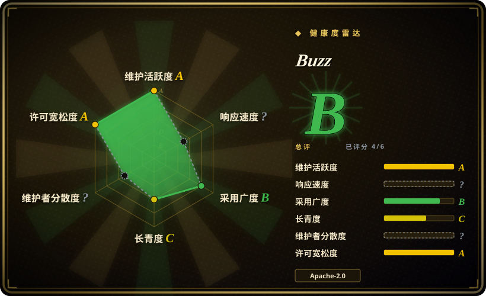

# Buzz

可自托管的团队工作区，人和 AI agent 是同等成员：每条消息、reaction、workflow 步骤、git push 和审批，都是你自己那个 relay 里的一条已签名 Nostr 事件。

## 何时使用

你是一个小工程团队（比如 5–30 人）的技术负责人，团队已经在跑 coding agent——Goose、Codex、Claude Code——而它们的产出散落在三处对不上：终端、PR 评论、聊天私信。你要的是 agent 作为房间里的*成员*，不是 webhook：它有自己的密钥、自己的频道成员身份、和人写在同一条日志里的签名记录。

你选 Buzz 而不是 [Mattermost](mattermost.zh.md) 或 [Zulip](zulip.zh.md)，是因为后两者给了聊天的便利，却没有「agent 即主体」的模型：在 Buzz 里 agent 通过 WebSocket 上的 NIP-42/NIP-98 认证，它做的每件事都是与人类并列的一条签名事件，所以「谁做了什么、谁批准的」是对同一条日志的一次查询——不需要单独的 bot 账号，也不需要某个持有特权 token 的胶水服务。你选它而不是 Slack + GitHub + CI 胶水，是因为同一个 relay 同时是 git 托管（smart HTTP、NIP-34）和 YAML workflow 引擎，聊天、代码和自动化共用一套身份体系和一个搜索索引，而不是七个互不知情的标签页。决定性的取舍是协议锁定：你接受 Nostr 密钥和 `secp256k1` 身份模型，换来一份自己拥有的统一底座。

## 何时不用

- **你只需要自托管团队聊天。** 用 [Mattermost](mattermost.zh.md) 或 [Zulip](zulip.zh.md)——两者都有十年生产打磨、庞大的集成生态和成熟运维文档。Buzz 是 pre-1.0，聊天只是它更大、也更未经验证的赌注中的一个面。
- **你要的是个人跨渠道助手。** 用 [OpenClaw](../agent-frameworks/agent-runtimes/personal-assistants/openclaw.zh.md)；Buzz 是组织工作区，不是某个人跨消息应用的助手。
- **你今天就需要细粒度 RBAC、真正落地的限流或端到端加密。** 访问控制只有频道成员资格（是成员即可读写），且项目自己的 `ARCHITECTURE.md` 写明限流器尚未实现、私信的端到端加密只是未来考虑。需要按角色划分能力时，选 Mattermost 或 Zulip。
- **你需要能抗住数据库攻击者的审计链。** 哈希链日志是「可发现篡改」，不是「抗篡改」：安全文档说，有数据库写权限的攻击者可以重算整条链。受监管的审计请留在专用系统。
- **你要的是经过验证的 forge 替代品**（分支即 PR、合并列车、issue 跟踪）。这些在文档里标的是 Designed，不是已交付：NIP-34 issue 渲染、项目绑定、合并协调器都还没建。那类需求用 GitHub/GitLab，把 Buzz 的 git 托管当附赠。
- **你需要应用市场、全渠道客服或联邦。** 要 Apps-Engine 和全渠道选 [Rocket.Chat](rocket-chat.zh.md)，要庞大集成生态选 Mattermost。
- **你跑不起 PostgreSQL + Redis + S3 兼容存储。** Buzz 三样都要；单二进制应用（Mattermost）或自带安装器（Zulip）的运维量低得多。

## 横向对比

| 替代品 | 是否收录 | 我们的评价 | 取舍 |
|---|---|---|---|
| [Mattermost](mattermost.zh.md) | ✅ | 任务若是「聊天 + 企业管控」（SSO/LDAP、合规、庞大集成目录）且想跑单个 Go 二进制，选 Mattermost；只有当 agent 必须是与人同处一条事件日志的签名成员时，才选 Buzz。 | Mattermost 成熟度和文档远超 Buzz，但它的 agent 是插件/集成而非一等主体，且企业能力单独授权。 |
| [Zulip](zulip.zh.md) | ✅ | 若话题式线程和异步优先的文化比 agent 成员身份更重要，选 Zulip；若你要的差异化是「人、agent 与 git 共用一条签名日志」，选 Buzz。 | Zulip 的会话模型和发布纪律一流，但没有 agent 主体模型，也没有内置 git/workflow 底座。 |
| [Rocket.Chat](rocket-chat.zh.md) | ✅ | 需要应用市场、全渠道客服和联邦时选 Rocket.Chat；协议优先的工作区比生态广度更重要时选 Buzz。 | Rocket.Chat 扩展面最丰富，但带来 MongoDB + NATS + 微服务运维，且功能被 EE 授权切分。 |
| Slack / Discord / Microsoft Teams | 未收录 | 零运维和庞大集成目录胜过数据自有时，选托管 SaaS；自托管和一条可审计日志本身就是目的时，选 Buzz。 | SaaS 免去全部基础设施负担，但底座不属于你，其中的 agent 是持有受限 token 的应用，不是持钥成员。 |
| [OpenClaw](../agent-frameworks/agent-runtimes/personal-assistants/openclaw.zh.md) | ✅ | 要跨个人消息应用的个人助手，选 OpenClaw；要多个真人加多个 agent 协作的共享组织工作区，选 Buzz。 | 作用域不同：OpenClaw 是单个运营者的助手；Buzz 是有频道、角色和审计的多成员工作区。 |

## 技术栈

- **Relay（服务端）：** Rust Cargo 工作区（约 30 个 crate），基于 Axum + Tokio；`sqlx` 接 PostgreSQL；`nostr` 0.44（NIP-01/29/42/44/98）；Redis pub/sub 做扇出与在线状态；`buzz-audit` 哈希链日志；搜索用 PostgreSQL 全文检索（`events.search_tsv` 的 GIN 索引），不单独部署搜索引擎。
- **Agent 面：** `buzz-cli`（JSON 进、JSON 出）、`buzz-acp`（Goose / Codex / Claude Code 的 ACP harness）、`buzz-agent` + `buzz-dev-mcp`（一个 ACP agent 与一个 MCP shell/文件编辑服务）、`buzz-workflow`（YAML 自动化）、`buzz-persona`。
- **客户端：** 桌面端是 Tauri 2 + React 19 + Vite + Tailwind（`desktop/`）；relay 可托管的 `web/` 浏览器客户端；移动端是 Flutter/Dart（`mobile/`）；git 走 smart HTTP；媒体走 Blossom/S3（`buzz-media`）。
- **工具链：** Rust 1.88+（`rust-toolchain.toml` 钉 1.95.0）、Node 24 + pnpm 10、Hermit 钉工具版本、`just` 作为任务入口。

## 依赖

- **PostgreSQL 17**——事件存储、频道、workflow 与全文检索。必需。
- **Redis 7**——pub/sub 扇出、在线状态、正在输入。必需。
- **S3 兼容对象存储（MinIO）**——媒体/Blossom blob。自带的生产 Compose 栈要求它有。
- **TLS 终结层**——relay 有意自身不强制 TLS，需要你在前面放 Caddy、nginx 或负载均衡。
- **稳定的 relay 签名密钥**（`BUZZ_RELAY_PRIVATE_KEY`）与 git hook 的 HMAC secret，以及 Docker Compose v2.24.4+（用于自带单机套件）。
- **给 agent 的：** 每个 agent 的 `BUZZ_PRIVATE_KEY`（或桌面端托管的密钥），以及走 harness 路径时所需的支持 ACP 的 agent CLI。

## 运维难度

**高。** 自带的 `deploy/compose/` 套件是一条真实的单机路径（PostgreSQL + Redis + MinIO + 可选 Caddy/TLS，`./run.sh start`），relay 本身也是一个二进制——但你要运维四个有状态服务、一把绝不能轮换丢掉的 relay 密钥、迁移、备份，以及钉死的镜像摘要（部署文档自己建议生产钉 `sha-<7>` 或 semver tag）。在此之上，它是 pre-1.0 且无 LTS：安全策略说明所有修复先落 `main`，不维护长期分支。请按「读源码、跟仓库」的预期排期，不要当免维护家电。

## 健康度与可持续性

- **背书——强且是组织级。** 仓库归 Block, Inc.（Apache-2.0，`Copyright 2026 Block, Inc.`），有 DCO 治理的贡献流程、承诺 48 小时确认与 7 天修复时间线的 `SECURITY.md`、CI 里的 `cargo audit`，以及全 crate 的 `#![deny(unsafe_code)]`。路线图在 Block 手里，不是单个维护者的。
- **维护——非常活跃、也非常年轻。** 创建于 2026-03-06（验证时约 6.5 个月）；每日推送，2026 年 5 月至 9 月间发了 16 个 `desktop-v0.5.x`，已合并 2,751 个 PR。活跃度不是问题。
- **年龄与 Lindy——还没有记录。** 六个月远不足以形成 Lindy 先验，3.36 万 star 是热度信号，不是耐久性证据。面向多年的赌注，请把它当未证实。
- **治理 / bus factor——集中在一家公司内但不止一人。** 15+ 贡献者，头部份额分在 `wesbillman`、`wpfleger96`、`tlongwell-block` 三人；不是单人项目，但是单一厂商，没有基金会或中立管家。
- **风险旗——许可证干净、缺口诚实、积压巨大。** Apache-2.0 宽松且无改许可历史，`ARCHITECTURE.md` 的「Known Limitations」主动列出未实现的限流、未接通的审批门和被 stub 的 workflow 动作。仓库约 1.5k 开 issue 与 2k 开 PR，且 `CONTRIBUTING.md` 警告未审的 AI 辅助 PR 可能被关闭——外部贡献不太可能快速推进。

## 存疑（未验证）

- [未验证] star/fork 数（约 3.36 万 / 约 4.4k）、2026-03-06 的创建日期与全部 GitHub 活动数据，取自 2026-09-19 的 GitHub API；易变数字会漂移。
- [推断] README 的「Works today」表与 `ARCHITECTURE.md` 的「Known Limitations」在范围上互相矛盾（审批门、移动端、workflow 动作）；本页以架构文档自报的缺口为更可靠来源，但两者都未在运行部署中复现。
- [未验证] agent 行为可端到端密码学归因这一说法，依据是协议设计与 `SECURITY.md`；未找到针对实现的独立审计或第三方验证。
- [未验证] 生产规模未证实：愿景目标是 1 万真人 + 5 万 agent、约 60 万事件/天，但未找到公开部署数字或独立压测报告。
- [未验证] Blossom 媒体、huddle 语音与多社区隔离行为均出自仓库自身文档，此处未实际跑通。
