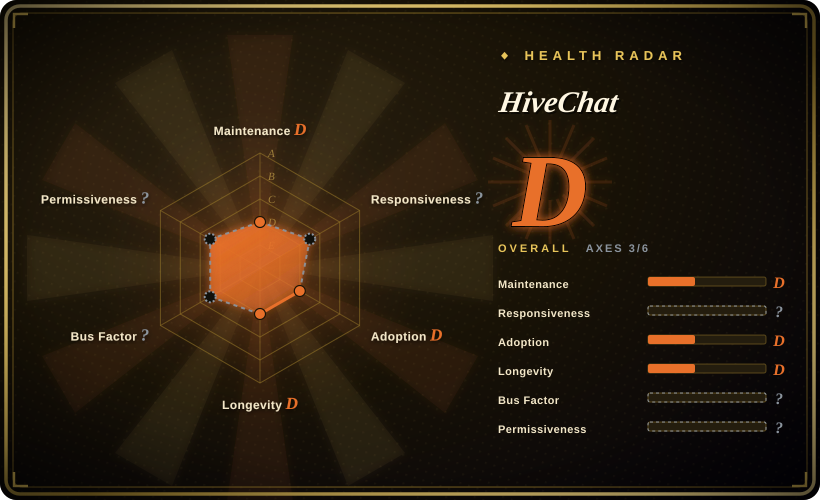
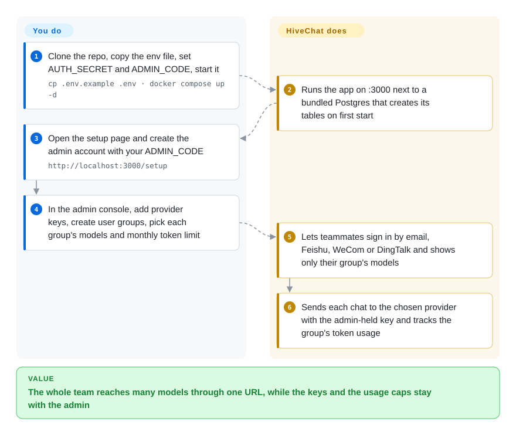

# HiveChat

A self-hostable, admin-managed AI chat app for small-to-medium teams: one admin wires up many LLM providers (OpenAI, Claude, Gemini, DeepSeek, Ollama, OpenAI-compatible), and the whole team chats through them with per-group model access and token quotas.

## When to use

You're the technical lead or IT admin at a 5–50 person company, and your team keeps asking for ChatGPT/Claude access. You don't want to buy a seat of every vendor's product, hand out raw API keys, or let usage run unbounded — and you'd rather not send internal conversations through a third-party SaaS you can't audit. You want one place where *you* hold the API keys, decide which models the sales team versus the engineers can see, cap monthly tokens per group, and onboard people by Feishu/DingTalk/WeWork login instead of yet another password.

HiveChat is built for exactly this shape. You deploy it once (Docker Compose with a bundled Postgres, or one-click on Vercel), hit `/setup` to create the admin account with an `ADMIN_CODE`, then add your providers and models in the admin console. Users sign in, pick from the models you've allowed their group, and chat with image understanding, LaTeX/Markdown rendering, DeepSeek reasoning-chain display, and MCP tool servers — while you watch quotas from the admin side. It's the "self-hosted team front-end over many model APIs" niche, not a personal single-user playground and not a from-scratch chat framework.

## How it works

HiveChat is one Next.js web app plus a PostgreSQL database that holds users, groups, provider keys and conversations. **The chat screens, the admin console, the provider adapters (OpenAI, Claude, Gemini and a generic OpenAI-compatible one) and the team logins ship with it** — you only run it, create the admin, and *configure* who can see which models and how many tokens a month each group may spend. The admin account is bootstrapped by a shared secret: you put `ADMIN_CODE` in the env file, and whoever presents that code on `/setup` becomes the admin. After that every chat is a request from a teammate's browser to the HiveChat server, which calls the provider with the key only the admin has seen and records usage against that teammate's group. The Docker image ships no upgrade migrations — the README says test users may drop the Postgres volume to re-initialize after upgrading, which is why the Vercel / local `npm run initdb` paths are the ones with a real upgrade story.

<!-- flow-steps:begin (generated from flows/hivechat.json by tools/flow_card.py — do not edit) -->

Text version of the flow

1. **You**: Clone the repo, copy the env file, set AUTH_SECRET and ADMIN_CODE, start it — `cp .env.example .env · docker compose up -d`
2. **HiveChat**: Runs the app on :3000 next to a bundled Postgres that creates its tables on first start
3. **You**: Open the setup page and create the admin account with your ADMIN_CODE — `http://localhost:3000/setup`
4. **You**: In the admin console, add provider keys, create user groups, pick each group's models and monthly token limit
5. **HiveChat**: Lets teammates sign in by email, Feishu, WeCom or DingTalk and shows only their group's models
6. **HiveChat**: Sends each chat to the chosen provider with the admin-held key and tracks the group's token usage

**Value**: The whole team reaches many models through one URL, while the keys and the usage caps stay with the admin

<!-- flow-steps:end -->

## When NOT to use

- **You're a single user wanting a local/personal chat client.** The whole model is admin-over-team (Postgres, user groups, quotas, a `/setup` admin flow). For one person, a desktop client like Cherry Studio, Chatbox, or LibreChat-as-personal is lighter.
- **You need an on-device, no-server, offline setup.** HiveChat mandates a PostgreSQL backend and a running Node/Next.js server; there is no SQLite or fully-local single-binary mode.
- **You need software someone is still shipping — it looks dormant.** No commit since **2025-09-16** (over 12 months as of 2026-10-08), still `v0.1.0` with no git tags or releases. A team deployment you will have to keep patching should go to [LibreChat](../llm-chat-ui/librechat.md) or [Open WebUI](../llm-chat-ui/open-webui.md) instead; pick HiveChat only if you are willing to own a fork.
- **You need a custom license-clean fork or to resell a derivative.** The license is Apache-2.0 *with added commercial conditions*: building and distributing a derivative work requires a separate commercial license from the author. This is not vanilla Apache-2.0.
- **You want pluggable enterprise SSO beyond the built-ins (SAML/OIDC/LDAP).** Auth is email/password plus Feishu, DingTalk, and WeChat Work; generic enterprise IdP integration is not advertised.
- **You need a self-hosted RAG / document-knowledge platform.** It's a chat front-end over model APIs (plus MCP tools), not a document-ingestion / vector-search knowledge base.

## Comparison

| Alternative | In index | Our verdict | Tradeoff |
|---|---|---|---|
| [LibreChat](../llm-chat-ui/librechat.md) | ✅ | Choose LibreChat when you need a more mature, larger feature surface with RAG, assistants, code interpreter, and many auth backends. | MIT-licensed and broader, but heavier to operate and less opinionated toward HiveChat's small-team admin-quota flow. |
| [Open WebUI](../llm-chat-ui/open-webui.md) | ✅ | Choose Open WebUI when local-model serving, RBAC, and pipelines matter more than multi-cloud provider quotas. | Broader and more active, but its sweet spot is Ollama/local-model serving rather than HiveChat's per-group quota framing. |
| Lobe Chat | 未收录 | Choose Lobe Chat when you need a polished multi-provider UI with plugins and self-hosting for personal/prosumer use. | Less centered on centralized admin-managed team governance with token quotas. |
| Chatbox / Cherry Studio | 未收录 | Choose desktop clients when each person brings their own key and central governance is unnecessary. | No central admin, groups, quotas, or shared server. |
| ChatGPT Team / Claude Team (SaaS) | 未收录 | Choose managed SaaS teams when zero-ops and a single model family are acceptable. | HiveChat trades that convenience for self-hosting, multi-provider choice, and key/data control. |

## Tech stack

- **Language:** TypeScript (~99% of the repo), with small CSS/JS/Dockerfile.
- **Framework:** Next.js 14 (App Router) + React 18; Ant Design 5 + Tailwind CSS for UI.
- **Auth:** NextAuth (next-auth 5 beta) with the Drizzle adapter; email/password plus Feishu/DingTalk/WeChat Work.
- **Data:** PostgreSQL via Drizzle ORM (`postgres` / `@neondatabase/serverless` drivers); `drizzle-kit` for schema push and seed scripts.
- **Model SDKs:** `@anthropic-ai/sdk`, `openai`, `@google/generative-ai`, plus OpenAI-compatible HTTP for the long tail (DeepSeek, Moonshot, Volcano, Qianfan, Hunyuan, Zhipu, OpenRouter, Grok, Ollama, SiliconFlow, custom).
- **Extras:** `@modelcontextprotocol/sdk` (MCP, SSE mode), KaTeX + react-markdown/rehype for math/Markdown, `@agentic/tavily` for web search, `sharp` for images, Zustand for state.

## Dependencies

- **Runtime:** Node.js (Next.js 14 server) — must run a persistent server process; not a static site.
- **Database:** PostgreSQL is mandatory. Self-host with bundled Postgres via Docker Compose, or use Neon serverless Postgres on the Vercel one-click path. On the local path the schema is initialized/migrated with `npm run initdb` (re-run on version upgrades); the Docker Compose path creates it on first start but ships no upgrade migrations.
- **Config:** environment variables including `ADMIN_CODE` for first-run admin creation via the `/setup` route; provider API keys are entered/stored through the admin console.
- **Optional:** Ollama or any OpenAI-compatible endpoint for local/extra models; MCP servers (SSE) for tools; Tavily key for web search.

## Ops difficulty

**Low-to-medium.** The happy path — set `ADMIN_CODE` in `.env`, `docker compose up -d` (app + Postgres, schema created on first start), visit `/setup` — is genuinely simple for a single small deployment, and the Vercel + Neon route removes server management entirely. It rises toward **medium** once you self-host the database for real: you own Postgres backups, migrations on each upgrade (`npm run initdb` on the local path; the Docker path ships no upgrade SQL at all, and there are no versioned releases to pin, so you track a `main` that has itself gone quiet), TLS/reverse-proxy, secret storage for many provider keys, and the enterprise-login (Feishu/DingTalk/WeWork) callback configuration. As an early-stage `v0.1.0` single-vendor project, expect to read source and follow the repo for breaking changes.

## Health & viability

- **Responsiveness**: Cannot be scored — no_traffic.
- **Maintenance — dormant.** Last commit **2025-09-16**, over 12 months without a commit as of 2026-10-08; not archived, but a year of silence on a `v0.1.0` project is a dormancy signal, not a pause. There are **no git tags or GitHub releases** at all — version is `0.1.0` from `package.json`, so there is no semver to pin and no upgrade path to follow.
- **Governance / bus factor — single-vendor, tiny.** **Organization**-owned (`HiveNexus/HiveChat`) but ~1.2k stars and early-stage single-vendor pace; the roadmap is one small team's. Low adoption + dormancy is a real abandonment-risk combination here.
- **Age & Lindy — young (created 2025-02, ~1.6 years) and now quiet.** Not old enough for a Lindy prior, and the recent quiet erodes even that — a young project that stops pushing trends toward the "fails Lindy" quadrant, not the "strong Lindy" one. Verify the repo is still moving before betting a team deployment on it.
- **Risk flags — non-vanilla license.** Apache-2.0 **with added commercial conditions** (read from `LICENSE`, 2026-10-08): commercial use as an unmodified front-end/back-end service is allowed, but building and distributing a derivative requires a separate commercial license from the author. This is *not* plain Apache-2.0 — read `LICENSE` before any commercial or fork/resell use. Self-hosting for internal use appears unaffected, but confirm.

## Caveats (unverified)

- [未验证] Star count ~1.2k is from the GitHub API on 2026-10-08 (last commit 2025-09-16); GitHub stars are unreliable — treat as indicative.
- [推断] "Dormant" is read from commit history alone (no commit since 2025-09-16); no maintainer notice of deprecation was found, and the vendor may still be developing elsewhere.
- [推断] License: GitHub reports `NOASSERTION`; the `LICENSE` file is Apache-2.0 plus commercial conditions on derivative works. The frontmatter keeps `Apache-2.0` for tooling, but whether a given internal modification counts as a "derivative work" you "distribute" is a legal reading this page does not make — ask a lawyer before shipping a modified build to customers.
- [未验证] The exact list of supported model providers, auth integrations (Feishu/DingTalk/WeWork), and capabilities (MCP SSE, image understanding, web search) is taken from the README; verify each against the current code/admin UI before relying on it.
- [推断] Comparison verdicts (LibreChat/Open WebUI/Lobe Chat being broader or more mature, desktop clients lacking central admin) reflect general project positioning, not a benchmarked head-to-head; LibreChat and Open WebUI are indexed here, while Lobe Chat, desktop clients, and SaaS team products are not.
- [推断] That the token limit is enforced per request (blocking a chat once a group is over quota) rather than only displayed is inferred from the README's "monthly token limit per group" feature; the enforcement code was not read.
- [推断] "Small-to-medium team" sizing (≈5–50 people) is illustrative framing, not a documented hard limit; no published scale/load numbers were found.
