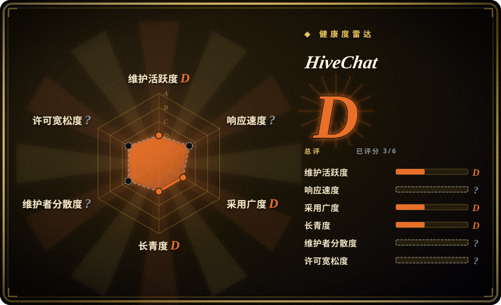
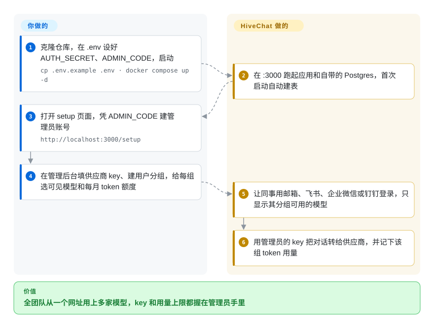

# HiveChat

一款可自托管、由管理员统一管理的中小团队 AI 聊天应用：管理员一次配好多家大模型供应商（OpenAI、Claude、Gemini、DeepSeek、Ollama 以及任意 OpenAI 兼容服务），整个团队据此聊天，并按用户分组控制可见模型与 token 配额。

## 何时使用

你是一家 5–50 人公司的技术负责人或 IT 管理员，团队不断要 ChatGPT/Claude 的使用权限。你不想给每家厂商都买席位、不想把原始 API key 发给每个人、也不想让用量无上限地跑；同时你更不愿把内部对话送进一个你无法审计的第三方 SaaS。你想要一个地方：API key 握在*你*手里，由你决定销售组和工程组各能看到哪些模型，给每个分组设月度 token 上限，并且用飞书/钉钉/企业微信登录来拉人进来，而不是再发一套账号密码。

HiveChat 正是为这个形态设计的。你部署一次（Docker Compose 自带 Postgres，或在 Vercel 一键部署），访问 `/setup` 用 `ADMIN_CODE` 建管理员账号，然后在管理后台加供应商和模型。用户登录后从你为其分组开放的模型里挑选，带图片理解、LaTeX/Markdown 渲染、DeepSeek 思维链展示和 MCP 工具服务器；与此同时你在管理端盯着配额。它占的是「自托管、覆盖多家模型 API 的团队前端」这个位置，既不是个人单用户的把玩工具，也不是从零搭聊天的框架。

## 怎么用起来

HiveChat 就是一个 Next.js 网页应用加一个 PostgreSQL 数据库，库里存用户、分组、供应商 key 和对话记录。**聊天界面、管理后台、各家模型的对接代码（OpenAI、Claude、Gemini，外加一个通用的 OpenAI 兼容接口）和团队登录都是它自带的**——你只管把它跑起来、建好管理员，然后**配置**谁能看到哪些模型、每个分组每月能花多少 token。管理员账号靠一个共享暗号开通：你在 env 文件里写好 `ADMIN_CODE`，谁在 `/setup` 页面报出这个暗号，谁就成为管理员。此后每次对话都是同事浏览器向 HiveChat 服务端发的请求，服务端拿着只有管理员见过的 key 去调供应商，再把用量记到这位同事所在的分组上。Docker 镜像不带升级用的数据库迁移脚本——README 让测试用户升级后直接删掉 Postgres 数据卷重新初始化，所以真正有升级路径的是 Vercel 和本地 `npm run initdb` 这两条。

<!-- flow-steps:begin (generated from flows/hivechat.json by tools/flow_card.py — do not edit) -->

流程文字版

1. **你**：克隆仓库，在 .env 设好 AUTH_SECRET、ADMIN_CODE，启动 — `cp .env.example .env · docker compose up -d`
2. **HiveChat**：在 :3000 跑起应用和自带的 Postgres，首次启动自动建表
3. **你**：打开 setup 页面，凭 ADMIN_CODE 建管理员账号 — `http://localhost:3000/setup`
4. **你**：在管理后台填供应商 key、建用户分组，给每组选可见模型和每月 token 额度
5. **HiveChat**：让同事用邮箱、飞书、企业微信或钉钉登录，只显示其分组可用的模型
6. **HiveChat**：用管理员的 key 把对话转给供应商，并记下该组 token 用量

**价值**：全团队从一个网址用上多家模型，key 和用量上限都握在管理员手里

<!-- flow-steps:end -->

## 何时不用

- **你是单个用户，想要本地/个人聊天客户端。** 它整套模型都是管理员对团队（Postgres、用户分组、配额、`/setup` 管理流程）。一个人用，Cherry Studio、Chatbox 这类桌面客户端或个人版 LibreChat 更轻。
- **你要纯本地、无服务器、离线运行。** HiveChat 强制依赖 PostgreSQL 后端和一个常驻的 Node/Next.js 服务进程，没有 SQLite 或完全本地的单二进制模式。
- **你需要一个还有人在发版的软件——它看起来已经休眠。** 自 **2025-09-16** 起再无提交（截至 2026-10-08 已超过 12 个月），版本仍是 `v0.1.0`，没有任何 git tag 或 release。需要长期打补丁的团队部署，改用 [LibreChat](../llm-chat-ui/librechat.zh.md) 或 [Open WebUI](../llm-chat-ui/open-webui.zh.md)；只有你愿意自己维护一个 fork 时才选 HiveChat。
- **你要做无版权顾虑的 fork 或转售衍生品。** 许可证是 Apache-2.0 *外加商业附加条款*：构建并分发衍生作品需要向作者另行获取商业授权，这并非纯粹的 Apache-2.0。
- **你需要内置之外的可插拔企业 SSO（SAML/OIDC/LDAP）。** 认证为邮箱密码加飞书、钉钉、企业微信；未宣称支持通用企业 IdP 对接。
- **你要的是自托管 RAG / 文档知识库平台。** 它是覆盖模型 API（加 MCP 工具）的聊天前端，不是文档摄取 / 向量检索的知识库。

## 横向对比

| 替代品 | 是否收录 | 我们的评价 | 取舍 |
|---|---|---|---|
| [LibreChat](../llm-chat-ui/librechat.zh.md) | ✅ | 需要更成熟、更大功能面，包括 RAG、assistants、代码解释器和多种认证后端时，选 LibreChat。 | MIT 许可且功能更广，但运维更重，也不如 HiveChat 专注小团队管理员-配额流程。 |
| [Open WebUI](../llm-chat-ui/open-webui.zh.md) | ✅ | 本地模型服务、RBAC 和 pipelines 比多云供应商配额更重要时，选 Open WebUI。 | 更广也更活跃，但甜点区是 Ollama/本地模型服务，而不是 HiveChat 的按组配额定位。 |
| Lobe Chat | 未收录 | 需要面向个人/进阶玩家的精致多服务商 UI、插件和自托管时，选 Lobe Chat。 | 不那么围绕 token 配额做集中式管理员团队治理。 |
| Chatbox / Cherry Studio | 未收录 | 每个人各自带 key，且不需要中心治理时，选桌面客户端。 | 没有中心管理员、分组、配额或共享服务端。 |
| ChatGPT Team / Claude Team（SaaS） | 未收录 | 能接受零运维和锁定单一模型家族时，选托管团队 SaaS。 | HiveChat 用自托管、多供应商选择和密钥/数据掌控换取这份便利的反面。 |

## 技术栈

- **语言：** TypeScript（约占仓库 99%），少量 CSS/JS/Dockerfile。
- **框架：** Next.js 14（App Router）+ React 18；UI 用 Ant Design 5 + Tailwind CSS。
- **认证：** NextAuth（next-auth 5 beta）配 Drizzle adapter；邮箱密码加飞书/钉钉/企业微信。
- **数据：** PostgreSQL，经 Drizzle ORM（`postgres` / `@neondatabase/serverless` 驱动）；用 `drizzle-kit` 做 schema push 和 seed 脚本。
- **模型 SDK：** `@anthropic-ai/sdk`、`openai`、`@google/generative-ai`，其余长尾走 OpenAI 兼容 HTTP（DeepSeek、Moonshot、火山、千帆、混元、智谱、OpenRouter、Grok、Ollama、SiliconFlow、自定义）。
- **附加：** `@modelcontextprotocol/sdk`（MCP，SSE 模式）、KaTeX + react-markdown/rehype 做数学/Markdown、`@agentic/tavily` 做网络搜索、`sharp` 处理图片、Zustand 管状态。

## 依赖

- **运行时：** Node.js（Next.js 14 服务端）——需常驻服务进程，不是静态站点。
- **数据库：** 强制 PostgreSQL。自托管可用 Docker Compose 自带 Postgres，或在 Vercel 一键路径上用 Neon serverless Postgres。本地部署路径用 `npm run initdb` 初始化/迁移 schema（每次升版本也要重跑）；Docker Compose 路径在首次启动时自动建表，但不带升级迁移。
- **配置：** 环境变量，包括首次经 `/setup` 路由建管理员所需的 `ADMIN_CODE`；供应商 API key 通过管理后台录入/存储。
- **可选：** Ollama 或任意 OpenAI 兼容端点接本地/额外模型；MCP 服务器（SSE）接工具；Tavily key 做网络搜索。

## 运维难度

**低到中。** 顺路径——在 `.env` 里设好 `ADMIN_CODE`、`docker compose up -d`（app + Postgres，首次启动自动建表）、访问 `/setup`——对单个小部署确实简单，而 Vercel + Neon 这条路更是完全免去服务器管理。一旦你认真自托管数据库，难度升到**中**：Postgres 备份要你自己扛、每次升级都要迁移（本地路径要重跑 `npm run initdb`；Docker 路径根本不带升级 SQL；且没有发布版本可锁，只能跟着一个本身已经停下的 `main`）、TLS/反向代理、众多供应商 key 的 secret 存储，以及企业登录（飞书/钉钉/企业微信）的回调配置。作为早期 `v0.1.0` 单一开发方项目，预期要读源码并跟仓库盯破坏性变更。

## 健康度与可持续性

- **响应速度**：无法计算——no_traffic。
- **维护——休眠。** 最后一次提交在 **2025-09-16**，截至 2026-10-08 已超过 12 个月没有提交；未归档，但一个 `v0.1.0` 项目沉寂一整年是休眠信号，不是暂停。**完全没有 git tag 或 GitHub release**——版本是 `package.json` 里的 `0.1.0`，既没有 semver 可锁，也没有升级路径可跟。
- **治理 / bus factor——单一厂商，体量很小。** 仓库为 **Organization** 所有（`HiveNexus/HiveChat`），但约 1.2k star，且是早期单厂商节奏；路线图握在一个小团队手里。低采用 + 休眠，在这里是真实的弃坑风险组合。
- **年龄与 Lindy——年轻（创建于 2025-02，约 1.6 年）且如今沉寂。** 还不够老到拿到 Lindy 先验，而近期的沉寂进一步侵蚀了这点——一个停止 push 的年轻项目，趋向“过不了 Lindy”的象限，而非“强 Lindy”。在拿团队部署下注前，先确认仓库仍在推进。
- **风险标志——非纯净许可证。** Apache-2.0 **外加商业附加条款**（2026-10-08 读 `LICENSE` 原文确认）：不改源码、当作前后端服务商用是允许的，但开发并分发衍生作品需向作者另行获取商业授权。这*不是*纯 Apache-2.0——商用或 fork/转售前请先读 `LICENSE`。内部自托管使用似乎不受影响，但请确认。

## 存疑（未验证）

- [未验证] star 数约 1.2k 取自 2026-10-08 的 GitHub API（最后提交 2025-09-16）；GitHub star 不可靠，仅供参考。
- [推断] “休眠”只根据提交历史判断（2025-09-16 之后无提交）；没找到维护方的弃用声明，厂商也可能在别处继续开发。
- [推断] 许可证：GitHub 报 `NOASSERTION`；`LICENSE` 文件是 Apache-2.0 加针对衍生作品的商业条款。frontmatter 为工具链保留 `Apache-2.0`，但你内部的某个改动算不算“分发衍生作品”，是本页不做的法律判断——把改过的版本交给客户之前请咨询律师。
- [未验证] 所支持的模型供应商清单、认证集成（飞书/钉钉/企业微信）与能力（MCP SSE、图片理解、网络搜索）均取自 README；依赖前请对照当前代码/管理后台核实。
- [推断] 对比结论（LibreChat/Open WebUI/Lobe Chat 更广或更成熟、桌面客户端缺中心管理）反映的是项目大致定位，不是基准化的正面对比；LibreChat 和 Open WebUI 已收录，Lobe Chat、桌面客户端和团队 SaaS 未收录。
- [推断] token 额度是在每次请求时强制执行（超额就拦下对话），而不只是展示，这是从 README 的“按分组设置每月 Token 限额”功能推断的；没读执行这部分的代码。
- [推断] 「中小团队」规模（约 5–50 人）是示意性框定，不是文档明确的硬上限；未找到公开的规模/负载数据。
