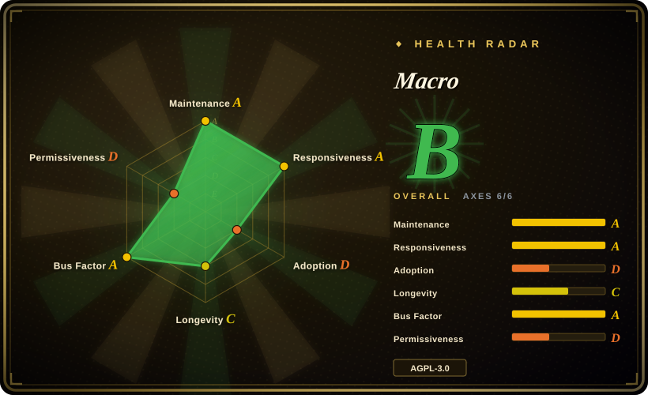
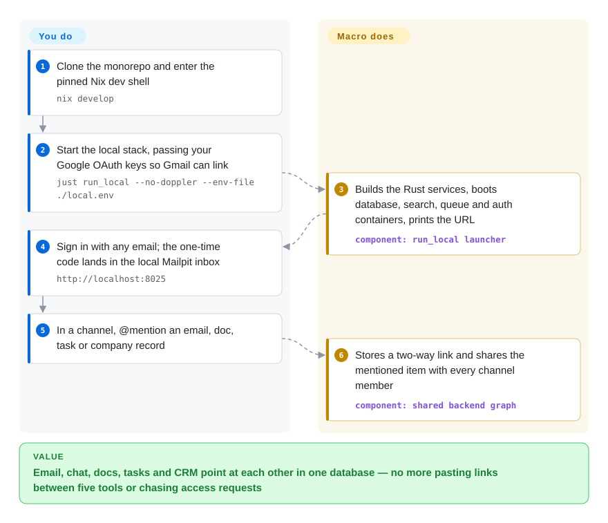

# Macro

Your team's decisions are split across Slack threads, Linear tickets, Notion pages, a CRM and five Gmail inboxes, so "what's the latest on the Acme deal?" means searching all of them — and an AI agent has the same problem. Macro puts email, chat, docs, tasks, calls and CRM into one app with one database, where anything can be @-mentioned from anything else and agents read the same linked record.

## When to use

You run a 10–40 person startup. A customer email says the export is broken; someone screenshots it into Slack, an engineer opens a Linear ticket that links to nothing, the account manager updates HubSpot a week later, and the answer to "did we fix it for them?" lives in four places that do not know about each other. You have also started pointing Claude Code at all of this through separate MCP servers, and it still misses the call where the real decision was made.

You reach for Macro when you are willing to *replace* those tools rather than glue them: its email client (Gmail only), channels, Linear-style tasks, CRDT-based markdown docs, canvas, call recording and CRM share one backend, so an @mention of an email inside a task is a stored two-way link, and mentioning something in a channel shares it with that channel's members. Pick it over [Mattermost](mattermost.md) or [Zulip](zulip.md) when chat alone is not the problem and the pain is the seams *between* chat, mail, tickets and customer records; pick it over Huly (the closest all-in-one tracker+chat+docs, now frozen upstream) when you want an email client and CRM in the same graph, an MCP surface meant for agents, and a vendor that is still actively shipping. The deciding tradeoff: you get one linked system instead of five, but you are betting on a young, VC-backed vendor whose hosted SaaS is the primary product and whose self-host path is still a developer stack.

## How it works

Macro is a monorepo: a SolidJS client (browser, Tauri desktop, iOS) talking to ~40 Rust services and workers over PostgreSQL, Redis, OpenSearch (the search engine) and Kafka (the event queue between services), with FusionAuth handling login. The key idea is that every surface is purpose-built but writes into the same backend, so a reference between a doc and a task, or a message and an email, is a row both sides can see — like a wiki's backlinks, but across your inbox, tickets and customer list. Docs sync live through a CRDT — a data structure that lets two editors change the same text at once and merge without conflicts — served by a Cloudflare Workers service, and AI agents join those edits as ordinary peers. You supply the accounts and API keys (Google OAuth for Gmail, model providers, Stripe if you bill) and decide what goes in which channel; Macro does the linking, the channel-based sharing, the search across every block, and a nightly job that rewrites a markdown "team memory" its agents and MCP clients read. Most teams use the hosted app at macro.com; the path below is the repo's own way to run the whole stack yourself.

<!-- flow-steps:begin (generated from flows/macro.json by tools/flow_card.py — do not edit) -->

Text version of the flow

1. **You**: Clone the monorepo and enter the pinned Nix dev shell — `nix develop`
2. **You**: Start the local stack, passing your Google OAuth keys so Gmail can link — `just run_local --no-doppler --env-file ./local.env`
3. **Macro**: Builds the Rust services, boots database, search, queue and auth containers, prints the URL — component: `run_local launcher`
4. **You**: Sign in with any email; the one-time code lands in the local Mailpit inbox — `http://localhost:8025`
5. **You**: In a channel, @mention an email, doc, task or company record
6. **Macro**: Stores a two-way link and shares the mentioned item with every channel member — component: `shared backend graph`

**Value**: Email, chat, docs, tasks and CRM point at each other in one database — no more pasting links between five tools or chasing access requests

<!-- flow-steps:end -->

## When NOT to use

- **You just need self-hosted team chat.** Use [Mattermost](mattermost.md) or [Zulip](zulip.md): each is one service you can run from packaged releases, with a decade of production use. Macro's chat is one block of a ~40-service system you would have to build from source.
- **You need a supported, production self-host today.** The FAQ says self-hosting "hasn't been our primary focus" as of June 2026; there are no official prebuilt server images (issue #6447, open, maintainer: "in the pipeline"), the documented path is a developer stack (`just run_local`, LocalStack standing in for AWS, fixed test secrets), and the production infra in `infra/stacks/` is Pulumi for AWS plus Cloudflare Workers. If the requirement is "runs on our own box with a runbook", pick Mattermost or Zulip for chat; Huly has a Docker self-host bundle, but its upstream repo is frozen (see Comparison).
- **Your mail is on Microsoft 365, IMAP or your own server.** The email block is a Gmail/Google Workspace client, not a mail server; Outlook account linking merged in August 2026 but the Outlook mail adapter was still an open issue (#5670) on 2026-09-28. Stay with your current client until that ships.
- **You only want a CRM, or only a docs/whiteboard tool.** Use Twenty for a standalone CRM with its own data model and API, or AFFiNE for docs + whiteboard + local-first knowledge base; Macro's CRM and canvas deliberately stay thin and only pay off when the rest of the team's work lives in Macro too.
- **You plan to embed or fork it inside a closed product.** It is AGPL-3.0 with a CLA and a paid alternative license (`licensing@macro.com`); a network-served derivative must be released under AGPL. Pick an MIT/Apache base (Zulip, AFFiNE's MIT parts) if that is a blocker.
- **You need calls, auth and analytics to be fully open and self-contained.** The FAQ says the hosted product sublicenses LiveKit (calls), FusionAuth (auth) and PostHog (analytics), so a self-hoster must hold their own licenses for those services or turn them off.
- **You want a multi-year bet on a stable platform.** The public repo dates from November 2025 and ships several calendar-versioned releases a day; there is no LTS line or stability promise. Mattermost or Zulip carry a far longer track record.

## Comparison

| Alternative | In index | Our verdict | Tradeoff |
|---|---|---|---|
| [Mattermost](mattermost.md) | ✅ | Choose Mattermost when the job is self-hosted Slack-style chat with calling and enterprise compliance; choose Macro only when the pain is the seams between chat, email, tickets and CRM. | Mattermost is one Go binary over PostgreSQL with packaged releases and mature ops, but mail, docs and CRM stay separate tools; Macro links them but asks you to adopt all its blocks and run a ~40-service stack. |
| [Zulip](zulip.md) | ✅ | For an async engineering team that wants topic-threaded chat under Apache-2.0 on its own host, pick Zulip; pick Macro when tasks and customer email must live in the same threads. | Zulip has a clean permissive license and a supported installer; Macro's inline-collapsing threads aim at the same focus problem but come bundled with an AGPL, vendor-steered, hosted-first platform. |
| [Buzz](buzz.md) | ✅ | If agents must be key-holding members with a signed audit trail and git hosting in the same log, pick Buzz; if the team's work is really email, CRM and tickets, pick Macro. | Both are young and agent-first; Buzz is Apache-2.0 with a real single-node Compose bundle but no mail or CRM, Macro has the broader business surface but no packaged self-host. |
| Huly (hcengineering/platform) | 未收录 | Treat the original Huly repo as frozen: its README says it is no longer maintained and hosted Huly shut down, with development moved to Platform-Collective/platform (created 2026-06); pick it only if an existing Docker self-host (`huly-selfhost`) is what you need and you accept a community continuation, otherwise Macro is the actively shipped all-in-one. | Huly (EPL-2.0) covers chat, project management, CRM, HRM and ATS with a documented Docker self-host, but its vendor-hosted service ended for lack of funding — the same failure mode a hosted-first Macro could hit. Not added in this tab-intake batch. |
| Twenty (twentyhq/twenty) | 未收录 | When you only need a modern open CRM with its own API and data model, pick Twenty; pick Macro when deal context must come from the same chat and inbox the team already uses. | Twenty is a focused CRM (AGPL core, `@license Enterprise` files under a commercial license); Macro's CRM is thin by design and only pays off inside the whole workspace. Not added in this tab-intake batch. |
| AFFiNE (toeverything/AFFiNE) | 未收录 | For docs, whiteboards and a local-first knowledge base, pick AFFiNE; pick Macro when those docs must @-link live emails, tasks and customer records. | AFFiNE's client is MIT (its server directory has its own license) and it works without a team backend; Macro's docs are CRDT-synced but tied to its full service stack. Not added in this tab-intake batch. |

## Tech stack

- **Backend:** a Rust Cargo workspace (~167 crates, ~40 deployable services/workers/Lambda handlers under `services/`), Axum + Tokio, `sqlx` over PostgreSQL with `pgvector`; services follow a hexagonal (ports-and-adapters) layout per `docs/STYLE_GUIDE.md`.
- **Frontend:** SolidJS + Vite in `apps/web`, packaged for browser, Tauri desktop and mobile (an iOS app is published); the editor is Lexical, collaboration uses the Loro CRDT (`loro-crdt`, `packages/loro-mirror`).
- **Realtime & sync:** `sync-service` is a Cloudflare Workers project (`wrangler.toml`), plus a WebSocket service and a Lexical service; search is OpenSearch; events flow through Kafka.
- **Auth & infra:** FusionAuth for identity; Pulumi stacks in `infra/stacks/` target AWS (Lambda, OpenSearch, Kafka, S3/CloudFront); Doppler for team secrets; Nix flake + `just` + Bun as the developer toolchain.
- **Agents:** an MCP service (`mcp_service`, hosted at `mcp-server.macro.com`), an agent harness service and a coding-agent worker; model calls go to OpenAI/Google/Anthropic through a model picker.

## Dependencies

- **To self-host / develop:** Nix (supplies Rust, Bun, `just`, sqlx, zig), a Docker runtime, and enough machine to compile the Rust services; the stack brings PostgreSQL, Redis, LocalStack (standing in for AWS), OpenSearch, Kafka, FusionAuth and Mailpit in containers.
- **For real integrations:** Google OAuth client keys (Gmail and Google login), GitHub OAuth keys, Stripe keys, CloudFront signing keys — each falls back to a stub that disables that integration.
- **For AI features:** API keys for the model providers you route to [推断: provider env vars appear in the agent/editing workers; the full set needed for a self-hosted install is not documented].
- **For calls, auth and analytics in production:** your own LiveKit, FusionAuth and PostHog arrangements, per the FAQ.
- **Hosted path instead:** a macro.com account plus Gmail/Google Workspace; external agents connect via `claude mcp add --transport http macro https://mcp-server.macro.com/mcp`.

## Ops difficulty

**Low as a hosted user; high to self-host.** Using macro.com is a signup plus Gmail OAuth. Running it yourself means compiling a large Rust workspace, operating seven stateful infrastructure components, supplying OAuth apps for Google/GitHub, replacing LocalStack with real AWS (or equivalents) and a Cloudflare Workers deployment for document sync, and tracking a monorepo that releases several times a day with no LTS. The repo's own tooling is good for developers (`just doctor-local`, snapshot-cached init, named instances, bundled Grafana LGTM tracing), but it is a contributor environment, not an appliance — the local stack uses fixed test secrets and the docs warn it is not safe to expose.

## Health & viability

- **Maintenance — extremely active.** As of 2026-09-28 the repo had ~6,080 commits since it was created on 2025-11-08, 100+ calendar-versioned releases since 2026-06-11 (often several a day), and a push the same day. Activity is not the risk.
- **Governance / bus factor — one venture-backed company.** macro-inc (an Organization) owns the roadmap; the top contributors are a dozen employees with 400–900 commits each, so it is not a solo project. The FAQ states ~$30M raised led by a16z. There is no foundation or neutral steward; outside contributors must sign a CLA and open an issue first.
- **Age & Lindy — young in public.** The public repo is under a year old, although the team says it dogfooded Macro for two years before; that earlier history is not in the repo. No Lindy credit — treat it as a startup bet.
- **Adoption — early.** ~4.5k stars and ~430 forks (2026-09); the README asks for stars as its main discovery channel, so read the count as attention, not production adoption. Real-world usage beyond the vendor's own customers is unverified.
- **A cautionary peer.** Huly, the closest earlier all-in-one (Linear+Slack+Notion replacement), froze its main repo and shut down its hosted service when that hosting stopped being funded (per its README, checked 2026-09-28). Macro's AGPL code would survive a similar event, but a self-host path that is still developer-grade would make that survival hard to use.
- **Risk flags — licensing and business model.** Relicensed from BSL (source-available) to AGPL-3.0 on 2026-05-31. The combination of a CLA, a sold alternative license and a hosted-first revenue model means the vendor *can* relicense future versions; AGPL copies already released stay AGPL. Hosted SaaS is SOC 2 Type II per the README.

## Caveats (unverified)

- [未验证] Star (~4.5k), fork (~430), commit (~6,080) and release counts were read from the GitHub API on 2026-09-28 and drift quickly.
- [未验证] The "dogfooded for two years" claim and the ~$30M a16z-led raise come from the README and FAQ; no independent source was checked.
- [推断] Production self-hosting is judged immature from the FAQ wording, the open request for prebuilt images (#6447) and the AWS/Cloudflare-specific Pulumi stacks; nobody on this page ran a production self-host.
- [推断] The exact set of model-provider keys needed for AI features in a self-hosted install is not documented; it was inferred from env files in the agent and editing workers.
- [未验证] Whether the nightly team-memory job and the calls block work in a self-hosted stack (calls depend on a LiveKit arrangement) was not exercised.
- [未验证] Outlook mail support was reported as "coming in the next couple of weeks" by a maintainer on 2026-08-17; status after 2026-09-28 unknown.
- [未验证] Huly's frozen status and hosted shutdown come from its README banner on 2026-09-28; the health of the Platform-Collective continuation (42 stars, created 2026-06-26) was not assessed.
- [未验证] SOC 2 Type II / ISO 27001 status applies to the hosted service per the vendor's README; not independently checked.
