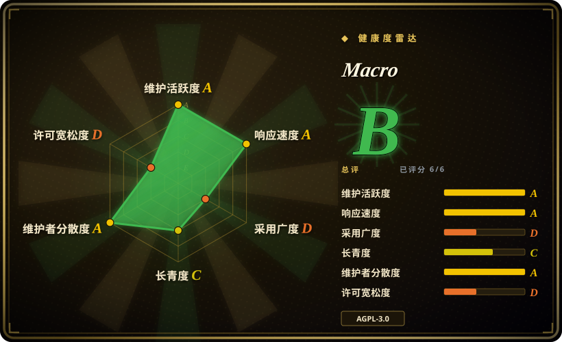
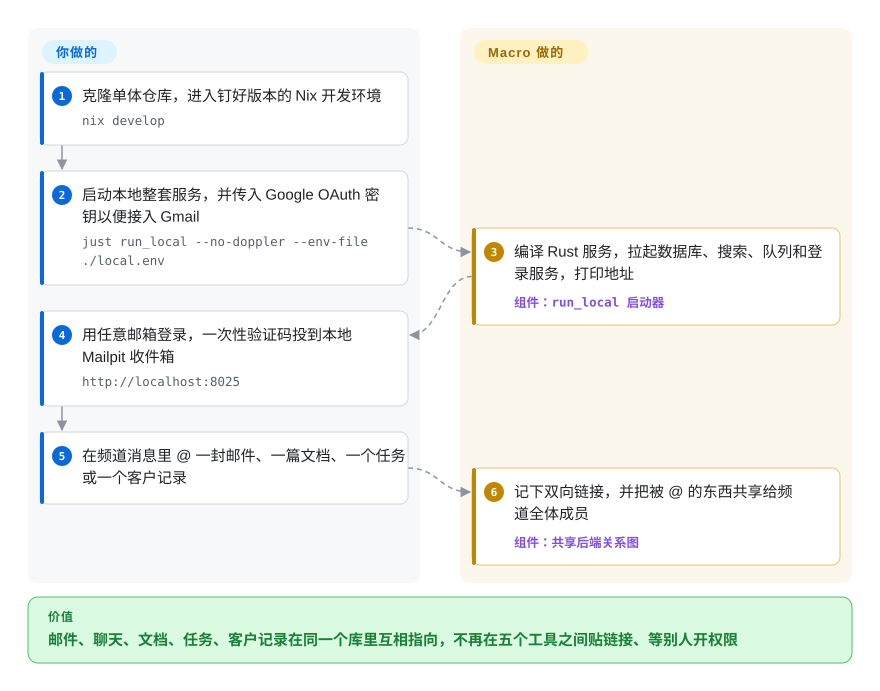

# Macro

团队的决定散落在 Slack 线程、Linear 工单、Notion 页面、CRM 和五个 Gmail 收件箱里，想知道“Acme 那单现在什么情况”就得挨个翻一遍，AI agent 也一样找不全。Macro 把邮件、聊天、文档、任务、通话录音和客户管理装进同一个应用、同一个数据库：任何东西都能在别处被 @ 引用，agent 读的也是这张连好的网。

## 何时使用

你在管一家 10 到 40 人的创业公司。客户来信说导出坏了；有人截图贴进 Slack，工程师开了一张谁也没链接的 Linear 工单，客户经理一周后才去 HubSpot 更新状态，“到底给他们修好没”这个问题的答案分散在四个彼此不认识的地方。你已经开始给 Claude Code 挂一堆 MCP 服务器去读这些工具，它还是会漏掉真正拍板的那通电话。

当你愿意**替换**这些工具、而不是继续用胶水粘它们时，就该想到 Macro：它的邮件客户端（只支持 Gmail）、频道、Linear 风格的任务、基于 CRDT 的 Markdown 文档、画布、通话录制和 CRM 共用一个后端，所以在任务里 @ 一封邮件会存成一条双向链接，在频道里 @ 什么就自动共享给频道成员。如果只是聊天本身有问题，选 [Mattermost](mattermost.zh.md) 或 [Zulip](zulip.zh.md)；痛点在聊天、邮件、工单、客户记录之间的缝隙时选 Macro。相比 Huly（最接近的“项目管理+聊天+文档”一体化方案，上游仓库已冻结），Macro 多了同一张关系图里的邮件客户端和 CRM、专门给 agent 用的 MCP 接口，而且厂商还在持续发版。决定性的取舍是：你用一个互相连通的系统换掉五个工具，但押注的是一家年轻的风投公司，它的主产品是托管 SaaS，自托管路径目前还是开发者环境。

## 怎么用起来

Macro 是一个单体仓库：SolidJS 客户端（浏览器、Tauri 桌面端、iOS）对接约 40 个 Rust 服务和后台任务，底下是 PostgreSQL、Redis、OpenSearch（搜索引擎）和 Kafka（服务之间传事件的消息队列），登录交给 FusionAuth。核心想法是每个界面都专门设计，但都写进同一个后端，所以文档和任务之间、消息和邮件之间的引用，是两边都看得见的一行数据——像维基的反向链接，只不过横跨收件箱、工单和客户名单。文档用 CRDT 实时同步（CRDT 是一种让两个人同时改同一段文字、事后自动合并不打架的数据结构），由一个 Cloudflare Workers 服务承载，AI agent 也以普通协作者身份参与编辑。你负责提供账号和密钥（接 Gmail 用的 Google OAuth、大模型服务商、要收费就再加 Stripe），并决定什么东西放进哪个频道；Macro 负责建链接、按频道共享、跨所有模块搜索，以及每晚重写一份 Markdown 格式的“团队记忆”，供它的 agent 和外部 MCP 客户端读取。多数团队直接用 macro.com 的托管版；下面这条路径是仓库自己给出的、把整套服务跑在你机器上的方式。

<!-- flow-steps:begin (generated from flows/macro.json by tools/flow_card.py — do not edit) -->

流程文字版

1. **你**：克隆单体仓库，进入钉好版本的 Nix 开发环境 — `nix develop`
2. **你**：启动本地整套服务，并传入 Google OAuth 密钥以便接入 Gmail — `just run_local --no-doppler --env-file ./local.env`
3. **Macro**：编译 Rust 服务，拉起数据库、搜索、队列和登录服务，打印地址 — 组件：`run_local 启动器`
4. **你**：用任意邮箱登录，一次性验证码投到本地 Mailpit 收件箱 — `http://localhost:8025`
5. **你**：在频道消息里 @ 一封邮件、一篇文档、一个任务或一个客户记录
6. **Macro**：记下双向链接，并把被 @ 的东西共享给频道全体成员 — 组件：`共享后端关系图`

**价值**：邮件、聊天、文档、任务、客户记录在同一个库里互相指向，不再在五个工具之间贴链接、等别人开权限

<!-- flow-steps:end -->

## 何时不用

- **你只需要自托管团队聊天。** 用 [Mattermost](mattermost.zh.md) 或 [Zulip](zulip.zh.md)：各自都是能从打包好的发行版部署的单个服务，有十年左右的生产使用史。Macro 的聊天只是一个约 40 个服务、需要从源码编译的系统里的一块。
- **你今天就需要一个有支持的生产级自托管。** FAQ 写明截至 2026 年 6 月自托管“不是我们的主要重心”；官方没有预构建的服务端镜像（issue #6447 仍开着，维护者回复“在计划中”），文档里的路径是开发者环境（`just run_local`，用 LocalStack 顶替 AWS，密钥是固定的测试值），而 `infra/stacks/` 里的生产基础设施是面向 AWS 的 Pulumi 加 Cloudflare Workers。如果要求是“有运维手册、能跑在我们自己的机器上”，聊天选 Mattermost 或 Zulip；Huly 有 Docker 自托管包，但它的上游仓库已冻结（见横向对比）。
- **你的邮件在 Microsoft 365、IMAP 或自建服务器上。** 邮件模块是 Gmail / Google Workspace 的客户端，不是邮件服务器；Outlook 账号关联在 2026 年 8 月已合并，但 Outlook 收发信适配器截至 2026-09-28 仍是未关闭的 issue（#5670）。在它上线前继续用你现有的客户端。
- **你只想要一个 CRM，或只想要文档/白板。** 单独的 CRM 用 Twenty，它有自己的数据模型和 API；文档 + 白板 + 本地优先知识库用 AFFiNE。Macro 的 CRM 和画布刻意做得很薄，只有团队其他工作也在 Macro 里时才划算。
- **你打算把它嵌进或分叉进一个闭源产品。** 它是 AGPL-3.0，贡献要签 CLA，另有付费的替代许可（`licensing@macro.com`）；通过网络提供服务的衍生作品必须以 AGPL 开源。如果这是硬约束，换一个 MIT/Apache 的底座（Zulip、AFFiNE 的 MIT 部分）。
- **你要求通话、认证、统计都完全开源且自成一体。** FAQ 写明托管版转授权使用了 LiveKit（通话）、FusionAuth（认证）和 PostHog（统计），自托管者要么自己拿这些服务的授权，要么关掉相应功能。
- **你要为一个稳定平台下多年的赌注。** 公开仓库始于 2025 年 11 月，每天按日历版本号发好几次版，没有 LTS 分支也没有稳定性承诺。Mattermost 或 Zulip 的历史要长得多。

## 横向对比

| 替代品 | 是否收录 | 我们的评价 | 取舍 |
|---|---|---|---|
| [Mattermost](mattermost.zh.md) | ✅ | 要自托管 Slack 式聊天加通话和企业合规，选 Mattermost；只有痛点在聊天、邮件、工单、CRM 之间的缝隙时才选 Macro。 | Mattermost 是跑在 PostgreSQL 上的单个 Go 二进制，有打包发行版和成熟运维，但邮件、文档、CRM 仍是各自的工具；Macro 把它们连起来，代价是整套模块一起采用，并运维约 40 个服务。 |
| [Zulip](zulip.zh.md) | ✅ | 异步工作的工程团队要在自己主机上跑按话题分线程、Apache-2.0 许可的聊天，选 Zulip；任务和客户邮件必须和讨论串在一起时选 Macro。 | Zulip 许可宽松干净、有官方安装器；Macro 的“前几条回复内联、其余折叠”也在解决专注问题，但捆绑的是一个 AGPL、厂商主导、以托管为主的平台。 |
| [Buzz](buzz.zh.md) | ✅ | 如果 agent 必须是持有密钥的成员、要有签名审计日志和同一日志里的 git 托管，选 Buzz；如果团队的工作其实是邮件、CRM 和工单，选 Macro。 | 两者都年轻且以 agent 为中心；Buzz 是 Apache-2.0，有真正可用的单机 Compose 包，但没有邮件和 CRM；Macro 业务面更广，却没有打包好的自托管。 |
| Huly（hcengineering/platform） | 未收录 | 把原 Huly 仓库视为已冻结：它的 README 写明不再维护、托管版已关停，开发转到 Platform-Collective/platform（2026 年 6 月新建）；只有你正需要现成的 Docker 自托管（`huly-selfhost`）并接受社区接续时才选它，否则持续发版的一体化方案是 Macro。 | Huly（EPL-2.0）覆盖聊天、项目管理、CRM、人事和招聘，有文档齐全的 Docker 自托管，但厂商托管服务因资金断供而关停——以托管为主的 Macro 也可能遇到同样的失败方式。本批次（标签页收录）未添加。 |
| Twenty（twentyhq/twenty） | 未收录 | 只需要一个现代的开源 CRM、有自己的 API 和数据模型，选 Twenty；商机上下文必须来自团队已在用的聊天和收件箱时选 Macro。 | Twenty 是专注的 CRM（核心 AGPL，标了 `@license Enterprise` 的文件走商业许可）；Macro 的 CRM 刻意做薄，只有在整个工作区里才有价值。本批次（标签页收录）未添加。 |
| AFFiNE（toeverything/AFFiNE） | 未收录 | 要文档、白板和本地优先的知识库，选 AFFiNE；文档必须实时 @ 链接邮件、任务和客户记录时选 Macro。 | AFFiNE 客户端是 MIT（服务端目录另有许可），没有团队后端也能用；Macro 的文档靠 CRDT 同步，但绑定它整套服务。本批次（标签页收录）未添加。 |

## 技术栈

- **后端：** Rust Cargo 工作区（约 167 个 crate，`services/` 下约 40 个可部署服务、后台任务和 Lambda 处理器），Axum + Tokio，`sqlx` 访问带 `pgvector` 的 PostgreSQL；按 `docs/STYLE_GUIDE.md`，服务采用六边形（端口与适配器）分层。
- **前端：** `apps/web` 里的 SolidJS + Vite，打包成浏览器版、Tauri 桌面端和移动端（已上架 iOS）；编辑器是 Lexical，协作用 Loro CRDT（`loro-crdt`、`packages/loro-mirror`）。
- **实时与同步：** `sync-service` 是一个 Cloudflare Workers 项目（`wrangler.toml`），另有 WebSocket 服务和 Lexical 服务；搜索用 OpenSearch；事件经 Kafka 流转。
- **认证与基础设施：** 身份认证用 FusionAuth；`infra/stacks/` 里的 Pulumi 栈面向 AWS（Lambda、OpenSearch、Kafka、S3/CloudFront）；团队密钥用 Doppler；开发工具链是 Nix flake + `just` + Bun。
- **Agent：** 一个 MCP 服务（`mcp_service`，托管地址 `mcp-server.macro.com`）、一个 agent harness 服务和一个 coding-agent worker；模型调用经模型选择器发往 OpenAI、Google、Anthropic。

## 依赖

- **自托管或开发：** Nix（提供 Rust、Bun、`just`、sqlx、zig）、一个 Docker 运行时，以及足够编译 Rust 服务的机器；整套环境会在容器里拉起 PostgreSQL、Redis、LocalStack（顶替 AWS）、OpenSearch、Kafka、FusionAuth 和 Mailpit。
- **真实集成：** Google OAuth 客户端密钥（Gmail 与 Google 登录）、GitHub OAuth 密钥、Stripe 密钥、CloudFront 签名密钥——缺哪个就回退成占位值，对应集成不可用。
- **AI 功能：** 你要路由到的大模型服务商的 API 密钥[推断：agent 与编辑 worker 的环境变量里出现了服务商密钥，但自托管所需的完整清单没有文档]。
- **生产环境的通话、认证与统计：** 按 FAQ，需要自己的 LiveKit、FusionAuth 和 PostHog 授权安排。
- **改走托管版：** 一个 macro.com 账号加 Gmail / Google Workspace；外部 agent 用 `claude mcp add --transport http macro https://mcp-server.macro.com/mcp` 接入。

## 运维难度

**当托管用户很低；自托管很高。** 用 macro.com 只要注册再授权 Gmail。自己跑则要编译一个大型 Rust 工作区、运维七个有状态的基础组件、为 Google/GitHub 申请 OAuth 应用、把 LocalStack 换成真实的 AWS（或等价服务）并为文档同步部署 Cloudflare Workers，还要跟上一个每天发好几次版、没有 LTS 的单体仓库。仓库自带的工具对开发者很友好（`just doctor-local`、带快照缓存的初始化、命名实例、内置 Grafana LGTM 链路追踪），但那是贡献者环境，不是开箱即用的设备——本地环境用的是固定测试密钥，文档也警告不要对外暴露。

## 健康度与可持续性

- **维护：极其活跃。** 截至 2026-09-28，仓库自 2025-11-08 创建以来约有 6,080 次提交，自 2026-06-11 起发了 100 多个日历版本号的版本（经常一天好几个），当天也有推送。活跃度不是风险所在。
- **治理与巴士因子：一家风投支持的公司。** macro-inc（组织账号）掌握路线图；头部贡献者是十来位员工，每人 400 到 900 次提交，不是单人项目。FAQ 写明由 a16z 领投、融资约 3000 万美元。没有基金会或中立托管方；外部贡献者必须签 CLA，并且先开 issue。
- **年龄与 Lindy：公开时间很短。** 公开仓库不到一年，团队自称此前已内部自用两年，但那段历史不在仓库里。没有 Lindy 加分——当作一次创业公司押注来看。
- **采用度：早期。** 约 4.5k star、约 430 fork（2026-09）；README 把求 star 当作主要获客渠道，所以这个数字代表关注度，不代表生产采用。厂商自有客户之外的真实使用情况未经核实。
- **可参照的前车之鉴。** 最接近的前一代一体化方案 Huly（替代 Linear+Slack+Notion）已冻结主仓库，并因托管经费断供关停了托管服务（据其 README，2026-09-28 查阅）。Macro 的 AGPL 代码在类似事件后仍然存在，但眼下还是开发者级别的自托管路径会让这份“存活”很难真正用起来。
- **风险信号：许可与商业模式。** 2026-05-31 从 BSL（源码可见）改为 AGPL-3.0。CLA、出售替代许可、以托管为主的收入模式三者叠加，意味着厂商**可以**为未来版本改许可；已经发布的 AGPL 版本仍然是 AGPL。按 README，托管版通过了 SOC 2 Type II。

## 存疑（未验证）

- [未验证] star（约 4.5k）、fork（约 430）、提交数（约 6,080）和发版数读自 2026-09-28 的 GitHub API，变化很快。
- [未验证] “内部自用两年”和“a16z 领投约 3000 万美元”来自 README 和 FAQ，未查独立来源。
- [推断] 生产级自托管不成熟，是根据 FAQ 措辞、仍未关闭的预构建镜像请求（#6447）以及只面向 AWS/Cloudflare 的 Pulumi 栈判断的；本页没有人实际跑过生产自托管。
- [推断] 自托管时 AI 功能需要哪些服务商密钥没有文档，是从 agent 与编辑 worker 的环境变量文件推断的。
- [未验证] 每晚的团队记忆任务和通话模块（依赖 LiveKit 授权）在自托管环境里能否工作，没有实际验证。
- [未验证] 维护者在 2026-08-17 说 Outlook 邮件支持“几周内上线”；2026-09-28 之后的状态未知。
- [未验证] Huly 已冻结、托管版关停的信息来自其 README 横幅（2026-09-28）；Platform-Collective 接续仓库（42 star，2026-06-26 创建）的健康度没有评估。
- [未验证] SOC 2 Type II / ISO 27001 资质按厂商 README 适用于托管服务，未独立核实。
