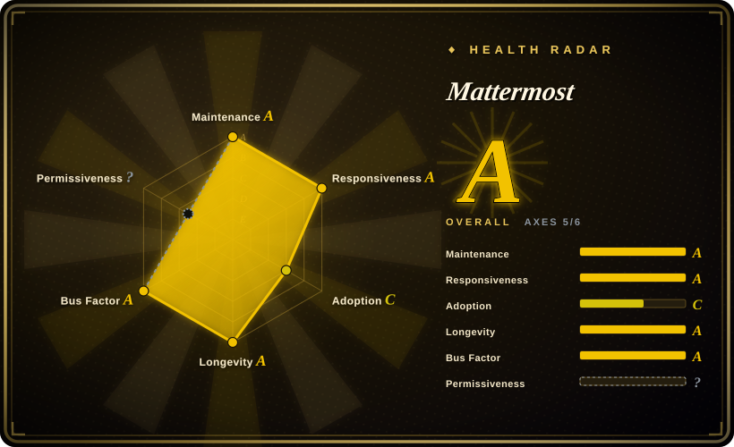

# Mattermost

An open-core, self-hosted collaboration platform — chat, workflow automation, voice calling, screen sharing, and AI integration — that ships as a single Go binary over PostgreSQL and publishes a compiled build monthly.

## When to use

You're the platform owner at an organization with compliance pressure — a bank, a hospital, a defense contractor, or a company that simply refuses to put internal chat on someone else's servers. You need Slack-shaped channels and threads that staff already understand, but you also need the controls an auditor asks about: SSO/LDAP, data retention and compliance export, and an integration catalog deep enough to connect CI, ticketing, and alerting without writing everything yourself.

You pick Mattermost over [Zulip](zulip.md) because your users want a familiar single-stream chat UX plus built-in voice/screen-share rather than topic-threaded asynchronous conversation. You pick it over [Rocket.Chat](rocket-chat.md) because the server is a single Go binary over PostgreSQL, not a Meteor monolith over MongoDB with a service fleet. The deciding tradeoff is open-core: you get a mature, single-binary core under a permissive license for the *official* build, but advanced enterprise capabilities sit behind a commercial license.

## When NOT to use

- **You plan to build from source and redistribute a compiled product.** `LICENSE.txt` grants MIT only to compiled versions *produced by Mattermost, Inc.* Source is offered under **AGPL-3.0** (with narrow Apache-2.0 exceptions for Admin Tools and Configuration Files: `server/templates/`, `server/i18n/`, `server/public/`, `webapp/`) or a commercial license. Self-compiling and distributing triggers AGPL copyleft — pick [Zulip](zulip.md) (Apache-2.0) or [Rocket.Chat](rocket-chat.md) (MIT Community Edition) instead.
- **You need the enterprise features without a subscription.** Compliance/advanced controls live under `server/enterprise/` with a separate `LICENSE.enterprise`; the open-core boundary is real. If you want everything permissively licensed, use Rocket.Chat CE (and accept its EE split) or a fully permissive project.
- **Your priority is asynchronous, topic-organized conversation.** Zulip's threading model is the differentiator; Mattermost is channel/thread-shaped like Slack.
- **You want agents as first-class signed members.** That is [Buzz](buzz.md); in Mattermost agents arrive as bots, integrations, or plugins with their own tokens, not as key-holding principals in the same audit log as humans.
- **You just need lightweight chat and want zero ops.** A hosted Slack/Discord, or a smaller tool, is less work than running PostgreSQL plus the optional services.
- **You need a federation protocol across independently owned servers.** Rocket.Chat ships native federation; Mattermost does not.

## Comparison

| Alternative | In index | Our verdict | Tradeoff |
|---|---|---|---|
| [Zulip](zulip.md) | ✅ | Choose Zulip when async, topic-threaded discussion and a cleanly permissive license matter most; choose Mattermost when you need Slack-like UX, built-in voice/screen-share, and a large plugin catalog. | Zulip organizes long conversations far better and is Apache-2.0 throughout, but its conversation model is unfamiliar to Slack users and it has no built-in calling. |
| [Rocket.Chat](rocket-chat.md) | ✅ | Choose Rocket.Chat for an app marketplace, omnichannel customer support, and federation; choose Mattermost when a single Go binary plus PostgreSQL is a materially simpler operational target. | Rocket.Chat's extension surface is broader, but you pay for it in MongoDB + microservices operations and an EE license split. |
| [Buzz](buzz.md) | ✅ | Choose Buzz when you specifically need humans and AI agents as co-equal signed members over one event log; choose Mattermost for a battle-tested chat platform whose agents are ordinary integrations. | Buzz is protocol-native and agent-first but pre-1.0 and heavy on new infrastructure; Mattermost is mature and boring in the good sense. |
| Slack / Microsoft Teams | 未收录 | Choose hosted SaaS when zero ops and the largest integration ecosystem outweigh data control; choose Mattermost when self-hosting and auditability are requirements. | SaaS removes infrastructure and upgrade burden, but you don't own the data plane and per-seat costs scale with headcount. |
| Mattermost Cloud | 未收录 | Choose the vendor cloud when you want Mattermost without operating it; choose self-hosted when data residency or air-gap is mandatory. | Managed hosting trades control for convenience and is not the OSS repo — the same distinction applies to every hosted tier. |

## Tech stack

- **Server:** Go (`server/`), distributed as a single Linux binary; PostgreSQL is the datastore. WebSocket + REST APIs, an interactive-message / slash-command / webhook model, and a plugin system (Go and TypeScript).
- **Clients:** React + TypeScript webapp (`webapp/`), React Native mobile apps, and an Electron desktop app.
- **Extras:** plugin marketplace integrations, bots, open-source and enterprise feature tiers, and an `server/enterprise/` boundary for gated capabilities.

## Dependencies

- **PostgreSQL** — the only required datastore (the README states the platform "relies on PostgreSQL").
- **Optional but common:** Redis (caching / HA coordination), S3-compatible object storage or MinIO (file uploads), Elasticsearch or OpenSearch (advanced search), an LDAP/AD or SAML IdP for SSO, SMTP for email, and a push-notification proxy for mobile.
- **Deployment:** Docker, an Ubuntu package / Omnibus installer, Kubernetes/Helm, or a plain tarball; a reverse proxy terminates TLS.
- The repository's dev compose wires Postgres, MinIO, inbucket (email), OpenLDAP, Elasticsearch, OpenSearch, Redis, Keycloak (SAML), Prometheus, and Grafana — a good map of the integration surface you may end up operating.

## Ops difficulty

**Low-to-medium for the core, rising with the enterprise surface.** The core is genuinely kind to operate: one Go binary plus PostgreSQL, deployed by Docker, Ubuntu package, or tarball, with monthly releases and LTS-style release lines. Difficulty climbs as you adopt the surrounding services — Redis, S3/MinIO, Elasticsearch/OpenSearch, LDAP/SAML, and the push proxy — each of which is another moving part to secure and monitor. A small team can run the core; a compliance-grade deployment is a real platform effort.

## Health & viability

- **Maintenance — steady and long-running.** Created 2015-06-15 (~11.3 years old at verification); pushes daily, maintains multiple stable release lines in parallel (e.g. v11.10.x, v11.9.x, v10.11.x) alongside `v12.0.0-rc1`, and releases a compiled build "every month on the 16th" per its README.
- **Governance / bus factor — company-owned, multi-maintainer.** Owned and steered by Mattermost, Inc.; the contributor list shows a deep bench (`jwilander`, `hmhealey`, `coreyhulen`, `crspeller`, `agnivade`, and more), so the project does not hinge on one person — but the roadmap and the license are the vendor's.
- **Backing & longevity — Lindy-favorable, with open-core caveats.** Eleven-plus years of continuous, still-active development is exactly the age × still-active pattern the Lindy prior rewards: a long-lived *active* project is a safer multi-year bet than a young one. The qualifier is open-core economics: features can move across the free/paid boundary over time, so a capability you depend on today may become licensed tomorrow.
- **Adoption & ecosystem — broad.** ~39.1k stars and ~9.0k forks, a large plugin/integration catalog, native mobile and desktop clients, and adoption in regulated industries. Documentation is extensive.
- **Risk flags — license is the one that matters.** The source-vs-binary license split (AGPL/commercial source, MIT for vendor builds) is a genuine legal trap for anyone compiling and redistributing; enterprise code is separately licensed. No relicense *surprise* on the binary path, but read `LICENSE.txt` before any source-based distribution.

## Caveats (unverified)

- [未验证] Star/fork counts (~39.1k / ~9.0k), the 2015-06-15 creation date, and GitHub-reported activity were read from the GitHub API on 2026-09-19; volatile numbers drift.
- [未验证] The specific list of gated enterprise capabilities is inferred from the presence of `server/enterprise/` and `LICENSE.enterprise`; the exact feature-by-feature boundary was not verified against the vendor's plan comparison.
- [未验证] "Over 700 integrations" and "releases every month on the 16th" are the README's own claims, not independently confirmed.
- [推断] The optional-service list (Redis, MinIO, Elasticsearch/OpenSearch, LDAP/SAML, push proxy) is derived from the repo's dev compose and public docs; which of them a given production topology actually needs depends on the features you enable.
- [推断] "Low-to-medium" ops difficulty assumes you run the core chat path; it is not a measured benchmark and rises materially with HA, compliance, and search configuration.
- [推断] The generated `health:` block cannot classify this composite `LICENSE.txt` (its preamble grants MIT for Mattermost-built binaries and AGPL-3.0-or-commercial for source, then embeds the Apache-2.0 text), so the license axis is recorded as `?` (unknown/`license_unparsed`) rather than a permissive grade. The file's preamble governs; the authoritative statement is this page's `license:` frontmatter.
