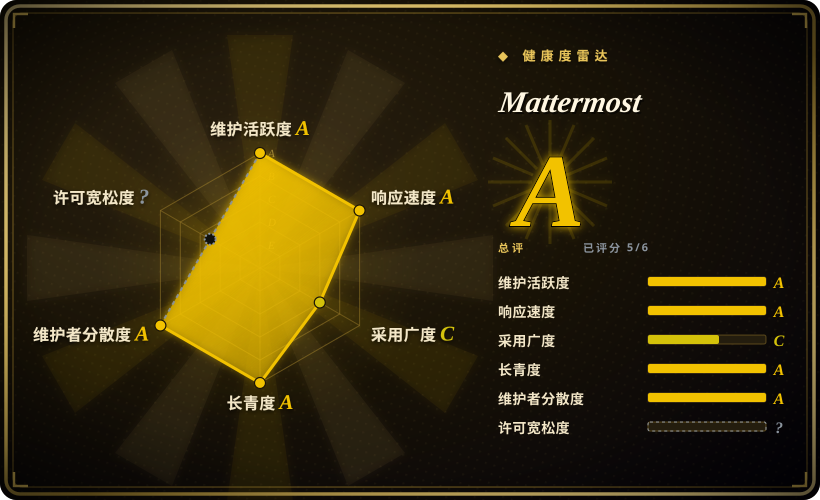

# Mattermost

开源自托管协作平台——聊天、工作流自动化、语音通话、屏幕共享与 AI 集成——以单个 Go 二进制跑在 PostgreSQL 之上，并每月发布一次编译版本。

## 何时使用

你是一个有合规压力的组织的平台负责人——银行、医院、国防承包商，或者一家就是不肯把内部聊天放在别人服务器上的公司。你需要员工已经熟悉的 Slack 式频道与线程，同时也需要审计会问的那些管控：SSO/LDAP、数据留存与合规导出，以及深到足以接上 CI、工单和告警而不用什么都自己写的集成目录。

你选 Mattermost 而不是 [Zulip](zulip.zh.md)，是因为用户想要熟悉的单流聊天体验，还想要内置的语音/屏幕共享，而不是话题式线程的异步讨论。你选它而不是 [Rocket.Chat](rocket-chat.zh.md)，是因为它的服务端是跑在 PostgreSQL 上的单个 Go 二进制，而不是 MongoDB 上的 Meteor 单体加一堆微服务。决定性取舍是 open-core：官方编译版给你成熟、单二进制的宽松许可核心，但高级企业能力锁在商业许可之后。

## 何时不用

- **你打算从源码自行编译并分发编译产物。** `LICENSE.txt` 只把 MIT 授予*由 Mattermost, Inc. 生成的*编译版本；源码是按 **AGPL-3.0** 提供（仅有 Admin Tools 与 Configuration Files 的窄例外：`server/templates/`、`server/i18n/`、`server/public/`、`webapp/`），或者走商业许可。自行编译并分发会触发 AGPL 的 copyleft——改用 [Zulip](zulip.zh.md)（Apache-2.0）或 [Rocket.Chat](rocket-chat.zh.md)（MIT 社区版）。
- **你想不订阅就用企业功能。** 合规与高级管控位于 `server/enterprise/`，另有 `LICENSE.enterprise`；open-core 的边界是真实存在的。想要全部宽松许可的功能，就用 Rocket.Chat 社区版（并接受它的 EE 切分），或用全宽松许可的项目。
- **你的优先级是异步、按话题组织的会话。** Zulip 的线程模型才是差异化所在；Mattermost 是 Slack 那种频道/线程形态。
- **你要 agent 作为一等的签名成员。** 那是 [Buzz](buzz.zh.md)；在 Mattermost 里 agent 是 bot、集成或插件，带各自的 token，不是与人同处一条审计日志的持钥主体。
- **你只要轻量聊天、想零运维。** 托管 Slack/Discord 或更小的工具，比跑 PostgreSQL 加一堆可选服务省事。
- **你需要跨独立服务端的联邦协议。** Rocket.Chat 内置联邦；Mattermost 没有。

## 横向对比

| 替代品 | 是否收录 | 我们的评价 | 取舍 |
|---|---|---|---|
| [Zulip](zulip.zh.md) | ✅ | 异步、话题式线程讨论与干净的宽松许可最重要时选 Zulip；需要 Slack 式体验、内置语音/屏幕共享与庞大插件目录时选 Mattermost。 | Zulip 组织长对话的能力好得多，且全程 Apache-2.0，但它的会话模型对 Slack 用户陌生，且没有内置通话。 |
| [Rocket.Chat](rocket-chat.zh.md) | ✅ | 要应用市场、全渠道客服与联邦时选 Rocket.Chat；单 Go 二进制加 PostgreSQL 显著更简单时选 Mattermost。 | Rocket.Chat 扩展面更广，代价是 MongoDB + 微服务运维与 EE 许可切分。 |
| [Buzz](buzz.zh.md) | ✅ | 明确需要人与 AI agent 作为同等签名成员共用一条事件日志时选 Buzz；要一个经受过考验、agent 只是普通集成的聊天平台时选 Mattermost。 | Buzz 协议原生、agent 优先，但 pre-1.0 且基础设施新；Mattermost 成熟，是「好的无聊」。 |
| Slack / Microsoft Teams | 未收录 | 零运维和最大集成生态胜过数据掌控时选托管 SaaS；自托管与可审计是硬需求时选 Mattermost。 | SaaS 免去基础设施与升级负担，但数据面不属于你，且按席位成本随人数增长。 |
| Mattermost Cloud | 未收录 | 想要 Mattermost 但不想自己运维时选厂商云；数据驻留或气隙是强制要求时选自托管。 | 托管用控制权换便利，且它不是本仓库的开源版——这条区别适用于所有托管层。 |

## 技术栈

- **服务端：** Go（`server/`），以单个 Linux 二进制分发；数据存储是 PostgreSQL。WebSocket + REST API，交互消息/斜杠命令/webhook 模型，以及插件体系（Go 与 TypeScript）。
- **客户端：** React + TypeScript 的 webapp（`webapp/`）、React Native 移动端，以及 Electron 桌面端。
- **其余：** 插件市场集成、bot、开源与企业两级功能，以及用 `server/enterprise/` 划出的受控能力边界。

## 依赖

- **PostgreSQL**——唯一必需的存储（README 明确说平台「relies on PostgreSQL」）。
- **常见但可选：** Redis（缓存 / 高可用协调）、S3 兼容对象存储或 MinIO（文件上传）、Elasticsearch 或 OpenSearch（高级搜索）、LDAP/AD 或 SAML IdP（单点登录）、SMTP（邮件），以及移动端的推送代理。
- **部署方式：** Docker、Ubuntu 包 / Omnibus 安装器、Kubernetes/Helm，或纯 tarball；由反向代理终结 TLS。
- 仓库的开发 compose 串起了 Postgres、MinIO、inbucket（邮件）、OpenLDAP、Elasticsearch、OpenSearch、Redis、Keycloak（SAML）、Prometheus 与 Grafana——这是你可能最终要运维的集成面的好地图。

## 运维难度

**核心低到中等，随企业面上升。** 核心确实好运维：一个 Go 二进制加 PostgreSQL，用 Docker、Ubuntu 包或 tarball 部署，每月发版并维护多条稳定线。难度随周边服务上升——Redis、S3/MinIO、Elasticsearch/OpenSearch、LDAP/SAML、推送代理，每一个都是新的要加固和监控的部件。小团队能跑核心；合规级部署则是一项真正的平台工程。

## 健康度与可持续性

- **维护——稳定且长期。** 创建于 2015-06-15（验证时约 11.3 年）；每日推送，并行维护多条稳定发布线（如 v11.10.x、v11.9.x、v10.11.x）并有 `v12.0.0-rc1`，README 称「每月 16 日」发布一次编译版本。
- **治理 / bus factor——公司所有、多维护者。** 由 Mattermost, Inc. 拥有并主导；贡献者名单显示后备充足（`jwilander`、`hmhealey`、`coreyhulen`、`crspeller`、`agnivade` 等），项目不押在一个人身上——但路线图和许可证是厂商的。
- **背书与长期性——Lindy 有利，但带 open-core 保留项。** 十一年以上持续且仍在活跃的开发，正是 Lindy 先验奖励的「年龄 × 仍活跃」模式：长期*活跃*的项目比年轻项目更适合做多年赌注。保留项是 open-core 经济学：功能可能随时间在免费/付费边界移动，你今天依赖的能力明天可能变成授权功能。
- **采用与生态——广。** 约 3.91 万 star 与约 9.0k fork，庞大的插件/集成目录，原生移动与桌面客户端，并在受监管行业被采用。文档很全。
- **风险旗——许可证是唯一要紧的那个。** 源码与二进制的许可切分（源码 AGPL/商业，厂商编译版 MIT）对任何自行编译再分发的人是真实的法律陷阱；企业代码单独授权。二进制路径上没有改许可的*意外*，但任何基于源码的分发前都要读 `LICENSE.txt`。

## 存疑（未验证）

- [未验证] star/fork 数（约 3.91 万 / 约 9.0k）、2015-06-15 的创建日期与 GitHub 活动数据，取自 2026-09-19 的 GitHub API；易变数字会漂移。
- [未验证] 受控企业能力的具体清单，是从 `server/enterprise/` 与 `LICENSE.enterprise` 的存在推断的；逐项功能的准确边界未与厂商的套餐对比核实。
- [未验证] 「700+ 集成」与「每月 16 日发版」是 README 自身的说法，未独立确认。
- [推断] 可选服务清单（Redis、MinIO、Elasticsearch/OpenSearch、LDAP/SAML、推送代理）来自仓库开发 compose 与公开文档；具体生产拓扑需要哪些，取决于你启用了哪些功能。
- [推断] 「低到中等」运维难度假设你只跑核心聊天路径；它不是实测基准，开启高可用、合规与搜索配置后会显著上升。
- [推断] 机器生成的 `health:` 块无法归类这份组合式 `LICENSE.txt`（其开头声明：Mattermost 自建二进制为 MIT、源码为 AGPL-3.0 或商业许可，随后内嵌 Apache-2.0 全文），因此许可轴记为 `?`（未知 / `license_unparsed`），而非宽松档。实际条款以该文件开头声明为准；权威表述以本页 frontmatter 的 `license:` 为准。
