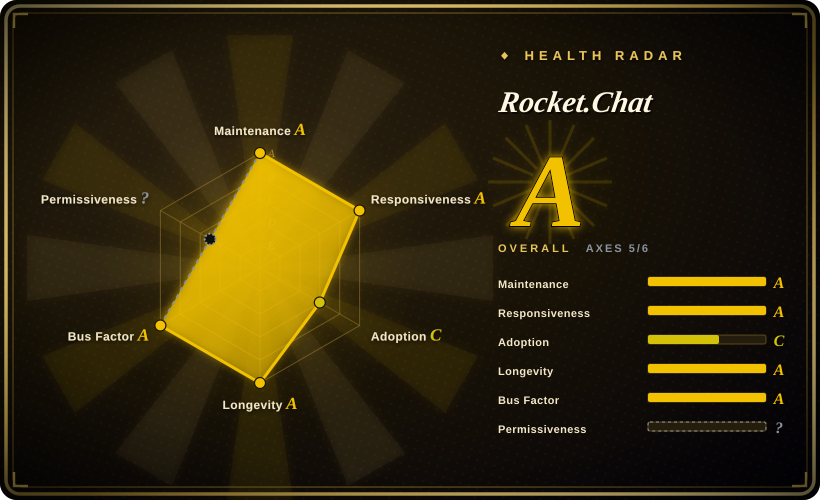

# Rocket.Chat

A TypeScript/Meteor-based communications platform for organizations that need chat, omnichannel customer support, an app marketplace, and federation — with a permissively licensed Community Edition and a separately licensed Enterprise Edition.

## When to use

You're building a communications platform, not just deploying a chat app. You need one system that handles internal team channels *and* inbound conversations from external customers — web widgets, email, live chat, social channels — with a marketplace of installable apps, an SDK for custom integrations, and optionally native federation so you can talk to other independently operated Rocket.Chat servers. Your organization may also have an air-gapped or high-security requirement that rules out most SaaS.

You pick Rocket.Chat over [Mattermost](mattermost.md) because the Apps-Engine marketplace and omnichannel (customer-facing) surface are deeper, the core is MIT rather than an AGPL/commercial source split, and federation ships natively. You pick it over [Zulip](zulip.md) because you want Slack-shaped channels plus voice/video and an extension marketplace rather than a topic-threaded focused chat server. The deciding tradeoff is operational weight: Rocket.Chat is a large monorepo that has decomposed into multiple services with MongoDB and NATS, so you are running a platform, not a binary.

## When NOT to use

- **You want a small operational footprint.** Rocket.Chat's modern deployment is a service fleet (account, authorization, presence, streamer, queue-worker services) over MongoDB with NATS as the transport and a reverse proxy in front. If you want one binary plus a database, use [Mattermost](mattermost.md); for a single-purpose chat server, use [Zulip](zulip.md).
- **You want every feature permissively licensed.** Only the Community Edition is MIT; everything under `apps/meteor/ee/` and `ee/` is governed by a separate EE license that requires a valid subscription for production use. If an ungated permissive license is mandatory, use [Zulip](zulip.md).
- **You can't or won't operate MongoDB (with oplog/replica set) and NATS.** These are load-bearing; the local compose wires `MONGO_URL`, `MONGO_OPLOG_URL`, and a NATS transporter, and includes the decomposed services. Choosing Rocket.Chat means committing to that stack.
- **You need agents as first-class signed members sharing one log with humans.** That is [Buzz](buzz.md); Rocket.Chat bots and apps are integrations with their own credentials.
- **You need a topic-threaded, async-first conversation model.** Zulip is purpose-built for that; Rocket.Chat is Slack-shaped.
- **You want the simplest possible upgrade story.** The Meteor monorepo, service decomposition, and Node/Mongo dependencies make version upgrades heavier than a single-binary product.

## Comparison

| Alternative | In index | Our verdict | Tradeoff |
|---|---|---|---|
| [Mattermost](mattermost.md) | ✅ | Choose Rocket.Chat when the app marketplace, omnichannel support, or native federation are decision criteria; choose Mattermost when a single Go binary over PostgreSQL is a materially simpler platform to run and secure. | Rocket.Chat extends further, but you pay in MongoDB + NATS + microservices complexity and an EE feature split. |
| [Zulip](zulip.md) | ✅ | Choose Zulip when a cleanly permissive, topic-threaded chat server is enough and you value a calmer architecture; choose Rocket.Chat when you need the marketplace, omnichannel, or federation. | Zulip is Apache-2.0 end-to-end with a simpler stack, but lacks Rocket.Chat's extension ecosystem and customer-facing surface. |
| [Buzz](buzz.md) | ✅ | Choose Buzz when humans and AI agents must be signed co-equal members over one event log; choose Rocket.Chat for a mature, extensible communications platform where agents are ordinary integrations. | Buzz is agent-native but pre-1.0 and protocol-locked; Rocket.Chat is mature and extensible but heavier to operate. |
| Slack / Microsoft Teams | 未收录 | Choose hosted SaaS when zero ops and the largest integration catalog outweigh data control; choose Rocket.Chat when self-hosting, air-gap, or federation are requirements. | SaaS removes infrastructure burden but you don't own the data plane, and neither offers native server federation. |
| Rocket.Chat Cloud | 未收录 | Choose the vendor cloud when you want Rocket.Chat without operating MongoDB + services; choose self-hosted when residency or air-gap is mandatory. | Managed hosting trades control and customization for convenience. |

## Tech stack

- **Server:** a TypeScript monorepo (Turborepo/yarn workspaces) built on Meteor (`apps/meteor`), decomposed into services including authorization, account, presence, DDP-streamer, and queue-worker; NATS as the service transport; MongoDB (+ oplog) as the datastore.
- **Clients:** React web client, Electron desktop app (separate `Rocket.Chat.Electron` repo), and React Native mobile apps (`Rocket.Chat.ReactNative`).
- **Extensibility:** the open-source Apps-Engine framework, a public app marketplace, REST/Realtime APIs, and omnichannel/live-chat tooling.
- **Deployment surfaces:** Docker, Podman, Kubernetes (with a Launchpad option), air-gapped installs, and federation configuration.

## Dependencies

- **MongoDB with oplog** — the primary datastore; the local compose sets `MONGO_URL` and `MONGO_OPLOG_URL`.
- **NATS** — the transporter for the decomposed service fleet.
- **Node.js** — the runtime for the Meteor app and services.
- **A reverse proxy / load balancer** (the local compose uses Traefik) terminating client traffic.
- **Optional:** S3-compatible object storage for file uploads, a push-notification gateway for mobile, an enterprise license for EE features, and federation configuration for cross-server communication.
- **Enterprise gates:** `apps/meteor/ee/` and `ee/` require a valid Rocket.Chat Enterprise Edition subscription for production use; CE is MIT.

## Ops difficulty

**High.** This is the heaviest of the three self-hosted options to operate: a Meteor-based monorepo that has been decomposed into multiple services, a MongoDB primary store requiring oplog for realtime behavior, NATS as transport, and a reverse proxy in front — plus separate desktop and mobile client repos. The payoff is real (marketplace, omnichannel, federation, air-gap), but a small team should expect to learn the service topology and the Mongo operational model before it feels routine. Mattermost (single binary + PostgreSQL) and Zulip (bundled installer + dedicated host) are both lighter targets.

## Health & viability

- **Maintenance — long-lived and active.** Created 2015-05-19 (~11.3 years old at verification); pushes daily on `develop`, and release lines are maintained in parallel (e.g. `8.8.1` in 2026-09, `8.8.0`, and the older `7.10.15` LTS line).
- **Governance / bus factor — company-steered, multi-maintainer.** Org-owned (`RocketChat/Rocket.Chat`) and driven by Rocket.Chat Technologies Corp.; the contributor list shows a deep bench (`rodrigok`, `engelgabriel`, `sampaiodiego`, `ggazzo`, and more), so it is not a one-person project, but the roadmap and the EE license are the vendor's.
- **Backing & longevity — Lindy-favorable, open-core.** Eleven-plus years of still-active development is a strong durability signal; the caveat is the open-core split, where CE is MIT but enterprise capabilities require a subscription. Feature boundaries can shift between editions over time.
- **Adoption & ecosystem — very broad.** ~46.1k stars and ~13.9k forks, a public app marketplace, an Apps-Engine SDK, and adoption claims spanning regulated and public-sector organizations. Documentation and integrations are extensive.
- **Risk flags — EE gating plus a large backlog.** The EE license restricts production use of `ee/` code without a subscription; the repository carries thousands of open issues (~4.1k at verification), and the architecture's operational weight (MongoDB, NATS, services) is itself a risk for small teams.

## Caveats (unverified)

- [未验证] Star/fork counts (~46.1k / ~13.9k), the 2015-05-19 creation date, and GitHub-reported activity were read from the GitHub API on 2026-09-19; volatile numbers drift.
- [未验证] The exact feature boundary between Community and Enterprise editions is set by the EE license and vendor packaging; it was not verified feature-by-feature against a current plan comparison.
- [未验证] Adoption claims in the README ("tens of millions of users in over 150 countries", named customers) are the vendor's marketing statements and were not independently confirmed.
- [推断] The service list (authorization, account, presence, DDP-streamer, queue-worker) and MongoDB/NATS dependencies are taken from the repository's `docker-compose-local.yml`; a production topology may vary.
- [推断] "High" ops difficulty assumes the decomposed deployment; a minimal single-container setup is possible but is not the topology the repository's own deployment guides emphasize.
- [推断] The generated `health:` block cannot classify this composite `LICENSE` (it embeds the MIT text while putting `apps/meteor/ee/` and `ee/` under a separate Enterprise Edition license), so the license axis is recorded as `?` (unknown/`license_unparsed`). The authoritative statement is this page's `license:` frontmatter.
