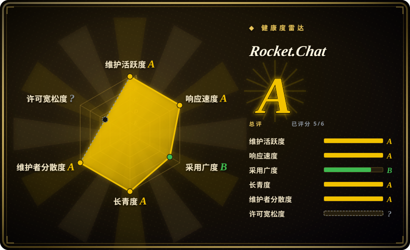

# Rocket.Chat

基于 TypeScript/Meteor 的通信平台，面向需要聊天、全渠道客服、应用市场与联邦的组织——社区版为宽松许可，企业版单独授权。

## 何时使用

你在搭一个通信平台，而不只是部署一个聊天应用。你需要一套系统同时处理内部团队频道*和*来自外部客户的入站会话——网页挂件、邮件、在线客服、社交渠道——还要可安装应用的市场、做自定义集成的 SDK，以及可选的服务器联邦，好与别的独立 Rocket.Chat 服务端互通。你的组织也可能有气隙或高安全要求，直接排除掉大多数 SaaS。

你选 Rocket.Chat 而不是 [Mattermost](mattermost.zh.md)，是因为 Apps-Engine 市场与全渠道（面向客户）面更深，核心是 MIT 而不是 AGPL/商业的源码切分，且原生带联邦。你选它而不是 [Zulip](zulip.zh.md)，是因为你要 Slack 式频道加语音/视频与扩展市场，而不是一个专注话题线程的聊天服务器。决定性取舍是运维重量：Rocket.Chat 是一个已拆成多服务、依赖 MongoDB 与 NATS 的大型 monorepo，你运维的是一个平台，不是一个二进制。

## 何时不用

- **你想要小的运维足迹。** Rocket.Chat 的现代部署是一支服务舰队（account、authorization、presence、streamer、queue-worker 等服务），跑在 MongoDB 上，以 NATS 为传输，前面还要反向代理。想只要一个二进制加一个数据库，用 [Mattermost](mattermost.zh.md)；想要单一用途聊天服务器，用 [Zulip](zulip.zh.md)。
- **你要所有功能都是宽松许可。** 只有社区版是 MIT；`apps/meteor/ee/` 与 `ee/` 下的一切由单独的 EE 许可管辖，生产使用需要有效订阅。无门禁的宽松许可是硬要求时，用 [Zulip](zulip.zh.md)。
- **你跑不动或不想运维 MongoDB（带 oplog/副本集）与 NATS。** 它们是承重件；本地 compose 会设 `MONGO_URL`、`MONGO_OPLOG_URL` 和一个 NATS transporter，并带上拆分后的各项服务。选 Rocket.Chat 就等于承诺这套栈。
- **你要 agent 作为与人共享一条日志的一等签名成员。** 那是 [Buzz](buzz.zh.md)；Rocket.Chat 的 bot 与应用是带各自凭据的集成。
- **你需要话题线程、异步优先的会话模型。** Zulip 专为此而生；Rocket.Chat 是 Slack 形态。
- **你想要尽可能简单的升级路径。** Meteor monorepo、服务拆分与 Node/Mongo 依赖，使版本升级比单二进制产品更重。

## 横向对比

| 替代品 | 是否收录 | 我们的评价 | 取舍 |
|---|---|---|---|
| [Mattermost](mattermost.zh.md) | ✅ | 应用市场、全渠道客服或原生联邦是决策标准时选 Rocket.Chat；单个 Go 二进制加 PostgreSQL 显著更简单好管时选 Mattermost。 | Rocket.Chat 扩展更远，代价是 MongoDB + NATS + 微服务的复杂度与 EE 功能切分。 |
| [Zulip](zulip.zh.md) | ✅ | 干净宽松许可、话题线程的聊天服务器已够用且看重更平静的架构时选 Zulip；需要市场、全渠道或联邦时选 Rocket.Chat。 | Zulip 端到端 Apache-2.0、栈更简单，但没有 Rocket.Chat 的扩展生态与面向客户的面。 |
| [Buzz](buzz.zh.md) | ✅ | 人与 AI agent 必须是共用一条事件日志的签名同等成员时选 Buzz；要成熟、可扩展、agent 只是普通集成的通信平台时选 Rocket.Chat。 | Buzz agent 原生但 pre-1.0 且协议锁定；Rocket.Chat 成熟可扩展但运维更重。 |
| Slack / Microsoft Teams | 未收录 | 零运维与最大集成目录胜过数据掌控时选托管 SaaS；自托管、气隙或联邦是硬需求时选 Rocket.Chat。 | SaaS 免去基础设施负担，但数据面不属于你，且两者都不提供原生服务器联邦。 |
| Rocket.Chat Cloud | 未收录 | 想要 Rocket.Chat 但不想自己运维 MongoDB 与服务舰队时选厂商云；数据驻留或气隙是强制要求时选自托管。 | 托管用控制权与可定制性换便利。 |

## 技术栈

- **服务端：** TypeScript monorepo（Turborepo/yarn workspaces），基于 Meteor（`apps/meteor`），已拆分为 authorization、account、presence、DDP-streamer、queue-worker 等服务；以 NATS 做服务间传输；MongoDB（+ oplog）为数据存储。
- **客户端：** React Web 客户端、Electron 桌面端（独立的 `Rocket.Chat.Electron` 仓库）与 React Native 移动端（`Rocket.Chat.ReactNative`）。
- **扩展性：** 开源的 Apps-Engine 框架、公开应用市场、REST/Realtime API，以及全渠道/在线客服工具。
- **部署形态：** Docker、Podman、Kubernetes（含 Launchpad 选项）、气隙部署与联邦配置。

## 依赖

- **带 oplog 的 MongoDB**——主数据存储；本地 compose 会设 `MONGO_URL` 与 `MONGO_OPLOG_URL`。
- **NATS**——拆分后服务舰队的传输层。
- **Node.js**——Meteor 应用与各服务的运行时。
- **反向代理 / 负载均衡**（本地 compose 用 Traefik）终结客户端流量。
- **可选：** S3 兼容对象存储做文件上传、移动端推送网关、启用 EE 功能的企业许可，以及跨服务端通信的联邦配置。
- **企业门禁：** `apps/meteor/ee/` 与 `ee/` 需要有效的 Rocket.Chat 企业版订阅才能生产使用；社区版是 MIT。

## 运维难度

**高。** 这是三个自托管选项里运维最重的：一个已拆成多个服务的 Meteor monorepo、一个需要 oplog 才能实时的主存储 MongoDB、作为传输的 NATS，以及前面的反向代理——再加独立的桌面与移动端仓库。回报是真实的（市场、全渠道、联邦、气隙），但小团队应预期先学会服务拓扑与 Mongo 运维模型才能算顺手。Mattermost（单二进制 + PostgreSQL）与 Zulip（自带安装器 + 专用主机）都更轻。

## 健康度与可持续性

- **维护——长期且活跃。** 创建于 2015-05-19（验证时约 11.3 年）；在 `develop` 上每日推送，并行维护多条发布线（如 2026-09 的 `8.8.1`、`8.8.0`，以及更早的 `7.10.15` LTS 线）。
- **治理 / bus factor——公司主导、多维护者。** 组织所有（`RocketChat/Rocket.Chat`），由 Rocket.Chat Technologies Corp. 驱动；贡献者名单显示后备充足（`rodrigok`、`engelgabriel`、`sampaiodiego`、`ggazzo` 等），不是单人项目——但路线图与 EE 许可归厂商。
- **背书与长期性——Lindy 有利、open-core。** 十一年以上仍在活跃的开发是很强的耐久性信号；保留项是 open-core 切分，社区版 MIT 而企业能力需订阅。版本之间的功能边界可能移动。
- **采用与生态——非常广。** 约 4.61 万 star 与约 13.9k fork，公开应用市场、Apps-Engine SDK，并被受监管与公共部门组织采用的宣称。文档与集成都很全。
- **风险旗——EE 门禁加大积压。** EE 许可限制 `ee/` 代码无订阅的生产使用；仓库有数千开 issue（验证时约 4.1k），其架构运维重量（MongoDB、NATS、多服务）本身对小团队就是风险。

## 存疑（未验证）

- [未验证] star/fork 数（约 4.61 万 / 约 13.9k）、2015-05-19 的创建日期与 GitHub 活动数据，取自 2026-09-19 的 GitHub API；易变数字会漂移。
- [未验证] 社区版与企业版的确切功能边界由 EE 许可与厂商打包决定；未与当前套餐对比逐项核实。
- [未验证] README 中的采用宣称（「150 多个国家、数千万用户」与具名客户）属厂商营销表述，未独立确认。
- [推断] 服务清单（authorization、account、presence、DDP-streamer、queue-worker）与 MongoDB/NATS 依赖取自仓库的 `docker-compose-local.yml`；生产拓扑可能不同。
- [推断] 「高」运维难度假设采用拆分式部署；极简的单容器部署可行，但那不是仓库自身部署指南强调的拓扑。
- [推断] 机器生成的 `health:` 块无法归类这份组合式 `LICENSE`（它内嵌 MIT 文本，同时把 `apps/meteor/ee/` 与 `ee/` 置于单独的企业版许可之下），因此许可轴记为 `?`（未知 / `license_unparsed`）。权威表述以本页 frontmatter 的 `license:` 为准。
