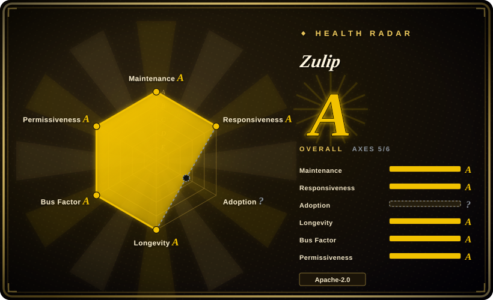

# Zulip

An open-source, topic-threaded team chat server built for both live and asynchronous conversation, distributed under Apache-2.0 and installed on a dedicated Ubuntu/Debian machine (or via Docker).

## When to use

You run a distributed or open-source team spread across time zones, and your real problem is not "where do we chat" but "how does a discussion that spans three days stay readable". Slack-style single streams bury long conversations; email threads scatter them across inboxes. You want every conversation to live under an explicit topic so someone can catch up, skim, and reply asynchronously without reading 400 unread messages.

You pick Zulip over [Mattermost](mattermost.md) because topic threading is the product, not a feature bolted on, and because the license is cleanly Apache-2.0 rather than an AGPL/commercial source split. You pick it over [Rocket.Chat](rocket-chat.md) because you want a single-purpose, exceptionally well-documented chat server rather than a Meteor-based platform with an app marketplace. The deciding tradeoff is operational shape: Zulip's installer expects a dedicated machine and a supported OS, and it delegates voice/video to integrations — in exchange you get the best-organized long-form team chat of the three, with first-class upgrade tooling.

## When NOT to use

- **You need built-in voice or video calls.** Zulip has no native calling; it links out to Jitsi, Zoom, BigBlueButton, and others via configured integrations. If a native calling UI is the requirement, use [Mattermost](mattermost.md) or [Rocket.Chat](rocket-chat.md).
- **Your users expect Slack-style single-stream channels.** The topic model is a genuine workflow change and some teams reject it. If familiarity wins, Mattermost is the closer substitute.
- **You can't give it a dedicated machine or VM.** The production requirements explicitly expect Zulip to be the only thing running on the host — the installer installs and configures nginx, PostgreSQL, and Redis system-wide. Sharing a host is documented as unsupported (with caveats); use the Docker image or a different product instead.
- **You need Windows or an unsupported distro as the host OS.** Self-hosting targets Ubuntu 22.04/24.04/26.04 and Debian 12/13 (x86-64 or aarch64); other platforms are only reachable via Docker.
- **You want agents as first-class signed members sharing one event log with humans.** That is [Buzz](buzz.md); Zulip integrates bots but has no agent-principal model.
- **You need an app marketplace, omnichannel customer support, or server federation.** Use [Rocket.Chat](rocket-chat.md) for the Apps-Engine and federation, or Mattermost for its larger integration catalog.
- **You want to avoid operating a database and message queue.** The installer bundles PostgreSQL, memcached, RabbitMQ, and Redis; if that stack is more than you want to run, a single-binary product (Mattermost) or a hosted service is lighter.

## Comparison

| Alternative | In index | Our verdict | Tradeoff |
|---|---|---|---|
| [Mattermost](mattermost.md) | ✅ | Choose Zulip when organized, asynchronous discussion is the core need and a permissive end-to-end license matters; choose Mattermost when users want Slack-like channels plus built-in calling and a deeper plugin catalog. | Zulip's threading is the best in this set and its license is clean, but it lacks native calls and its dedicated-host install model is less flexible. |
| [Rocket.Chat](rocket-chat.md) | ✅ | Choose Rocket.Chat when you need an app marketplace, omnichannel support, or federation; choose Zulip for a focused, well-documented chat server with a calmer operational footprint than Meteor + MongoDB + services. | Rocket.Chat extends further, but its architecture and EE split are heavier than Zulip's single-purpose model. |
| [Buzz](buzz.md) | ✅ | Choose Buzz when agents must be signed co-equal members over one event log; choose Zulip when you need a decade-hardened chat product and don't need a Nostr substrate. | Buzz is agent-native and protocol-first but pre-1.0; Zulip is mature, permissively licensed, and predictable. |
| Slack / Discord | 未收录 | Choose hosted SaaS when zero ops and a vast integration catalog beat self-hosting; choose Zulip when data ownership and topic organization are the point. | SaaS is easier to start and scales without your effort, but you don't own the data and conversation organization is weaker for long threads. |
| Zulip Cloud | 未收录 | Choose Zulip Cloud when you want Zulip's model without operating it; choose self-hosted when data residency or air-gap is mandatory. | Hosted trading control for convenience — the same tradeoff as every managed tier of an OSS product. |

## Tech stack

- **Server:** Python (Django) plus Tornado for real-time event delivery, with a queue-worker architecture; the repository also builds the web client. Apache-2.0.
- **Middleware:** PostgreSQL (primary datastore), memcached, RabbitMQ (queues), and Redis, provisioned and configured by the installer.
- **Clients:** React webapp, Electron desktop app, and React Native mobile apps; an extensive integration/webhook catalog for CI, issue trackers, and alerting.
- **Tooling:** a well-known contributor workflow with a large test suite, 100% mypy coverage claim on the badge, Ruff/Prettier linting, and a first-party upgrade path.

## Dependencies

- **A dedicated machine or VM.** Listed as a hard requirement for the recommended install path.
- **A supported OS:** Ubuntu 22.04 / 24.04 / 26.04 or Debian 12 / 13, on x86-64 or aarch64.
- **Hardware floor:** at least 2 GB RAM (with 2 GB swap if under 5 GB), 10 GB free disk; 4 GB RAM and 2 CPUs for 100+ users.
- **Bundled services:** the installer installs and configures nginx, PostgreSQL, memcached, RabbitMQ, and Redis itself.
- **Network / identities:** a DNS hostname, inbound HTTPS (port 443), optional port 80, and SMTP credentials for outgoing email; port 25 if you enable the incoming-email gateway.
- **Alternative path:** the separate `docker-zulip` image / Compose stack, or the Helm chart, if you can't dedicate a host.

## Ops difficulty

**Medium.** Zulip's installer does an unusual amount for you — it provisions the OS packages, database, cache, queue, and web server and wires them together — and upgrades are a documented, first-class operation, which is why the ops burden is not higher despite the service count. The friction is the *shape* of the requirement: a dedicated host, a supported OS, and no co-tenancy, plus a database-heavy disk profile (SSD recommended). Docker and Helm paths exist when that constraint is unacceptable. Compared with a single-binary app this is more to operate; compared with Rocket.Chat's microservice decomposition it is calmer.

## Health & viability

- **Maintenance — long-lived and fast-moving.** Created 2015-09-25 (~11 years old at verification); pushes daily, and ships regular server releases (`12.2` in 2026-08, `12.1` in 2026-06, `12.0` in 2026-04) with beta cycles before majors. The README claims over 500 commits a month.
- **Governance / bus factor — project-lead-centric.** Org-owned (`zulip/zulip`) with a very deep contributor bench (the README claims 99+ people with 100+ commits each), but commit counts show a strong central maintainer (`timabbott` leads by a wide margin), so direction is concentrated even though contribution is broad. [推断] Treat it as a healthy project with a clear lead rather than a committee-run one.
- **Backing & longevity — Lindy-favorable, Apache-2.0 throughout.** Eleven years of still-active development plus a uniformly permissive license is about as safe as a self-hosted chat bet gets; there is no open-core feature gate to worry about and no relicense history.
- **Adoption & ecosystem — broad and documented.** ~25.9k stars, ~10.3k forks, use by large open-source projects and enterprises, extensive public documentation, and a mature webhook integration catalog. Hosted "Zulip Cloud" exists as a separate commercial offering.
- **Risk flags — low.** No license rug-pull, no single-binary lock-in, plain deployment. The main practical risks are the dedicated-host requirement and the fact that calling depends on third-party integrations.

## Caveats (unverified)

- [未验证] Star/fork counts (~25.9k / ~10.3k), the 2015-09-25 creation date, and GitHub-reported activity were read from the GitHub API on 2026-09-19; volatile numbers drift.
- [未验证] "1,500 contributors", "500+ commits a month", and "99+ people with 100+ commits" are the README's own claims, not independently confirmed.
- [未验证] The commercial backing entity and funding model behind Zulip Cloud were not verified in this pass; the repository is org-owned and the project predates this verification.
- [推断] The claim that Zulip has no native voice/video is based on its documentation routing calls through Jitsi/Zoom/BigBlueButton/Webex integrations; a native calling feature may exist that was not found.
- [推断] All deployment requirements are taken from `docs/production/requirements.md` in the repository; installers and supported-OS lists change between releases.
