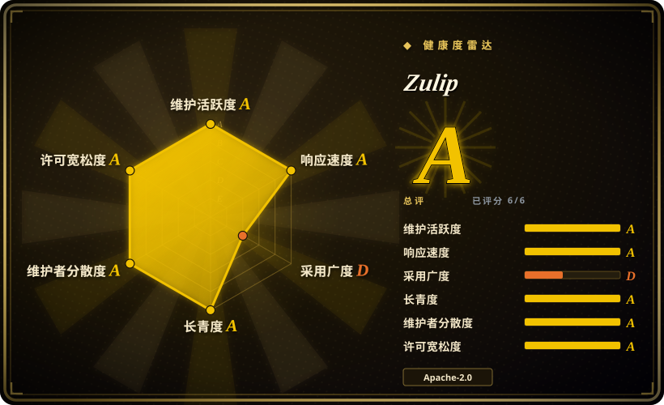

# Zulip

开源、按话题分线程的团队聊天服务器，同时面向实时与异步会话，以 Apache-2.0 分发，安装在专用的 Ubuntu/Debian 机器上（或用 Docker）。

## 何时使用

你带一个跨时区的分布式团队或开源团队，真正的痛点不是「我们在哪聊」，而是「一场横跨三天的讨论怎么保持可读」。Slack 式单流会把长对话埋掉，邮件线程又把它们打散到收件箱各处。你要的是每段对话都落在明确的话题之下，成员可以异步补看、略读、回复，而不必读完 400 条未读。

你选 Zulip 而不是 [Mattermost](mattermost.zh.md)，是因为话题线程就是产品本身，而不是事后加的补丁功能；也因为许可证是干净的 Apache-2.0，而不是 AGPL/商业的源码切分。你选它而不是 [Rocket.Chat](rocket-chat.zh.md)，是因为你要一个单一用途、文档异常完备的聊天服务器，而不是带应用市场的 Meteor 平台。决定性取舍是运维形态：Zulip 的安装器要求专用机器和受支持的操作系统，并把语音/视频交给集成——换来的是三者中组织得最好的长文本团队聊天，以及一流的升级工具。

## 何时不用

- **你需要内置语音或视频通话。** Zulip 没有原生通话；它通过配置好的集成跳转到 Jitsi、Zoom、BigBlueButton 等。原生通话界面是硬需求时，用 [Mattermost](mattermost.zh.md) 或 [Rocket.Chat](rocket-chat.zh.md)。
- **你的用户期待 Slack 式单流频道。** 话题模型是一次真实的工作流变更，有些团队会拒绝。若「熟悉」更重要，Mattermost 是更近的替代品。
- **你给不了它一台专用机器或 VM。** 生产要求明确期望 Zulip 是主机上唯一在跑的东西——安装器会在系统层安装并配置 nginx、PostgreSQL 与 Redis。共用主机被文档列为不受支持（另有限制说明）；请改用 Docker 镜像或其他产品。
- **你需要用 Windows 或不受支持的发行版做宿主。** 自托管面向 Ubuntu 22.04/24.04/26.04 与 Debian 12/13（x86-64 或 aarch64）；其他平台只能经 Docker 抵达。
- **你要 agent 作为与人共享一条事件日志的一等签名成员。** 那是 [Buzz](buzz.zh.md)；Zulip 能集成 bot，但没有 agent 主体模型。
- **你需要应用市场、全渠道客服或服务端联邦。** 要 Apps-Engine 和联邦用 [Rocket.Chat](rocket-chat.zh.md)，要更大的集成目录用 Mattermost。
- **你不想运维数据库和消息队列。** 安装器会捆绑 PostgreSQL、memcached、RabbitMQ 与 Redis；若这套栈超出你的意愿，单二进制产品（Mattermost）或托管服务更轻。

## 横向对比

| 替代品 | 是否收录 | 我们的评价 | 取舍 |
|---|---|---|---|
| [Mattermost](mattermost.zh.md) | ✅ | 组织化的异步讨论是核心需求、且在意端到端宽松许可时选 Zulip；用户要 Slack 式频道加内置通话与更深插件目录时选 Mattermost。 | Zulip 的线程能力是这组里最好的，且许可证干净，但没有原生通话，专用主机安装模型也更不灵活。 |
| [Rocket.Chat](rocket-chat.zh.md) | ✅ | 需要应用市场、全渠道客服或联邦时选 Rocket.Chat；要一个专注、文档完备、运维比 Meteor + MongoDB + 微服务更平静的聊天服务器时选 Zulip。 | Rocket.Chat 扩展更远，但架构与 EE 切分比 Zulip 的单一用途模型更重。 |
| [Buzz](buzz.zh.md) | ✅ | agent 必须是共用一条事件日志的签名同等成员时选 Buzz；需要一个十年打磨的聊天产品、不需要 Nostr 底座时选 Zulip。 | Buzz agent 原生、协议优先，但 pre-1.0；Zulip 成熟、宽松许可、可预期。 |
| Slack / Discord | 未收录 | 零运维和庞大集成目录胜过自托管时选托管 SaaS；数据自有与话题组织本身就是目的时选 Zulip。 | SaaS 起步更容易、扩容不用你操心，但数据不属于你，长线程的会话组织也更弱。 |
| Zulip Cloud | 未收录 | 想要 Zulip 的模型但不想自己运维时选 Zulip Cloud；数据驻留或气隙是强制要求时选自托管。 | 托管用控制权换便利——与所有开源产品的托管层是同一个取舍。 |

## 技术栈

- **服务端：** Python（Django）加 Tornado 做实时事件投递，配队列 worker 架构；仓库同时构建 Web 客户端。Apache-2.0。
- **中间件：** PostgreSQL（主存储）、memcached、RabbitMQ（队列）与 Redis，均由安装器提供并配置。
- **客户端：** React webapp、Electron 桌面端、React Native 移动端；以及面向 CI、工单与告警的大量集成/webhook 目录。
- **工具链：** 成熟的贡献者工作流与大型测试套件，徽章标注 mypy 100% 覆盖，Ruff/Prettier 检查，以及一方维护的升级路径。

## 依赖

- **一台专用机器或 VM。** 推荐安装路径的硬性要求。
- **受支持的操作系统：** Ubuntu 22.04 / 24.04 / 26.04 或 Debian 12 / 13，x86-64 或 aarch64。
- **硬件下限：** 至少 2 GB 内存（低于 5 GB 时需 2 GB swap），10 GB 空闲磁盘；100+ 用户需 4 GB 内存与 2 CPU。
- **捆绑服务：** 安装器自行安装并配置 nginx、PostgreSQL、memcached、RabbitMQ 与 Redis。
- **网络与身份：** 一个 DNS 主机名、入站 HTTPS（443 端口）、可选 80 端口，以及发信所需的 SMTP 凭据；启用收信网关还需 25 端口。
- **替代路径：** 无法专用主机时，用独立的 `docker-zulip` 镜像 / Compose 栈，或 Helm chart。

## 运维难度

**中。** Zulip 的安装器替你做了异常多的事——它装好系统包、数据库、缓存、队列与 Web 服务器并接好线——升级也是有文档的一等操作，所以尽管服务不少，运维负担没有更高。真正的摩擦在要求的*形态*：专用主机、受支持的系统、不允许共置，外加磁盘偏数据库型（建议 SSD）。不接受该约束时，有 Docker 与 Helm 路径。相比单二进制应用这更重；相比 Rocket.Chat 的微服务拆分则更平静。

## 健康度与可持续性

- **维护——长期且快速。** 创建于 2015-09-25（验证时约 11 年）；每日推送，定期发布服务端版本（2026-08 的 `12.2`、2026-06 的 `12.1`、2026-04 的 `12.0`），大版本前有 beta 周期。README 称每月 500+ commit。
- **治理 / bus factor——以项目 lead 为中心。** 组织所有（`zulip/zulip`）且贡献者后备很深（README 称 99+ 人各有 100+ commit），但提交数显示有一个强势的中心维护者（`timabbott` 领先幅度很大），所以方向集中、贡献面广。[推断] 把它当作有明确 lead 的健康项目，而非委员会治理。
- **背书与长期性——Lindy 有利，全程 Apache-2.0。** 十一年仍在活跃的开发，加上整齐的宽松许可，已经是自托管聊天里最安全的一档；没有 open-core 功能门，也没有改许可历史。
- **采用与生态——广且有文档。** 约 2.59 万 star、约 10.3k fork，被大型开源项目与企业使用，公开文档详尽，webhook 集成目录成熟。另有独立的商业 Zulip Cloud。
- **风险旗——低。** 没有许可证突袭，没有单二进制锁定，部署方式朴素。主要实际风险是专用主机要求，以及通话依赖第三方集成。

## 存疑（未验证）

- [未验证] star/fork 数（约 2.59 万 / 约 10.3k）、2015-09-25 的创建日期与 GitHub 活动数据，取自 2026-09-19 的 GitHub API；易变数字会漂移。
- [未验证] 「1,500 名贡献者」「每月 500+ commit」「99+ 人各有 100+ commit」都是 README 自身说法，未独立确认。
- [未验证] Zulip Cloud 背后的商业实体与资金模式在此次未核实；仓库为组织所有，项目早于本次验证。
- [推断] 「Zulip 没有原生语音/视频」的依据是其文档把通话路由到 Jitsi/Zoom/BigBlueButton/Webex 集成；可能存在未被发现的原生通话功能。
- [推断] 全部部署要求取自仓库内 `docs/production/requirements.md`；安装器与受支持系统列表会随版本变化。
