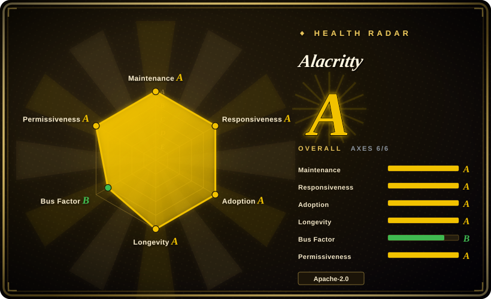
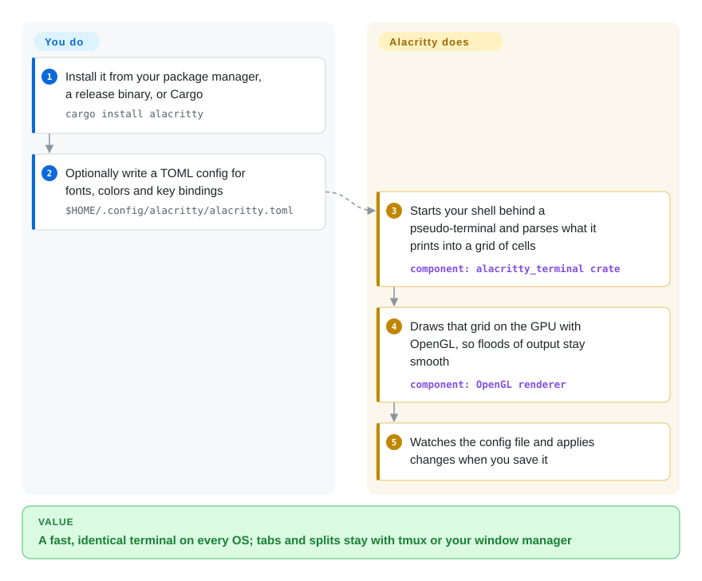

# Alacritty

When a build spews a few hundred thousand log lines, many terminal windows stutter and fall behind your scrolling. Alacritty draws the screen on the graphics card and does nothing else — no tabs, no splits, no AI — so it stays fast and behaves the same on macOS, Linux, BSD and Windows, while tmux or your window manager handles the layout.

## When to use

You're a developer who spends hours in the terminal every day and wants the fastest, most responsive terminal emulator available. You pick Alacritty over WezTerm, Kitty or Ghostty because you want a terminal that does one thing exceptionally well — GPU-accelerated rendering — and delegates everything else to tools you already use. You pick it over iTerm2 because you need a cross-platform terminal that works identically on macOS, Linux, BSD, and Windows with the same configuration file, not a macOS-only app. You pick it over Warp because you value open-source transparency and minimalism over AI features and cloud integration. You are frustrated with terminal emulators that lag when you `cat` a 200 MB log or a test run prints faster than the window can repaint. You want a terminal that uses your GPU for rendering, offloading work from the CPU, and you already use tmux or screen for multiplexing.

## How it works

A terminal emulator is the window that sits between you and your shell: the shell writes text plus escape sequences (invisible codes meaning "make this red", "move the cursor here"), and the emulator turns them into a picture. **Alacritty does that translation and the drawing** — it starts your shell behind a pseudo-terminal (a fake keyboard-and-screen pair the shell talks to as if it were real hardware), keeps a grid of character cells, and repaints it with OpenGL on your GPU, which is why huge outputs scroll smoothly. It also gives you scrollback search, a vi-style mode for moving around and copying with the keyboard, clickable hints for URLs, and several windows from one process (`alacritty msg create-window`). **What you bring is everything else**: tabs, splits and session persistence come from tmux, Zellij or your window manager, and you write the optional `alacritty.toml` yourself — Alacritty never generates one, but reloads it whenever you save.

<!-- flow-steps:begin (generated from flows/alacritty.json by tools/flow_card.py — do not edit) -->

Text version of the flow

1. **You**: Install it from your package manager, a release binary, or Cargo — `cargo install alacritty`
2. **You**: Optionally write a TOML config for fonts, colors and key bindings — `$HOME/.config/alacritty/alacritty.toml`
3. **Alacritty**: Starts your shell behind a pseudo-terminal and parses what it prints into a grid of cells — component: `alacritty_terminal crate`
4. **Alacritty**: Draws that grid on the GPU with OpenGL, so floods of output stay smooth — component: `OpenGL renderer`
5. **Alacritty**: Watches the config file and applies changes when you save it

**Value**: A fast, identical terminal on every OS; tabs and splits stay with tmux or your window manager

<!-- flow-steps:end -->

## When NOT to use

- If you need tabs and splits inside the terminal window, use WezTerm, Ghostty or iTerm2 instead of Alacritty — its README says tabs and splits are left to a window manager or a multiplexer such as [tmux](tmux.md) or [Zellij](zellij.md), so pair it with one of those if you stay.
- If you need font ligatures, use WezTerm, Kitty or Ghostty instead of Alacritty: the ligature request (issue #50, opened in 2017) is still open, so `!=` in Fira Code stays two characters.
- If the machine has no working OpenGL (the README requires at least OpenGL ES 2.0) — some VMs, remote desktops or very old drivers — use the platform's built-in terminal (Windows Terminal, GNOME Terminal) instead, because Alacritty cannot render without a GL context. On Windows it also needs ConPTY (Windows 10 1809+).
- If you want a terminal with built-in AI or shell integration, use Warp instead of Alacritty, because Alacritty is a plain terminal emulator with no AI features, shell suggestions, or smart completions.
- If you need a fully stable, 1.0 product, use iTerm2 or Windows Terminal instead of Alacritty, because Alacritty is still 0.x and its README calls it beta-level; it is widely used as a daily driver, but minor releases do change config keys (the YAML-to-TOML switch in 0.13 needed `alacritty migrate`).
- If you want images in the terminal (Kitty graphics protocol, sixel) or a GUI settings editor, use Kitty or WezTerm instead; Alacritty has neither, and its FAQ rules out a GUI config editor.

## Comparison

| Alternative | In index | Our verdict | Tradeoff |
| --- | --- | --- | --- |
| WezTerm | 未收录 | Use Alacritty for minimal, raw-performance GPU terminal emulation; choose WezTerm when you want a modern GPU-accelerated terminal with tabs, splits, and ligatures built in. | WezTerm has more built-in features (tabs, ligatures, multiplexing); Alacritty is faster and more minimal. |
| Kitty | 未收录 | Use Alacritty for minimal, raw-performance GPU terminal emulation; choose Kitty when you want a GPU-based terminal with advanced features like kittens (plugins) and image support. | Kitty has more features and a plugin system; Alacritty is simpler and more focused on raw performance. |
| iTerm2 | 未收录 | Use Alacritty for cross-platform, minimal GPU terminal emulation; choose iTerm2 when you want the most popular macOS terminal with deep macOS integration and extensive features. | iTerm2 is macOS-only and feature-rich; Alacritty is cross-platform and minimal. |
| Ghostty | 未收录 | Choose Ghostty on macOS or Linux when you want GPU speed plus native tabs, splits and ligatures in one app; choose Alacritty when you need Windows/BSD too or prefer a terminal that leaves layout to tmux. | Ghostty (MIT, Zig, Metal on macOS) gives a native feature-rich app on two OSes; Alacritty covers four OSes with a smaller surface but fewer built-ins. |
| [Warp](warp.md) | ✅ | Use Alacritty for fully open-source, minimal, local terminal emulation; choose Warp when you want an AI-powered modern terminal with cloud features and IDE-like blocks. | Warp has AI features and modern UI; Alacritty is plain, fast, and fully local. |

## Tech stack

- **Rust** — primary implementation language; the terminal state machine is the reusable `alacritty_terminal` crate (also used by other projects)
- **OpenGL / OpenGL ES 2.0+** via `glutin` (EGL/WGL) — GPU rendering; `winit` for windows and input
- **crossfont** — font loading/rasterizing (FreeType + fontconfig on Linux/BSD, platform APIs elsewhere)
- **TOML** configuration (`toml` / `toml_edit`), `notify` for live config reload

## Dependencies

- A modern desktop OS (macOS, Linux, BSD, Windows)
- A GPU/driver exposing at least OpenGL ES 2.0; on Windows, ConPTY (Windows 10 1809+)
- A shell of your choice (Alacritty does not bundle one)

## Ops difficulty

**Low.** Alacritty is a single binary: install it from a package manager, a release binary (macOS/Windows), or `cargo install alacritty` (Linux builds need cmake, fontconfig and xcb/xkbcommon headers). Configuration is one optional TOML file; there is no service to run. The recurring cost is config churn across 0.x releases — keys get renamed and old YAML configs need `alacritty migrate` — plus GPU-driver issues on unusual Linux setups.

## Health & viability

- **Maintenance (2026-10), grade A.** Roughly one minor release a year with patch releases in between (0.16.0 2025-10, 0.17.0 2026-04, 0.18.0 in development); commits landed within the last week. Steady, not hyped.
- **Responsiveness, grade A.** Maintainers answer new issues quickly (median first response about 2 hours in the scorer's window), though 300+ open issues show many feature requests are declined or parked by design.
- **Governance, grade B.** An `alacritty` GitHub organization, but effectively three people: `chrisduerr`, original author `jwilm` (no longer the main committer) and `kchibisov` account for the bulk of commits. Bus factor is small but has already survived one hand-over from the founder.
- **Age & Lindy, longevity A.** Created 2016-02 (3885 days ago) and still shipping a decade later — the Lindy prior favors it. It remains 0.x by choice, not because it is young.
- **Adoption, grade A.** ~65.9k stars, installable through package managers on Linux, BSD, macOS and Windows plus Homebrew; the `alacritty_terminal` crate is reused by other terminal projects, which widens its base.
- **Risk / license, grade A.** Apache-2.0, no relicensing, no commercial owner — the main risk is feature stagnation relative to Ghostty/WezTerm, not licensing.
## Caveats (unverified)

- [未验证] OpenGL ES 2.0 is the README's floor; real compatibility with specific Linux GPU drivers, VMs and remote-desktop sessions varies and was not tested.
- [未验证] Ghostty facts in Comparison (MIT, Zig, macOS + Linux apps with native tabs/splits, no official Windows app) come from its README on 2026-10-08, not from using it.
- [推断] The governance reading (three core maintainers, founder no longer main committer) comes from all-time contributor counts; who holds release rights was not checked.
- [未验证] The beta-level readiness claim is self-assessed by the project; many users report stable daily use.
- [推断] As the terminal emulator landscape evolves, Alacritty's minimalism may cause it to lose users to feature-richer alternatives like WezTerm or Warp unless it finds a way to maintain its performance edge.
