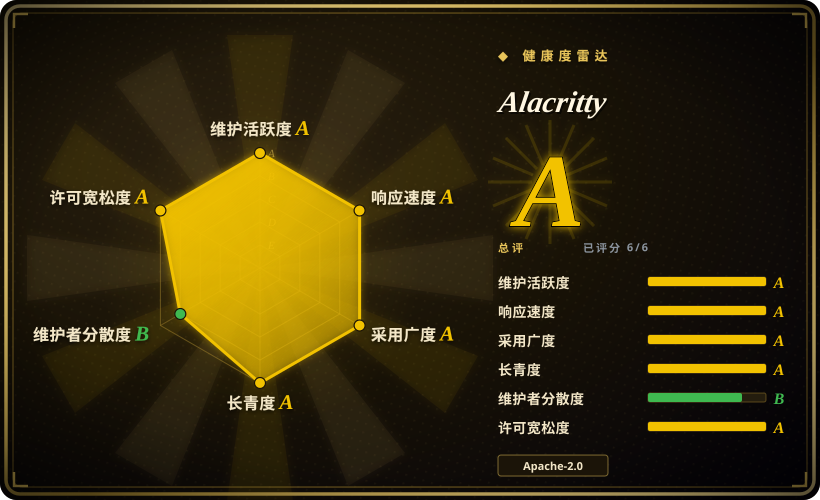
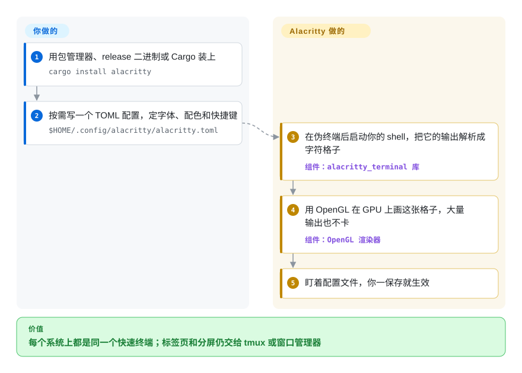

# Alacritty

构建一口气刷出几十万行日志时，很多终端窗口会卡顿、跟不上你的滚动。Alacritty 用显卡画屏幕，别的什么都不做——没有标签页、没有分屏、没有 AI——所以它一直很快，在 macOS、Linux、BSD 和 Windows 上表现一致，布局交给 tmux 或窗口管理器。

## 何时使用

你是一位每天在终端里花数小时的开发者，想要最快、最响应的终端模拟器。你选 Alacritty 而不选 WezTerm、Kitty 或 Ghostty，是因为你想要一个把一件事做到极致的终端——GPU 加速渲染——并把其他所有事交给你已有的工具。你选它而不选 iTerm2，是因为你需要一个在 macOS、Linux、BSD 和 Windows 上配置一致、行为统一的跨平台终端，而非仅限 macOS 的应用。你选它而不选 Warp，是因为你看重开源透明和极简主义，而非 AI 功能和云集成。你受够了 `cat` 一个 200 MB 的日志、或者测试输出快过窗口重绘时就卡住的终端。你想要一个利用 GPU 渲染、把负载从 CPU 卸下的终端，而且你已经用 tmux 或 screen 做复用。

## 怎么用起来

终端模拟器是夹在你和 shell 之间的那个窗口：shell 输出文字，外加转义序列（看不见的控制码，意思是“这段标红”“光标挪到这里”），终端模拟器把它们变成画面。**Alacritty 负责这层翻译和绘制**——它在伪终端（一对假的键盘加屏幕，shell 以为自己连的是真硬件）后面启动你的 shell，维护一张字符格子，再用 OpenGL 在 GPU 上重绘，所以海量输出也能顺滑滚动。它还提供回滚搜索、用键盘移动和复制的 vi 模式、可点击的 URL 提示，以及一个进程开多个窗口（`alacritty msg create-window`）。**其余都由你自带**：标签页、分屏和会话保持来自 tmux、Zellij 或窗口管理器；可选的 `alacritty.toml` 也由你自己写——Alacritty 从不替你生成，但你一保存它就重新加载。

<!-- flow-steps:begin (generated from flows/alacritty.json by tools/flow_card.py — do not edit) -->

流程文字版

1. **你**：用包管理器、release 二进制或 Cargo 装上 — `cargo install alacritty`
2. **你**：按需写一个 TOML 配置，定字体、配色和快捷键 — `$HOME/.config/alacritty/alacritty.toml`
3. **Alacritty**：在伪终端后启动你的 shell，把它的输出解析成字符格子 — 组件：`alacritty_terminal 库`
4. **Alacritty**：用 OpenGL 在 GPU 上画这张格子，大量输出也不卡 — 组件：`OpenGL 渲染器`
5. **Alacritty**：盯着配置文件，你一保存就生效

**价值**：每个系统上都是同一个快速终端；标签页和分屏仍交给 tmux 或窗口管理器

<!-- flow-steps:end -->

## 何时不用

- 如果你要在终端窗口里直接开标签页和分屏，请用 WezTerm、Ghostty 或 iTerm2，而不用 Alacritty——它的 README 写明标签页和分屏交给窗口管理器或 [tmux](tmux.zh.md)、[Zellij](zellij.zh.md) 这类复用器；如果留在 Alacritty，就搭配其中一个。
- 如果你需要字体连字，请用 WezTerm、Kitty 或 Ghostty，而不用 Alacritty：连字需求（issue #50，2017 年提出）至今仍是 open，Fira Code 里的 `!=` 依然是两个字符。
- 如果机器上没有可用的 OpenGL（README 要求至少 OpenGL ES 2.0）——部分虚拟机、远程桌面或很老的驱动——请用系统自带终端（Windows Terminal、GNOME Terminal），因为 Alacritty 没有 GL 上下文就画不出来。在 Windows 上它还需要 ConPTY（Windows 10 1809 及以上）。
- 如果你想要内置 AI 或 shell 集成的终端，请用 Warp，而不用 Alacritty，因为 Alacritty 是纯粹的终端模拟器，没有 AI 功能、shell 建议或智能补全。
- 如果你需要完全稳定、1.0 的产品，请用 iTerm2 或 Windows Terminal，而不用 Alacritty，因为它仍是 0.x，README 自称 beta 级；虽然很多人拿它当日常主力，但小版本会改配置项（0.13 从 YAML 换成 TOML，要跑 `alacritty migrate`）。
- 如果你想在终端里看图（Kitty 图形协议、sixel）或要图形化设置界面，请用 Kitty 或 WezTerm；Alacritty 两样都没有，FAQ 也明确不做图形化配置编辑器。

## 横向对比

| 替代品 | 是否收录 | 我们的评价 | 取舍 |
|---|---|---|---|
| WezTerm | 未收录 | 需要极简、原生性能 GPU 终端模拟时选 Alacritty；需要现代 GPU 加速终端且内置标签页、分屏和连字时，再选 WezTerm。 | WezTerm 内置功能更多（标签页、连字、复用）；Alacritty 更快、更极简。 |
| Kitty | 未收录 | 需要极简、原生性能 GPU 终端模拟时选 Alacritty；需要基于 GPU 的终端且支持 kitten（插件）和图像等高级功能时，再选 Kitty。 | Kitty 功能更多、有插件系统；Alacritty 更简单、更专注于原生性能。 |
| iTerm2 | 未收录 | 需要跨平台、极简 GPU 终端模拟时选 Alacritty；需要最受欢迎的 macOS 终端且深度集成 macOS 和丰富功能时，再选 iTerm2。 | iTerm2 仅限 macOS、功能丰富；Alacritty 跨平台、极简。 |
| Ghostty | 未收录 | 在 macOS 或 Linux 上想要 GPU 速度加原生标签页、分屏和连字一体的应用，选 Ghostty；还要覆盖 Windows／BSD，或更想把布局交给 tmux，选 Alacritty。 | Ghostty（MIT、Zig、macOS 上用 Metal）在两个系统上给你功能丰富的原生应用；Alacritty 覆盖四个系统、表面更小，但内置功能更少。 |
| [Warp](warp.zh.md) | ✅ | 需要完全开源、极简、本地终端模拟时选 Alacritty；需要带 AI 功能和现代 UI 的终端时，再选 Warp。 | Warp 有 AI 功能和现代 UI；Alacritty 朴素、快速、完全本地。 |

## 技术栈

- **Rust**——主要实现语言；终端状态机是可复用的 `alacritty_terminal` 库（也被其他项目使用）
- **OpenGL／OpenGL ES 2.0+**，经 `glutin`（EGL／WGL）——GPU 渲染；`winit` 负责窗口和输入
- **crossfont**——字体加载与光栅化（Linux／BSD 上是 FreeType + fontconfig，其他平台用系统 API）
- **TOML** 配置（`toml`／`toml_edit`），`notify` 负责配置热重载

## 依赖

- 现代桌面操作系统（macOS、Linux、BSD、Windows）
- 至少提供 OpenGL ES 2.0 的 GPU／驱动；Windows 上需要 ConPTY（Windows 10 1809 及以上）
- 自选的 shell（Alacritty 不捆绑 shell）

## 运维难度

**低。** Alacritty 是单一二进制：用包管理器装、下 release 二进制（macOS／Windows），或 `cargo install alacritty`（Linux 上构建要 cmake、fontconfig 和 xcb／xkbcommon 头文件）。配置是一个可选的 TOML 文件，没有需要常驻的服务。长期成本在于 0.x 版本间的配置变动——配置项会改名，老的 YAML 配置要跑 `alacritty migrate`——以及少见 Linux 环境下的显卡驱动问题。

## 健康度与可持续性

- **维护（2026-10），A 级。** 大约一年一个小版本，中间穿插补丁版（0.16.0 在 2025-10，0.17.0 在 2026-04，0.18.0 开发中）；最近一周内仍有提交。稳定推进，不靠热度。
- **响应速度，A 级。** 维护者回应新 issue 很快（评分窗口内首次响应中位数约 2 小时），但 300 多个 open issue 说明很多功能请求是按设计被拒或搁置的。
- **治理，B 级。** 挂在 `alacritty` GitHub 组织下，但实际是三个人：`chrisduerr`、原作者 `jwilm`（已不是主要提交者）和 `kchibisov` 贡献了绝大部分提交。bus factor 小，但已经扛过一次从创始人手里交接。
- **年龄与 Lindy，长青度 A 级。** 2016-02 创建（至今 3885 天），十年后仍在发版——Lindy 先验对它有利。它停在 0.x 是有意为之，不是因为年轻。
- **采用，A 级。** 约 65.9k star，在 Linux、BSD、macOS、Windows 的包管理器和 Homebrew 上都能装；`alacritty_terminal` 库被其他终端项目复用，基础更广。
- **风险与许可，A 级。** Apache-2.0，没有改过许可，也没有商业公司控制——主要风险是相对 Ghostty／WezTerm 的功能停滞，而不是许可。
## 存疑（未验证）

- [未验证] README 给出的下限是 OpenGL ES 2.0；在具体 Linux 显卡驱动、虚拟机和远程桌面上的实际兼容性没有测试。
- [未验证] 横向对比里 Ghostty 的事实（MIT、Zig、macOS + Linux 原生应用带标签页／分屏、没有官方 Windows 应用）取自 2026-10-08 的 README，没有实际使用。
- [推断] 治理判断（三位核心维护者、创始人已不是主要提交者）来自历史累计贡献数；谁持有发版权限没有核对。
- [未验证] beta 级就绪声明是项目自我评估；许多用户报告日常使用稳定。
- [推断] 随着终端模拟器领域演进，Alacritty 的极简主义可能导致其用户流向 WezTerm 或 Warp 等功能更丰富的替代品，除非它能保持性能优势。
